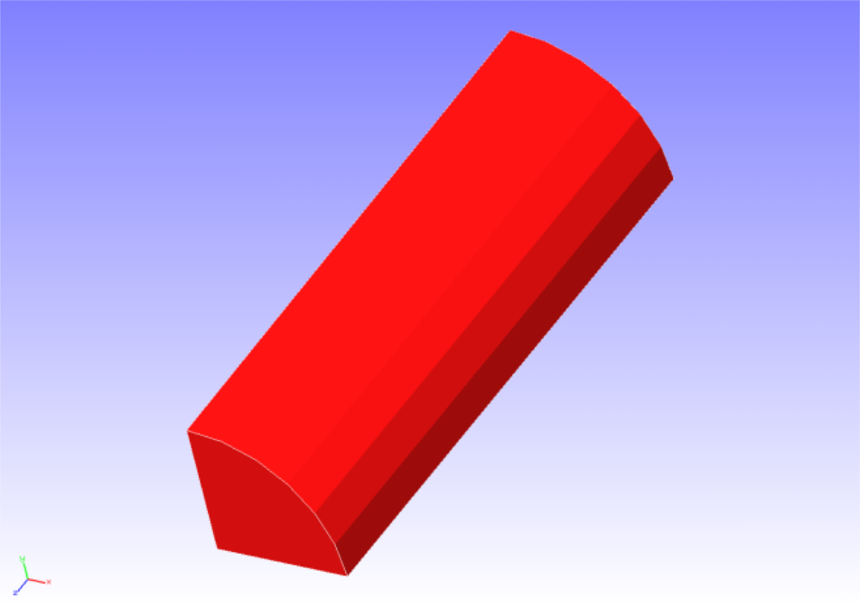

## 非線形静解析 (超弾性その1)

本解析の実施には、`tutorial/03_hyperelastic_cylinder` のデータを用います。

### 解析対象

解析対象は丸棒の1/8モデルで、形状を図4.3.1に、メッシュデータを図4.3.2に示します。

 | 項目       | 内容                    | 備考                             | 参照 |
 |------------|-------------------------|----------------------------------|------| 
 | 解析の種別 | 非線形静解析(超弾性)    | !SOLUTION,TYPE=NLSTATIC          |      |
 | 節点数     | 629                     |                                  |      |
 | 要素数     | 432                     |                                  |      |
 | 要素タイプ | 8節点六面体一次要素     | !ELEMENT,TYPE=361                |      |
 | 材料物性名 | MAT1                    | !MATERIAL,NAME=MAT1              |      |
 | 材料性質   | HYPERELASTIC            | !HYPERELASTIC,TYPE=MOONEY-RIVLIN |      |
 | 境界条件   | 拘束, 強制変位          |                                  |      |
 | 行列解法   | CG/SSOR                 | !SOLVER,METHOD=CG,PRECOND=1      |      |

{.center width="350px"}
<div style="text-align: center;">
図4.3.1　丸棒(1/8モデル)の形状
</div>

{.center width="350px"}
<div style="text-align: center;">
図4.3.2　丸棒(1/8モデル)のメッシュデータ
</div>

### 解析内容

丸棒に軸方向の引張変位を与える応力解析を実施します。
超弾性の材料構成式にはMooney-Rivlinモデルを用います。解析制御データを以下に示します。

#### 解析制御データ `cylinder.cnt`

```
#  Control File for FISTR
## Analysis Control
!VERSION
 3
!SOLUTION, TYPE=NLSTATIC
!WRITE,RESULT
!WRITE,VISUAL
## Solver Control
### Boundary Conditon
!BOUNDARY, GRPID=1
 LOADS, 3, 3, -7.0
 FIX,   3, 3, 0.0
 XSYMM, 1, 1, 0.0
 YSYMM, 2, 2, 0.0
### STEP
!STEP, SUBSTEPS=5, CONVERG=1.0e-5
 BOUNDARY, 1
### Material
!MATERIAL, NAME=MAT1
!HYPERELASTIC, TYPE=MOONEY-RIVLIN
 0.1486, 0.4849, 0.0789
### Solver Setting
!SOLVER,METHOD=CG,PRECOND=1,ITERLOG=YES,TIMELOG=YES
 10000, 1
 1.0e-8, 1.0, 0.0
## Post Control
!VISUAL,metod=PSR
!surface_num=1
!surface 1
!output_type=VTK
!END
```

### 解析結果

5サブステップ目の解析結果について、ミーゼス応力のコンターを付加した変形図をREVOCAP_PrePostで作成して図4.3.3に示します。
また、解析結果の数値データとして、解析結果ログファイルの一部を以下に示します。

{.center width="350px"}
<div style="text-align: center;">
図4.3.3　変形およびミーゼス応力の解析結果
</div>

#### 解析結果ログ `0.log`

<div style="height: 400px; overflow-y: scroll;">
```
 fstr_setup: OK
#### Result step=     0
 ##### Local Summary @Node    :Max/IdMax/Min/IdMin####
 //U1    0.0000E+00         1  0.0000E+00         1
 //U2    0.0000E+00         1  0.0000E+00         1
 //U3    0.0000E+00         1  0.0000E+00         1
 //E11   0.0000E+00         1  0.0000E+00         1
 //E22   0.0000E+00         1  0.0000E+00         1
 //E33   0.0000E+00         1  0.0000E+00         1
 //E12   0.0000E+00         1  0.0000E+00         1
 //E23   0.0000E+00         1  0.0000E+00         1
 //E31   0.0000E+00         1  0.0000E+00         1
 //S11   0.0000E+00         1  0.0000E+00         1
 //S22   0.0000E+00         1  0.0000E+00         1
 //S33   0.0000E+00         1  0.0000E+00         1
 //S12   0.0000E+00         1  0.0000E+00         1
 //S23   0.0000E+00         1  0.0000E+00         1
 //S31   0.0000E+00         1  0.0000E+00         1
 //SMS   0.0000E+00         1  0.0000E+00         1
 ##### Local Summary @Element :Max/IdMax/Min/IdMin####
 //E11   0.0000E+00         1  0.0000E+00         1
 //E22   0.0000E+00         1  0.0000E+00         1
 //E33   0.0000E+00         1  0.0000E+00         1
 //E12   0.0000E+00         1  0.0000E+00         1
 //E23   0.0000E+00         1  0.0000E+00         1
 //E31   0.0000E+00         1  0.0000E+00         1
 //S11   0.0000E+00         1  0.0000E+00         1
 //S22   0.0000E+00         1  0.0000E+00         1
 //S33   0.0000E+00         1  0.0000E+00         1
 //S12   0.0000E+00         1  0.0000E+00         1
 //S23   0.0000E+00         1  0.0000E+00         1
 //S31   0.0000E+00         1  0.0000E+00         1
 //SMS   0.0000E+00         1  0.0000E+00         1
 ##### Global Summary @Node    :Max/IdMax/Min/IdMin####
 //U1    0.0000E+00         1  0.0000E+00         1
 //U2    0.0000E+00         1  0.0000E+00         1
 //U3    0.0000E+00         1  0.0000E+00         1
 //E11   0.0000E+00         1  0.0000E+00         1
 //E22   0.0000E+00         1  0.0000E+00         1
 //E33   0.0000E+00         1  0.0000E+00         1
 //E12   0.0000E+00         1  0.0000E+00         1
 //E23   0.0000E+00         1  0.0000E+00         1
 //E31   0.0000E+00         1  0.0000E+00         1
 //S11   0.0000E+00         1  0.0000E+00         1
 //S22   0.0000E+00         1  0.0000E+00         1
 //S33   0.0000E+00         1  0.0000E+00         1
 //S12   0.0000E+00         1  0.0000E+00         1
 //S23   0.0000E+00         1  0.0000E+00         1
 //S31   0.0000E+00         1  0.0000E+00         1
 //SMS   0.0000E+00         1  0.0000E+00         1
 ##### Global Summary @Element :Max/IdMax/Min/IdMin####
 //E11   0.0000E+00         1  0.0000E+00         1
 //E22   0.0000E+00         1  0.0000E+00         1
 //E33   0.0000E+00         1  0.0000E+00         1
 //E12   0.0000E+00         1  0.0000E+00         1
 //E23   0.0000E+00         1  0.0000E+00         1
 //E31   0.0000E+00         1  0.0000E+00         1
 //S11   0.0000E+00         1  0.0000E+00         1
 //S22   0.0000E+00         1  0.0000E+00         1
 //S33   0.0000E+00         1  0.0000E+00         1
 //S12   0.0000E+00         1  0.0000E+00         1
 //S23   0.0000E+00         1  0.0000E+00         1
 //S31   0.0000E+00         1  0.0000E+00         1
 //SMS   0.0000E+00         1  0.0000E+00         1
 
 ...

#### Result step=     5
 ##### Local Summary @Node    :Max/IdMax/Min/IdMin####
 //U1    0.0000E+00         1 -6.7543E-01        90
 //U2    0.0000E+00         1 -6.7543E-01        89
 //U3    0.0000E+00         1 -7.0000E+00        38
 //E11  -1.0781E-01        38 -1.1448E-01         7
 //E22  -1.0781E-01        50 -1.1448E-01        13
 //E33   2.3916E-01         7  2.2715E-01        50
 //E12   8.9609E-04        53 -9.2501E-04        10
 //E23   1.0074E-07        38 -2.6232E-03        86
 //E31   1.0074E-07        50 -2.6232E-03        93
 //S11   2.7292E-03        14 -2.6468E-03        49
 //S22   2.7292E-03         6 -2.6468E-03        39
 //S33   8.5422E-01         7  8.1021E-01        50
 //S12   1.2861E-03        53 -1.3373E-03        10
 //S23   1.4289E-07        38 -3.1695E-03        86
 //S31   1.4289E-07        50 -3.1695E-03        93
 //SMS   8.5307E-01         7  8.1134E-01        50
 ##### Local Summary @Element :Max/IdMax/Min/IdMin####
 //E11  -1.0817E-01       759 -1.1410E-01       354
 //E22  -1.0817E-01       768 -1.1410E-01       363
 //E33   2.3863E-01       354  2.2766E-01       759
 //E12   7.4078E-04       766 -7.5734E-04       360
 //E23  -2.5376E-05       753 -2.4790E-03       471
 //E31  -2.5376E-05       749 -2.4790E-03       462
 //S11   2.8994E-03       363 -2.8080E-03       768
 //S22   2.8994E-03       354 -2.8080E-03       759
 //S33   8.5295E-01       354  8.1143E-01       759
 //S12   1.0634E-03       766 -1.0947E-03       360
 //S23  -3.0682E-05       753 -2.9954E-03       471
 //S31  -3.0682E-05       749 -2.9954E-03       462
 //SMS   8.5118E-01       354  8.1315E-01       759
 ##### Global Summary @Node    :Max/IdMax/Min/IdMin####
 //U1    0.0000E+00         1 -6.7543E-01        90
 //U2    0.0000E+00         1 -6.7543E-01        89
 //U3    0.0000E+00         1 -7.0000E+00        38
 //E11  -1.0781E-01        38 -1.1448E-01         7
 //E22  -1.0781E-01        50 -1.1448E-01        13
 //E33   2.3916E-01         7  2.2715E-01        50
 //E12   8.9609E-04        53 -9.2501E-04        10
 //E23   1.0074E-07        38 -2.6232E-03        86
 //E31   1.0074E-07        50 -2.6232E-03        93
 //S11   2.7292E-03        14 -2.6468E-03        49
 //S22   2.7292E-03         6 -2.6468E-03        39
 //S33   8.5422E-01         7  8.1021E-01        50
 //S12   1.2861E-03        53 -1.3373E-03        10
 //S23   1.4289E-07        38 -3.1695E-03        86
 //S31   1.4289E-07        50 -3.1695E-03        93
 //SMS   8.5307E-01         7  8.1134E-01        50
 ##### Global Summary @Element :Max/IdMax/Min/IdMin####
 //E11  -1.0817E-01       759 -1.1410E-01       354
 //E22  -1.0817E-01       768 -1.1410E-01       363
 //E33   2.3863E-01       354  2.2766E-01       759
 //E12   7.4078E-04       766 -7.5734E-04       360
 //E23  -2.5376E-05       753 -2.4790E-03       471
 //E31  -2.5376E-05       749 -2.4790E-03       462
 //S11   2.8994E-03       363 -2.8080E-03       768
 //S22   2.8994E-03       354 -2.8080E-03       759
 //S33   8.5295E-01       354  8.1143E-01       759
 //S12   1.0634E-03       766 -1.0947E-03       360
 //S23  -3.0682E-05       753 -2.9954E-03       471
 //S31  -3.0682E-05       749 -2.9954E-03       462
 //SMS   8.5118E-01       354  8.1315E-01       759
```
</div>