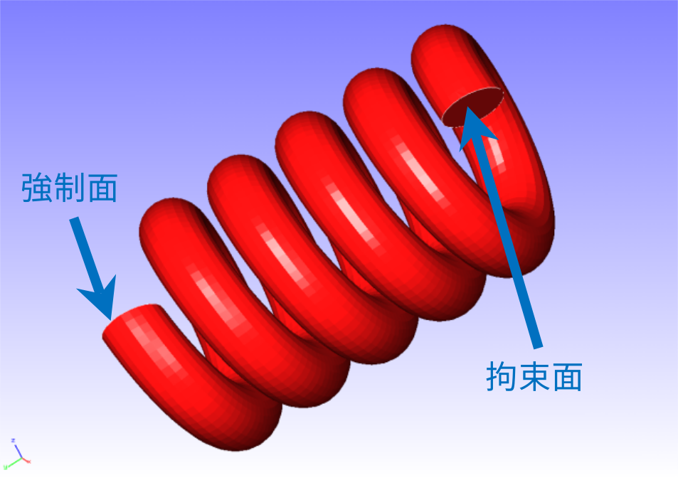

## 非線形静解析 (超弾性その2)

本解析の実施には、`tutorial/04_hyperelastic_spring` のデータを用います。

### 解析対象

解析対象はスプリングで、形状を図4.4.1に、メッシュデータを図4.4.2に示します。

 | 項目       | 内容                 | 備考                            | 参照 |
 |------------|----------------------|---------------------------------|------|
 | 解析の種別 | 非線形静解析(超弾性) | !SOLUTION,TYPE=NLSTATIC         |      |
 | 節点数     | 78,771               |                                 |      |
 | 要素数     | 46,454               |                                 |      |
 | 要素タイプ | 10節点四面体二次要素 | !ELEMENT,TYPE=342               |      |
 | 材料物性名 | MAT1                 | !MATERIAL,NAME=MAT1             |      |
 | 材料性質   | HYPERELASTIC         | !HYPERELASTIC,TYPE=ARRUDA-BOYCE |      |
 | 境界条件   | 拘束/強制変位        |                                 |      |
 | 行列解法   | CG/SSOR              | !SOLVER,METHOD=CG,PRECOND=1     |      |

{.center width="350px"}
<div style="text-align: center;">
図4.4.1　スプリングの形状
</div>

{.center width="350px"}
<div style="text-align: center;">
図4.4.2　スプリングのメッシュデータ
</div>

### 解析内容

図4.4.1に示す拘束面の変位を拘束し、強制面に変位を与える応力解析を実施します。超弾性の材料構成式にはArruda-Boyceモデルを用います。解析制御データを以下に示します。

#### 解析制御データ `spring.cnt`

```
#  Control File for FISTR
## Analysis Control
!VERSION
 3
!SOLUTION, TYPE=NLSTATIC
!WRITE,RESULT
!WRITE,VISUAL
## Solver Control
### Boundary Conditon
!BOUNDARY, GRPID=1
 LOADS, 2, 2, -5.0
 FIX,   1, 3, 0.0
### STEP
!STEP, SUBSTEPS=1, CONVERG=1.0e-5
 BOUNDARY, 1
### Material
!MATERIAL, NAME=MAT1
!HYPERELASTIC, TYPE=ARRUDA-BOYCE
 0.71, 1.7029, 0.1408
### Solver Setting
!SOLVER,METHOD=CG,PRECOND=1,ITERLOG=YES,TIMELOG=YES
 10000, 1
 1.0e-8, 1.0, 0.0
## Post Control
!VISUAL,metod=PSR
!surface_num=1
!surface 1
!output_type=VTK
!END
```

### 解析手順

FrontISTRの実行コマンド `fistr1` を実行します。

```
$ cd FrontISTR/tutorial/04_hyperelastic_spring
$ fistr1 -t 4
(4スレッドで実行)
```

### 解析結果

変位のコンターを付加した変形図をREVOCAP_PrePostで作成して図4.4.3に示します。また、解析結果の数値データとして、解析結果ログファイルの一部を以下に示します。

{.center width="350px"}
<div style="text-align: center;">
図4.4.3　変形および変位の解析結果
</div>

#### 解析結果ログ `0.log`

<div style="height: 400px; overflow-y: scroll;">
```
 fstr_setup: OK
#### Result step=     0
 ##### Local Summary @Node    :Max/IdMax/Min/IdMin####
 //U1    0.0000E+00         1  0.0000E+00         1
 //U2    0.0000E+00         1  0.0000E+00         1
 //U3    0.0000E+00         1  0.0000E+00         1
 //E11   0.0000E+00         1  0.0000E+00         1
 //E22   0.0000E+00         1  0.0000E+00         1
 //E33   0.0000E+00         1  0.0000E+00         1
 //E12   0.0000E+00         1  0.0000E+00         1
 //E23   0.0000E+00         1  0.0000E+00         1
 //E31   0.0000E+00         1  0.0000E+00         1
 //S11   0.0000E+00         1  0.0000E+00         1
 //S22   0.0000E+00         1  0.0000E+00         1
 //S33   0.0000E+00         1  0.0000E+00         1
 //S12   0.0000E+00         1  0.0000E+00         1
 //S23   0.0000E+00         1  0.0000E+00         1
 //S31   0.0000E+00         1  0.0000E+00         1
 //SMS   0.0000E+00         1  0.0000E+00         1
 ##### Local Summary @Element :Max/IdMax/Min/IdMin####
 //E11   0.0000E+00         1  0.0000E+00         1
 //E22   0.0000E+00         1  0.0000E+00         1
 //E33   0.0000E+00         1  0.0000E+00         1
 //E12   0.0000E+00         1  0.0000E+00         1
 //E23   0.0000E+00         1  0.0000E+00         1
 //E31   0.0000E+00         1  0.0000E+00         1
 //S11   0.0000E+00         1  0.0000E+00         1
 //S22   0.0000E+00         1  0.0000E+00         1
 //S33   0.0000E+00         1  0.0000E+00         1
 //S12   0.0000E+00         1  0.0000E+00         1
 //S23   0.0000E+00         1  0.0000E+00         1
 //S31   0.0000E+00         1  0.0000E+00         1
 //SMS   0.0000E+00         1  0.0000E+00         1
 ##### Global Summary @Node    :Max/IdMax/Min/IdMin####
 //U1    0.0000E+00         1  0.0000E+00         1
 //U2    0.0000E+00         1  0.0000E+00         1
 //U3    0.0000E+00         1  0.0000E+00         1
 //E11   0.0000E+00         1  0.0000E+00         1
 //E22   0.0000E+00         1  0.0000E+00         1
 //E33   0.0000E+00         1  0.0000E+00         1
 //E12   0.0000E+00         1  0.0000E+00         1
 //E23   0.0000E+00         1  0.0000E+00         1
 //E31   0.0000E+00         1  0.0000E+00         1
 //S11   0.0000E+00         1  0.0000E+00         1
 //S22   0.0000E+00         1  0.0000E+00         1
 //S33   0.0000E+00         1  0.0000E+00         1
 //S12   0.0000E+00         1  0.0000E+00         1
 //S23   0.0000E+00         1  0.0000E+00         1
 //S31   0.0000E+00         1  0.0000E+00         1
 //SMS   0.0000E+00         1  0.0000E+00         1
 ##### Global Summary @Element :Max/IdMax/Min/IdMin####
 //E11   0.0000E+00         1  0.0000E+00         1
 //E22   0.0000E+00         1  0.0000E+00         1
 //E33   0.0000E+00         1  0.0000E+00         1
 //E12   0.0000E+00         1  0.0000E+00         1
 //E23   0.0000E+00         1  0.0000E+00         1
 //E31   0.0000E+00         1  0.0000E+00         1
 //S11   0.0000E+00         1  0.0000E+00         1
 //S22   0.0000E+00         1  0.0000E+00         1
 //S33   0.0000E+00         1  0.0000E+00         1
 //S12   0.0000E+00         1  0.0000E+00         1
 //S23   0.0000E+00         1  0.0000E+00         1
 //S31   0.0000E+00         1  0.0000E+00         1
 //SMS   0.0000E+00         1  0.0000E+00         1
#### Result step=     1
 ##### Local Summary @Node    :Max/IdMax/Min/IdMin####
 //U1    2.6070E-01     42179 -2.4651E-01     44163
 //U2    2.0567E-02     14512 -5.0036E+00     44753
 //U3    6.6559E-02     15443 -6.6862E-01     44664
 //E11   4.1026E-03      1015 -4.5809E-03      3429
 //E22   2.3030E-03     42626 -1.5152E-03     44761
 //E33   4.1949E-03     23553 -5.0169E-03     27938
 //E12   1.3348E-02     55149 -1.3381E-02     56829
 //E23   2.7881E-02     48353 -1.9534E-02     48322
 //E31   1.0861E-02     47938 -8.8803E-03      9493
 //S11   8.4247E-03      8264 -9.1017E-03      8501
 //S22   1.0769E-02     56772 -6.3921E-03     56787
 //S33   1.3881E-02     56764 -1.2778E-02     42632
 //S12   1.2396E-02     55149 -1.2434E-02     56829
 //S23   2.5880E-02     48353 -1.8138E-02     48322
 //S31   1.0081E-02     47938 -8.2435E-03      9493
 //SMS   4.9638E-02     48353  2.8482E-04     66578
 ##### Local Summary @Element :Max/IdMax/Min/IdMin####
 //E11   3.9156E-03     34074 -4.3403E-03     16932
 //E22   1.8391E-03     23282 -1.2721E-03     56220
 //E33   3.9490E-03     45925 -4.4530E-03     34145
 //E12   1.2578E-02     45680 -1.1729E-02     19492
 //E23   2.0534E-02     40739 -1.3512E-02     24172
 //E31   9.4162E-03     32786 -7.6149E-03     44971
 //S11   7.7882E-03     25880 -8.2932E-03     45925
 //S22   6.8884E-03     23275 -6.1373E-03     49821
 //S33   9.9242E-03     59974 -9.5475E-03     31626
 //S12   1.1679E-02     45680 -1.0893E-02     19492
 //S23   1.9071E-02     40739 -1.2534E-02     24172
 //S31   8.7376E-03     32786 -7.0660E-03     44971
 //SMS   3.5586E-02     40739  4.1161E-04     40537
 ##### Global Summary @Node    :Max/IdMax/Min/IdMin####
 //U1    2.6070E-01     42179 -2.4651E-01     44163
 //U2    2.0567E-02     14512 -5.0036E+00     44753
 //U3    6.6559E-02     15443 -6.6862E-01     44664
 //E11   4.1026E-03      1015 -4.5809E-03      3429
 //E22   2.3030E-03     42626 -1.5152E-03     44761
 //E33   4.1949E-03     23553 -5.0169E-03     27938
 //E12   1.3348E-02     55149 -1.3381E-02     56829
 //E23   2.7881E-02     48353 -1.9534E-02     48322
 //E31   1.0861E-02     47938 -8.8803E-03      9493
 //S11   8.4247E-03      8264 -9.1017E-03      8501
 //S22   1.0769E-02     56772 -6.3921E-03     56787
 //S33   1.3881E-02     56764 -1.2778E-02     42632
 //S12   1.2396E-02     55149 -1.2434E-02     56829
 //S23   2.5880E-02     48353 -1.8138E-02     48322
 //S31   1.0081E-02     47938 -8.2435E-03      9493
 //SMS   4.9638E-02     48353  2.8482E-04     66578
 ##### Global Summary @Element :Max/IdMax/Min/IdMin####
 //E11   3.9156E-03     34074 -4.3403E-03     16932
 //E22   1.8391E-03     23282 -1.2721E-03     56220
 //E33   3.9490E-03     45925 -4.4530E-03     34145
 //E12   1.2578E-02     45680 -1.1729E-02     19492
 //E23   2.0534E-02     40739 -1.3512E-02     24172
 //E31   9.4162E-03     32786 -7.6149E-03     44971
 //S11   7.7882E-03     25880 -8.2932E-03     45925
 //S22   6.8884E-03     23275 -6.1373E-03     49821
 //S33   9.9242E-03     59974 -9.5475E-03     31626
 //S12   1.1679E-02     45680 -1.0893E-02     19492
 //S23   1.9071E-02     40739 -1.2534E-02     24172
 //S31   8.7376E-03     32786 -7.0660E-03     44971
 //SMS   3.5586E-02     40739  4.1161E-04     40537
```
</div> 