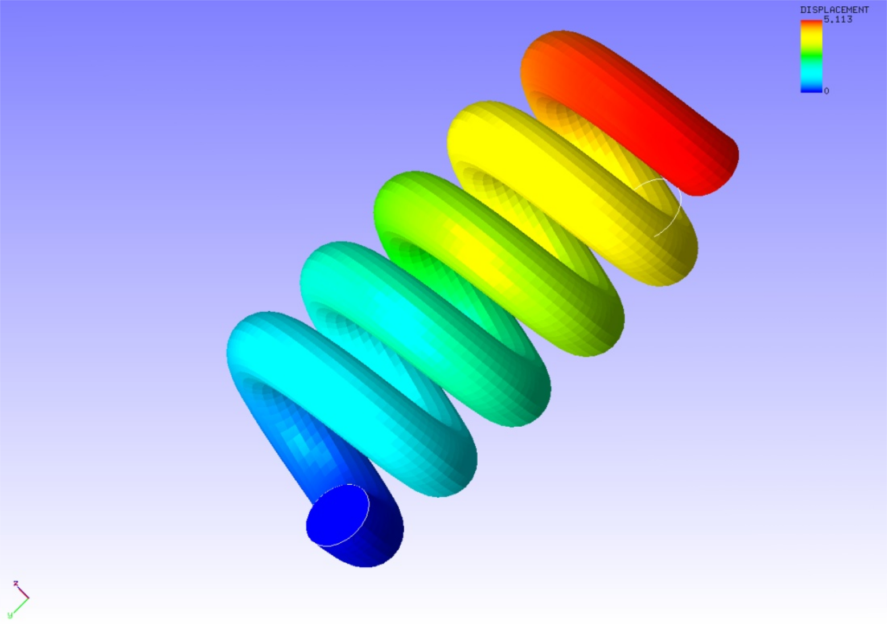

## 静解析（超弾性その２）

本解析の実施には、`tutorial/04_hyperelastic_spring` のデータを用います。

### 解析対象

解析対象はスプリングで、形状を図4.4.1に、メッシュデータを図4.4.2に示します。メッシュには四面体2次要素を用い、メッシュ規模は要素数46,454、節点数78,771です。

{: .center width="350px"}

図4.4.1　スプリングの形状

{: .center width="350px"}

図4.4.2　スプリングのメッシュデータ

### 解析内容

図4.4.1に示す拘束面の変位を拘束し、強制面に変位を与える応力解析を実施します。超弾性の材料構成式にはArruda-Boyceモデルを用います。解析制御データを以下に示します。

### 解析結果

変位のコンターを付加した変形図をREVOCAP_PrePostで作成して図4.4.3に示します。また、解析結果の数値データとして、解析結果ログファイルの一部を以下に示します。

{: .center width="350px"}

図4.4.3　変形および変位の解析結果

