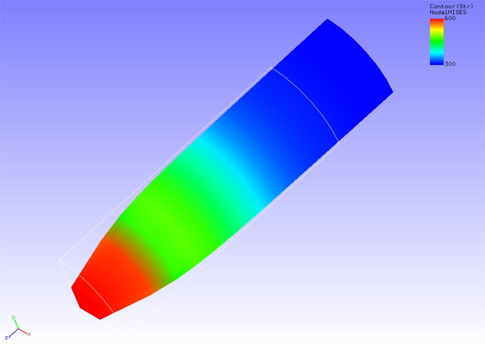

## 非線形静解析 (弾塑性その1)

本解析の実施には、`tutorial/05_plastic_cylinder` のデータを用います。

### 解析対象

解析対象は、[非線形静解析(超弾性その1)](tutorial_03.md)と同一の丸棒1/8モデルです。

 | 項目       | 内容                 | 備考                        | 参照 |
 |------------|----------------------|-----------------------------|------|
 | 解析の種別 | 非線形静解析(弾塑性) | !SOLUTION,TYPE=NLSTATIC     |      |
 | 節点数     | 629                  |                             |      |
 | 要素数     | 432                  |                             |      |
 | 要素タイプ | 8節点六面体一次要素  | !ELEMENT,TYPE=361           |      |
 | 材料物性名 | MAT1                 | !MATERICAL,NAME=MAT1        |      |
 | 材料性質   | ELASTIC,PLASTIC      | !ELASTIC    !PLASTIC        |      |
 | 境界条件   | 拘束, 強制変位       |                             |      |
 | 行列解法   | CG/SSOR              | !SOLVER,METHOD=CG,PRECOND=1 |      | 

### 解析内容

塑性変形による丸棒のNecking現象を解析します。降伏関数にはMisesモデルを用います。解析制御データを以下に示します。

#### 解析制御データ `necking.cnt`

```
#  Control File for FISTR
## Analysis Control
!VERSION
 3
!SOLUTION, TYPE=NLSTATIC
!WRITE,RESULT,FREQUENCY=10
!WRITE,VISUAL,FREQUENCY=10
## Solver Control
### Boundary Conditon
!BOUNDARY, GRPID=1
 LOADS, 3, 3, -7.0
 FIX,   3, 3, 0.0
 XSYMM, 1, 1, 0.0
 YSYMM, 2, 2, 0.0
### STEP
!STEP, SUBSTEPS=40, CONVERG=1.0e-3
 BOUNDARY, 1
### Material
!MATERIAL, NAME=MAT1
!ELASTIC
 206900.0, 0.29
!PLASTIC, YIELD=MISES, HARDEN=MULTILINEAR
 450.0, 0.0
 608.0, 0.05
 679.0, 0.1
 732.0, 0.2
 752.0, 0.3
 766.0, 0.4
 780.0, 0.5
### Output
!OUTPUT_VIS
 NSTRAIN, ON
!OUTPUT_RES
 ISTRESS, ON
### Solver Setting
!SOLVER,METHOD=CG,PRECOND=1,ITERLOG=NO,TIMELOG=YES
 2000, 1
 1.0e-8, 1.0, 0.0
## Post Control
!VISUAL,metod=PSR
!surface_num=1
!surface 1
!output_type=VTK
!END
```

### 解析手順

FrontISTRの実行コマンド `fistr1` を実行します。 

```
$ cd FrontISTR/tutorial/05_plastic_cylinder
$ fistr1 -t 4
(4スレッドで実行)
```

### 解析結果

35サブステップ目の解析結果について、ミーゼス応力のコンターを付加した変形図をREVOCAP_PrePostで作成して図4.5.1に示します。また、解析結果の数値データとして、解析結果ログファイルの一部を以下に示します。

{.center width="350px"}
<div style="text-align: center;">
図4.5.1 変形およびミーゼス応力の解析結果
</div>

#### 解析結果ログ `0.log`

```
 fstr_setup: OK
#### Result step=     0
 ##### Local Summary @Node    :Max/IdMax/Min/IdMin####
 //U1    0.0000E+00         1  0.0000E+00         1
 //U2    0.0000E+00         1  0.0000E+00         1
 //U3    0.0000E+00         1  0.0000E+00         1
 //E11   0.0000E+00         1  0.0000E+00         1
 //E22   0.0000E+00         1  0.0000E+00         1
 //E33   0.0000E+00         1  0.0000E+00         1
 //E12   0.0000E+00         1  0.0000E+00         1
 //E23   0.0000E+00         1  0.0000E+00         1
 //E31   0.0000E+00         1  0.0000E+00         1
 //S11   0.0000E+00         1  0.0000E+00         1
 //S22   0.0000E+00         1  0.0000E+00         1
 //S33   0.0000E+00         1  0.0000E+00         1
 //S12   0.0000E+00         1  0.0000E+00         1
 //S23   0.0000E+00         1  0.0000E+00         1
 //S31   0.0000E+00         1  0.0000E+00         1
 //SMS   0.0000E+00         1  0.0000E+00         1
 ##### Local Summary @Element :Max/IdMax/Min/IdMin####
 //E11   0.0000E+00         1  0.0000E+00         1
 //E22   0.0000E+00         1  0.0000E+00         1
```
