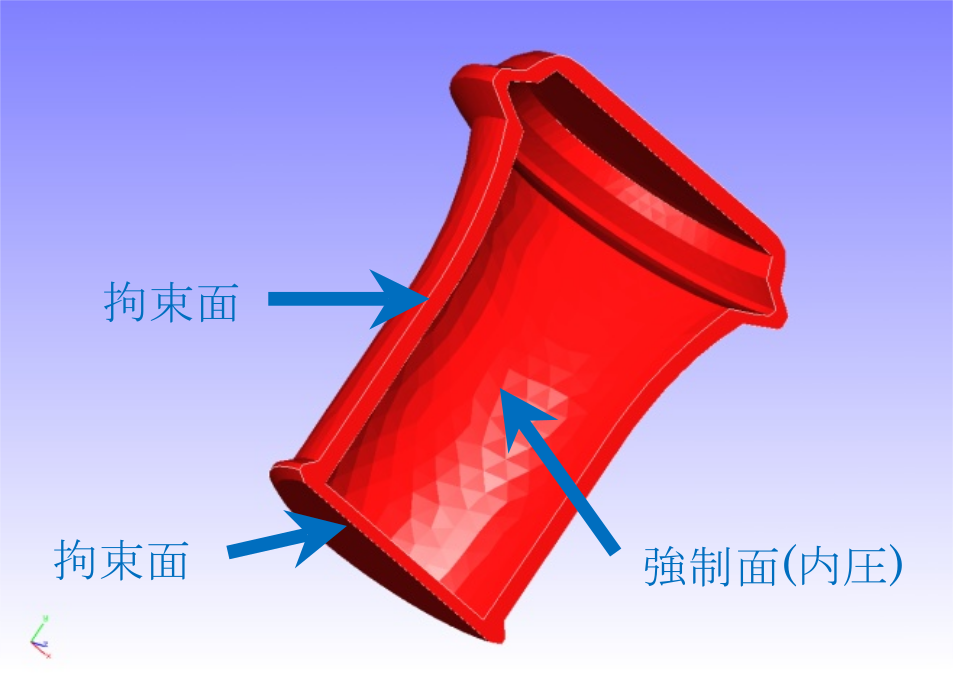
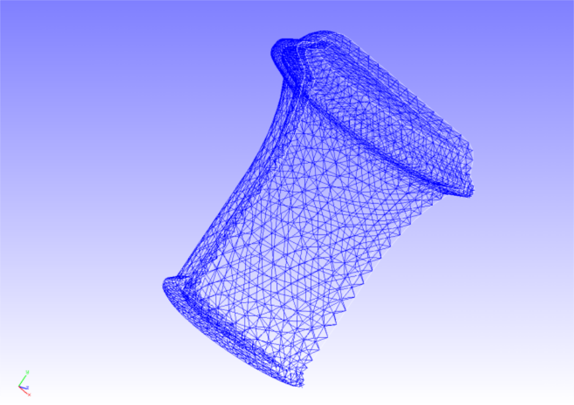

## 静解析（弾塑性その２）

本解析の実施には、`tutorial/06_plastic_can` のデータを用います。

### 解析対象

解析対象は容器の1/2モデルで、形状を図4.6.1に、メッシュデータを図4.6.2に示します。
メッシュには四面体2次要素を用い、メッシュ規模は要素数7,236、節点数14,119です。

{: .center width="350px"}

図4.6.1　容器の形状

{: .center width="350px"}

図4.6.2　容器のメッシュデータ

### 解析内容

図4.6.1に示す拘束面の変位を拘束し、容器内部を強制面とし分布荷重を負荷する応力解析を実施します。
降伏関数にはDrucker-Pragerモデルを用います。解析制御データを以下に示します。

### 解析結果

10サブステップ目の解析結果について、ミーゼス応力のコンターを付加した変形図をREVOCAP_PrePostで作成して図4.6.3に示します。
変形倍率を30としています。また、解析結果の数値データとして、解析結果ログファイルの一部を以下に示します。

{: .center width="350px"}

図4.6.3　変形およびミーゼス応力の解析結果

