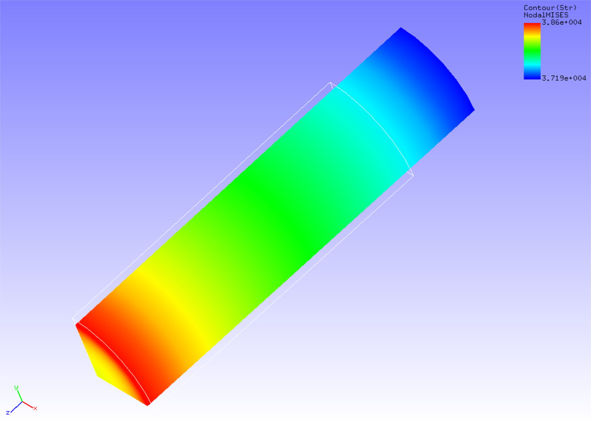

## 非線形静解析 (粘弾性)

本解析の実施には、`tutorial/07_viscoelastic_cylinder` のデータを用います。

### 解析対象

解析対象は、[非線形静解析(超弾性その1)](tutorial_03.md)と同一の丸棒1/8モデルです。


 | 項目       | 内容                 | 備考                        | 参照 |
 |------------|----------------------|-----------------------------|------|
 | 解析の種別 | 非線形静解析(弾塑性) | !SOLUTION,TYPE=NLSTATIC     |      |
 | 節点数     | 629                  |                             |      |
 | 要素数     | 432                  |                             |      |
 | 要素タイプ | 8節点六面体一次要素  | !ELEMENT,TYPE=361           |      |
 | 材料物性名 | MAT1                 | !MATERICAL,NAME=MAT1        |      |
 | 材料性質   | ELASTIC,VISCOELASTIC | !ELASTIC    !VISCOELASTIC   |      |
 | 境界条件   | 拘束, 強制変位       |                             |      |
 | 行列解法   | CG/SSOR              | !SOLVER,METHOD=CG,PRECOND=1 |      | 

### 解析内容

丸棒に軸方向の引張変位を与え、応力緩和解析を実施します。解析制御データを以下に示します。

#### 解析制御データ `cylinder.cnt`

```
#  Control File for FISTR
## Analysis Control
!VERSION
 3
!SOLUTION, TYPE=NLSTATIC
!WRITE,VISUAL
!WRITE,RESULT
## Solver Control
### Boundary Conditon
!BOUNDARY, GRPID=1
 LOADS, 3, 3, -7.0
 FIX,   3, 3, 0.0
 XSYMM, 1, 1, 0.0
 YSYMM, 2, 2, 0.0
### STEP
!STEP, TYPE=VISCO, CONVERG=1.0e-5
 0.2, 2.0
 BOUNDARY, 1
### Material
!MATERIAL, NAME=MAT1
!ELASTIC
 206900.0, 0.29
!VISCOELASTIC
 0.5, 1.0
### Solver Setting
!SOLVER,METHOD=CG,PRECOND=1,ITERLOG=YES,TIMELOG=YES
 10000, 1
 1.0e-8, 1.0, 0.0
## Post Control
!VISUAL,metod=PSR
!surface_num=1
!surface 1
!output_type=VTK
!END
```

### 解析手順

FrontISTRの実行コマンド `fistr1` を実行します。

```
$ cd FrontISTR/tutorial/07_viscoelastic_cylinder
$ fistr1 -t 4
(4スレッドで実行)
```

### 解析結果

ミーゼス応力のコンターを付加した変形図をREVOCAP_PrePostで作成して図4.7.1に示します。
2秒後(10ステップ目)の解析結果です。また、解析結果の数値データとして、解析結果ログファイルの一部を以下に示します。

{.center width="350px"}
<div style="text-align: center;">
図4.7.1　変形およびミーゼス応力の解析結果
</div>

#### 解析結果ログ `0.log`

<div style="height: 400px; overflow-y: scroll;">
```
 fstr_setup: OK
#### Result step=     0
 ##### Local Summary @Node    :Max/IdMax/Min/IdMin####
 //U1    0.0000E+00         1  0.0000E+00         1
 //U2    0.0000E+00         1  0.0000E+00         1
 //U3    0.0000E+00         1  0.0000E+00         1
 //E11   0.0000E+00         1  0.0000E+00         1
 //E22   0.0000E+00         1  0.0000E+00         1
 //E33   0.0000E+00         1  0.0000E+00         1
 //E12   0.0000E+00         1  0.0000E+00         1
 //E23   0.0000E+00         1  0.0000E+00         1
 //E31   0.0000E+00         1  0.0000E+00         1
 //S11   0.0000E+00         1  0.0000E+00         1
 //S22   0.0000E+00         1  0.0000E+00         1
 //S33   0.0000E+00         1  0.0000E+00         1
 //S12   0.0000E+00         1  0.0000E+00         1
 //S23   0.0000E+00         1  0.0000E+00         1
 //S31   0.0000E+00         1  0.0000E+00         1
 //SMS   0.0000E+00         1  0.0000E+00         1
 ##### Local Summary @Element :Max/IdMax/Min/IdMin####
 //E11   0.0000E+00         1  0.0000E+00         1
 //E22   0.0000E+00         1  0.0000E+00         1
 //E33   0.0000E+00         1  0.0000E+00         1
 //E12   0.0000E+00         1  0.0000E+00         1
 //E23   0.0000E+00         1  0.0000E+00         1
 //E31   0.0000E+00         1  0.0000E+00         1
 //S11   0.0000E+00         1  0.0000E+00         1
 //S22   0.0000E+00         1  0.0000E+00         1
 //S33   0.0000E+00         1  0.0000E+00         1
 //S12   0.0000E+00         1  0.0000E+00         1
 //S23   0.0000E+00         1  0.0000E+00         1
 //S31   0.0000E+00         1  0.0000E+00         1
 //SMS   0.0000E+00         1  0.0000E+00         1
 ##### Global Summary @Node    :Max/IdMax/Min/IdMin####
 //U1    0.0000E+00         1  0.0000E+00         1
 //U2    0.0000E+00         1  0.0000E+00         1
 //U3    0.0000E+00         1  0.0000E+00         1
 //E11   0.0000E+00         1  0.0000E+00         1
 //E22   0.0000E+00         1  0.0000E+00         1
 //E33   0.0000E+00         1  0.0000E+00         1
 //E12   0.0000E+00         1  0.0000E+00         1
 //E23   0.0000E+00         1  0.0000E+00         1
 //E31   0.0000E+00         1  0.0000E+00         1
 //S11   0.0000E+00         1  0.0000E+00         1
 //S22   0.0000E+00         1  0.0000E+00         1
 //S33   0.0000E+00         1  0.0000E+00         1
 //S12   0.0000E+00         1  0.0000E+00         1
 //S23   0.0000E+00         1  0.0000E+00         1
 //S31   0.0000E+00         1  0.0000E+00         1
 //SMS   0.0000E+00         1  0.0000E+00         1
 ##### Global Summary @Element :Max/IdMax/Min/IdMin####
 //E11   0.0000E+00         1  0.0000E+00         1
 //E22   0.0000E+00         1  0.0000E+00         1
 //E33   0.0000E+00         1  0.0000E+00         1
 //E12   0.0000E+00         1  0.0000E+00         1
 //E23   0.0000E+00         1  0.0000E+00         1
 //E31   0.0000E+00         1  0.0000E+00         1
 //S11   0.0000E+00         1  0.0000E+00         1
 //S22   0.0000E+00         1  0.0000E+00         1
 //S33   0.0000E+00         1  0.0000E+00         1
 //S12   0.0000E+00         1  0.0000E+00         1
 //S23   0.0000E+00         1  0.0000E+00         1
 //S31   0.0000E+00         1  0.0000E+00         1
 //SMS   0.0000E+00         1  0.0000E+00         1

 ...

#### Result step=    10
 ##### Local Summary @Node    :Max/IdMax/Min/IdMin####
 //U1    0.0000E+00         1 -7.4530E-01        91
 //U2    0.0000E+00         1 -7.4530E-01        88
 //U3    0.0000E+00         1 -7.0000E+00        38
 //E11  -1.2136E-01        38 -1.2719E-01         7
 //E22  -1.2136E-01        50 -1.2719E-01        13
 //E33   2.3670E-01         7  2.2951E-01        50
 //E12   1.2005E-03        53 -1.2295E-03        10
 //E23   1.2987E-04        72 -2.5210E-03        83
 //E31   1.2987E-04        64 -2.5210E-03        96
 //S11   1.3771E+02        13 -1.3366E+02        50
 //S22   1.3771E+02         7 -1.3366E+02        38
 //S33   6.3193E+04         7  5.9532E+04        50
 //S12   3.5416E+01        53 -3.5955E+01        10
 //S23   1.0704E+01        35 -2.1669E+02        83
 //S31   1.0704E+01        31 -2.1669E+02        96
 //SMS   6.3093E+04         7  5.9628E+04        50
 ##### Local Summary @Element :Max/IdMax/Min/IdMin####
 //E11  -1.2167E-01       759 -1.2687E-01       354
 //E22  -1.2167E-01       768 -1.2687E-01       363
 //E33   2.3619E-01       354  2.3001E-01       768
 //E12   1.1247E-03       765 -1.1492E-03       360
 //E23  -8.9560E-06       758 -2.4072E-03       552
 //E31  -8.9560E-06       771 -2.4072E-03       543
 //S11   1.0437E+02       363 -1.0216E+02       768
 //S22   1.0437E+02       354 -1.0216E+02       759
 //S33   6.2914E+04       354  5.9795E+04       768
 //S12   3.3111E+01       765 -3.3459E+01       360
 //S23  -7.6469E-01       758 -2.0669E+02       552
 //S31  -7.6469E-01       771 -2.0669E+02       543
 //SMS   6.2843E+04       354  5.9864E+04       768
 ##### Global Summary @Node    :Max/IdMax/Min/IdMin####
 //U1    0.0000E+00         1 -7.4530E-01        91
 //U2    0.0000E+00         1 -7.4530E-01        88
 //U3    0.0000E+00         1 -7.0000E+00        38
 //E11  -1.2136E-01        38 -1.2719E-01         7
 //E22  -1.2136E-01        50 -1.2719E-01        13
 //E33   2.3670E-01         7  2.2951E-01        50
 //E12   1.2005E-03        53 -1.2295E-03        10
 //E23   1.2987E-04        72 -2.5210E-03        83
 //E31   1.2987E-04        64 -2.5210E-03        96
 //S11   1.3771E+02        13 -1.3366E+02        50
 //S22   1.3771E+02         7 -1.3366E+02        38
 //S33   6.3193E+04         7  5.9532E+04        50
 //S12   3.5416E+01        53 -3.5955E+01        10
 //S23   1.0704E+01        35 -2.1669E+02        83
 //S31   1.0704E+01        31 -2.1669E+02        96
 //SMS   6.3093E+04         7  5.9628E+04        50
 ##### Global Summary @Element :Max/IdMax/Min/IdMin####
 //E11  -1.2167E-01       759 -1.2687E-01       354
 //E22  -1.2167E-01       768 -1.2687E-01       363
 //E33   2.3619E-01       354  2.3001E-01       768
 //E12   1.1247E-03       765 -1.1492E-03       360
 //E23  -8.9560E-06       758 -2.4072E-03       552
 //E31  -8.9560E-06       771 -2.4072E-03       543
 //S11   1.0437E+02       363 -1.0216E+02       768
 //S22   1.0437E+02       354 -1.0216E+02       759
 //S33   6.2914E+04       354  5.9795E+04       768
 //S12   3.3111E+01       765 -3.3459E+01       360
 //S23  -7.6469E-01       758 -2.0669E+02       552
 //S31  -7.6469E-01       771 -2.0669E+02       543
 //SMS   6.2843E+04       354  5.9864E+04       768
```
</div>