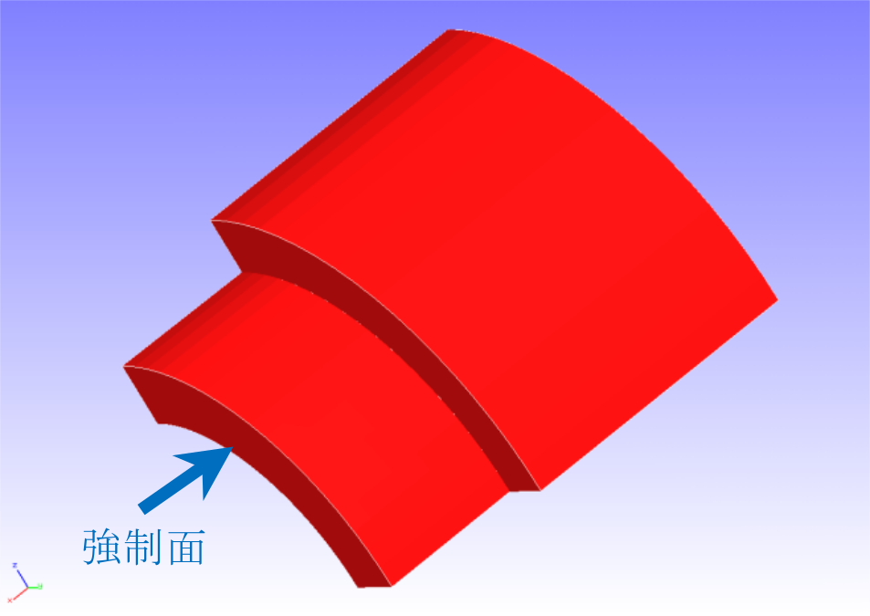
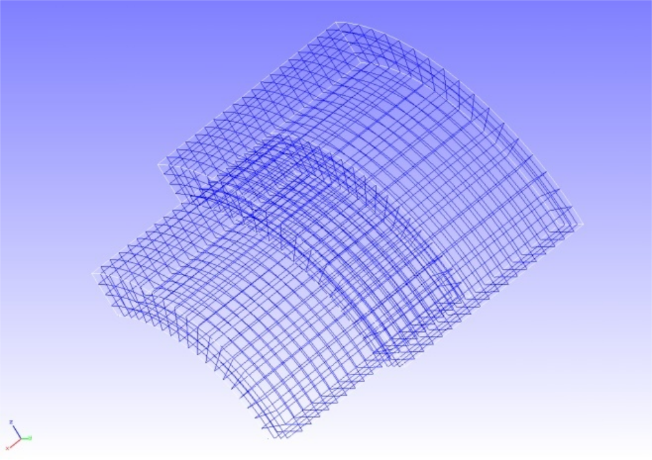

## 接触解析 (その2)

本解析の実施には、`tutorial/10_contact_2tubes` のデータを用います。

### 解析対象

解析は円筒の押し込み問題で、解析対象の形状を図4.10.1に、メッシュデータを図4.10.2に示します。

 | 項目       | 内容                    | 備考                             | 参照 |
 |------------|-------------------------|----------------------------------|------|
 | 解析の種別 | 非線形静解析(弾性,接触) | !SOLUTION,TYPE=NLSTATIC !CONTACT |      |
 | 接点数     | 4,000                   |                                  |      |
 | 要素数     | 2,888                   |                                  |      |
 | 要素タイプ | 8節点六面体一次要素     | !ELEMENT,TYPE=361                |      |
 | 材料物性名 | M1                      | !MATERIAL,NAME=M1                |      |
 | 材料性質   | ELASTIC                 | !ELASTIC                         |      |
 | 境界条件   | 拘束, 強制変位          |                                  |      |
 | 行列解法   | 直接法                  | !SOLVER,METHOD=MUMPS             |      |

{.center width="350px"}
<div style="text-align: center;">
図4.10.1　解析対象の形状
</div>

{.center width="350px"}
<div style="text-align: center;">
図4.10.2　解析対象のメッシュデータ
</div>

### 解析内容

図4.10.1に示す強制面に押し込み方向の強制変位を与える接触解析をラグランジュ乗数法で実施します。解析制御データを以下に示します。

#### 解析制御データ `2tubes.cnt`

```
#  Control File for FISTR
## Analysis Control
!VERSION
 3
!SOLUTION, TYPE=NLSTATIC
!WRITE,RESULT
!WRITE,VISUAL
## Solver Control
### Boundary Conditon
!BOUNDARY, GRPID=1
  X0, 1, 3, 0.0
  Y0, 2, 2, 0.0
  Z0, 3, 3, 0.0
!BOUNDARY, GRPID=2
  X1, 1, 1, 0.0
!BOUNDARY, GRPID=3
  X1, 1, 1, -1.0
!CONTACT_ALGO, TYPE=SLAGRANGE
!CONTACT, GRPID=1, INTERACTION=FSLID, NPENALTY=1.0e+2
  CP1, 0.0, 1.0e+5
### STEP
!STEP, SUBSTEPS=4, CONVERG=1.0e-5
 BOUNDARY, 1
 BOUNDARY, 3
 CONTACT, 1
### Material
!MATERIAL, NAME=M1
!ELASTIC
 2.1e+5, 0.3
### Solver Setting
!SOLVER,METHOD=MUMPS
## Post Control
!VISUAL,metod=PSR
!surface_num=1
!surface 1
!output_type=VTK
!END
```

### 解析手順

FrontISTRの実行コマンド `fistr1` を実行します。

```
$ cd FrontISTR/tutorial/10_contact_2tubes
$ fistr1 -t 4
(4スレッドで実行)
```

### 解析結果

4サブステップ目の解析結果について、ミーゼス応力のコンターを付加した変形図をREVOCAP_PrePostで作成して図4.10.3に示します。
また、解析結果の数値データとして、解析結果ログファイルの一部を以下に示します。

{.center width="350px"}
<div style="text-align: center;">
図4.10.3 変形およびミーゼス応力の解析結果
</div>

#### 解析結果ログ `0.log`

```
 fstr_setup: OK
#### Result step=     0
 ##### Local Summary @Node    :Max/IdMax/Min/IdMin####
 //U1    0.0000E+00         1  0.0000E+00         1
 //U2    0.0000E+00         1  0.0000E+00         1
 //U3    0.0000E+00         1  0.0000E+00         1
 //E11   0.0000E+00         1  0.0000E+00         1
 //E22   0.0000E+00         1  0.0000E+00         1
 //E33   0.0000E+00         1  0.0000E+00         1
 //E12   0.0000E+00         1  0.0000E+00         1
 //E23   0.0000E+00         1  0.0000E+00         1
 //E31   0.0000E+00         1  0.0000E+00         1
 //S11   0.0000E+00         1  0.0000E+00         1
 //S22   0.0000E+00         1  0.0000E+00         1
 //S33   0.0000E+00         1  0.0000E+00         1
 //S12   0.0000E+00         1  0.0000E+00         1
 //S23   0.0000E+00         1  0.0000E+00         1
 //S31   0.0000E+00         1  0.0000E+00         1
 //SMS   0.0000E+00         1  0.0000E+00         1
 ##### Local Summary @Element :Max/IdMax/Min/IdMin####
 //E11   0.0000E+00         1  0.0000E+00         1
 //E22   0.0000E+00         1  0.0000E+00         1
```

