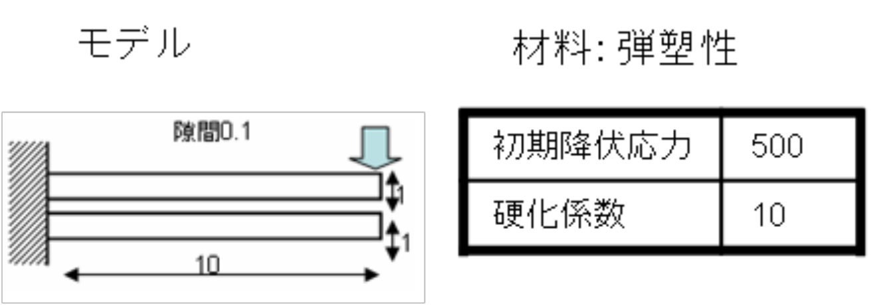
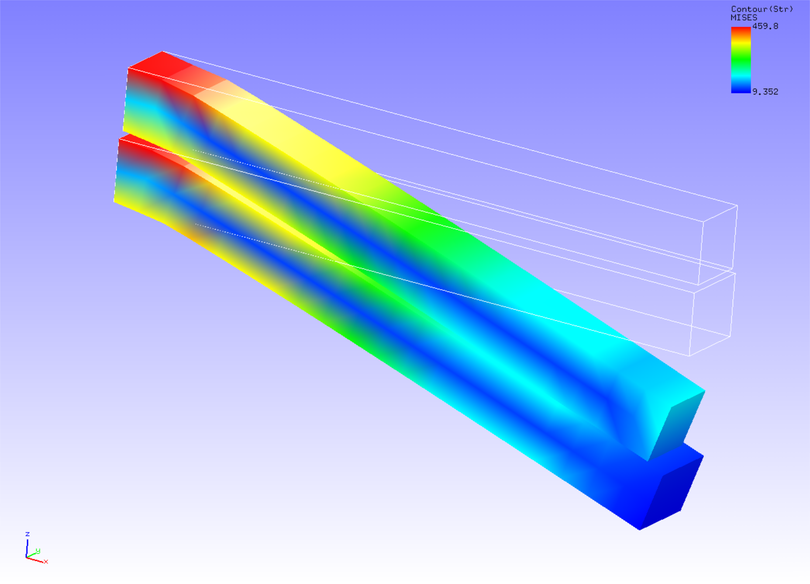

## 接触解析 (その3)

本解析の実施には、`tutorial/11_contact_2beam` のデータを用います。


### 解析対象

解析はふたつの梁の接触問題で、解析モデルの概要を図4.11.1に示します。

 | 項目       | 内容                    | 備考                              | 参照 |
 |------------|-------------------------|-----------------------------------|------|
 | 解析の種別 | 非線形静解析(弾性,接触) | !SOLUTION,TYPE=NLSTATIC  !CONTACT |      |   
 | 節点数     | 252                     |                                   |      |
 | 要素数     | 80                      |                                   |      |
 | 要素タイプ | 8節点六面体一次要素     | !ELEMENT,TYPE=361                 |      |
 | 材料物性名 | M1                      | !MATERIAL,NAME=M1                 |      |
 | 材料性質   | ELASTIC, PLASTIC        | !ELASTIC   !PLASTIC               |      |
 | 境界条件   | 拘束, 強制変位          |                                   |      |
 | 行列解法   | 直接法                  | !SOLVER,METHOD=MUMPS              |      |

{.center width="350px"}
<div style="text-align: center;">
図4.11.1　解析モデルの概要
</div>


### 解析内容

上側の梁の先端面に強制変位を与える接触解析をラグランジュ乗数法で実施します。解析制御データを以下に示します。

#### 解析制御データ `2beams.cnt`

```
!!
!! Control File for FISTR
!!
!VERSION
 3
!SOLUTION, TYPE=NLSTATIC
!WRITE,RESULT
!WRITE,VISUAL
!BOUNDARY, GRPID=1
  ng1, 1, 3, 0.0
  ng2, 1, 3, 0.0
  ng3, 3, 3, -3.0
!CONTACT_ALGO, TYPE=SLAGRANGE
!CONTACT, GRPID=1, INTERACTION=FSLID
  CP1, 0.0, 1.0e+5
!STEP, SUBSTEPS=100, CONVERG=1.0e-4, MAXITER=1000
 BOUNDARY, 1
 CONTACT, 1
!MATERIAL, NAME=M1
!ELASTIC
 2.1e+5, 0.3
!PLASTIC,YIELD=MISES
 500.0, 10.0
!SOLVER,METHOD=MUMPS
## Post Control
!VISUAL,metod=PSR
!surface_num=1
!surface 1
!output_type=VTK
!END
```

### 解析手順

FrontISTRの実行コマンド `fistr1` を実行します。

```
$ cd FrontISTR/tutorial/11_contact_2beam
$ fistr1 -t 4
(4スレッドで実行)
```

### 解析結果

100サブステップ目の解析結果について、ミーゼス応力のコンターを付加した変形図をREVOCAP_PrePostで作成して図4.11.2に示します。
また、解析結果の数値データとして、解析結果ログファイルの一部を以下に示します。

{.center width="350px"}
<div style="text-align: center;">
図4.11.2　変形およびミーゼス応力の解析結果
</div>

#### 解析結果ログ `0.log`

```
 fstr_setup: OK
#### Result step=     0
 ##### Local Summary @Node    :Max/IdMax/Min/IdMin####
 //U1    0.0000E+00         1  0.0000E+00         1
 //U2    0.0000E+00         1  0.0000E+00         1
 //U3    0.0000E+00         1  0.0000E+00         1
 //E11   0.0000E+00         1  0.0000E+00         1
 //E22   0.0000E+00         1  0.0000E+00         1
 //E33   0.0000E+00         1  0.0000E+00         1
 //E12   0.0000E+00         1  0.0000E+00         1
 //E23   0.0000E+00         1  0.0000E+00         1
 //E31   0.0000E+00         1  0.0000E+00         1
 //S11   0.0000E+00         1  0.0000E+00         1
 //S22   0.0000E+00         1  0.0000E+00         1
 //S33   0.0000E+00         1  0.0000E+00         1
 //S12   0.0000E+00         1  0.0000E+00         1
 //S23   0.0000E+00         1  0.0000E+00         1
 //S31   0.0000E+00         1  0.0000E+00         1
 //SMS   0.0000E+00         1  0.0000E+00         1
 ##### Local Summary @Element :Max/IdMax/Min/IdMin####
 //E11   0.0000E+00         1  0.0000E+00         1
 //E22   0.0000E+00         1  0.0000E+00         1
```
