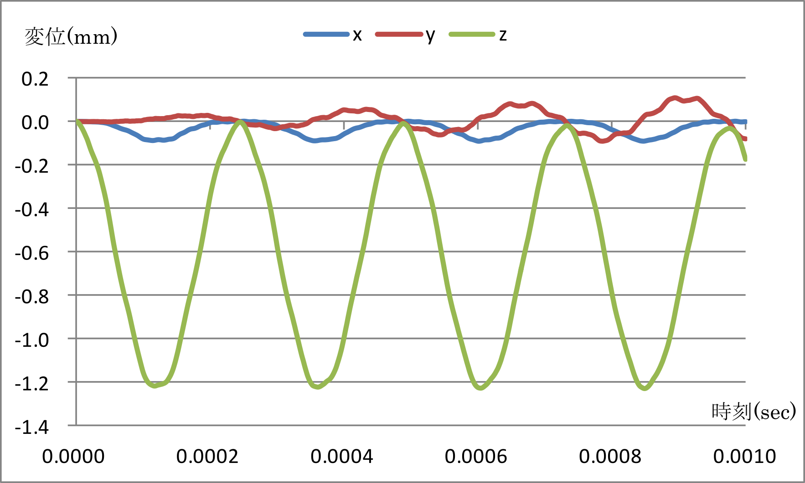

##  非線形動解析

本解析の実施には、`tutorial/13_dynamic_beam_nonlinear` のデータを用います。

### 解析対象

解析対象は、前節の[線形動解析](tutorial_12.md)と同一の片持ち梁です。

 | 項目       | 内容                 | 備考                                             | 参照  |
 |------------|----------------------|--------------------------------------------------|-------|
 | 解析の種別 | 非線形動解析         | !SOLUTION,TYPE=DYNAMIC   !DYNAMIC,TYPE=NONLINEAR |       |
 | 節点数     | 525                  |                                                  |       |
 | 要素数     | 240                  |                                                  |       |
 | 要素タイプ | 10節点四面体二次要素 | !ELEMENT,TYPE=342                                |       |
 | 材料物性名 | M1                   | !MATERIAL,NAME=M1                                |       |
 | 境界条件   | 拘束, 集中荷重       | !CLOAD                                           |       |
 | 行列解法   | CG/SSOR              | !SOLVER,METHOD=CG,PRECOND=1                      |       |

### 解析内容

図4.12.1に示す拘束面の変位を拘束し、荷重節点に集中荷重を負荷した後の非線形動解析を実施します。解析制御データを以下に示します。

{.center width="350px"}
<div style="text-align: center;">
図4.12.1　片持ち梁の形状
</div>

#### 解析制御データ `beam.cnt`

```
#  Control File for FISTR
## Analysis Control
!VERSION
 3
!WRITE,RESULT,FREQUENCY=100
!SOLUTION, TYPE=DYNAMIC
!DYNAMIC, TYPE=NONLINEAR
 1 , 1
 0.0, 0.1, 100000, 1.0000e-8
 0.5, 0.25
 1, 1, 0.0, 0.0
 1000, 3121, 100
 1, 1, 1, 1, 1, 1
## Solver Control
### Boundary Conditon
!BOUNDARY, GRPID=1, AMP=AMP1
 FIX, 1, 3, 0.0
!CLOAD, GRPID=1, AMP=AMP1
 CL1,    3,    -1.0
### STEP
!STEP, CONVERG=1.0e-3
 BOUNDARY, 1
 LOAD,     1
### Material
!DENSITY
 1.0e-8
!HYPERELASTIC, TYPE=NEOHOOKE
 1000.0, 0.00005
### Solver Setting
!SOLVER,METHOD=CG,PRECOND=1,ITERLOG=NO,TIMELOG=NO
 10000, 1
 1.0e-06, 1.0, 0.0
!END
```

### 解析手順

FrontISTRの実行コマンド `fistr1` を実行します。

```
$ cd FrontISTR/tutorial/13_dynamic_beam_nonlinear
$ fistr1 -t 4
(4スレッドで実行)
```

### 解析結果

解析制御データで指定したモニタリング節点（荷重節点、節点番号3121）の変位の時系列表示をMicrosoft
Excelで作成して図4.13.1に示します。また、解析結果の数値データとして、モニタリング節点の変位出力ファイル(dyna_disp_3121.txt)の一部を以下に示します。

{.center width="350px"}
<div style="text-align: center;">
図4.13.1　モニタリング節点の変位時系列
</div>

#### モニタリング節点の変位 `dyna_disp_3121.txt`

```
         0  0.0000E+000      3121  0.0000E+000  0.0000E+000  0.0000E+000
       100  1.0000E-006      3121  7.6885E-005 -7.3733E-005 -6.0988E-004
       200  2.0000E-006      3121  3.3089E-005 -7.5879E-006 -8.2481E-004
       300  3.0000E-006      3121  8.9272E-005 -5.6180E-005 -1.2550E-003
       400  4.0000E-006      3121  5.8434E-005 -2.9113E-005 -1.9326E-003
       500  5.0000E-006      3121  3.3598E-005 -3.7069E-005 -2.6955E-003
       600  6.0000E-006      3121  9.2438E-005 -2.9415E-005 -3.4297E-003
       700  7.0000E-006      3121  4.4742E-005 -1.9064E-005 -4.2128E-003
       800  8.0000E-006      3121  4.2702E-005 -3.7315E-005 -5.2563E-003
       900  9.0000E-006      3121  7.9468E-005  4.8283E-006 -6.1239E-003
      1000  1.0000E-005      3121  2.5902E-005 -3.1393E-005 -7.1463E-003
      1100  1.1000E-005      3121  6.9365E-005 -1.1486E-005 -8.3515E-003
```

