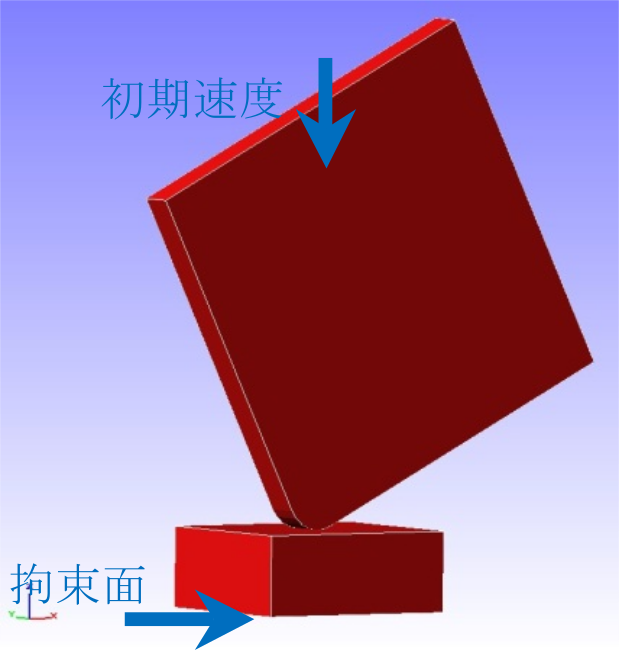
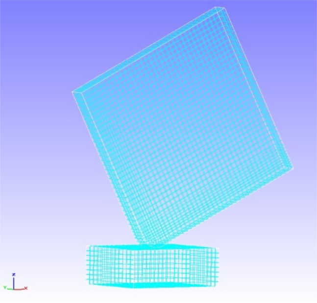
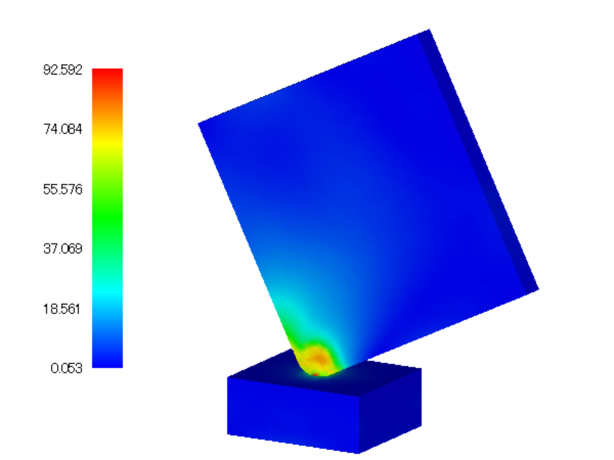

##  非線形接触動解析

本解析の実施には、`tutorial/14_dynamic_plate_contact` のデータを用います。

### 解析対象

解析対象は床面への角材の落下衝撃解析で、形状を図4.14.1に、メッシュデータを図4.14.2に示します。

 | 項目       | 内容             | 備考                                                        | 参照 |
 |------------|------------------|-------------------------------------------------------------|------|
 | 解析の種別 | 非線形接触動解析 | !SOLUTION,TYPE=DYNAMIC   !DYNAMIC,TYPE=NONLINEAR   !CONTACT |      |
 | 節点数     | 10,712           |                                                             |      |
 | 要素数     | 8,232            |                                                             |      |
 | 要素タイプ | 8節点六面体要素  | !ELEMENT,TYPE=361                                           |      |
 | 材料物質名 | M1, M2           | !MATERIAL,NAME=M1    !MATERIAL,NAME=M2                      |      |
 | 材料性質   | ELASTIC, PLASTIC | !ELASTIC    !PLASTIC                                        |      |
 | 境界条件   | 拘束, 初期速度   | !VELOCITY,TYPE=INITIAL                                      |      |
 | 行列解法   | 直接法           | !SOLVER,METHOD=MUMPS                                        |      |

{.center width="350px"}
<div style="text-align: center;">
図4.14.1　床面と角材の形状
</div>

{.center width="350px"}
<div style="text-align: center;">
図4.14.2　床面と角材のメッシュデータ
</div>

### 解析内容

解析対象の角材に初期速度4427mm/sを設定し、接触動解析を実施します。解析制御データを以下に示します。

#### 解析制御データ `plateToGround.cnt`

```
!!
!! Control File for FISTR
!!
!VERSION
 3
!WRITE,LOG,FREQUENCY=10
!WRITE,RESULT,FREQUENCY=10
!SOLUTION, TYPE=DYNAMIC
!DYNAMIC, TYPE=NONLINEAR
 1 , 1
 0.0, 1.0, 200, 1.0000e-8
 0.65, 0.330625
 1, 1, 0.0, 0.0
 20, 2621, 1
 1, 1, 1, 1, 1, 1
!BOUNDARY, GRPID = 1
  bottom, 1, 3, 0.0
!VELOCITY, TYPE = INITIAL
  plate, 3, 3, -4427.0
!CONTACT_ALGO, TYPE=SLAGRANGE
!CONTACT, GRPID=1, INTERACTION=FSLID
  CP1, 0.0, 1.0e+5
!STEP, CONVERG=1.0e-8, ITMAX=100
 BOUNDARY, 1
 CONTACT, 1
!MATERIAL, NAME = M1
!ELASTIC
2.00000e+5, 0.3
!PLASTIC
 1.0e+8, 0.0
!MATERIAL, NAME = M2
!ELASTIC
 1.16992e+5, 0.3
!PLASTIC
 70.0, 0.0
!SOLVER,METHOD=MUMPS
!END
```

### 解析結果

落下衝撃時のミーゼス応力のコンター図を図4.14.3に示します。
また、解析結果の数値データとして、モニタリング節点のエネルギー出力ファイル(dyna_energy.txt)の一部を以下に示します。

{.center width="350px"}
<div style="text-align: center;">
図4.14.3　落下衝撃時のミーゼス応力
</div>

#### モニタリング節点のエネルギー `dyna_energey.txt`

```
  time step     time      kinetic energy   strain energy   total energy
         0  0.0000E+000     9.7816E-003     0.0000E+000     9.7816E-003
         1  1.0000E-008     9.7756E-003     4.9470E-006     9.7806E-003
         2  2.0000E-008     9.7654E-003     1.4636E-005     9.7800E-003
         3  3.0000E-008     9.7566E-003     2.2609E-005     9.7792E-003
         4  4.0000E-008     9.7505E-003     3.7965E-005     9.7884E-003
         5  5.0000E-008     9.7425E-003     6.4932E-005     9.8074E-003
         6  6.0000E-008     9.7214E-003     8.4571E-005     9.8060E-003
         7  7.0000E-008     9.7139E-003     9.0613E-005     9.8045E-003
         8  8.0000E-008     9.7184E-003     1.0958E-004     9.8280E-003
         9  9.0000E-008     9.7175E-003     1.5717E-004     9.8747E-003
        10  1.0000E-007     9.6909E-003     1.7998E-004     9.8709E-003
        11  1.1000E-007     9.6917E-003     1.9733E-004     9.8890E-003
        12  1.2000E-007     9.7137E-003     2.2403E-004     9.9377E-003
        13  1.3000E-007     9.6813E-003     2.4397E-004     9.9253E-003
```
