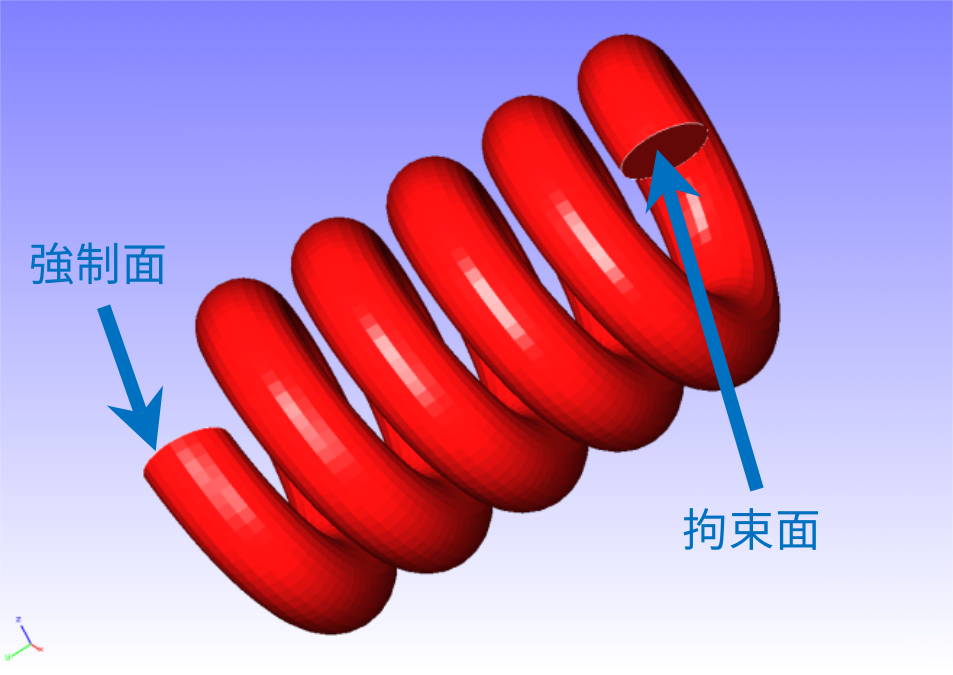
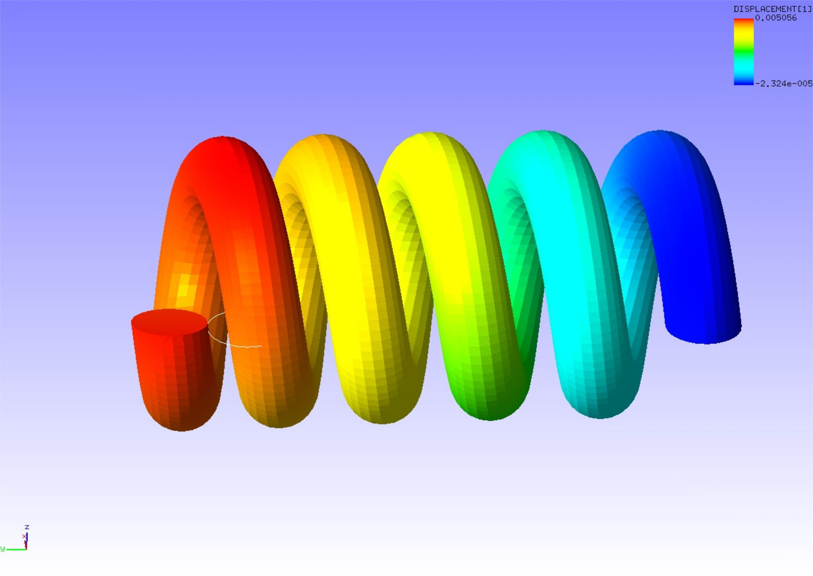

##  固有値解析

本解析の実施には、`tutorial/15_eigen_spring` のデータを用います。

### 解析対象

解析対象は、前節の[非線形静解析(超弾性その2)](tutorial_04.md)と同一のスプリングです。

 | 項目       | 内容                 | 備考                       | 参照 |
 |------------|----------------------|----------------------------|------|
 | 解析の種別 | 固有値解析           | !SOLUTION, TYPE=EIGEN      |      |
 | 節点数     | 78,771               |                            |      |
 | 要素数     | 46,454               |                            |      |
 | 要素タイプ | 10節点四面体二次要素 | !ELEMENT,TYPE=342          |      |
 | 材料物性名 | MAT1                 | !MATERIAL,NAME=MAT1        |      |
 | 境界条件   | 拘束                 |                            |      |
 | 行列解法   | 直接法               | !SOLVER,METHOD=DIRECT      |      |

### 解析内容

図4.4.1に示す拘束面の変位を拘束し、5次までの固有値解析を実施します。解析制御データを以下に示します。

{.center width="350px"}
<div style="text-align: center;">
図4.4.1　スプリングの形状
</div>

#### 解析制御データ `spring.cnt`

```
#  Control File for FISTR
## Analysis Control
!VERSION
 3
!SOLUTION, TYPE=EIGEN
!EIGEN
 5, 1.0E-8, 60
!WRITE,RESULT
!WRITE,VISUAL
## Solver Control
### Boundary Conditon
!BOUNDARY
 XFIX, 1, 1, 0.0
 YFIX, 2, 2, 0.0
 ZFIX, 3, 3, 0.0
### Material
# define in mesh file
### Solver Setting
!SOLVER,METHOD=DIRECT
## Post Control
!VISUAL,method=PSR
!surface_num=1
!surface 1
!output_type=VTK
!END
```

### 解析手順

FrontISTRの実行コマンド fistr1 を実行します。

```
$ cd FrontISTR/tutorial/15_eigen_spring
$ fistr1 -t 4
(4スレッドで実行)
```

### 解析結果

解析結果データファイルspring.res.0.3を用いて、3次の振動モード（スプリングのy方向圧縮伸長）をREVOCAP_PrePostで作成して図4.15.1に示します。
変形倍率を1000としています。また、解析結果の数値データとして、解析結果ログファイルに出力された固有振動数リストを以下に示します。

{.center width="350px"}
<div style="text-align: center;">
図4.15.1　スプリングの3次振動モード
</div>

#### 解析結果ログ `0.log`

```
 fstr_setup: OK

********************************
*RESULT OF EIGEN VALUE ANALYSIS*
********************************

NUMBER OF ITERATIONS =       47
TOTAL MASS =   3.4184E-06

                   ANGLE       FREQUENCY   PARTICIPATION FACTOR                EFFECTIVE MASS
  NO.  EIGENVALUE  FREQUENCY   (HZ)        X           Y           Z           X           Y           Z
  ---  ----------  ----------  ----------  ----------  ----------  ----------  ----------  ----------  ----------
    1  7.8307E+06  2.7983E+03  4.4537E+02  1.0289E+00 -8.8939E-02 -7.0520E-01  1.3006E-06  9.7176E-09  6.1094E-07
    2  7.8716E+06  2.8056E+03  4.4653E+02  6.9687E-01  1.0755E-01  1.0106E+00  6.1290E-07  1.4598E-08  1.2890E-06
    3  3.2600E+07  5.7097E+03  9.0872E+02  4.8622E-03  1.2364E+00 -7.9172E-02  4.0069E-11  2.5908E-06  1.0624E-08
    4  3.8366E+07  6.1940E+03  9.8581E+02 -2.9654E-02  3.3849E-01 -6.7819E-03  9.8232E-10  1.2799E-07  5.1379E-11
    5  1.2931E+08  1.1372E+04  1.8098E+03  5.1856E-01  4.7604E-02  6.7703E-01  2.8377E-07  2.3915E-09  4.8371E-07

    Iter.#   Eigenvalue    Abs. Residual
    1  7.8307E+06  2.4730E-08
    2  7.8716E+06  1.0144E-08
    3  3.2600E+07  1.9866E-07
    4  3.8366E+07  3.1463E-08
    5  1.2931E+08  2.6103E-07
```
