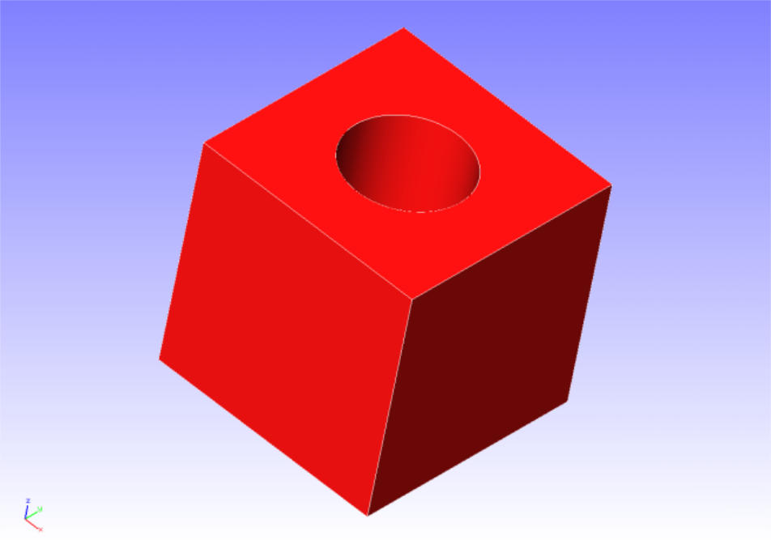
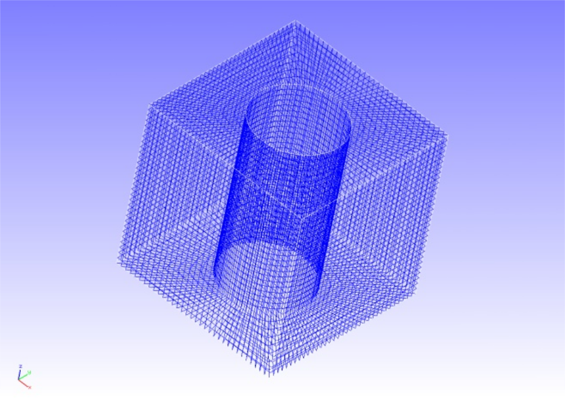
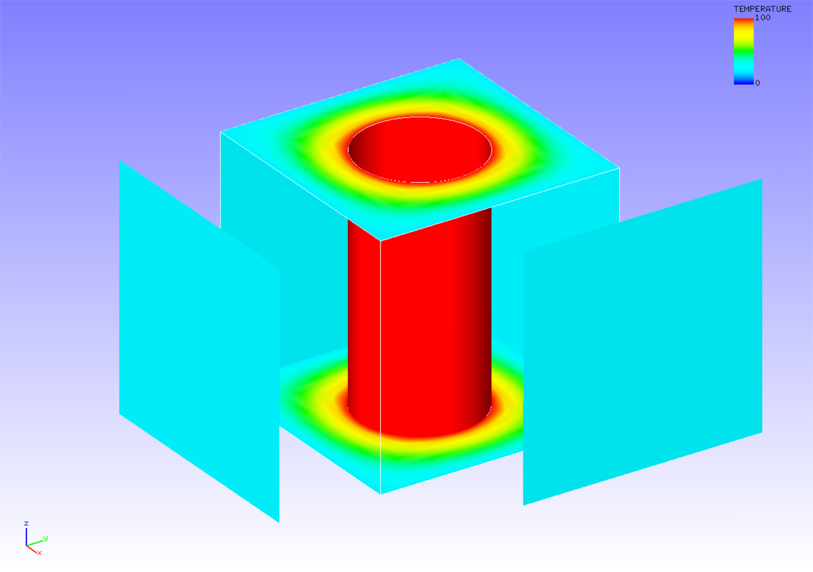

##  熱伝導解析

本解析の実施には、`tutorial/16_heat_block` のデータを用います。

### 解析対象

解析対象は穴あきブロックで、形状を図4.16.1に、メッシュデータを図4.16.2に示します。

 | 項目       | 内容                | 備考                        | 参照 |
 |------------|---------------------|-----------------------------|------|
 | 解析の種別 | 熱伝導解析          | !SOLUTION,TYPE=HEAT         |      |
 | 節点数     | 37,386              |                             |      |
 | 要素数     | 32,160              |                             |      |
 | 要素タイプ | 8節点六面体一次要素 | !ELEMENT,TYPE=361           |      |
 | 材料物性名 | AL                  | !MATERIAL,NAME=AL           |      |
 | 境界条件   | 規定温度            | !FIXTEMP                    |      |
 | 行列解法   | CG/SSOR             | !SOLVER,METHOD=CG,PRECOND=1 |      |

{.center width="350px"}
<div style="text-align: center;">
図4.16.1　穴あきブロックの形状
</div>

{.center width="350px"}
<div style="text-align: center;">
図4.16.2　穴あきブロックのメッシュデータ
</div>

### 解析内容

解析対象の円筒状内面に熱源を与える定常熱伝導解析を実施します。解析制御データを以下に示します。

#### 解析制御データ `block.cnt`

```
#  Control File for FISTR
## Analysis Control
!VERSION
 3
!SOLUTION, TYPE=HEAT
!HEAT
 0.0
!WRITE,RESULT
!WRITE,VISUAL
## Solver Control
### Boundary Conditon
!FIXTEMP
 FTMPC,  100.0
 FTMPS1, 20.0
 FTMPS2, 20.0
 FTMPS3, 20.0
 FTMPS4, 20.0
### Material
# define in mesh file
### Solver Setting
!SOLVER,METHOD=CG,PRECOND=1,ITERLOG=YES,TIMELOG=YES
 100, 1
 1.0e-8, 1.0, 0.0
## Post Control
!VISUAL,metod=PSR
!surface_num=1
!surface 1
!output_type=VTK
!END
```

### 解析手順

FrontISTRの実行コマンド fistr1 を実行します。

```
$ cd FrontISTR/tutorial/16_heat_block
$ fistr1 -t 4
(4スレッドで実行)
```

### 解析結果

温度のコンター図をREVOCAP_PrePostで作成して図4.16.3に示します。また、解析結果の数値データとして、解析結果ログファイルの一部を以下に示します。

{.center width="350px"}
<div style="text-align: center;">
図4.16.3　温度の解析結果
</div>

#### 解析結果ログファイル `0.log`

```
 fstr_setup: OK

 ISTEP =     1
 Time  =     0.000
 Maximum Temperature :   100.000
 Maximum Node No.    :         9
 Minimum Temperature :    20.000
 Minimum Node No.    :        85
 Maximum Temperature(global) :   100.000
 Minimum Temperature(global) :    20.000
```

