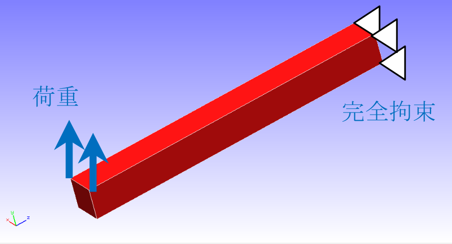
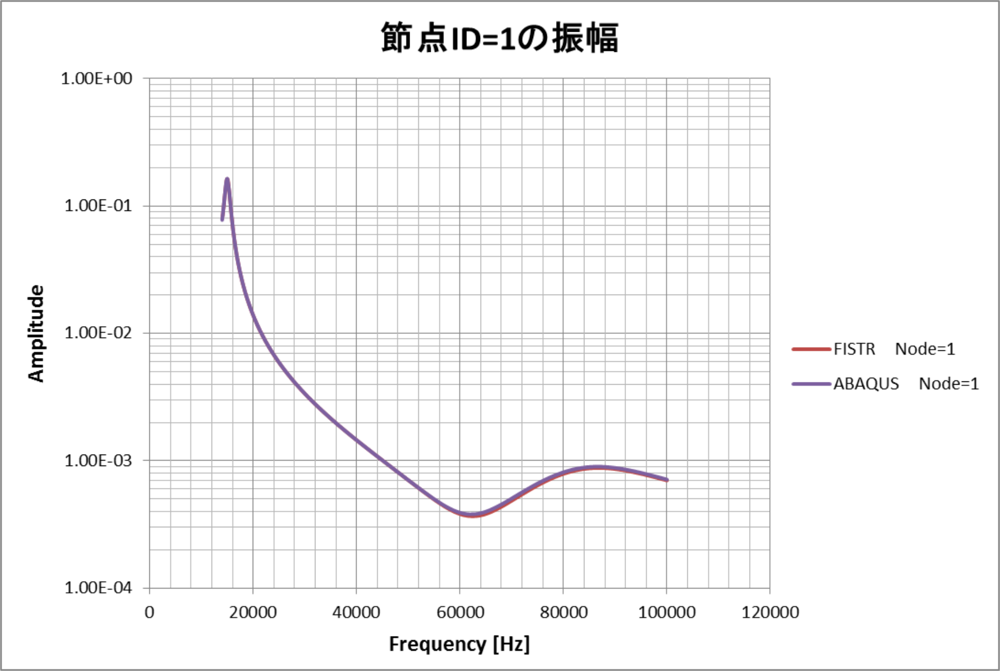

## 周波数応答解析

本解析の実施には、`tutorial/17_freq_beam` のデータを用います。
解析手順として、まず固有値解析用の全体制御データhecmw_ctrl_eigen.datをhecmw_ctrl.datと変更し固有値解析を行い、周波数応答解析用の全体制御データhecmw_ctrl_freq.datをhecmw_ctrl.dat、固有値解析の解析結果ログファイル0.logをeigen_0.log（周波数応答解析用の解析制御データ内で指定されている）と変更し、周波数応答解析を行います。

### 解析対象

解析対象は片持ち梁で、形状を図4.17.1に、メッシュデータを図4.17.2に示します。メッシュには四面体1次要素を用い、メッシュ規模は要素数126、節点数55です。

{.center width="350px"}

図4.17.1　片持ち梁の形状

{.center width="350px"}

図4.17.2　片持ち梁のメッシュデータ

### 解析内容

解析対象の片持ち梁の端部を完全拘束し、反対側の端部の2節点に集中荷重を加えた周波数応答解析を実施します。
手順として同じ境界条件での10次までの固有値解析を実施した後、5次までの固有値、固有ベクトルを使い解析を実施します。周波数応答解析用の解析制御データを以下に示します。

### 解析結果

解析制御データで指定したモニタリング節点（節点番号1）の周波数と変位振幅の関係をMicrosoft Excelで作成して図4.17.3に示します。
また、解析結果の数値データとして、解析結果ログファイルの一部を以下に示します。

{.center width="350px"}

図4.17.3　モニタリング節点の周波数と変位振幅の関係

