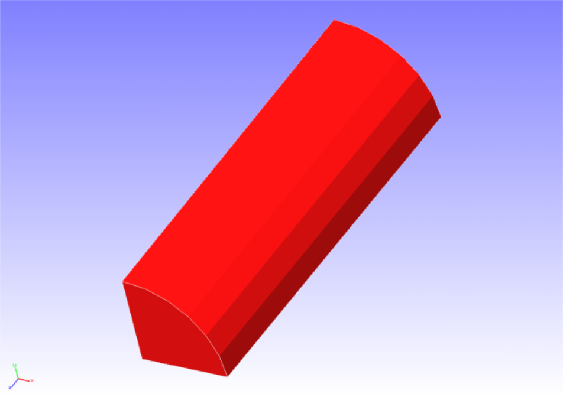
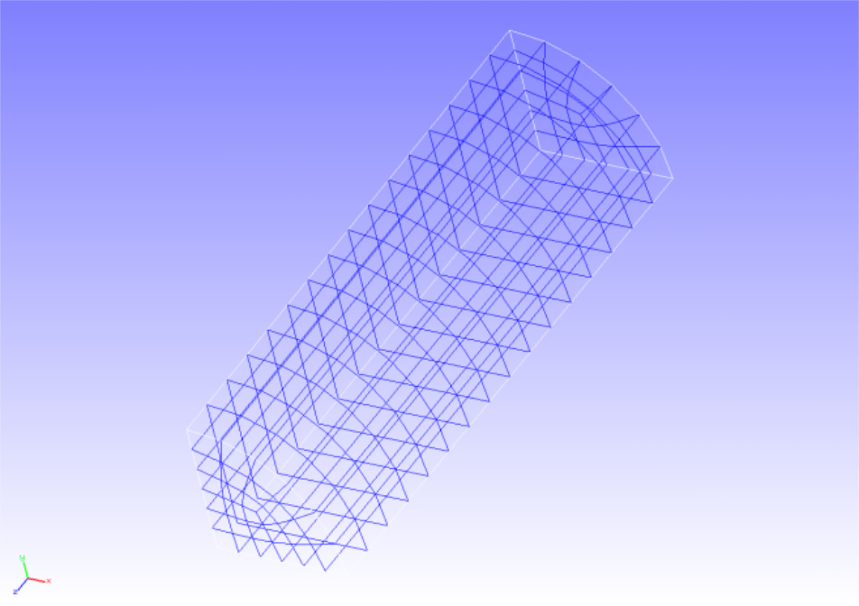
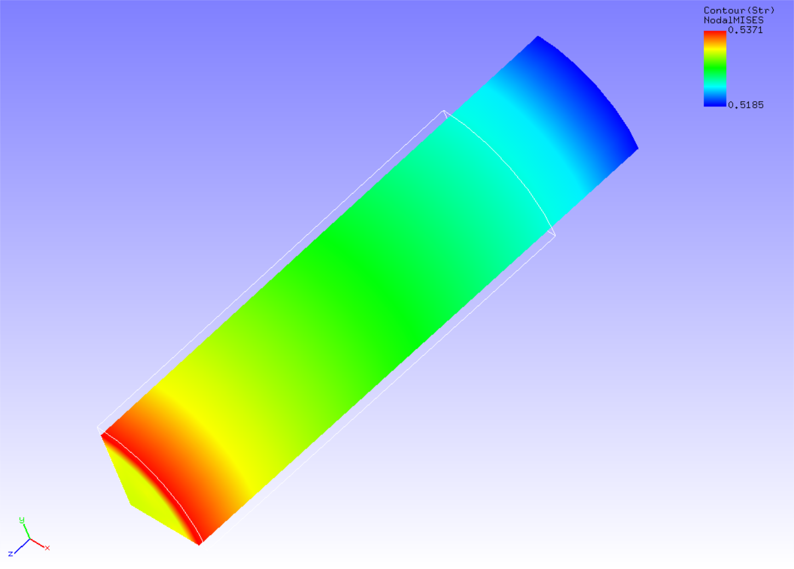

## 静解析（超弾性その１）

本解析の実施には、`tutorial/03_hyperelastic_cylinder` のデータを用います。

### 解析対象

解析対象は丸棒の1/8モデルで、形状を図4.3.1に、メッシュデータを図4.3.2に示します。
メッシュには六面体1次要素を用い、メッシュ規模は要素数432、節点数629です。

 
図4.3.1　丸棒(1/8モデル)の形状

 
図4.3.2　丸棒(1/8モデル)のメッシュデータ

### 解析内容

丸棒に軸方向の引張変位を与える応力解析を実施します。
超弾性の材料構成式にはMooney-Rivlinモデルを用います。解析制御データを以下に示します。

### 解析結果

5サブステップ目の解析結果について、ミーゼス応力のコンターを付加した変形図をREVOCAP\PrePostで作成して図4.3.3に示します。
また、解析結果の数値データとして、解析結果ログファイルの一部を以下に示します。

 
図4.3.3　変形およびミーゼス応力の解析結果

