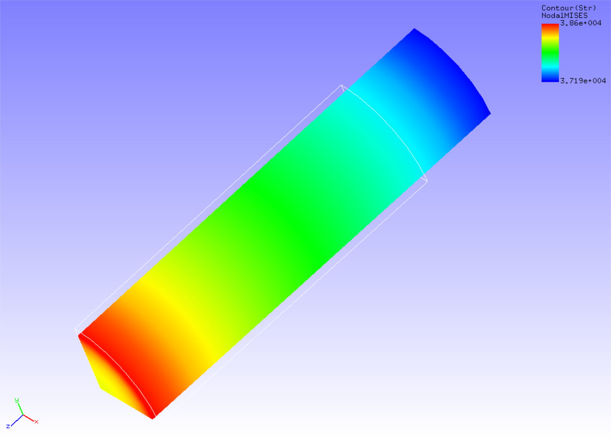

## 静解析（粘弾性）

本解析の実施には、`tutorial/07_viscoelastic_cylinder` のデータを用います。

### 解析対象

解析対象は、4.3 節の静解析（超弾性その１）と同一の丸棒1/8モデルです。

### 解析内容

丸棒に軸方向の引張変位を与え、応力緩和解析を実施します。解析制御データを以下に示します。

### 解析結果

ミーゼス応力のコンターを付加した変形図をREVOCAP\_PrePostで作成して図4.7.1に示します。
2秒後（10ステップ目）の解析結果です。また、解析結果の数値データとして、解析結果ログファイルの一部を以下に示します。

 
図4.7.1　変形およびミーゼス応力の解析結果

