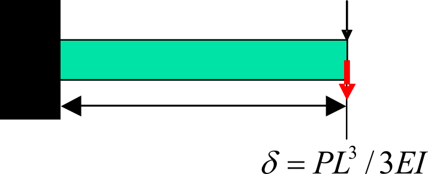
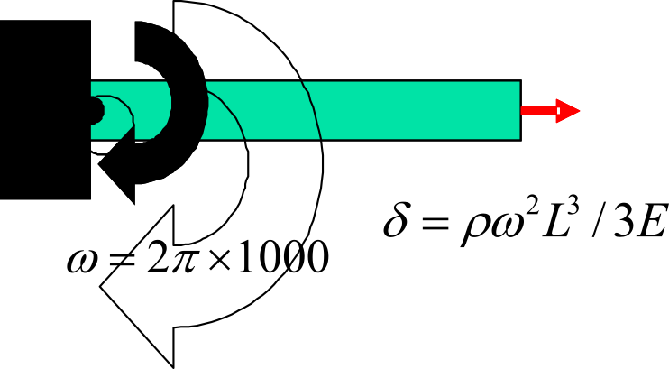
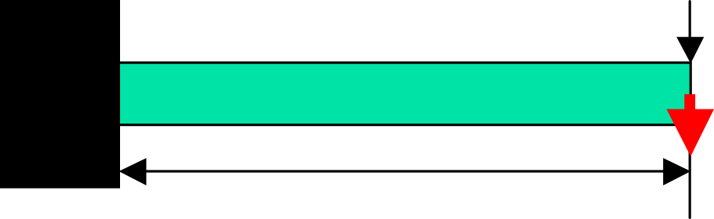
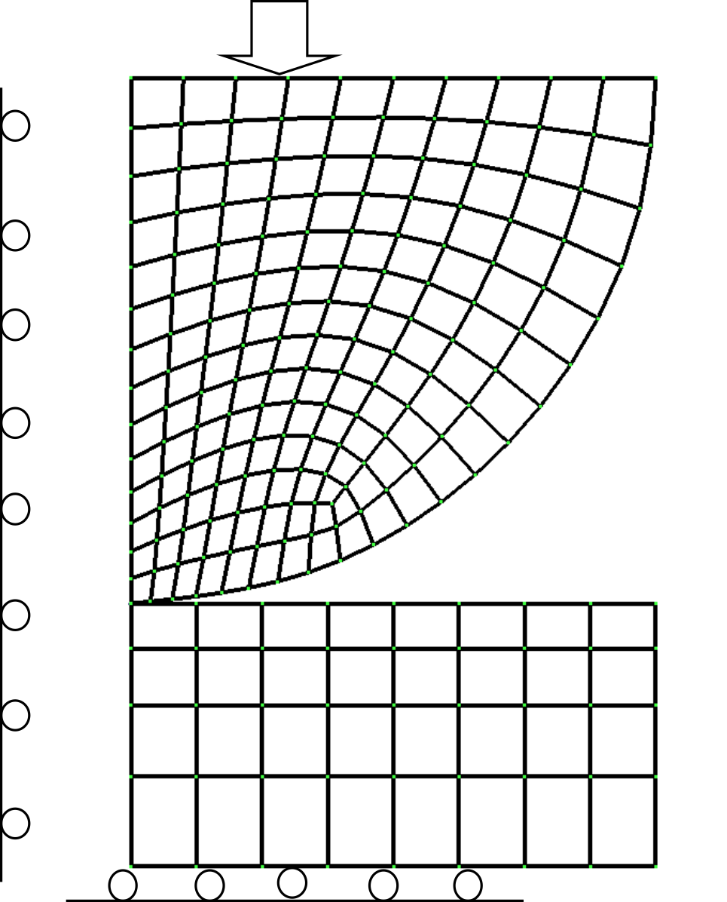
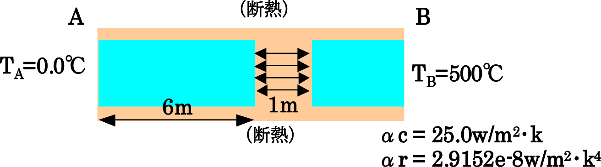
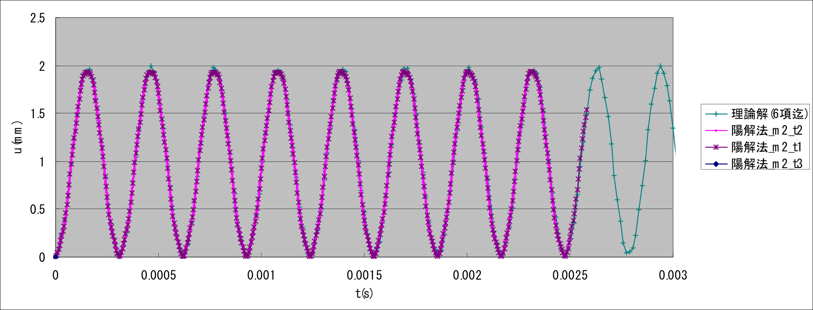
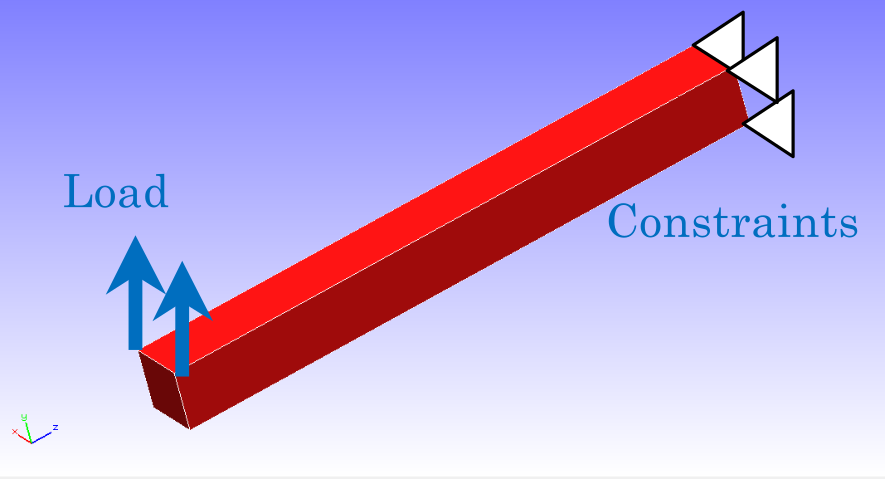

## 単純形状モデルによる検証

### 弾性静解析

本検証においては、片持ち梁を図9.1.1のようにメッシュ分割したものを対象とした。
検証条件については図9.1.2に示す荷重条件を変えたexA～exGの7条件について解析を行った。
なお、exGはexAと同じ荷重条件で、直接法ソルバーを使用した場合の検証ケースである。

表 9.1.1～表 9.1.7にケース別検証結果を示す。

 
図 9.1.1　片持ち梁のメッシュ分割例（六面体要素）

|   |   |
|---|---|
||(a) exA,G：集中荷重|
||(b) exD：重力|
||(c) exB：面分布荷重|
||(d) exE：遠心力|
||(e) exC：体積荷重|
||(f) exF：熱荷重|

| 項目 | 値 |
|:--|:--|
|ヤング率   | $E = 4000.0\ kgf/mm^2$ |
|長さ       | $L = 10.0\ mm$ |
|ポアソン比 | $\nu = 0.3$ |
|断面積     | $A = 1.0\ mm^2$ |
|質量密度   | $\rho = 8.0102 x 10^{-10}\ kg\,s^2/mm^4$ |
|断面二次モーメント | $I = 1.0/12.0\ mm^4$ |
|重力加速度 | $g = 9800.0\ mm/s^2$ |
|線熱膨張率 | $\alpha = 1.0 \times 10^{-5}$ |

表 9.1.2 片持ち梁モデルの検証条件

表 9.1.1　exA：集中荷重問題の検証結果

| ケース名 | 要素数 | | 予測値：$\delta_{max}=$ -1.000 | | 備考 |
|:-:|:-:|:-:|:-:|:-:|:-:|
|   |   | NASTRAN | ABAQUS | FrontISTR | |
| A231 | 40  | -0.338 | -0.371 | -0.371 | 33節点 / 平面応力状問題 |
| A232 | 40  | -0.942 | -1.002 | -1.002 | 105節点 / 平面応力状問題 |
| A241 | 20  | -0.720 | -0.711 | -0.711 | 33節点 / 平面応力状問題 |
| A242 | 20  | -0.910 | -1.002 | -1.002 | 85節点 / 平面応力状問題 |
| A341 | 240 | -0.384 | -0.384 | -0.386 | 99節点 |
| A342 | 240 | -0.990 | -0.990 | -0.999 | 525節点 |
| A351 | 80  | -0.353 | -0.355 | -0.351 | 99節点 |
| A352 | 80  | -0.993 | -0.993 | -0.992 | 381節点 |
| A361 | 40  | -0.954 | -0.985 | -0.984 | 99節点 |
| A362 | 40  | -0.994 | -0.993 | -0.993 | 220節点 |
| A731 | 40  | -      | -      | -0.991 | 33節点 / 直接法 |
| A741 | 20  | -      | -      | -0.996 | 33節点 / 直接法 |

表 9.1.2　exB：面分布荷重問題の検証結果

| ケース名 | 要素数 | | 予測値：$\delta\_{max}= -3.750$ | | 備考 |
|:-:|:-:|:-:|:-:|:-:|:-:|
|   |   | NASTRAN | ABAQUS | FrontISTR | |
| B231 | 40  | -1.281 | -1.403 | -1.403 | 33節点 / 平面応力状問題 |
| B232 | 40  | -3.579 | -3.763 | -3.763 | 105節点 / 平面応力状問題 |
| B241 | 20  | -3.198 | -2.680 | -2.680 | 33節点 / 平面応力状問題 |
| B242 | 20  | -3.426 | -3.765 | -3.765 | 85節点 / 平面応力状問題 |
| B341 | 240 | -1.088 | -1.449 | -1.454 | 99節点 |
| B342 | 240 | -3.704 | -3.704 | -3.748 | 525節点 |
| B351 | 80  | -3.547 | -1.338 | -1.325 | 99節点 |
| B352 | 80  | -0.3717| -3.716 | -3.713 | 381節点 |
| B361 | 40  | -3.557 | -3.691 | -3.688 | 99節点 |
| B362 | 40  | -3.726 | -3.717 | -3.717 | 220節点 |
| B731 | 40  | -      | -      | -3.722 | 33節点 / 直接法 |
| B741 | 20  | -      | -      | -3.743 | 33節点 / 直接法 |

表 9.1.3　exC：体積荷重問題の検証結果

| ケース名 | 要素数 | | 予測値：$\delta_{max}=$ -2.944e-5 | | 備考 |
|:-:|:-:|:-:|:-:|:-:|:-:|
|   |   | NASTRAN | ABAQUS | FrontISTR | |
| C231 | 40  | - | -1.101e-5 | -1.101e-5 | 33節点 / 平面応力状問題 |
| C232 | 40  | - | -2.951e-5 | -2.951e-5 | 105節点 / 平面応力状問題 |
| C241 | 20  | - | -2.102e-5 | -2.102e-5 | 33節点 / 平面応力状問題 |
| C242 | 20  | - | -2.953e-5 | -2.953e-5 | 85節点 / 平面応力状問題 |
| C341 | 240 | - | -1.136e-5 | -1.140e-5 | 99節点 |
| C342 | 240 | - | -2.905e-5 | -2.937e-5 | 525節点 |
| C351 | 80  | - | -1.050e-5 | -1.039e-5 | 99節点 |
| C352 | 80  | - | -2.914e-5 | -2.911e-5 | 381節点 |
| C361 | 40  | - | -2.895e-5 | -2.893e-5 | 99節点 |
| C362 | 40  | - | -2.915e-5 | -2.915e-5 | 220節点 |
| C731 | 40  | - | -         | -2.922e-5 | 33節点 / 直接法 |
| C741 | 20  | - | -         | -2.938e-5 | 33節点 / 直接法 |

表 9.1.4　exD：重力問題の検証結果

| ケース名 | 要素数 | | 予測値：$\delta_{max}=$ -2.944e-5 | | 備考 |
|:-:|:-:|:-:|:-:|:-:|:-:|
|   |   | NASTRAN | ABAQUS | FrontISTR | |
| D231 | 40  | -1.101e-5 | -1.101e-5 | -1.101e-5 | 33節点 / 平面応力状問題 |
| D232 | 40  | -2.805e-5 | -2.951e-5 | -2.951e-5 | 105節点 / 平面応力状問題 |
| D241 | 20  | -2.508e-5 | -2.102e-5 | -2.102e-5 | 33節点 / 平面応力状問題 |
| D242 | 20  | -2.684e-5 | -2.953e-5 | -2.953e-5 | 85節点 / 平面応力状問題 |
| D341 | 240 | -1.172e-5 | -1.136e-5 | -1.140e-5 | 99節点 |
| D342 | 240 | -2.906e-5 | -2.905e-5 | -2.937e-5 | 525節点 |
| D351 | 80  | -1.046e-5 | -1.050e-5 | -1.039e-5 | 99節点 |
| D352 | 80  | -2.917e-5 | -2.914e-5 | -2.911e-5 | 381節点 |
| D361 | 40  | -2.800e-5 | -2.895e-5 | -2.893e-5 | 99節点 |
| D362 | 40  | -2.919e-5 | -2.915e-5 | -2.915e-5 | 220節点 |
| D731 | 40  | -         | -         | -2.922e-5 | 33節点 / 直接法 |
| D741 | 20  | -         | -         | -2.938e-5 | 33節点 / 直接法 |

表 9.1.5　exE：遠心力問題の検証結果

| ケース名 | 要素数 | | 予測値：$\delta_{max}=$ 2.635e-5 | | 備考 |
|:-:|:-:|:-:|:-:|:-:|:-:|
|   |   | NASTRAN | ABAQUS | FrontISTR | |
| E231 | 40  | 2.410e-3 | 2.616e-3 | 2.650e-3 | 33節点 / 平面応力状問題 |
| E232 | 40  | 2.447e-3 | 2.627e-3 | 2.628e-3 | 105節点 / 平面応力状問題 |
| E241 | 20  | 2.386e-3 | 2.622e-3 | 2.624e-3 | 33節点 / 平面応力状問題 |
| E242 | 20  | 2.387e-3 | 2.627e-3 | 2.629e-3 | 85節点 / 平面応力状問題 |
| E341 | 240 | 2.708e-3 | 2.579e-3 | 2.625e-3 | 99節点 |
| E342 | 240 | 2.639e-3 | 2.614e-3 | 2.638e-3 | 525節点 |
| E351 | 80  | 2.642e-3 | 2.598e-3 | 2.625e-3 | 99節点 |
| E352 | 80  | 2.664e-3 | 2.617e-3 | 2.616e-3 | 381節点 |
| E361 | 40  | 2.611e-3 | 2.603e-3 | 2.603e-3 | 99節点 |
| E362 | 40  | 2.623e-3 | 2.616e-3 | 2.616e-3 | 220節点 |
| E731 | 40  | -        | -        | 2.619e-3 | 33節点 / 直接法 |
| E741 | 20  | -        | -        | 2.622e-3 | 33節点 / 直接法 |

表 9.1.6　exF：熱応力荷重問題の検証結果

| ケース名 | 要素数 | | 予測値：$\delta_{max}$= 1.000e-2 | | 備考 |
|:-:|:-:|:-:|:-:|:-:|:-:|
|   |   | NASTRAN | ABAQUS | FrontISTR | |
| F231 | 40  | - | 1.016e-2 | 1.007e-2 | 33節点 / 平面応力状問題 |
| F232 | 40  | - | 1.007e-2 | 1.007e-2 | 105節点 / 平面応力状問題 |
| F241 | 20  | - | 1.010e-2 | 1.010e-2 | 33節点 / 平面応力状問題 |
| F242 | 20  | - | 1.006e-2 | 1.006e-2 | 85節点 / 平面応力状問題 |
| F341 | 240 | - | 1.047e-2 | 1.083e-2 | 99節点 |
| F342 | 240 | - | 1.018e-2 | 1.022e-2 | 525節点 |
| F351 | 80  | - | 1.031e-2 | 1.062e-2 | 99節点 |
| F352 | 80  | - | 1.015e-2 | 1.017e-2 | 381節点 |
| F361 | 40  | - | 1.026e-2 | 1.026e-2 | 99節点 |
| F362 | 40  | - | 1.016e-2 | 1.016e-2 | 220節点 |

表 9.1.7　exG：直接法の検証結果（集中荷重問題）

| ケース名 | 要素数 | | 予測値：δmax= -1.000 | | 備考 |
|:-:|:-:|:-:|:-:|:-:|:-:|
|   |   | NASTRAN | ABAQUS | FrontISTR | |
| G231 | 40  | -0.338 | -0.371 | -0.371 | 33節点 / 平面応力状問題 |
| G232 | 40  | -0.942 | -1.002 | -1.002 | 105節点 / 平面応力状問題 |
| G241 | 20  | -0.720 | -0.711 | -0.711 | 33節点 / 平面応力状問題 |
| G242 | 20  | -0.910 | -1.002 | -1.002 | 85節点 / 平面応力状問題 |
| G341 | 240 | -0.384 | -0.384 | -0.386 | 99節点 |
| G342 | 240 | -0.990 | -0.990 | -0.999 | 525節点 |
| G351 | 80  | -0.353 | -0.355 | -0.351 | 99節点 |
| G352 | 80  | -0.993 | -0.993 | -0.992 | 381節点 |
| G361 | 40  | -0.954 | -0.985 | -0.984 | 99節点 |
| G362 | 40  | -0.994 | -0.993 | -0.993 | 220節点 |
| G731 | 40  | -      | -      | -0.991 | 33節点 / 直接法 |
| G741 | 20  | -      | -      | -0.996 | 33節点 / 直接法 |

### 非線形静解析

#### (2-1) exnl1: 幾何学非線形解析

検証ケースexIの検証モデルは検証ケースexA～Gのモデルと同一のものである。
図9.1.3に検証モデルの概念図を示す。
このモデルについて幾何学的非線形解析を実施する。
また、検証結果を表9.1.8に示す。

非線形計算は、最終荷重1.0Pに対して、荷重増分値0.1P，10ステップとする。

 
図 9.1.3　検証モデル

表 9.1.8　exI：検証結果（最大たわみ量履歴）

| ケース名 | 0.1   | 0.2   | 0.3   | 0.4   | 0.5   | 0.6   | 0.7   | 0.8   | 0.9   | 1.0   | 線形解 |
|:-:|:-:|:-:|:-:|:-:|:-:|:-:|:-:|:-:|:-:|:-:|:-:|
| I231     | -     | -     | -     | -     | -     | -     | -     | -     | -     | -     | -      |
| I232     | -     | -     | -     | -     | -     | -     | -     | -     | -     | -     | -      |
| I241     | -     | -     | -     | -     | -     | -     | -     | -     | -     | -     | -      |
| I242     | -     | -     | -     | -     | -     | -     | -     | -     | -     | -     | -      |
| I341     | 0.039 | 0.077 | 0.116 | 0.154 | 0.193 | 0.232 | 0.270 | 0.309 | 0.348 | 0.386 | 0.386  |
| I342     | 0.099 | 0.200 | 0.300 | 0.400 | 0.499 | 0.599 | 0.698 | 0.797 | 0.896 | 0.995 | 0.999  |
| I351     | 0.035 | 0.070 | 0.105 | 0.141 | 0.176 | 0.211 | 0.246 | 0.281 | 0.316 | 0.351 | 0.351  |
| I352     | 0.099 | 0.198 | 0.298 | 0.397 | 0.496 | 0.595 | 0.693 | 0.792 | 0.890 | 0.987 | 0.992  |
| I361     | 0.070 | 0.139 | 0.209 | 0.278 | 0.348 | 0.417 | 0.487 | 0.556 | 0.625 | 0.694 | 0.984  |
| I362     | 0.099 | 0.197 | 0.298 | 0.397 | 0.496 | 0.595 | 0.694 | 0.793 | 0.891 | 0.988 | 0.993  |

#### (2-2) 　exnl2: 弾塑性変形解析

本検証問題はNational Agency for Finite Element Methods and Standards (U.K.): Test NL1 from NAFEMSを参考し、
幾何学的非線形および複数の硬化則を取り入れ弾塑性変形解析を行った。図9.1.4に解析モデルを示す。

 
図9.1.4　弾塑性変形解析モデル

（１） 検証条件

| 項目 | 値 |
|:--|:--|
|材料   | Mises弾塑性材 |
|ヤング率   | E = 250 GPa |
|ポアソン比 | ν = 0.25 |
|初期降伏応力   | 5 MPa |
|初期降伏ひずみ | 0.25×10^-4 |
|等方硬化係数 | H_i = 0 または 62.5 GPa |

（２） 境界条件

| 項目 | 境界条件 | 値 |
|:--|:--|:--|
|ステップ１ | 節点2と3に強制変位 | $u_{x} =  0.2500031251 *10^{-4} $ |
|ステップ２ | 節点2と3に強制変位 | $u_{x} =  0.25000937518*10^{-4} $ |
|ステップ３ | 節点3と4に強制変位 | $u_{y} =  0.2500031251 *10^{-4} $ |
|ステップ４ | 節点3と4に強制変位 | $u_{y} =  0.25000937518*10^{-4} $ |
|ステップ５ | 節点2と3に強制変位 | $u_{x} = -0.25000937518*10^{-4} $ |
|ステップ６ | 節点2と3に強制変位 | $u_{x} = -0.2500031251 *10^{-4} $ |
|ステップ７ | 節点3と4に強制変位 | $u_{y} = -0.25000937518*10^{-4} $ |
|ステップ８ | 節点3と4に強制変位 | $u_{y} = -0.2500031251 *10^{-4} $ |

ここで示していない節点はすべて完全拘束される。
この問題の理論解は以下のとおりである。

| ひずみ ($\times10^{-4}$) [$\varepsilon_x$, $\varepsilon_y$, $\varepsilon_z$] | 相当応力($MPa$) [$H_i=0\ H_k=0$; $H_i=62.5\ H_k=0$] |
|:--|:--|
| 0.25, 0, 0    | 5.0; 5.0 | 
| 0.50, 0, 0    | 5.0; 5.862 |
| 0.50, 0.25, 0 | 5.0; 5.482 |
| 0.50, 0.50, 0 | 5.0; 6.362 |
| 0.25, 0.50, 0 | 5.0; 6.640 |
| 0, 0.50, 0    | 5.0; 7.322 |
| 0, 0.25, 0    | 3.917; 4.230 |
| 0, 0, 0       | 5.0; 5.673 |

これに対して、計算結果は以下のとおりである。

| ひずみ ($\times10^{-4}$) [$\varepsilon_x$, $\varepsilon_y$, $\varepsilon_z$] | 相当応力($MPa$ [$H_i=0\ H_k=0$; $H_i=62.5\ H_k=0$]) |
|:--|:--|
| $$\varepsilon_{x}$$ | $$\varepsilon_{y}$$ |
| 0.25, 0, 0    | 5.0 (0.0%); 5.0 (0.0%) | 
| 0.50, 0, 0    | 5.0 (0.0%); 5.862 (0.0%) |
| 0.50, 0.25, 0 | 5.0 (0.0%); 5.482 (0.0%) |
| 0.50, 0.50, 0 | 5.0 (0.0%); 6.362 (-0.05%)|
| 0.25, 0.50, 0 | 5.0 (0.0%); 6.640 (-0.21%)|
| 0, 0.50, 0    | 5.0 (0.0%); 7.322 (-0.34%)|
| 0, 0.25, 0    | 3.824 (-2.4%); 4.230 (-2.70%)|
| 0, 0, 0       | 5.0 (0.0%); 5.673 (5.673 (-2.50%)|

### 接触解析(1)

本検証問題はNational Agency for Finite Element Methods and Standards (U.K.):接触パーチテスト問題CGS-4を参考し、
摩擦ありの有限すべり接触問題機能をテストするものである。
図9.1.5に解析モデルを示す。

 
図9.1.5　接触解析モデル

この問題の釣り合い条件は以下のとおりである。

$$Fcos\alpha - Gsin\alpha = \pm f_{c}$$

粘着摩擦段階では摩擦力は$$f_{c} = E_{t}\text{Δu}$$であり、すべり摩擦段階では
$$f_{c} = \mu(G \cos \alpha + F \sin \alpha)$$となる。

計算結果と解析解との比較は以下のとおりである。

| $\mu$ | $F/G$解析解 | $F/G$計算結果 |
|:--|:--|:--|
| 0.0 | 0.1   | 0.1   |
| 0.1 | 0.202 | 0.202 |
| 0.2 | 0.306 | 0.306 |
| 0.3 | 0.412 | 0.412 |

### 接触解析(2): ヘルツの接触問題

本検証では無限長さ円柱と無限平面のヘルツ接触問題を解析した。
円柱の半径をR=8mmとし、変形体のヤング率E及びポアソンµ比はそれぞれ1100Mpaと0.0である。
また、接触面積は円柱の半径と比べ十分小さいと仮定し、問題の対称性も考慮して、円柱の四分の一モデルにより解析を行った。

 
図9.1.6　ヘルツ接触問題解析モデル

#### （1） 接触半径の検証結果

接触半径を計算する理論式は以下のとおりである。

$$a = \sqrt{\frac{4FR}{\pi E^{*}}}$$

ここで、
$$E^{*} = E/2(1 - \mu^{2})$$
である。
本計算では圧力F=100の時、接触半径a=1.36となる。

図9.1.7では接触点の等価節点力を示している。この節点力分布を外挿して、接触半径が得られる。

 
図9.1.7　接触点の等価節点力分布

#### （2） 最大せん断応力の検証結果

理論解では、接触位置
$$z = 0.78a$$
において最大せん断応力が
$$\tau_{\max} = 0.30\sqrt{\frac{\text{FE}^{*}}{\pi R}}$$
である。
本計算条件では
$$\tau_{\max} = 14.2$$
となる。
これに対して、
$$\tau_{\max} = 15.6$$
の計算結果が得られた。

 
図9.1.8　せん断応力分布（最大値=15.6）

### (3) 固有値解析

検証ケースexJ～Kの検証モデルは検証ケースexA～Gのモデルと同一のものである。
図9.1.9に検証モデルの概念図を示す。
このモデルについて固有値解析を実施する。
求める固有値は1次～3次固有値とする。
なお、exJでは反復法ソルバーを、exKでは直接法ソルバーを使用するものとする。
また、検証結果を表9.1.9～表 9.1.12に示す。

 
図 9.1.9　検証モデル

片持ち梁の振動固有値は次式で求まる。

第1次
$$ n_1 = \frac{1.875^2}{2 \pi l^2} \sqrt{ \frac{gEI}{\omega} } $$
第2次
$$ n_2 = \frac{4.694^2}{2 \pi l^2} \sqrt{ \frac{gEI}{\omega} } $$
第3次
$$ n_3 = \frac{7.855^2}{2 \pi l^2} \sqrt{ \frac{gEI}{\omega} } $$

検証モデルの特性値は

| 項目 | 値 |
|:--|:--|
| $I$ | $10.0 mm$ |
| $E$ | $4000.0 kgf /mm^2$ |
| $l$ | $1.0/12.0 mm^4$ |
| $\omega$ | $7.85 * 10^{-6} kgf/mm^3$ |
| $g$ | $9800.0 mm/sec^2$ |

である。従って3次までの固有値は次のとおりである。

| モード番号 | 値 |
|:--|:--|
| n_1 | 3.609e3 |
| n_2 | 2.262e4 |
| n_3 | 6.335e4 |

表 9.1.9　exJ：反復法での検証結果（1次固有値）

| ケース名 | 要素数 | 予測値：n1=3.609e3 | | 備考 |
|:-:|:-:|:-:|:-:|:-:|
|   |   | NASTRAN | FrontISTR | |
| J231 | 40  | 5.861e3 | 5.861e3 | 33節点 / 平面応力状問題 |
| J232 | 40  | 3.596e3 | 3.593e3 | 105節点 / 平面応力状問題 |
| J241 | 20  | 3.586e3 | 4.245e3 | 33節点 / 平面応力状問題 |
| J242 | 20  | 3.590e3 | 3.587e3 | 85節点 / 平面応力状問題 |
| J341 | 240 | 5.442e3 | 5.429e3 | 99節点 |
| J342 | 240 | 3.621e3 | 3.595e3 | 525節点 |
| J351 | 80  | 3.695e3 | 4.298e3 | 99節点 |
| J352 | 80  | 3.610e3 | 3.609e3 | 381節点 |
| J361 | 40  | 3.679e3 | 3.619e3 | 99節点 |
| J362 | 40  | 3.611e3 | 3.606e3 | 220節点 |

表 9.1.10　exJ：反復法での検証結果（2次固有値）

| ケース名 | 要素数 | 予測値：n2=2.262e4 | | 備考 |
|:-:|:-:|:-:|:-:|:-:|
|   |   | NASTRAN | FrontISTR | |
| J231 | 40  | 3.350e4 | 3.351e4 | 33節点 / 平面応力状問題 |
| J232 | 40  | 2.163e4 | 2.156e4 | 105節点 / 平面応力状問題 |
| J241 | 20  | 2.149e4 | 2.516e4 | 33節点 / 平面応力状問題 |
| J242 | 20  | 2.149e4 | 2.143e4 | 85節点 / 平面応力状問題 |
| J341 | 240 | 3.145e4 | 3.138e4 | 99節点 |
| J342 | 240 | 2.171e4 | 2.155e4 | 525節点 |
| J351 | 80  | 2.208e4 | 2.546e4 | 99節点 |
| J352 | 80  | 2.156e4 | 2.149e4 | 381節点 |
| J361 | 40  | 2.202e4 | 2.168e4 | 99節点 |
| J362 | 40  | 2.154e4 | 2.144e4 | 220節点 |

注) 三次元モデルでは1次と2次が重根となるので、表中の2次の値には、3次の計算値を記述している。

表 9.1.11　exK：直接法での検証結果（1次固有値）

| ケース名 | 要素数 | 予測値：n1=3.609e3 | | 備考 |
|:-:|:-:|:-:|:-:|:-:|
|   |   | NASTRAN | FrontISTR | |
| J231 | 40  | 5.861e3 | 5.861e3 | 33節点 / 平面応力状問題 |
| J232 | 40  | 3.596e3 | 3.593e3 | 105節点 / 平面応力状問題 |
| J241 | 20  | 3.586e3 | 4.245e3 | 33節点 / 平面応力状問題 |
| J242 | 20  | 3.590e3 | 3.587e3 | 85節点 / 平面応力状問題 |
| J341 | 240 | 5.442e3 | 5.429e3 | 99節点 |
| J342 | 240 | 3.621e3 | 3.595e3 | 525節点 |
| J351 | 80  | 3.695e3 | 4.298e3 | 99節点 |
| J352 | 80  | 3.610e3 | 3.609e3 | 381節点 |
| J361 | 40  | 3.679e3 | 3.619e3 | 99節点 |
| J362 | 40  | 3.611e3 | 3.606e3 | 220節点 |
| J731 | 40  | -       | 3.606e3 | 220節点 |
| J741 | 20  | -       | 3.594e3 | 220節点 |

表 9.1.12　exK：直接法での検証結果（2次固有値）

| ケース名 | 要素数 | 予測値：n2=2.262e4 | | 備考 |
|:-:|:-:|:-:|:-:|:-:|
|   |   | NASTRAN | FrontISTR | |
| J231 | 40  | 3.350e4 | 3.351e4 | 33節点 / 平面応力状問題 |
| J232 | 40  | 2.163e4 | 2.156e4 | 105節点 / 平面応力状問題 |
| J241 | 20  | 2.149e4 | 2.516e4 | 33節点 / 平面応力状問題 |
| J242 | 20  | 2.149e4 | 2.143e4 | 85節点 / 平面応力状問題 |
| J341 | 240 | 3.145e4 | 3.138e4 | 99節点 |
| J342 | 240 | 2.171e4 | 2.155e4 | 525節点 |
| J351 | 80  | 2.208e4 | 2.546e4 | 99節点 |
| J352 | 80  | 2.156e4 | 2.149e4 | 381節点 |
| J361 | 40  | 2.202e4 | 2.168e4 | 99節点 |
| J362 | 40  | 2.154e4 | 2.144e4 | 220節点 |
| J731 | 40  | -       | 2.156e4 | 220節点 |
| J741 | 20  | -       | 2.153e4 | 220節点 |

注) 三次元モデルでは1次と2次が重根となるので、表中の2次の値には、3次の計算値を記述している。

### (4) 熱伝導解析

定常熱伝導解析の共通する条件を図9.1.10に示す。
検証ケースexM～exTの個別の条件を図9.1.11に示す。
メッシュ分割は、exAと同等のものを使用することとする。

表 9.1.13～表 9.1.20にケース別に検証結果である温度分布テーブルを示す。

 

|   |   |
|---|---|
|AB間長さ|$L = 10.0m$|
|断面積|$A = 1.0 mm^2$|

熱伝導率の温度依存性

|熱伝導率 $\lambda(W/mK)$|温度 $(^\circ C)$|
|----------------------------|----------------|
|50.0                        |0.0             |
|35.0                        |500.0           |
|20.0                        |1000.0          |

図 9.1.10　定常熱伝導解析の検証条件

|   |   |
|---|---|
|exM:線形材料| |
|exN:規定温度問題||
|exO:集中熱流束問題||
|exP:分布熱流束問題||
|exQ:対流熱伝達問題||
|exR:輻射熱伝達問題||
|exS:体積発熱問題||
|exT:内部ギャップ問題||

図 9.1.11　検証ケース別解析条件

表 9.1.13　exM：線形材料による定常計算の検証結果

| ケース名 | 要素タイプ | 要素／節点数 | A端からの距離（ｍ） |  |  |  |  |  |  |
|:--|:--|:--|:--|:--|:--|:--|:--|:--|:--|
|   |   |   | A端 | 2.0 | 4.0 | 6.0 | 8,0 | B端 |
| M361A | 361 | 40／33  | 0.0 | 100.0 | 200.0 | 300.0 | 400.0 | 500.0 |
| M361B | 361 | 40／105 | 0.0 | 100.0 | 200.0 | 300.0 | 400.0 | 500.0 |
| M361C | 361 | 20／33  | 0.0 | 100.0 | 200.0 | 300.0 | 400.0 | 500.0 |
| M361D | 361 | 20／85  | 0.0 | 100.0 | 200.0 | 300.0 | 400.0 | 500.0 |
| M361E | 361 | 240／99 | 0.0 | 100.0 | 200.0 | 300.0 | 400.0 | 500.0 |
| M361F | 361 | 24／525 | 0.0 | 100.0 | 200.0 | 300.0 | 400.0 | 500.0 |
| M361G | 361 | 80／99  | 0.0 | 100.0 | 200.0 | 300.0 | 400.0 | 500.0 |

表 9.1.14　exN：規定温度問題の検証結果

| ケース名 | 要素タイプ | 要素／節点数 | A端からの距離（ｍ） |  |  |  |  |  |  |
|:--|:--|:--|:--|:--|:--|:--|:--|:--|:--|
|   |   |   | A端 | 2.0 | 4.0 | 6.0 | 8,0 | B端 |
| ABAQUS | 361 | 40／99  | 0.0 | 87.3 | 179.7 | 278.2 | 384.3 | 500.0 |
| N231   | 231 | 40／33  | 0.0 | 87.2 | 179.5 | 278.0 | 384.1 | 500.0 |
| N232   | 232 | 40／105 | 0.0 | 86.0 | 178.3 | 276.8 | 382.9 | 500.0 |
| N241   | 241 | 20／33  | 0.0 | 87.3 | 179.7 | 278.2 | 384.3 | 500.0 |
| N242   | 242 | 20／85  | 0.0 | 87.3 | 179.7 | 278.2 | 384.3 | 500.0 |
| N341   | 341 | 240／99 | 0.0 | 87.3 | 179.7 | 278.2 | 384.3 | 500.0 |
| N342   | 342 | 24／525 | 0.0 | 87.9 | 179.9 | 278.0 | 383.6 | 500.0 |
| N351   | 351 | 80／99  | 0.0 | 87.3 | 179.7 | 278.2 | 384.3 | 500.0 |
| N352   | 352 | 80／381 | 0.0 | 87.3 | 179.7 | 278.2 | 384.3 | 500.0 |
| N361   | 361 | 40／99  | 0.0 | 87.3 | 179.7 | 278.2 | 384.3 | 500.0 |
| N362   | 362 | 40／330 | 0.0 | 87.3 | 179.7 | 278.2 | 384.3 | 500.0 |
| N731   | 731 | 40／33  | 0.0 | 87.3 | 179.7 | 278.2 | 384.3 | 500.0 |
| N741   | 741 | 20／33  | 0.0 | 87.3 | 179.7 | 278.2 | 384.3 | 500.0 |

表 9.1.15　exO：集中熱流束問題の検証結果

| ケース名 | 要素タイプ | 要素／節点数 | A端からの距離（ｍ） |  |  |  |  |  |  |
|:--|:--|:--|:--|:--|:--|:--|:--|:--|:--|
|   |   |   | A端 | 2.0 | 4.0 | 6.0 | 8,0 | B端 |
| ABAQUS | 361 | 40／99  | 0.0 | 103.2 | 213.7 | 333.3 | 464.8 | 612.6 |
| O231   | 231 | 40／33  | 0.0 | 103.2 | 213.7 | 333.3 | 464.8 | 612.6 |
| O232   | 232 | 40／105 | 0.0 | 103.2 | 213.7 | 333.3 | 464.8 | 612.6 |
| O241   | 241 | 20／33  | 0.0 | 103.2 | 213.7 | 333.3 | 464.8 | 612.6 |
| O242   | 242 | 20／85  | 0.0 | 103.2 | 213.7 | 333.4 | 465.2 | 618.0 |
| O341   | 341 | 240／99 | -   | -     | -     | -     | -     | -     |
| O342   | 342 | 24／525 | 0.0 | 104.4 | 214.9 | 334.7 | 466.3 | 614.6 |
| O351   | 351 | 80／99  | -   | -     | -     | -     | -     | -     |
| O352   | 352 | 80／381 | 0.0 | 103.2 | 213.7 | 333.3 | 465.0 | 624.2 |
| O361   | 361 | 40／99  | 0.0 | 103.2 | 213.7 | 333.3 | 464.8 | 612.6 |
| O362   | 362 | 40／330 | 0.0 | 103.2 | 213.7 | 333.4 | 465.5 | 623.5 |
| O731   | 731 | 40／33  | 0.0 | 103.2 | 213.7 | 333.3 | 464.8 | 612.5 |
| O741   | 741 | 20／33  | 0.0 | 103.2 | 213.7 | 333.3 | 464.8 | 612.6 |

表 9.1.16　exP：分布熱流束問題の検証結果

| ケース名 | 要素タイプ | 要素／節点数 | A端からの距離（ｍ） |  |  |  |  |  |  |
|:--|:--|:--|:--|:--|:--|:--|:--|:--|:--|
|   |   |   | A端 | 2.0 | 4.0 | 6.0 | 8,0 | B端 |
| ABAQUS | 361 | 40／99  | 0.0 | 103.2 | 213.7 | 333.3 | 464.8 | 612.6 |
| P231   | 231 | 40／33  | 0.0 | 103.2 | 213.7 | 333.3 | 464.8 | 612.6 |
| P232   | 232 | 40／105 | 0.0 | 103.2 | 213.7 | 333.3 | 464.8 | 612.6 |
| P241   | 241 | 20／33  | 0.0 | 103.2 | 213.7 | 333.3 | 464.8 | 612.6 |
| P242   | 242 | 20／85  | 0.0 | 103.2 | 213.7 | 333.3 | 464.8 | 612.6 |
| P341   | 341 | 240／99 | -   | -     | -     | -     | -     | -     |
| P342   | 342 | 24／525 | 0.0 | 103.2 | 213.7 | 333.3 | 464.8 | 612.6 |
| P351   | 351 | 80／99  | -   | -     | -     | -     | -     | -     |
| P352   | 352 | 80／381 | 0.0 | 103.2 | 213.7 | 333.3 | 464.8 | 612.6 |
| P361   | 361 | 40／99  | 0.0 | 103.2 | 213.7 | 333.3 | 464.8 | 612.6 |
| P362   | 362 | 40／330 | 0.0 | 103.2 | 213.7 | 333.4 | 465.5 | 612.6 |
| P731   | 731 | 40／33  | 0.0 | 103.2 | 213.7 | 333.3 | 464.8 | 612.5 |
| P741   | 741 | 20／33  | 0.0 | 103.2 | 213.7 | 333.3 | 464.8 | 612.6 |

表 9.1.17　exQ：対流熱伝達問題の検証結果

| ケース名 | 要素タイプ | 要素／節点数 | A端からの距離（ｍ） |  |  |  |  |  |  |
|:--|:--|:--|:--|:--|:--|:--|:--|:--|:--|
|   |   |   | A端 | 2.0 | 4.0 | 6.0 | 8,0 | B端 |
| ABAQUS | 361 | 40／99  | 0.0 | 89.2 | 183.8 | 284.8 | 393.9 | 513.2 |
| Q231   | 231 | 40／33  | 0.0 | 89.2 | 183.8 | 284.8 | 393.9 | 513.2 |
| Q232   | 232 | 40／105 | 0.0 | 89.2 | 183.8 | 284.8 | 393.9 | 513.2 |
| Q241   | 241 | 20／33  | 0.0 | 89.2 | 183.8 | 284.8 | 393.9 | 513.2 |
| Q242   | 242 | 20／85  | 0.0 | 89.2 | 183.8 | 284.8 | 393.9 | 513.2 |
| Q341   | 341 | 240／99 | -   | -    | -     | -     | -     | -     |
| Q342   | 342 | 24／525 | 0.0 | 89.2 | 183.8 | 284.8 | 393.9 | 513.2 |
| Q351   | 351 | 80／99  | -   | -    | -     | -     | -     | -     |
| Q352   | 352 | 80／381 | 0.0 | 89.2 | 183.8 | 284.8 | 393.9 | 513.2 |
| Q361   | 361 | 40／99  | 0.0 | 89.2 | 183.8 | 284.8 | 393.9 | 513.2 |
| Q362   | 362 | 40／330 | 0.0 | 89.2 | 183.8 | 284.8 | 393.9 | 513.2 |
| Q731   | 731 | 40／33  | 0.0 | 89.2 | 183.8 | 284.8 | 393.9 | 513.2 |
| Q741   | 741 | 20／33  | 0.0 | 89.2 | 183.8 | 284.8 | 393.9 | 513.2 |

表 9.1.18　exR：輻射熱伝達問題の検証結果

| ケース名 | 要素タイプ | 要素／節点数 | A端からの距離（ｍ） |  |  |  |  |  |  |
|:--|:--|:--|:--|:--|:--|:--|:--|:--|:--|
|   |   |   | A端 | 2.0 | 4.0 | 6.0 | 8,0 | B端 |
| ABAQUS | 361 | 40／99  | 0.0 | 89.5 | 184.4 | 285.8 | 395.3 | 515.2 |
| R231   | 231 | 40／33  | 0.0 | 89.5 | 184.4 | 285.8 | 395.3 | 515.2 |
| R232   | 232 | 40／105 | 0.0 | 89.5 | 184.4 | 285.8 | 395.3 | 515.2 |
| R241   | 241 | 20／33  | 0.0 | 89.5 | 184.4 | 285.8 | 395.3 | 515.2 |
| R242   | 242 | 20／85  | 0.0 | 89.5 | 184.4 | 285.8 | 395.3 | 515.2 |
| R341   | 341 | 240／99 | -   | -    | -     | -     | -     | -     |
| R342   | 342 | 24／525 | 0.0 | 89.5 | 184.4 | 285.8 | 395.3 | 515.2 |
| R351   | 351 | 80／99  | -   | -    | -     | -     | -     | -     |
| R352   | 352 | 80／381 | 0.0 | 89.5 | 184.4 | 285.8 | 395.3 | 515.2 |
| R361   | 361 | 40／99  | 0.0 | 89.5 | 184.4 | 285.8 | 395.3 | 515.2 |
| R362   | 362 | 40／330 | 0.0 | 89.5 | 184.4 | 285.8 | 395.3 | 515.2 |
| R731   | 731 | 40／33  | 0.0 | 89.5 | 184.4 | 285.8 | 395.3 | 515.2 |
| R741   | 741 | 20／33  | 0.0 | 89.5 | 184.4 | 285.8 | 395.3 | 515.2 |

表 9.1.19　exS：体積発熱問題の検証結果

| ケース名 | 要素タイプ | 要素／節点数 | A端からの距離（ｍ） |  |  |  |  |  |  |
|:--|:--|:--|:--|:--|:--|:--|:--|:--|:--|
|   |   |   | A端 | 2.0 | 4.0 | 6.0 | 8,0 | B端 |
| ABAQUS | 361 | 40／99  | 0.0 | 103.2 | 213.7 | 333.3 | 464.8 | 612.6 |
| S231   | 231 | 40／33  | 0.0 | 103.2 | 213.7 | 333.3 | 464.8 | 612.6 |
| S232   | 232 | 40／105 | 0.0 | 103.2 | 213.7 | 333.3 | 464.8 | 612.6 |
| S241   | 241 | 20／33  | 0.0 | 103.2 | 213.7 | 333.3 | 464.8 | 612.6 |
| S242   | 242 | 20／85  | 0.0 | 103.2 | 213.7 | 333.3 | 464.8 | 612.6 |
| S341   | 341 | 240／99 | -   | -     | -     | -     | -     | -     |
| S342   | 342 | 24／525 | 0.0 | 103.2 | 213.7 | 333.3 | 464.8 | 612.6 |
| S351   | 351 | 80／99  | -   | -     | -     | -     | -     | -     |
| S352   | 352 | 80／381 | 0.0 | 103.2 | 213.7 | 333.3 | 464.8 | 612.6 |
| S361   | 361 | 40／99  | 0.0 | 103.2 | 213.7 | 333.3 | 464.8 | 612.6 |
| S362   | 362 | 40／330 | 0.0 | 103.2 | 213.7 | 333.3 | 464.8 | 612.6 |
| S731   | 731 | 40／33  | 0.0 | 103.2 | 213.7 | 333.3 | 464.8 | 612.6 |
| S741   | 741 | 20／33  | 0.0 | 103.2 | 213.7 | 333.3 | 464.8 | 612.6 |

表 9.1.20　exT：内部ギャップ問題の検証結果

| ケース名 | 要素タイプ | 要素／節点数 | A端からの距離（ｍ） |  |  |  |  |  |  |
|:--|:--|:--|:--|:--|:--|:--|:--|:--|:--|
|   |   |   | A端 | 2.0 | 4.0 | 6.0 | 8,0 | B端 |
| ABAQUS | 361 | 40／99  | 0.0 | 88.6 | 182.4 | 282.6 | 387.7 | 500.0 |
| S231   | 231 | 40／33  | 0.0 | 88.6 | 182.4 | 282.6 | 387.7 | 500.0 |
| S232   | 232 | 40／105 | 0.0 | 88.6 | 182.4 | 282.6 | 387.7 | 500.0 |
| S241   | 241 | 20／33  | 0.0 | 88.6 | 182.4 | 282.6 | 387.7 | 500.0 |
| S242   | 242 | 20／85  | 0.0 | 88.6 | 182.4 | 282.6 | 387.7 | 500.0 |
| S341   | 341 | 240／99 | -   | -    | -     | -     | -     | -     |
| S342   | 342 | 24／525 | 0.0 | 88.6 | 182.4 | 282.6 | 387.7 | 500.0 |
| S351   | 351 | 80／99  | -   | -    | -     | -     | -     | -     |
| S352   | 352 | 80／381 | 0.0 | 88.6 | 182.4 | 282.6 | 387.7 | 500.0 |
| S361   | 361 | 40／99  | 0.0 | 88.6 | 182.4 | 282.6 | 387.7 | 500.0 |
| S362   | 362 | 40／330 | 0.0 | 88.6 | 182.4 | 282.6 | 387.7 | 500.0 |
| S731   | 731 | 40／33  | 0.0 | 88.6 | 182.4 | 282.6 | 387.7 | 500.0 |
| S741   | 741 | 20／33  | 0.0 | 88.6 | 182.4 | 282.6 | 387.7 | 500.0 |

### 線形動解析

exWでは(1)項と同様の片持ち梁を対象に線形動解析を行った。
図9.1.12に検証条件を示す。
ここでは、同一のメッシュ分割に対して、時間増分が結果へ及ぼす影響を検証した。
動的解析手法として、陰解法及び陽解法の両手法を使用し、要素タイプは361及び342を使用した。
表9.1.22及び図 9.1.13～図 9.1.15に検証結果を示す。

 
解析モデル

 
外力Fの時刻歴

加振点変位の理論解:

$$
F(t)=F_0 I(t)
$$

ここで、

$$
F_0:Constant\ vector
$$

$$
I(t)=
\begin{cases}
0, t < 0 \\\
1, 0 \leq t
\end{cases}
$$

$$
u(t) = \frac{F_0 l^3}{EI} \sum^{\infty}\_{i=1} \frac{1-\cos{\omega_i t}}{{\lambda_i}^4}
\left\lbrace
\cosh{\lambda_i}-\cos{\lambda_i}-\frac{\cosh{\lambda_i} + \cos{\lambda_i}}{\sin{\lambda_i}+\sin{\lambda_i}}
(\sinh{\lambda_i} - \sin{\lambda_i})
\right\rbrace^2
$$

図 9.1.12　線形動解析の検証条件

検証条件:

|   |   |   |
|---|---|---|
|長さ       | $L$    | $10.0\ mm$|
|断面幅     | $a$    | $1.0\ mm$ |
|断面高さ   | $b$    | $1.0\ mm$ |
|縦弾性係数 | $E$    | $4000.0\ kgf/mm^2$ |
|ポアソン比 | $\nu$  | 0.3 |
|密度       | $\rho$ | $1.0E-09\ kgf\,s^2/mm^3$ |
|重力加速度 | $g$    | $9800.0\ mm/s^2$ |
|外力       | $F_0$  | $1.0\ kgf$ |

|   |   |
|---|---|
|要素  |6 面体 1 次要素|
|4 面体 2 次要素| |
|解法 |陰解法 |
|Newmark-$\beta$法のパラメータ$\gamma$ | 1/2 |
|Newmark-$\beta$法のパラメータ$\beta$  | 1/4 |
|陽解法| |
|減衰 | 無し |

表 9.1.21　線形動解析の検証条件 (続き)

| ケース名 | 要素タイプ | 節点数 | 要素数 | 解法 | 時間増分 $\Delta t$ [sec] |
|:--|:--|:--|:--|:--|:--|
| W361_c0_im_m2_t1 | 361 |  99 |  40 | 陰解法 | 1.0E-06 |
| W361_c0_im_m2_t2 | 361 |  99 |  40 | 陰解法 | 1.0E-05 |
| W361_c0_im_m2_t3 | 361 |  99 |  40 | 陰解法 | 1.0E-04 |
| W361_c0_ex_m2_t1 | 361 |  99 |  40 | 陰解法 | 1.0E-08 |
| W361_c0_ex_m2_t2 | 361 |  99 |  40 | 陰解法 | 1.0E-07 |
| W361_c0_ex_m2_t3 | 361 |  99 |  40 | 陰解法 | 1.0E-06 |
| W342_c0_im_m2_t1 | 342 | 525 | 240 | 陽解法 | 1.0E-06 |
| W342_c0_im_m2_t2 | 342 | 525 | 240 | 陽解法 | 1.0E-05 |
| W342_c0_im_m2_t3 | 342 | 525 | 240 | 陽解法 | 1.0E-04 |
| W342_c0_ex_m2_t1 | 342 | 525 | 240 | 陽解法 | 1.0E-08 |
| W342_c0_ex_m2_t2 | 342 | 525 | 240 | 陽解法 | 5.0E-08 |
| W342_c0_ex_m2_t3 | 342 | 525 | 240 | 陽解法 | 1.0E-07 |

表 9.1.22　exW：片持ち梁を対象とした線形動解析の検証結果

| ケース名 | 要素タイプ | 節点数 | 要素数 | 解法 | 時刻 t=0.002 sec におけるz方向変位 [mm] |  |
|:--|:--|:--|:--|:--|:--|:--|
| W361_c0_im_m2_t1 | 361 |  99 |  40 | 陰解法 | 1.9753 | 1.9302 |
| W361_c0_im_m2_t2 | 361 |  99 |  40 | 陰解法 | 1.9753 | 1.8686 |
| W361_c0_im_m2_t3 | 361 |  99 |  40 | 陰解法 | 1.9753 | 0.3794 |
| W361_c0_ex_m2_t1 | 361 |  99 |  40 | 陰解法 | 1.9753 | 1.9302 |
| W361_c0_ex_m2_t2 | 361 |  99 |  40 | 陰解法 | 1.9753 | 1.9247 |
| W361_c0_ex_m2_t3 | 361 |  99 |  40 | 陰解法 | 1.9753 | 発散   |
| W342_c0_im_m2_t1 | 342 | 525 | 240 | 陽解法 | 1.9753 | 1.9431 |
| W342_c0_im_m2_t2 | 342 | 525 | 240 | 陽解法 | 1.9753 | 1.8719 |
| W342_c0_im_m2_t3 | 342 | 525 | 240 | 陽解法 | 1.9753 | 0.3873 |
| W342_c0_ex_m2_t1 | 342 | 525 | 240 | 陽解法 | 1.9753 | 1.9359 |
| W342_c0_ex_m2_t2 | 342 | 525 | 240 | 陽解法 | 1.9753 | 1.9358 |
| W342_c0_ex_m2_t3 | 342 | 525 | 240 | 陽解法 | 1.9753 | 発散   |

 
図 9.1.13　片もち梁の変形図及び相当応力分布

 
(a) 要素タイプ 361:陰解法

 
(b) 要素タイプ 361:陽解法

図9.1.14 加振点変位 $u_z$ の時刻歴

 
(a) 要素タイプ 342:陰解法

 
(b) 要素タイプ 342:陽解法

図 9.1.14　加振点変$u_z$位の時刻歴

### 周波数応答解析

本検証では片持ち梁を対象に周波数応答解析を行い、汎用ソフトABAQUSの結果と比較することで検証を行った。
解析モデル、検証条件を示す。

解析条件:

|    |    |    |
|----|----|----|
|縦弾性係数| $E$ | $210000\ N/mm^2$ |
|ポアソン比| $\nu$ | $0.3$ |
|密度| $\rho$ | $7.89E-09\ t/mm^3$ |
|重力加速度| $g$ | $9800.0\ mm/s^2$ |
|荷重| $F_0$   | $1.0\ N$|
|Rayleigh減衰のパラメータ|$R_m$ |$0.0$ |
|Rayleigh減衰のパラメータ|$R_k$ |$7.2E-07$ |

図 9.1.15　解析モデル(4面体1次要素(要素数126、節点数55))

固有値解析から得られた5次までの固有値と加振点の周波数応答を示す。

| モード | FrontISTR | ABAQUS |
|:--|:--|:--|
| 1 | 14952  | 14952  |
| 2 | 15002  | 15003  |
| 3 | 84604  | 84539  |
| 4 | 84771  | 84697  |
| 5 | 127054 | 126852 |

 
図 9.1.16　加振点の変位強度の周波数依存性

