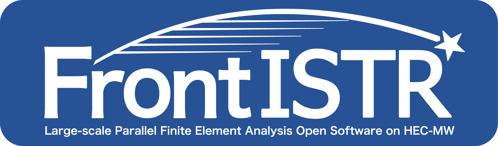

# FrontISTR Documentation

This software is the outcome of "Research and Development of Innovative Simulation Software" project supported by Research and Development for Next-generation Information Technology of Ministry of Education, Culture, Sports, Science and Technology.  We assume that you agree with our license agreement of “MIT License” by using this software at no charge or for the purpose of profit-making business.

| Item | Description |
|:---------:|:---------|
| Software | FrontISTR |
| Version | 5.0 |
| License | MIT License |
| Contact | FrontISTR seminar  Okuda Laboratory, the University of Tokyo, 5-1-5 Kashiwanoha, kashiwa-city, Chiba 277-8563 JAPAN  E-mail：fstr_seminar@multi.k.u-tokyo.ac.jp |
