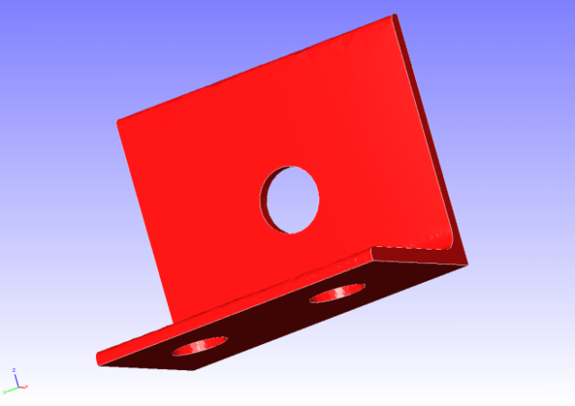
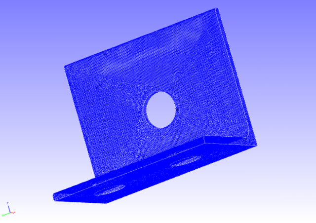
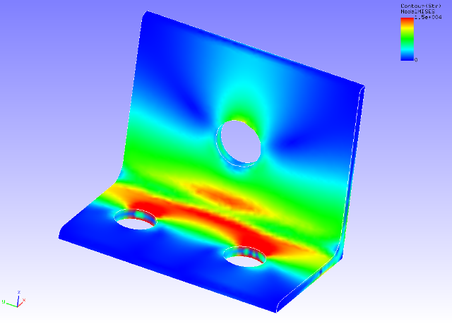

## Static Analysis (Elasticity)

Data of tutorial/01\_elastic\_hinge/ is used for the implementation of
this analysis.

### Analysis Object

A hinge component is the object of the analysis. The shape is shown in
Figure 4.1.1, and the mesh data is shown in Figure 4.1.2. Quadratic
tetrahedral elements are used for the mesh, and the scale of the mesh
consists of 49,871 elements and 84,056 nodes.

{width="2.986111111111111in"
height="2.111111111111111in"}
{width="2.986111111111111in"
height="2.111111111111111in"}

Figure 4.1.1: Shape of Hinge Component Figure 4.1.2: Mesh Data of Hinge
Component

### Analysis Contents

A stress analysis is implemented, where the displacement of the
restrained surface shown in Figure 4.1.1 is restrained, and a
concentrated load is applied to the forced surface. The analysis control
data is shown in the following.

### Analysis Results

A contour figure of the Mises stress was created by REVOCAP\_PrePost,
and is shown in Figure 4.1.3. Moreover, a portion of the analysis
results log file is shown in the following as numeric data of the
analysis results.

{width="4.974762685914261in"
height="3.570900043744532in"}

Figure 4.1.3: Analysis Results of Mises Stress
