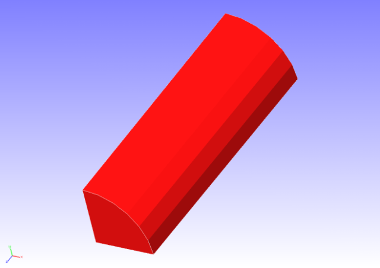
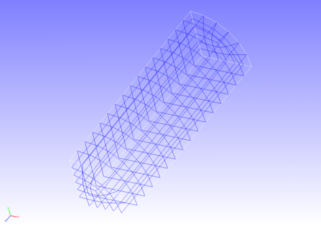
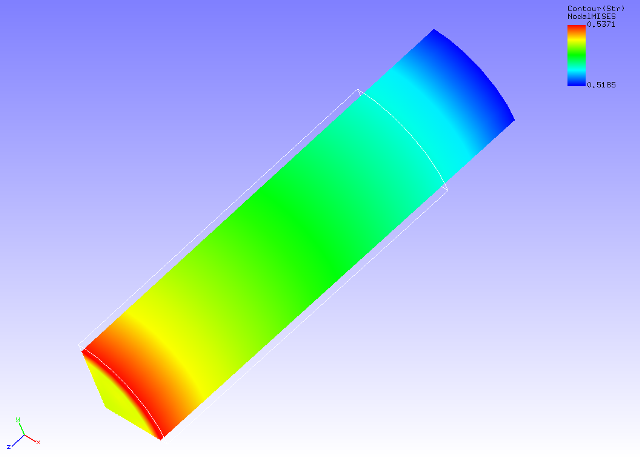

## Static Analysis (Hyperelasticity Part 1)

Data of tutorial/ 03\_hyperelastic\_cylinder/ is used to implement this
analysis.

### Analysis Object

The object for analysis is a 1/8 model of a cylinder. The shape is shown
in Figure 4.3.1, and the mesh data is shown in Figure 4.3.2. Hexahedral
linear elements are used for the mesh, and the scale of the mesh
consists of 432 elements and 629 nodes.

{width="2.986111111111111in"
height="2.111111111111111in"}
{width="2.986111111111111in"
height="2.111111111111111in"}

Figure 4.3.1: Shape of Cylinder (1/8 Model) Figure 4.3.2: Mesh Data of
Cylinder (1/8 model)

### Analysis Content

Stress analysis is implemented where tension displacement is applied to
the cylinder in the axial direction. The Mooney-Rivlin model is used for
the constitutive equation of the material of the hyperelasticity. The
analysis control data is shown in the following.

### Analysis Results

As analysis results of the 5th sub step, a deformed figure applied with
a contour of the Mises stress was created by REVOCAP\_PrePost, and is
shown in Figure 4.3.3. Moreover, a portion of the analysis results log
file is shown in the following as numeric data of the analysis results.

{width="4.548354111986002in"
height="3.264822834645669in"}

Figure 4.3.3: Analysis Results of Deformation and Mises Stress
