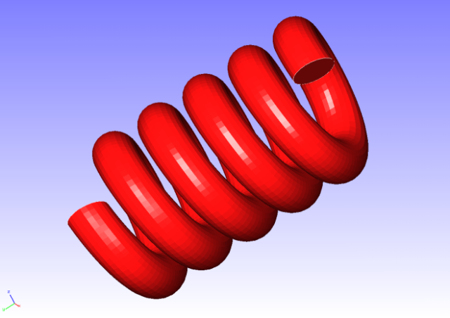
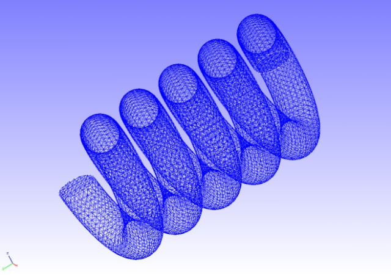
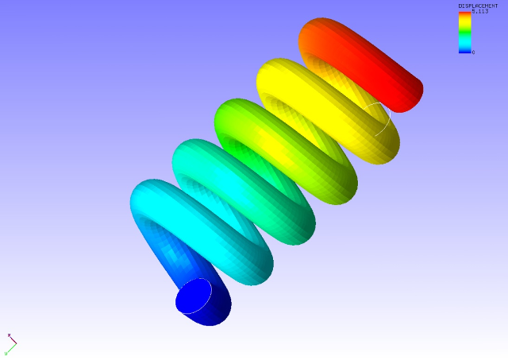

## Static Analysis (Hyperelasticity Part 2)

Data of tutorial/ 04\_hyperelastic\_spring/ is used to implement this
analysis.

### Analysis Object

A spring is the object of the analysis. The shape is shown in Figure
4.4.1, and the mesh data is shown in Figure 4.4.2. Quadratic tetrahedral
elements are used for the mesh, and the scale of the mesh consists of
46,454 elements and 78,771 nodes.

{width="2.986111111111111in"
height="2.111111111111111in"}
{width="2.986111111111111in"
height="2.111111111111111in"}

Figure 4.4.1: Shape of Spring Figure 4.4.2: Mesh Data of Spring

### Analysis Content

A stress analysis is implemented, where the displacement of the
restrained surface shown in Figure 4.4.1 is restrained, and a
displacement is applied to the forced surface. The Arruda-Boyce model is
used for the constitutive equation of the material of the
hyperelasticity. The analysis control data is shown in the following.

### Analysis Results

A deformed figure applied with a displacement contour was created by
REVOCAP\_PrePost, and is shown in Figure 4.4.3. Moreover, a portion of
the analysis results log file is shown in the following as numeric data
of the analysis results.

{width="4.888888888888889in"
height="3.4583333333333335in"}

Figure 4.4.3: Analysis Results of Deformation and Displacement
