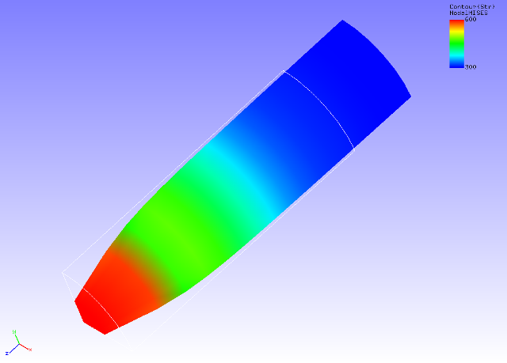

## Static Analysis (Elastoplasticity Part 1)

Data of tutorial/ 05\_plastic\_cylinder / is used to implement this
analysis.

### Analysis Object

The same 1/8 model cylinder as the static analysis (hyperelasticity part
1) in Section 4.3 is the object of the analysis.

### Analysis Content

The necking phenomenon of the cylinder by plastic deformation is
analyzed. The Mises model is used for the yield function. The analysis
control data is shown in the following.

### Analysis Results

As analysis results of the 35th sub step, a deformed figure applied with
a contour of the Mises stress was created by REVOCAP\_PrePost, and is
shown in Figure 4.5.1. Moreover, a portion of the analysis results log
file is shown in the following as numeric data of the analysis results.

{width="4.832626859142607in"
height="3.4688746719160104in"}

Figure 4.5.1: Analysis Results of Deformation and Mises Stress
