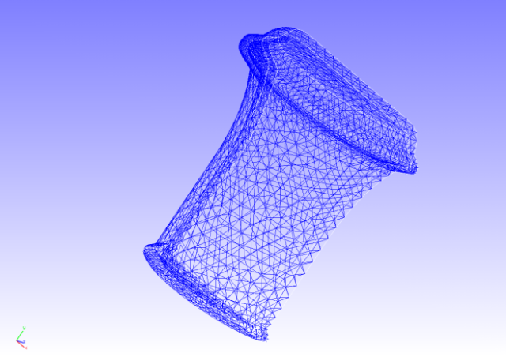
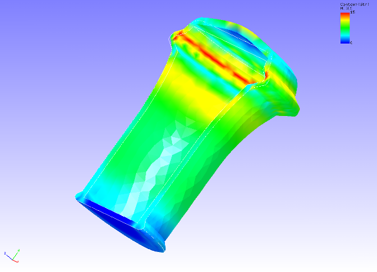

## Static Analysis (Elastoplasticity Part 2)

Data of tutorial/ 06\_plastic\_can / is used to implement this analysis.

### Analysis Object

The object for analysis is a 1/2 model of a can. The shape is shown in
Figure 4.6.1, and the mesh data is shown in Figure 4.6.2. Quadratic
tetrahedral elements are used for the mesh, and the scale of the mesh
consists of 7,236 elements and 14,119 nodes.

{width="2.986111111111111in"
height="2.111111111111111in"}　
{width="2.986111111111111in"
height="2.111111111111111in"}

Figure 4.6.1: Shape of Can Figure 4.6.2: Mesh Data of Can

### Analysis Content

A stress analysis is implemented, where the displacement of the
restrained surface shown in Figure 4.6.1 is restrained, and a
distributed load was applied to the forced surface inside of the can.
The Drucker-Prager model is used for the yield function. The analysis
control data is shown in the following.

### Analysis Results

As analysis results of the 10th sub step, a deformed figure applied with
a contour of the Mises stress was created by REVOCAP\_PrePost, and is
shown in Figure 4.6.3. The deformation magnification is set to 30.
Moreover, a portion of the analysis results log file is shown in the
following as numeric data of the analysis results.

{width="5.819444444444445in"
height="4.194444444444445in"}

Figure 4.6.3: Analysis Results of Deformation and Mises Stress
