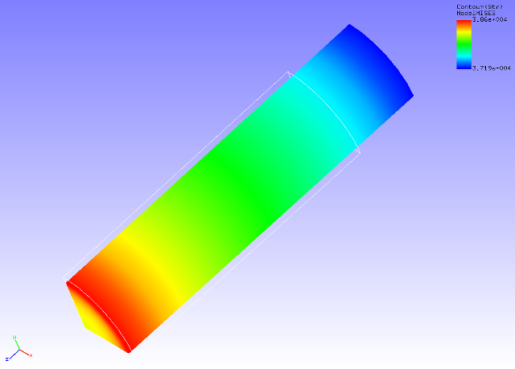

## Static Analysis (Viscoelasticity)

Data of tutorial/ 07\_viscoelastic\_cylinder / is used to implement this
analysis.

### Analysis Object

The same 1/8 model cylinder as in the static analysis (hyperelasticity
part 1) in Section 4.3 is the object of the analysis.

### Analysis Content

Stress relaxation analysis is implemented where tension displacement is
applied to the cylinder in the axial direction. The analysis control
data is shown in the following.

### Analysis Results

A deformed figure applied with a contour of the Mises stress was created
by REVOCAP\_PrePost, and is shown in Figure 4.7.1. This is the analysis
results after 2 seconds (10th step). Moreover, a portion of the analysis
results log file is shown in the following as numeric data of the
analysis results.

{width="5.685442913385827in"
height="4.0810279965004375in"}

Figure 4.7.1: Analysis Results of Deformation and Mises Stress
