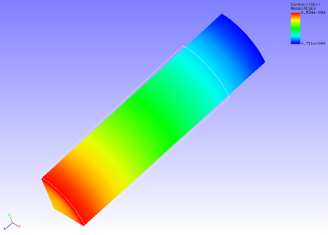

## Static Analysis (Creep)

Data of tutorial/ 08\_creep\_cylinder / is used to implement this
analysis.

### Analysis Object

The same 1/8 model cylinder as in the static analysis (hyperelasticity
part 1) in Section 4.3 is the object of the analysis.

### Analysis Content

Creep behavioral analysis is implemented where tension displacement is
applied to the cylinder in the axial direction. The analysis control
data is shown in the following.

### Analysis Results

As analysis results of the 5th sub step, a deformed figure applied with
a contour of the Mises stress was created by REVOCAP\_PrePost, and is
shown in Figure 4.8.1. Moreover, a portion of the analysis results log
file is shown in the following as numeric data of the analysis results.

{width="5.40117125984252in"
height="3.876977252843395in"}

Figure 4.8.1: Analysis Results of Deformation and Mises Stress
