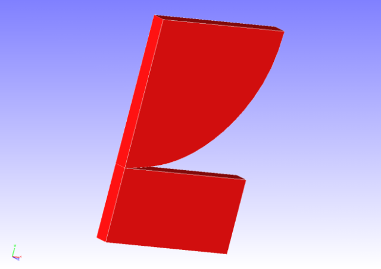
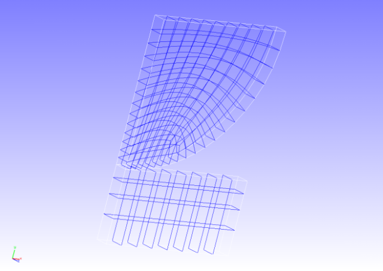
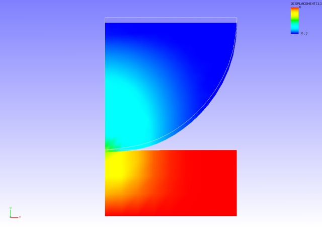

## Contact Analysis (Part 1)

Data of tutorial/ 09\_contact\_hertz / is used to implement this
analysis.

### Analysis Object

The Hertz contact problem was applied in this analysis. The shape of the
analysis object is shown in Figure 4.9.1, and the mesh data is shown in
Figure 4.9.2. Hexahedral linear elements are used for the mesh, and the
scale of the mesh consists of 168 elements and 408 nodes.

{width="2.986111111111111in"
height="2.111111111111111in"}
{width="2.986111111111111in"
height="2.111111111111111in"}

Figure 4.9.1: Shape of Analysis Object Figure 4.9.2: Mesh Data of
Analysis Object

### Analysis Content

An extended Lagrange multiplier method is used to implement the contact
analysis where forced displacement is applied to the upper surface of a
1/4 model disc in the compression direction. The analysis control data
is shown in the following.

### Analysis Results

As analysis results of the 5th sub step, a deformed figure applied with
a contour of the displacement in the y direction was created by
REVOCAP\_PrePost, and is shown in Figure 4.9.3. Moreover, a portion of
the analysis results log file is shown in the following as numeric data
of the analysis results.

{width="4.352727471566054in"
height="3.083182414698163in"}

Figure 4.9.3: Analysis Results of Deformation and y Direction
Displacement
