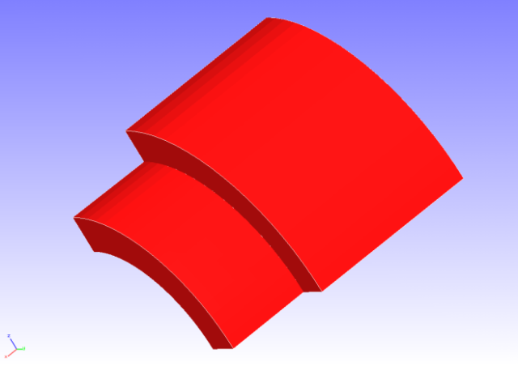
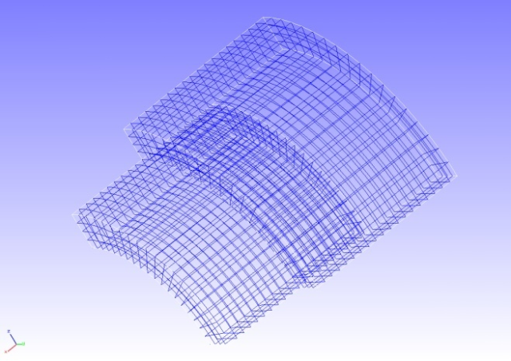
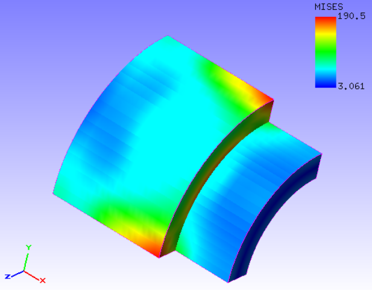

##  Contact Analysis (Part 2)

Data of tutorial/ 10\_contact\_2tubes/ is used to implement this
analysis.

### Analysis Object

A pinched cylindrical problem was applied in this analysis. The shape of
the analysis object is shown in Figure 4.10.1, and the mesh data is
shown in Figure 4.10.2. Hexahedral linear elements are used for the
mesh, and the scale of the mesh consists of 2,888 elements and 4,000
nodes.

{width="2.986111111111111in"
height="2.111111111111111in"}
{width="2.986111111111111in"
height="2.111111111111111in"}

Figure 4.10.1: Shape of Analysis Object Figure 4.10.2: Mesh Data of
Analysis Object

### Analysis Content

The Lagrange multiplier method is used to implement the contact analysis
where forced displacement is applied to the forced surface shown in
Figure 4.10.1 in the pinched direction. The analysis control data is
shown in the following.

### Analysis Results

As analysis results of the 4th sub step, a deformed figure applied with
a contour of the Mises stress was created by REVOCAP\_PrePost, and is
shown in Figure 4.10.3. Moreover, a portion of the analysis results log
file is shown in the following as numeric data of the analysis results.

{width="3.650168416447944in"
height="2.8390201224846896in"}

Figure 4.10.3: Analysis Results of Deformation and Mises Stress
