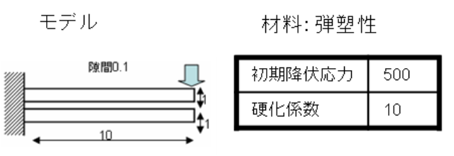
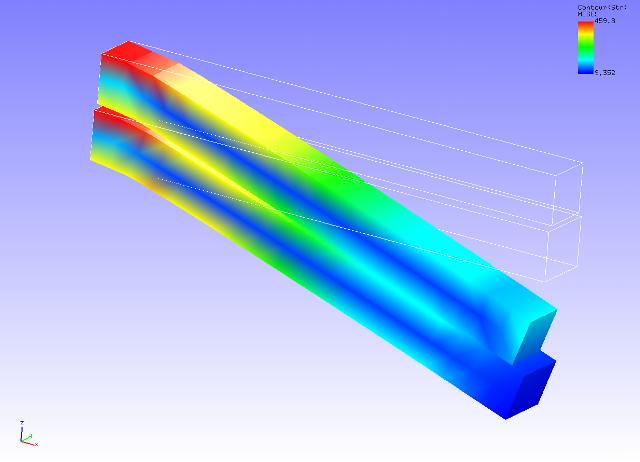

##  Contact Analysis (Part 3)

Data of tutorial/ 11\_contact\_2beam/ is used to implement this
analysis.

### Analysis Object

A two beam contact problem is applied in this analysis. The outline of
the analysis model is shown in Figure 4.11.1. Hexahedral linear elements
are used for the mesh, and the scale of the mesh consists of 80 elements
and 252 nodes.

{width="4.111111111111111in"
height="1.4583333333333333in"}

Figure 4.11.1 Outline of Analysis Model

### Analysis Contents

The Lagrange multiplier method is used to implement the contact analysis
where forced displacement is applied to the front edge surface of the
upper beam. The analysis control data is shown in the following.

### Analysis Results

As analysis results of the 100th sub step, a deformed figure applied
with a contour of the Mises stress was created by REVOCAP\_PrePost, and
is shown in Figure 4.11.2. Moreover, a portion of the analysis results
log file is shown in the following as numeric data of the analysis
results.

{width="5.819444444444445in"
height="4.194444444444445in"}

Figure 4.11.2: Analysis Results of Deformation and Mises Stress
