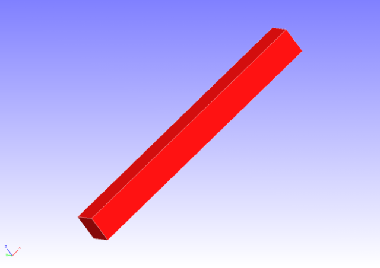
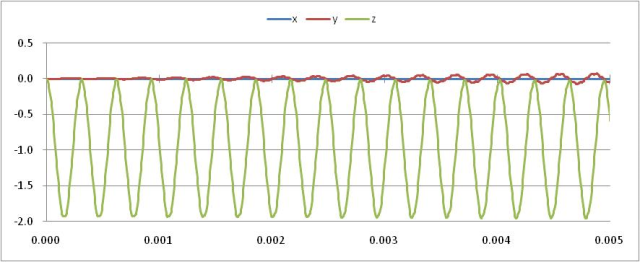

##  Linear Dynamic Analysis

Data of tutorial/ 12\_dynamic\_beam/ is used to implement this analysis.

### Analysis Object

A cantilever beam is the object of the analysis. The shape is shown in
Figure 4.12.1, and the mesh data is shown in Figure 4.12.2. Quadratic
tetrahedral elements are used for the mesh, and the scale of the mesh
consists of 240 elements and 525 nodes.

{width="2.986111111111111in"
height="2.111111111111111in"}
{width="2.986111111111111in"
height="2.111111111111111in"}

Figure 4.12.1: Shape of Cantilever Beam Figure 4.12.2: Mesh Data of
Cantilever Beam

### Analysis Contents

A linear dynamic analysis is implemented, after the displacement of the
restrained surface shown in Figure 4.12.1 is restrained, and a
concentrated load is applied to the load node. The analysis control data
is shown in the following.

### Analysis Results

A time sequence display of the displacement of the monitoring node (load
node, node number 3121) specified by the analysis control data was
created in Microsoft Excel, and is shown in Figure 4.12.3. A portion of
the displacement output file (dyna\_disp\_p1.out) of the monitoring node
is shown in the following as numeric data of the analysis results.

{width="5.902777777777778in"
height="2.361111111111111in"}

Figure 4.12.3: Displacement Time Sequence of Monitoring Node
