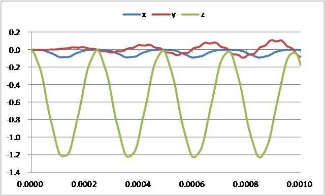

##  Nonlinear Dynamic Analysis

Data of tutorial/ 13\_dynamic\_beam\_nonlinear / is used to implement
this analysis.

### Analysis Object

The same cantilever beam as in the linear dynamic analysis in Section
4.12 is the object of the analysis.

### Analysis Content

A nonlinear dynamic analysis is implemented, after the displacement of
the restrained surface shown in Figure 4.12.1 is restrained, and a
concentrated load is applied to the load node. The analysis control data
is shown in the following.

### Analysis Results

A time sequence display of the displacement of the monitoring node (load
node, node number 3121) specified by the analysis control data was
created in Microsoft Excel, and is shown in Figure 4.13.1. A portion of
the displacement output file (dyna\_disp\_p1.out) of the monitoring node
is shown in the following as numeric data of the analysis results.

{width="5.36402668416448in"
height="3.2333333333333334in"}

Figure 4.13.1: Displacement Time Sequence of Monitoring Node
