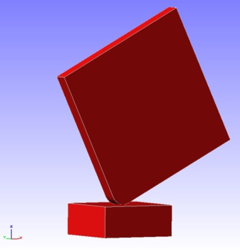
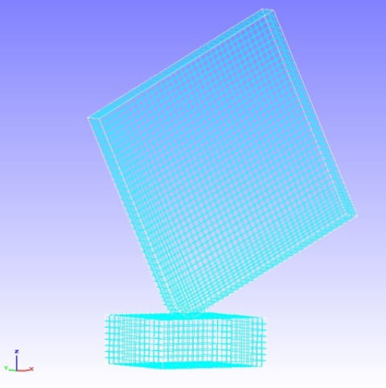
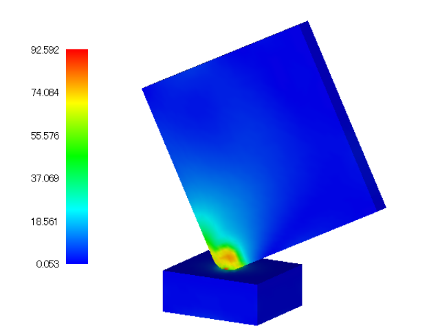

##  Nonlinear Contact Dynamic Analysis

Data of tutorial/ 14\_dynamic\_plate\_contact/ is used to implement this
analysis.

### Analysis Object

A drop impact analysis of a square plate on a floor is the subject of
the analysis. The shape is shown in Figure 4.14.1, and the mesh data is
shown in Figure 4.14.2. Hexahedral linear elements are used for the
mesh, and the scale of the mesh consists of 8,232 elements and 10,712
nodes.

{width="1.9166666666666667in"
height="2.0277777777777777in"}　　　　{width="2.0277777777777777in"
height="1.9444444444444444in"}

Figure 4.14.1: Shape of Floor and Figure 4.14.2: Mesh Data of Floor and

Square Plate Square Plate

### Analysis Content

An initial velocity of 4,427 mm/s is set for the square plate of the
analysis object, to implement the contact dynamic analysis. The analysis
control data is shown in the following.

### Analysis Results

The contour figure of the Mises stress at the time of the drop impact is
shown in Figure 4.14.3. A portion of the energy output file
(dyna\_energy.txt) of the monitoring node is shown in the following as
numeric data of the analysis results.

{width="5.625in" height="4.21875in"}

Figure 4.14.3: Mises Stress at time of Drop Impact
