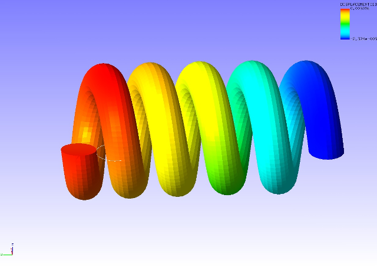

##  Eigenvalue Analysis

Data of tutorial/ 15\_eigen\_spring/ is used to implement this analysis.

### Analysis Object

The same spring as in the static analysis (hyperelasticity part 2) in
Section 4.4 is the object of the analysis.

### Analysis Content

The displacement of the restrained surface shown in Figure 4.4.1 is
restrained, and an eigenvalue analysis is implemented up to the 5th
mode. The analysis control data is shown in the following.

### Analysis Results

Analysis results data file spring.res.0.3 is used, and a 3rd oscillation
mode (compression extension of the spring in y direction) was created by
REVOCAP\_PrePost, and is shown in Figure 4.15.1. The deformation
magnification is set to 1,000. The character frequency list output to
the analysis results log file is shown in the following as numeric data
of the analysis results.

{width="5.666666666666667in"
height="4.013888888888889in"}

Figure 4.15.1: 3rd Oscillation Mode of Spring
