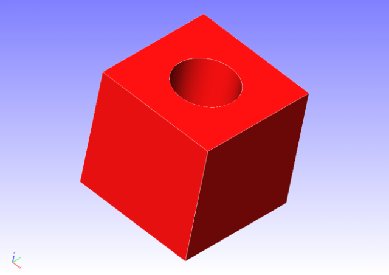
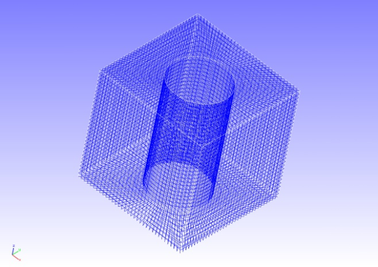
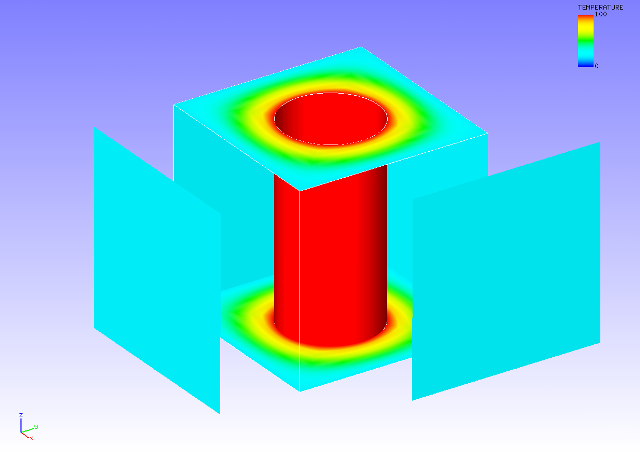

##  Heat Conduction Analysis

Data of tutorial/ 16\_heat\_block/ is used to implement this analysis.

### Analysis Object

A block with a hole is the object of the analysis. The shape is shown in
Figure 4.16.1, and the mesh data is shown in Figure 4.16.2. Hexahedral
linear elements are used for the mesh, and the scale of the mesh
consists of 32,160 elements and 37,386 nodes.

{width="2.986111111111111in"
height="2.111111111111111in"}
{width="2.986111111111111in"
height="2.111111111111111in"}

Figure 4.16.1: Shape of Block with Hole Figure 4.16.2: Mesh Data of
Block with Hole

### Analysis Content

A steady heat conduction analysis is implemented, where a heat source is
applied to the cylindrical inner surface of the analysis object. The
analysis control data is shown in the following.

### Analysis Results

A temperature contour figure was created by REVOCAP\_PrePost, and is
shown in Figure 4.16.3. Moreover, a portion of the analysis results log
file is shown in the following as numeric data of the analysis results.

{width="4.986111111111111in"
height="3.513888888888889in"}

Figure 4.16.3: Temperature Analysis Results
