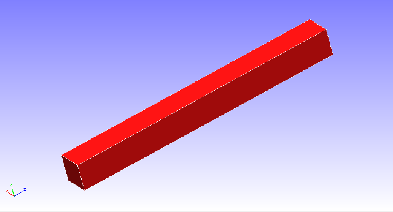
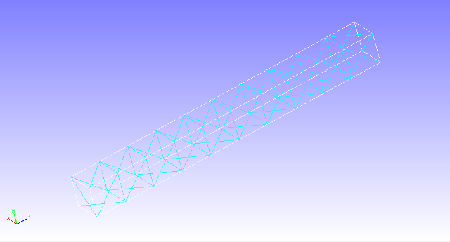
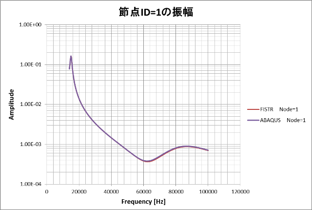

## Frequency Response Analysis

Use the files in the directory, tutorial/ 17\_freq\_beam/, in order to
reproduce the test. The analysis consists of two steps; 1st Eigenvalue
analysis, 2nd Frequency response analysis. For the 1s step, the
following name change is required.

hecmw\_ctrl\_eigen.dat -&gt; hecmw\_ctrl.dat

After changing the name of file, eigenvalues analysis should be
executed. You will get 0.log as the result of eigenvalue analysis. The
file name should be changed as follows.

0.log -&gt; eigen\_0.log

> Then start frequency response analysis.

### Analysis Object

{width="2.7777777777777777in"
height="1.5020833333333334in"}The analysis model is shown in Fig. 4.17.1
and the discretized mesh is shown in Fig.4.17.2. The model is mesh with
Element Type 341 (Number of Elements: 126, Number of Nodes: 55).

{width="2.8354166666666667in"
height="1.5277777777777777in"}

　　　Fig. 4.17.1　The analysis model　　　　 　　Fig. 4.17.2　The mesh

### Analysis Content

　One of the cantilever beam end was fixed and the other is applied load
as nodal force on two nodes. The eigenvalues up to 10th mode are
computed and the resulting eigenvalues and eigenvectors up to 5th mode
are used for frequency response analysis。The analysis control data
shown below.

### Analysis Results

　The frequency dependency of amplitude of displacement at a monitoring
node（Node ID 1）specified in the analysis control data is shown in Fig.
4.17.3. A portion of a log file is shown below to show the numerical
data obtained by the frequency response analysis.

{width="5.402777777777778in"
height="3.611111111111111in"}

Fig.4.17.3　Frequency dependency of amplitude of displacement at a
monitoring node

End
