## Verification by Simple Geometric Model

##### Elastic static analysis

The subject in this verification was a cantilever beam with mesh
partitioning as shown in Figure 9.1.1. Regarding the verification
conditions, the analysis was performed with 7 conditions from exA - exG
where the load conditions were changed as shown in Figure 9.1.2. In
addition, this is a verification case where a direct method solver was
used, with the same load conditions as exA being applied to exG.

The verification results for each case are shown in Table 9.1.1 \~ Table
9.1.7.

Figure 9.1.1: Example of Mesh Partitioned Cantilever Beam (Hexahedral
Element)

　　

\(a) exA, G: Concentrated load 　　　　　　(b) exD: Gravity

　　

\(c) exB: Surface distributed load (d) exE: Centrifugal force

　

\(e) exC: Volumetric load (f) exF: Heat load

Young's Modulus: E = 4000.0 kgf/mm^2^ Length: L = 10.0 mm

Poisson's Ratio: ν = 0.3 Cross-sectional area: A = 1.0 mm^2^

Mass density: ρ=8.0102x10^-10^ kgs^2^/mm^4^

Geometrical moment of inertia: I = 1.0/12.0mm^4^

Gravitational acceleration: g = 9800.0 mm/s^2^

Linear thermal expansion coefficient: α= 1.0x10^-5^

Figure 9.1.2: Verification Conditions of Cantilever Beam Model

Table 9.1.1: exA: Verification Results of Concentrated Load Problem

  ----------- ---------- -------------------------------- --------- ----------- --------------------------
  Case Name   No. of     Predicted Value: δmax = -1.000   Remarks

              Elements                                    

                         NASTRAN                          ABAQUS

  A231        40         -0.338                           -0.371

  A232        40         -0.942                           -1.002

  A241        20         -0.720                           -0.711

  A242        20         -0.910                           -1.002

  A341        240        -0.384                           -0.384

  A342        240        -0.990                           -0.990

  A351        80         -0.353                           -0.355

  A352        80         -0.993                           -0.993

  A361        40         -0.954                           -0.985

  A362        40         -0.994                           -0.993

  A731        40         -                                -

  A741        20         -                                -
  ----------- ---------- -------------------------------- --------- ----------- --------------------------

Table 9.1.2: exB: Verification Results of Surface Distributed Load
Problem

  ----------- ---------- ----------------------------- --------- ----------- --------------------------
  Case Name   No. of     Predicted Value:δmax=-3.750   Remarks

              Elements                                 

                         NASTRAN                       ABAQUS

  B231        40         -1.281                        -1.403

  B232        40         -3.579                        -3.763

  B241        20         -3.198                        -2.680

  B242        20         -3.426                        -3.765

  B341        240        -1.088                        -1.449

  B342        240        -3.704                        -3.704

  B351        80         -3.547                        -1.338

  B352        80         -.3717                        -3.716

  B361        40         -3.557                        -3.691

  B362        40         -3.726                        -3.717

  B731        40         -                             -

  B741        20         -                             -
  ----------- ---------- ----------------------------- --------- ----------- --------------------------

Table 9.1.3: exC: Verification Results of Volumetric Load Problem

  ----------- ---------- ---------------------------------- ----------- ----------- --------------------------
  Case Name   No. of     Predicted Value: δmax= -2.944e-5   Remarks

              Elements                                      

                         NASTRAN                            ABAQUS

  C231        40         -                                  -1.101e-5

  C232        40         -                                  -2.951e-5

  C241        20         -                                  -2.102e-5

  C242        20         -                                  -2.953e-5

  C341        240        -                                  -1.136e-5

  C342        240        -                                  -2.905e-5

  C351        80         -                                  -1.050e-5

  C352        80         -                                  -2.914e-5

  C361        40         -                                  -2.895e-5

  C362        40         -                                  -2.915e-5

  C731        40         -                                  -

  C741        20         -                                  -
  ----------- ---------- ---------------------------------- ----------- ----------- --------------------------

Table 9.1.4: exD: Verification Results of Gravity Problem

  ----------- ---------- ---------------------------------- ----------- ----------- --------------------------
  Case Name   No. of     Predicted Value: δmax= -2.944e-5   Remarks

              Elements                                      

                         NASTRAN                            ABAQUS

  D231        40         -1.101e-5                          -1.101e-5

  D232        40         -2.805e-5                          -2.951e-5

  D241        20         -2.508e-5                          -2.102e-5

  D242        20         -2.684e-5                          -2.953e-5

  D341        240        -1.172e-5                          -1.136e-5

  D342        240        -2.906e-5                          -2.905e-5

  D351        80         -1.046e-5                          -1.050e-5

  D352        80         -2.917e-5                          -2.914e-5

  D361        40         -2.800e-5                          -2.895e-5

  D362        40         -2.919e-5                          -2.915e-5

  D731        40         -                                  -

  D741        20         -                                  -
  ----------- ---------- ---------------------------------- ----------- ----------- --------------------------

Table 9.1.5: exE: Verification Results of Centrifugal Force Problem

  ----------- ---------- --------------------------------- ---------- ----------- --------------------------
  Case Name   No. of     Predicted Value: δmax= 2.635e-3   Remarks

              Elements                                     

                         NASTRAN                           ABAQUS

  E231        40         2.410e-3                          2.616e-3

  E232        40         2.447e-3                          2.627e-3

  E241        20         2.386e-3                          2.622e-3

  E242        20         2.387e-3                          2.627e-3

  E341        240        2.708e-3                          2.579e-3

  E342        240        2.639e-3                          2.614e-3

  E351        80         2.642e-3                          2.598e-3

  E352        80         2.664e-3                          2.617e-3

  E361        40         2.611e-3                          2.603e-3

  E362        40         2.623e-3                          2.616e-3

  E731        40         -                                 -

  E741        20         -                                 -
  ----------- ---------- --------------------------------- ---------- ----------- --------------------------

Table 9.1.6: exF: Verification Results of Thermal Stress Load Problem

  ----------- ---------- --------------------------------- ---------- ----------- -------------------
  Case Name   No. of     Predicted Value: δmax= 1.000e-2   Remarks

              Elements                                     

                         NASTRAN                           ABAQUS

  F231        40         -                                 1.016e-2

  F232        40         -                                 1.007e-2

  F241        20         -                                 1.010e-2

  F242        20         -                                 1.006e-2

  F341        240        -                                 1.047e-2

  F342        240        -                                 1.018e-2

  F351        80         -                                 1.031e-2

  F352        80         -                                 1.015e-2

  F361        40         -                                 1.026e-2

  F362        40         -                                 1.016e-2
  ----------- ---------- --------------------------------- ---------- ----------- -------------------

Table 9.1.7: exG: Verification Results of Direct Method (Concentrated
Load Problem)

  ----------- ---------- ------------------------------ --------- ----------- -------------------
  Case Name   No. of     Predicted Value: δmax=-1.000   Remarks

              Elements                                  

                         NASTRAN                        ABAQUS

  G231        40         -0.338                         -0.371

  G232        40         -0.942                         -1.002

  G241        20         -0.720                         -0.711

  G242        20         -0.910                         -1.002

  G341        240        -0.384                         -0.384

  G342        240        -0.990                         -0.990

  G351        80         -0.353                         -0.355

  G352        80         -0.993                         -0.993

  G361        40         -0.954                         -0.985

  G362        40         -0.994                         -0.993

  G731        40         -                              -

  G741        20         -                              -
  ----------- ---------- ------------------------------ --------- ----------- -------------------

##### Nonlinear static analysis

(2-1) exnl1: Geometrical nonlinear analysis

The same model of verification case exA - G was used for the
verification model of verification case exI. The conceptual diagram of
the verification model is shown in Figure 9.1.3. A geometric nonlinear
analysis is implemented in this model. The verification results are
shown in Table 9.1.8. A nonlinear calculation of the load increment
value of 0.1P for 10 steps is implemented for the final load of 1.0P.

Figure 9.1.3: Verification Model

Table 9.1.8: exI: Verification Results (Maximum Deflection Amount
History)

  ----------- ------- ------- ------- ------- ------- ------- ------- ------- ------- ------- -----------------
  Case Name   0.1     0.2     0.3     0.4     0.5     0.6     0.7     0.8     0.9     1.0     Linear Solution
  I231        -       -       -       -       -       -       -       -       -       -       -
  I232        -       -       -       -       -       -       -       -       -       -       -
  I241        -       -       -       -       -       -       -       -       -       -       -
  I242        -       -       -       -       -       -       -       -       -       -       -
  I341        0.039   0.077   0.116   0.154   0.193   0.232   0.270   0.309   0.348   0.386   0.386
  I342        0.099   0.200   0.300   0.400   0.499   0.599   0.698   0.797   0.896   0.995   0.999
  I351        0.035   0.070   0.105   0.141   0.176   0.211   0.246   0.281   0.316   0.351   0.351
  I352        0.099   0.198   0.298   0.397   0.496   0.595   0.693   0.792   0.890   0.987   0.992
  I361        0.070   0.139   0.209   0.278   0.348   0.417   0.487   0.556   0.625   0.694   0.984
  I362        0.099   0.197   0.298   0.397   0.496   0.595   0.694   0.793   0.891   0.988   0.993
  ----------- ------- ------- ------- ------- ------- ------- ------- ------- ------- ------- -----------------

(2-2) exnl2: Elastoplasticity deformation analysis

The National Agency for Finite Element Methods and Standards (U.K.):
Test NL1 from NAFEMS was referred to in this verification problem, and
incorporated the geometrical non-linearity and multiple hardening rules
in order to implement the elastoplasticity deformation analysis. The
analysis model is shown in Figure 9.1.4.

Figure 9.1.4: Elastoplasticity Deformation Analysis Model

\(1) Verification conditions:

Material: Mises elastoplastic material

Young's Modulus E 250 GPa

Poisson's Ratio ν 0.25

Initial yield stress　　　　 　 5 MPa

Initial yield strain　　　　 　0.25×10^-4^

Isotropic hardening factor H~i~ 　　 　　0 or 62.5 GPa

\(2) Boundary conditions

Step 1: Forced displacement in nodes 2 and 3
$u_{x} = 0.2500031251*10^{- 4}$

Step 2: Forced displacement in nodes 2 and 3
$\ u_{x} = 0.25000937518*10^{- 4}$

Step 3: Forced displacement in nodes 3 and 4
$u_{y} = 0.2500031251*10^{- 4}$

Step 4: Forced displacement in nodes 3 and 4
$u_{y} = 0.25000937518*10^{- 4}$

Step 5: Forced displacement in nodes 2 and 3
$u_{x} = - 0.25000937518*10^{- 4}$

Step 6: Forced displacement in nodes 2 and 3
$u_{x} = - 0.2500031251*10^{- 4}$

Step 7: Forced displacement in nodes 3 and 4
$u_{y} = - 0.25000937518*10^{- 4}$

Step 8: Forced displacement in nodes 3 and 4
$u_{y} = - 0.2500031251*10^{- 4}$

All the nodes not shown here will be completely restrained.

The theoretical solution of this problem is as follows.

  Strain (x10^-4)^      Equivalent Stress (MPa)
  --------------------- ------------------------- --------------------- ----------------- --------------------
  $$\varepsilon_{x}$$   $$\varepsilon_{y}$$
  0.25                  0
  0.50                  0
  0.50                  0.25
  0.50                  0.50
  0.25                  0.50
  0                     0.50
  0                     0.25
  0                     0

The calculation results for the above are as follows.

  Strain（×10^-4^）     Equivalent Stress (MPa)
  --------------------- ------------------------- --------------------- ----------------- --------------------
  $$\varepsilon_{x}$$   $$\varepsilon_{y}$$
  0.25                  0
  0.50                  0
  0.50                  0.25
  0.50                  0.50
  0.25                  0.50
  0                     0.50
  0                     0.25
  0                     0

(2-3) Contact analysis (1)

The National Agency for Finite Element Methods and Standards (U.K.):
Contact Patch Test Problem CGS-4 was referred to in this verification
problem, to test the limited sliding contact problem function with
friction. The analysis model is shown in Figure 9.1.5.

Figure 9.1.5: Contact Analysis Model

The equilibrium conditions of this problem are as follows.

　　　　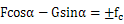$\text{\ F}cos\alpha - Gsin\alpha = \pm f_{c}$

The frictional force in the viscous friction stage was
$f_{c} = E_{t}\text{Δu}$, and becomes
$f_{c} = \mu(Gcos\alpha + Fsin\alpha$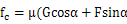)
in the sliding friction stage.

The comparison between the calculation results and the analysis solution
is as follows.

  µ     F/G Analysis Solution   F/G Calculation Results
  ----- ----------------------- -------------------------
  0.0   0.1                     0.1
  0.1   0.202                   0.202
  0.2   0.306                   0.306
  0.3   0.412                   0.412

(2-4) Contact analysis (2): Hertz contact problem

The Hertz contact problem of a cylinder of infinite length and an
infinite plane surface was analyzed in this verification.

The radius of the cylinder was set to R = 8 mm, and Young's modulus E
and Poisson's ratio µ of a deformable body was 1,100 Mpa and 0.0
respectively. Assuming that the contact area was sufficiently smaller
than the radius of the cyclinder, a 1/4 cylindrical model was used to
perform the analysis in consideration of the symmetry of the problem.

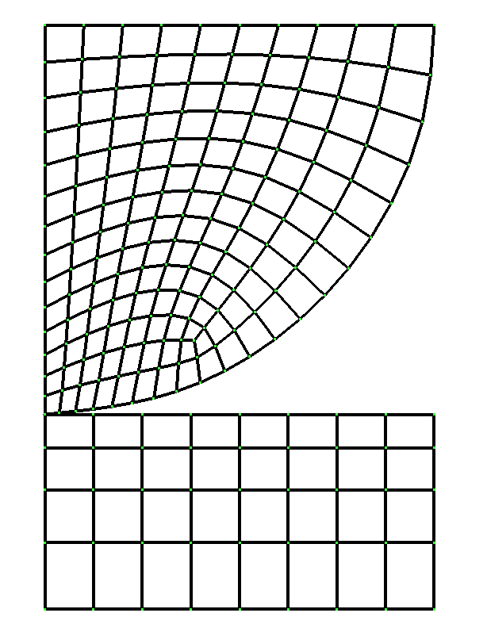

Figure 9.1.6: Hertz Contact Problem Analysis Model

\(1) Verification results of contact radius

The theoretical formula to calculate the contact radius is as follows.

　　　　　　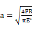Herein,$\ E^{*} = E/2(1 - \mu^{2})$.
In this calculation, the contact radius becomes a = 1.36 when pressure F
= 100.

The equivalent nodal force of the point of contact is shown in Figure
9.1.7. This nodal force distribution is extrapolated to acquire the
contact radius.

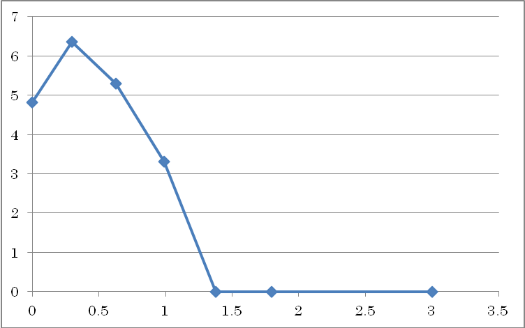

Figure 9.1.7: Equivalent Nodal Force Distribution of Contact Point

\(2) Verification results of maximum shear stress

　In this theoretical solution, the maximum shear stress is
$\tau_{\max} = 0.30\sqrt{\frac{\text{FE}^{*}}{\text{πR}}}$ in contact
position $z = 0.78a$. In this calculation condition it becomes
$\tau_{\max} = 14.2$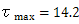. In
contrast to this, the calculation result of $\tau_{\max} = 15.6$ was
acquired.

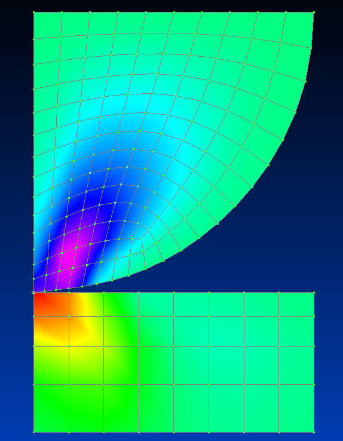

Figure 9.1.8: Shear Stress Distribution (Maximum Value = 15.6)

#####  Eigenvalue analysis

The verification model of verification case exJ \~ K is the same model
as in verification case exA \~ G. The conceptual diagram of the
verification model is shown in Figure 9.1.9. An eigenvalue analysis for
this model was implemented. The eigenvalues to be acquired are the
linear - cubic eigenvalues. In addition, the iterative method solver is
used in exJ, and the direct method solver is used in exK. The
verifications results are shown in Table 9.1.9 \~ Table 9.1.12.

Figure 9.1.9: Verification Model

The vibration eigenvalue of the cantilever beam can be acquired by the
following equations.

  Linear :　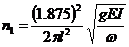      (9.1)
  -------------------------------------- -------
  Quadratic :　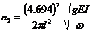   (9.2)
  Cubic :　       (9.3)

The characteristics of the verification model are as follows.

  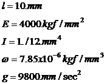   (9.4)
  ------------------------- -------

Therefore, up to a cubic eigenvalue becomes as follows.

n~1~ = 3.609e3 　　　

n~2~ = 2.262e4　　　

n~3~ = 6.335e4 　　　

Table 9.1.9: exJ: Verification Results with Iterative Method (Linear
Eigenvalue)

  ----------- ---------- ----------------------------- ----------- -------------------
  Case Name   No. of     Predicted Value: n1=3.609e3   Remarks

              Elements                                 

                         NASTRAN                       FrontISTR

  J231        40         5.861e3                       5.861e3

  J232        40         3.596e3                       3.593e3

  J241        20         3.586e3                       4.245e3

  J242        20         3.590e3                       3.587e3

  J341        240        5.442e3                       5.429e3

  J342        240        3.621e3                       3.595e3

  J351        80         3.695e3                       4.298e3

  J352        80         3.610e3                       3.609e3

  J361        40         3.679e3                       3.619e3

  J362        40         3.611e3                       3.606e3
  ----------- ---------- ----------------------------- ----------- -------------------

Table 9.1.10: exJ: Verification Results with Iterative Method (Quadratic
Eigenvalue)

  ----------- ---------- ----------------------------- ----------- -------------------
  Case Name   No. of     Predicted Value: n1=2.262e4   Remarks

              Elements                                 

                         NASTRAN                       FrontISTR

  J231        40         3.350e4                       3.351e4

  J232        40         2.163e4                       2.156e4

  J241        20         2.149e4                       2.516e4

  J242        20         2.149e4                       2.143e4

  J341        240        3.145e4                       3.138e4

  J342        240        2.171e4                       2.155e4

  J351        80         2.208e4                       2.546e4

  J352        80         2.156e4                       2.149e4

  J361        40         2.202e4                       2.168e4

  J362        40         2.154e4                       2.144e4
  ----------- ---------- ----------------------------- ----------- -------------------

> Note: Since the linear and quadratic eigenvalues of the 3D model have
> multiple roots, the value based on the cubic equation is used to
> describe the quadratic value in the table.

Table 9.1.11: exK: Verification Results with Direct Method (Linear
Eigenvalue)

  ----------- ---------- ----------------------------- ----------- -------------------
  Case Name   No. of     Predicted Value: n1=3.609e3   Remarks

              Elements                                 

                         NASTRAN                       FrontISTR

  J231        40         5.861e3                       5.861e3

  J232        40         3.596e3                       3.593e3

  J241        20         3.586e3                       4.245e3

  J242        20         3.590e3                       3.587e3

  J341        240        5.442e3                       5.429e3

  J342        240        3.621e3                       3.595e3

  J351        80         3.695e3                       4.298e3

  J352        80         3.610e3                       3.609e3

  J361        40         3.679e3                       3.619e3

  J362        40         3.611e3                       3.606e3

  J731        40         -                             3.606e3

  J741        20         -                             3.594e3
  ----------- ---------- ----------------------------- ----------- -------------------

Table 9.1.12: exK: Verification Results with Direct Method (Quadratic
Eigenvalue)

  ----------- ---------- ----------------------------- ----------- -------------------
  Case Name   No. of     Predicted Value: n1=2.262e4   Remarks

              Elements                                 

                         NASTRAN                       FrontISTR

  J231        40         3.350e4                       3.351e4

  J232        40         2.163e4                       2.156e4

  J241        20         2.149e4                       2.516e4

  J242        20         2.149e4                       2.143e4

  J341        240        3.145e4                       3.138e4

  J342        240        2.171e4                       2.155e4

  J351        80         2.208e4                       2.546e4

  J352        80         2.156e4                       2.149e4

  J361        40         2.202e4                       2.168e4

  J362        40         2.154e4                       2.144e4

  J731        40         -                             2.156e4

  J741        20         -                             2.153e4
  ----------- ---------- ----------------------------- ----------- -------------------

> Note: Since the linear and quadratic eigenvalues of the 3D model have
> multiple roots, the value based on the cubic equation is used to
> describe the quadratic value in the table.

##### Heat conduction analysis

Conditions common to a steady heat conduction analysis are shown in
Figure 9.1.10. The individual conditions of verification case exM - exT
are shown in Figure 9.1.11. Mesh partitioning equivalent to that of exA
was used.

Temperature distribution tables for each case of the verification
results are shown in Table 9.1.13 \~ Table 9.1.20.

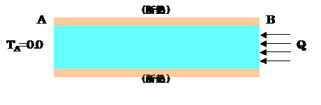

> Length between AB: L = 10.0m
>
> Cross-sectional area: A = 1.0 mm^2^
>
> Temperature dependency of thermal conductivity
>
> 　　Thermal conductivity λ(W/mK) Temperature (ºC)
>
> 　　　　50.0 0.
>
> 35.0 500.
>
> 20.0 1000.

Figure 9.1.10: Verification Conditions of Steady Heat Conduction
Analysis

exM: Linear material

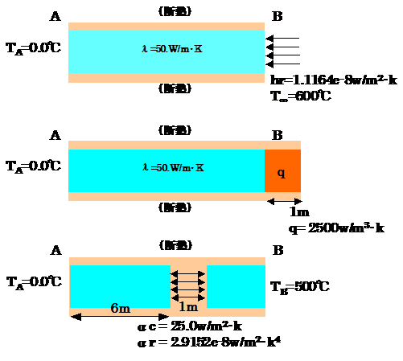

exN: Specified temperature problem

exO: Concentrated heat flux problem

exP: Distributed heat flux problem

exQ: Convective heat transfer problem

exR: Radiant heat transfer problem

exS: Volumetric heat generation problem

exT: Internal gap problem

Figure 9.1.11: Analysis Conditions for each Verification Case

Table 9.1.13: exM: Verification Results of Steady Calculation by Linear
Material

  ----------- -------------- ------------------------- ------------------------- ------ ------ ------ ------ -------
  Case Name   Element Type   No. of Elements / Nodes   Distance from End A (m)
                                                       End A
  M361A       361            40／33                    0.0
  M361B       361            40／105                   0.0
  M361C       361            20／33                    0.0
  M361D       361            20／85                    0.0
  M361E       361            240／99                   0.0
  M361F       361            24／525                   0.0
  M361G       361            80／99                    0.0
  ----------- -------------- ------------------------- ------------------------- ------ ------ ------ ------ -------

Table 9.1.14: exN: Verification Results of Specified Temperature Problem

  ----------- -------------- ------------------------- ------------------------- ------ ------- ------- ------- -------
  Case Name   Element Type   No. of Elements / Nodes   Distance from End A (m)
                                                       End A
  ABAQUS      361            40／99                    0.0
  N231        231            40／33                    0.0
  N232        232            40／105                   0.0
  N241        241            20／33                    0.0
  N242        242            20／85                    0.0
  N341        341            240／99                   0.0
  N342        342            24／525                   0.0
  N351        351            80／99                    0.0
  N352        352            80／381                   0.0
  N361        361            40／99                    0.0
  N362        362            40／330                   0.0
  N731        731            40／33                    0.0
  N741        741            20／33                    0.0
  ----------- -------------- ------------------------- ------------------------- ------ ------- ------- ------- -------

Table 9.1.15: exO: Verification Results of Concentrated Heat Flux
Problem

  ----------- -------------- ------------------------- ------------------------- ------- ------- ------- ------- -------
  Case Name   Element Type   No. of Elements / Nodes   Distance from End A (m)
                                                       End A
  ABAQUS      361            40／99                    0.0
  O231        231            40／33                    0.0
  O232        232            40／105                   0.0
  O241        241            20／33                    0.0
  O242        242            20／85                    0.0
  O341        341            240／99                   -
  O342        342            24／525                   0.0
  O351        351            80／99                    -
  O352        352            80／381                   0.0
  O361        361            40／99                    0.0
  O362        362            40／330                   0.0
  O731        731            40／33                    0.0
  O741        741            20／33                    0.0
  ----------- -------------- ------------------------- ------------------------- ------- ------- ------- ------- -------

Table 9.1.16: exP: Verification Results of Distributed Heat Flux Problem

  ----------- -------------- ------------------------- ------------------------- ------- ------- ------- ------- -------
  Case Name   Element Type   No. of Elements / Nodes   Distance from End A (m)
                                                       End A
  ABAQUS      361            40／99                    0.0
  P231        231            40／33                    0.0
  P232        232            40／105                   0.0
  P241        241            20／33                    0.0
  P242        242            20／85                    0.0
  P341        341            240／99                   -
  P342        342            24／525                   0.0
  P351        351            80／99                    -
  P352        352            80／381                   0.0
  P361        361            40／99                    0.0
  P362        362            40／330                   0.0
  P731        731            40／33                    0.0
  P741        741            20／33                    0.0
  ----------- -------------- ------------------------- ------------------------- ------- ------- ------- ------- -------

Table 9.1.17: exQ: Verification Results of Convective Heat Transfer
Problem

  ----------- -------------- ------------------------- ------------------------- ------ ------- ------- ------- -------
  Case Name   Element Type   No. of Elements / Nodes   Distance from End A (m)
                                                       End A
  ABAQUS      361            40／99                    0.0
  Q231        231            40／33                    0.0
  Q232        232            40／105                   0.0
  Q241        241            20／33                    0.0
  Q242        242            20／85                    0.0
  Q341        341            240／99                   -
  Q342        342            240／525                  0.0
  Q351        351            80／99                    -
  Q352        352            80／381                   0.0
  Q361        361            40／99                    0.0
  Q362        362            40／330                   0.0
  Q731        731            40／33                    0.0
  Q741        741            20／33                    0.0
  ----------- -------------- ------------------------- ------------------------- ------ ------- ------- ------- -------

Table 9.1.18: exR: Verification Results of Radiant Heat Transfer Problem

  ----------- -------------- ------------------------- ------------------------- ------ ------- ------- ------- -------
  Case Name   Element Type   No. of Elements / Nodes   Distance from End A (m)
                                                       End A
  ABAQUS      361            40／99                    0.0
  R231        231            40／33                    0.0
  R232        232            40／105                   0.0
  R241        241            20／33                    0.0
  R242        242            20／85                    0.0
  R341        341            240／99                   -
  R342        342            240／525                  0.0
  R351        351            80／99                    -
  R352        352            80／381                   0.0
  R361        361            40／99                    0.0
  R362        362            40／330                   0.0
  R731        731            40／33                    0.0
  R741        741            20／33                    0.0
  ----------- -------------- ------------------------- ------------------------- ------ ------- ------- ------- -------

Table 9.1.19: exS: Verification Results of Volumetric Heat Generation
Problem

  ----------- -------------- ------------------------- ------------------------- ------- ------- ------- ------- -------
  Case Name   Element Type   No. of Elements / Nodes   Distance from End A (m)
                                                       End A
  ABAQUS      361            40／99                    0.0
  S231        231            40／33                    0.0
  S232        232            40／105                   0.0
  S241        241            20／33                    0.0
  S242        242            20／85                    0.0
  S341        341            240／99                   -
  S342        342            24／525                   0.0
  S351        351            80／99                    -
  S352        352            80／381                   0.0
  S361        361            40／99                    0.0
  S362        362            40／330                   0.0
  S731        731            40／33                    0.0
  S741        741            20／33                    0.0
  ----------- -------------- ------------------------- ------------------------- ------- ------- ------- ------- -------

Table 9.1.20: exT: Verification Results of Internal Gap Problem

  ----------- -------------- ------------------------- ------------------------- ------ ------- ------- ------- -------
  Case Name   Element Type   No. of Elements / Nodes   Distance from End A (m)
                                                       End A
  ABAQUS      361            40／99                    0.0
  T231        231            40／33                    0.0
  T232        232            40／105                   0.0
  T241        241            20／33                    0.0
  T242        242            20／85                    0.0
  T341        341            240／99                   -
  T342        342            24／525                   0.0
  T351        351            80／99                    -
  T352        352            80／381                   0.0
  T361        361            40／99                    0.0
  T362        362            40／330                   0.0
  T731        731            40／33                    0.0
  T741        741            20／33                    0.0
  ----------- -------------- ------------------------- ------------------------- ------ ------- ------- ------- -------

##### Linear dynamic analysis

In exW, the same cantilever beam as in item (1) was used as the subject
to perform the linear dynamic analysis. The verification conditions are
shown in Figure 9.1.12. In this verification, the affects in which the
time increments may have on the results for the same mesh partition was
verified. As a dynamic analysis method, both the implicit method and the
explicit method were used, and element types 361 and 342 were used. The
verification results are shown in Table 9.1.22 and Figure 9.1.13 \~
Figure 9.1.15.

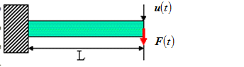

Analysis Model

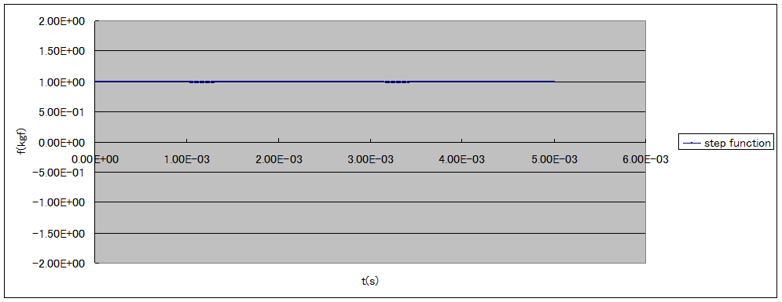

Time History of External Force F

Theoretical solution of vibration point displacement:

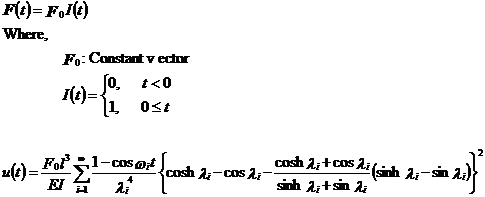

Figure 9.1.12: Verification Conditions of Linear Dynamic Analysis

Verification conditions:

Length L 10.0 mm

Cross-sectional width a 1.0 mm

Cross-sectional height b 1.0 mm

Young's Modulus E 4000.0 kgf /mm^2^

Poisson's Ratio ν 0.3

Density ρ 1.0E-09 kgfs^2^/mm^3^

Gravitational acceleration g 9800.0 mm/s^2^

External force F~0~ 1.0 kgf

Element Hexahedral linear element

Tetrahedral quadratic element

Solution Implicit method

Parameterγof Newmark-βmethod　　 1/2

Parameterβof Newmark-βmethod　 　1/4

Explicit method

Damping N/A

Table 9.1.21: Verification Conditions of Linear Dynamic Analysis
(Continued)

  ---------------------- -------------- -------------- ----------------- ----------------- ----------------
  Case Name              Element Type   No. of Nodes   No. of Elements   Solution          Time Increment

                                                                                           Δt(s)

  W361\_c0\_im\_m2\_t1   361            99             40                Implicit method   1.0E-06

  W361\_c0\_im\_m2\_t2   361            99             40                Implicit method   1.0E-05

  W361\_c0\_im\_m2\_t3   361            99             40                Implicit method   1.0E-04

  W361\_c0\_ex\_m2\_t1   361            99             40                Explicit method   1.0E-08

  W361\_c0\_ex\_m2\_t2   361            99             40                Explicit method   1.0E-07

  W361\_c0\_ex\_m2\_t3   361            99             40                Explicit method   1.0E-06

  W342\_c0\_im\_m2\_t1   342            525            240               Implicit method   1.0E-06

  W342\_c0\_im\_m2\_t2   342            525            240               Implicit method   1.0E-05

  W342\_c0\_im\_m2\_t3   342            525            240               Implicit method   1.0E-04

  W342\_c0\_ex\_m2\_t1   342            525            240               Explicit method   1.0E-08

  W342\_c0\_ex\_m2\_t2   342            525            240               Explicit method   5.0E-08

  W342\_c0\_ex\_m2\_t3   342            525            240               Explicit method   1.0E-07
  ---------------------- -------------- -------------- ----------------- ----------------- ----------------

Table 9.1.22: exW: Verification Results of Linear Dynamic Analysis for
Cantilever Beam

  ---------------------- -------------- -------------- ----------------- ----------------- ----------------------------------------------------------- ------------
  Case Name              Element Type   No. of Nodes   No. of Elements   Solution          z Direction Displacement: uz (mm) when Time t = 0.002 (s)
                                                                                           Theoretical Solution Repeated to Sextic Equation
  W361\_c0\_im\_m2\_t1   361            99             40                Implicit method   1.9753
  W361\_c0\_im\_m2\_t2   361            99             40                Implicit method   1.9753
  W361\_c0\_im\_m2\_t3   361            99             40                Implicit method   1.9753
  W361\_c0\_ex\_m2\_t1   361            99             40                Explicit method   1.9753
  W361\_c0\_ex\_m2\_t2   361            99             40                Explicit method   1.9753
  W361\_c0\_ex\_m2\_t3   361            99             40                Explicit method   1.9753
  W342\_c0\_im\_m2\_t1   342            525            240               Implicit method   1.9753
  W342\_c0\_im\_m2\_t2   342            525            240               Implicit method   1.9753
  W342\_c0\_im\_m2\_t3   342            525            240               Implicit method   1.9753
  W342\_c0\_ex\_m2\_t1   342            525            240               Explicit method   1.9753
  W342\_c0\_ex\_m2\_t2   342            525            240               Explicit method   1.9753
  W342\_c0\_ex\_m2\_t3   342            525            240               Explicit method   1.9753
  ---------------------- -------------- -------------- ----------------- ----------------- ----------------------------------------------------------- ------------

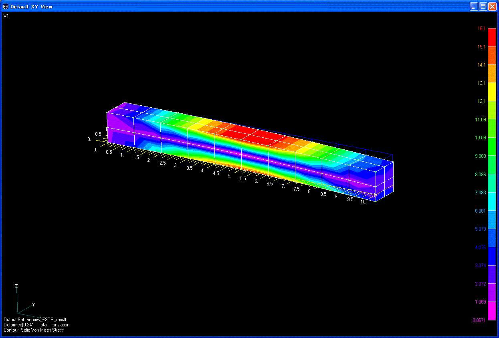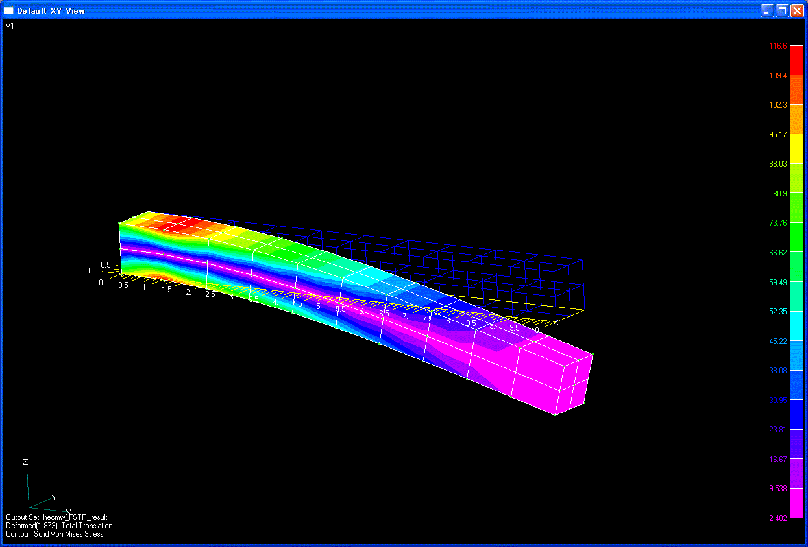

\(a) t=2.0E-03(s)　　　　　　　　　　　　　　　　　(b) t=4.0E-03(s)

Figure 9.1.13: Deformed Figure and Equivalent Stress Distribution of
Cantilever Beam (W361\_c0\_im\_m2\_t2)

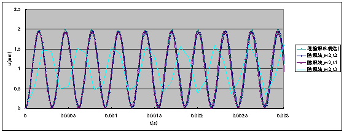

(a)　 Element Type 361: Implicit method

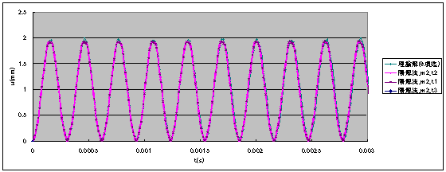

(b)　 Element Type 361: Explicit method

Figure 9.1.14: Time History of Vibration Point Displacement u~z~

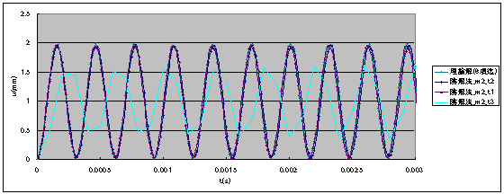

(a)　 Element Type 342: Implicit method

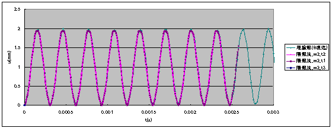

(b)　 Element Type 342: Explicit method

Figure 9.1.15: Time History of Vibration Point Displacement u~z~

##### Frequency Response Analysis

> A cantilever beam was used for the verification and validation of
> frequency response analayis.The results were compared with those of
> ABAQUS. The analysis model and boundary conditions are shown below.

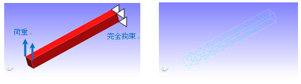{width="5.229897200349956in"
height="1.4689555993000876in"}

Analysis model (Element type= 341, Number of Elements:126, Number of
Nodes: 55)

Analysis conditions：

Young’s modulus E 210000 N/mm^2^

Poisson’s ratio ν 0.3

Density ρ 7.89E-09t/mm^3^

Gravity g 9800.0 mm/s^2^

Applied force F~0~ 1.0 N

Rayleigh damping parameter Rm 0.0

Rayleigh damping parameter Rk 7.2E-07

　Eigenvalue upto 5th mode obtained by eigenvalue analysis are listed
below.

  mode   FrontISTR   ABAQUS
  ------ ----------- --------
  1      14952       14952
  2      15002       15003
  3      84604       84539
  4      84771       84697
  5      127054      126852

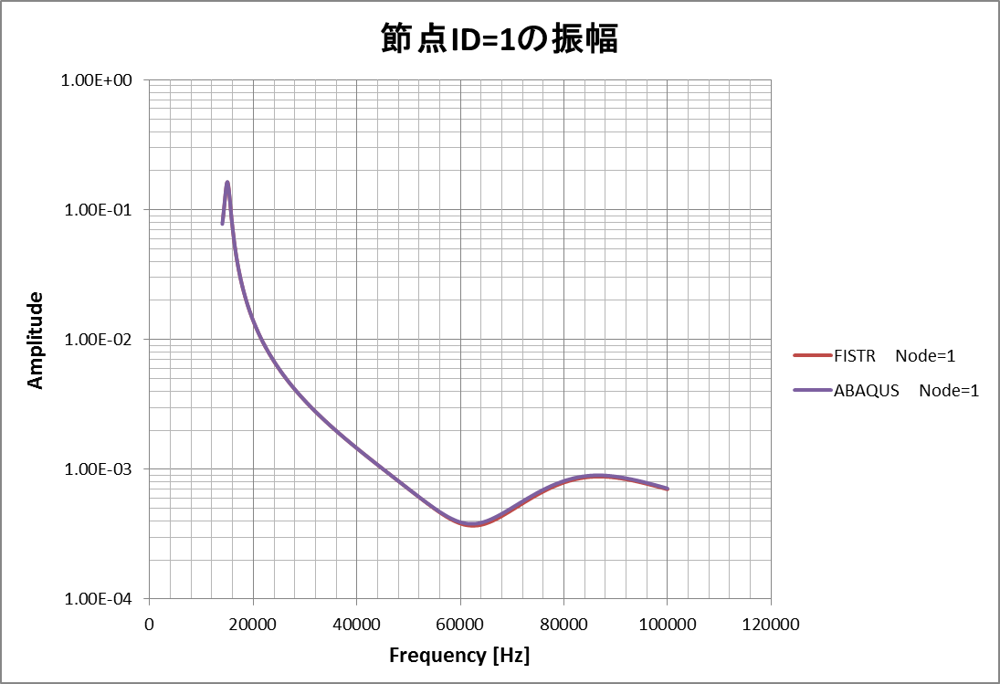{width="4.694444444444445in"
height="3.2110465879265093in"}

Fig. 9.1.16 : Frequency dependency of the displacement amplitude at
loaded point
