## Example of Actual Model for Elastic Static Analysis

### Analysis Model

A list of an actual model verification example for the elastic static
analysis is shown in Table 9.2.1. The shape of the model (portions
excluded) is shown in Figure 9.2.1 \~ Figure 9.2.5. In order to execute
an example of element type 731 and 741, a separate direct method solver
is required.

Table 9.2.1: Example of Actual Model Verification for Elastic Static
Analysis

  ------- --------- --------------------- --------- ----------------
  Case    Element   Verification Model    No. of    No. of Degrees

  Name    Type                            Nodes     of Freedom

  EX01A   342       Connecting rod        94,074    282,222

                    (100,000 nodes)                 

  EX01B   342       Connecting rod        331,142   993,426

                    (330,000 nodes)                 

  EX02    361       Block with hole       37,386    112,158

  EX03    342       Turbine blade         10,095    30,285

  EX04    741       Cylindrical shell     10,100    60,600

  EX05A   731       Wine glass (coarse)   7,240     43,440

  EX05B   731       Wine glass (medium)   48,803    292,818

  EX05C   731       Wine glass (fine)     100,602   603,612
  ------- --------- --------------------- --------- ----------------

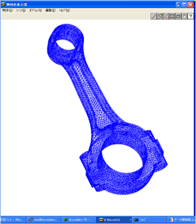

Figure 9.2.1: Connecting Rod (EX01A)

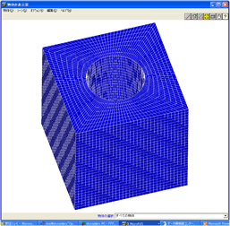

Figure 9.2.2: Block with Hole (EX02)

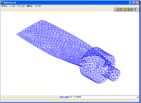

Figure 9.2.3: Turbine Blade (EX03, EX06)

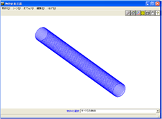

Figure 9.2.4: Cylindrical Shell (EX04, EX09)

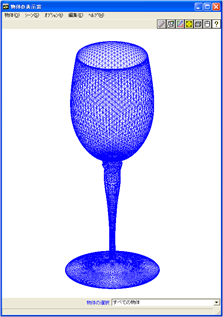

Figure 9.2.5: Wine Glass (EX05, EX10A)

### Analysis Results

#### Example of Analysis Results

An example of the analysis results is shown in Figure 9.2.6 \~ Figure
9.2.9.

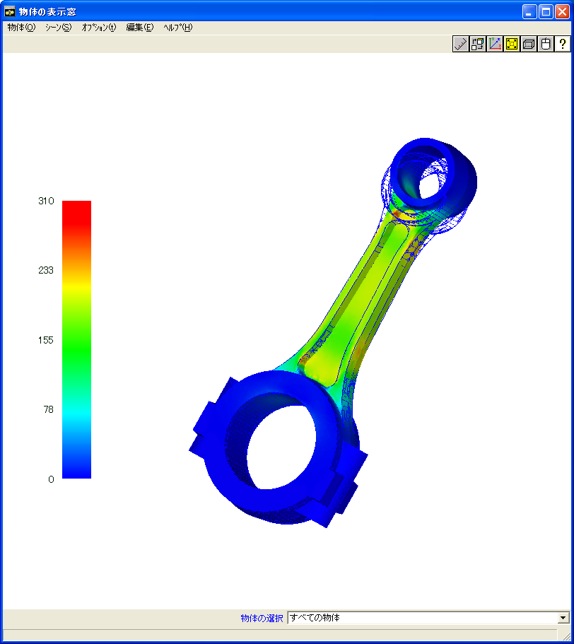

Figure 9.2.6: EX01A Analysis Results (Mises Stress and Deformed Figure
(10 times))

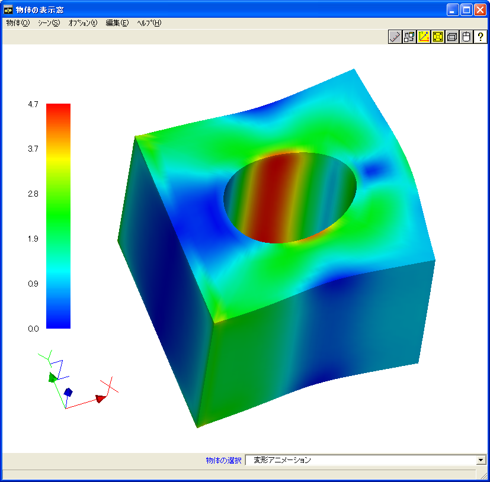

Figure 9.2.7: EX02 Analysis Results (Mises Stress and Deformed Figure
(100 times))

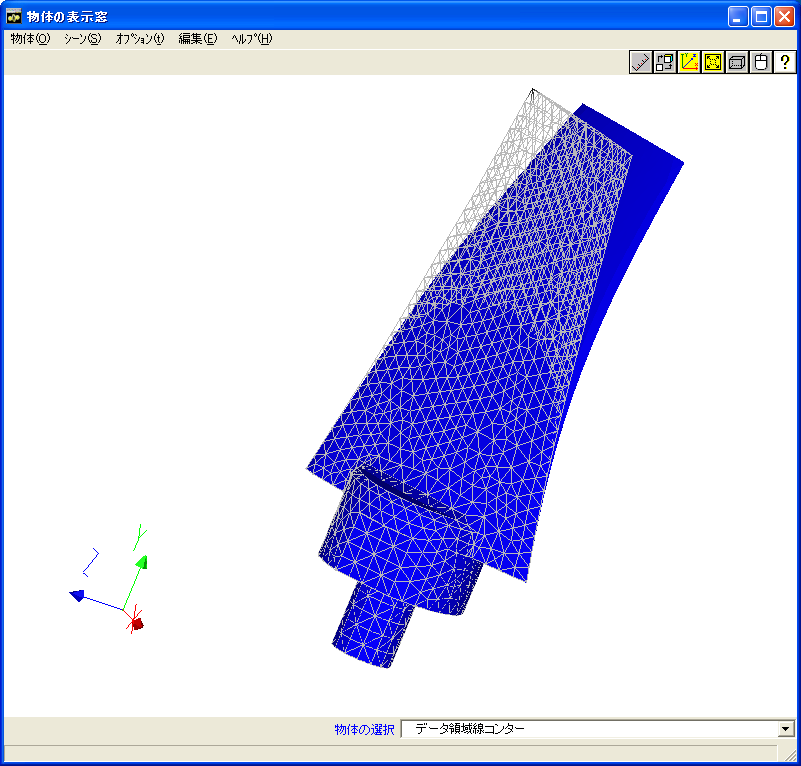

Figure 9.2.8: EX03 Analysis Results (Deformed Figure (10 times))

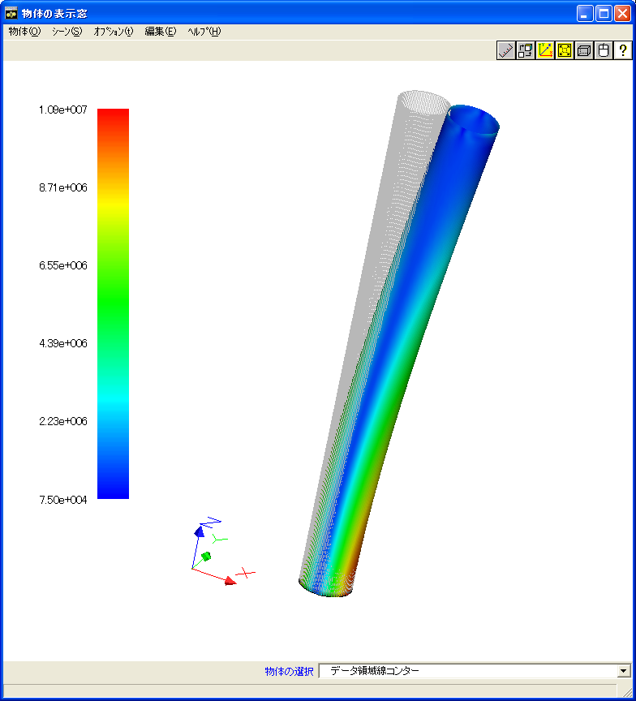

Figure 9.2.9: EX04 Analysis Results (Deformed Figure (100 times))

#### Verification Results of Analysis Performance by Verification Example EX02

An equivalent block model with a hole as in verification example EX02
was used to perform the analysis by general purpose commercial software
ABAQUS. The maximum and minimum comparison results of FrontISTR and the
stress component are shown in Figure 9.2.10. This figure shows that the
stress component is extremely coherent.

Next, the results of investigating the affects of domain partitioning in
the stress distribution are shown. The domain partitioning was performed
according to the RCB method, and X, Y and Z were partitioned into two in
each axial direction, and the overall model was partitioned into 8
domains. The partitioned state is shown in Figure 9.2.11. The stress
distribution in the analysis results of a single domain model and a
model partitioned into eight domains is shown in Figure 9.2.12.

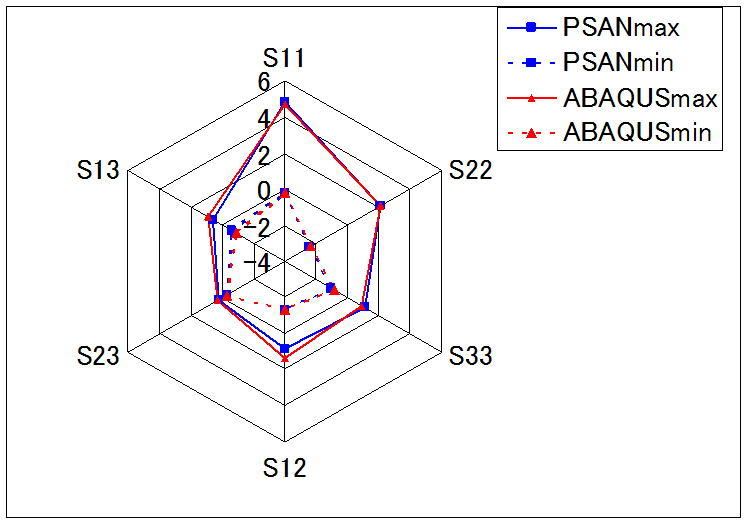

Figure 9.2.10: Comparison of Stress Component with General Purpose
Software in EX02

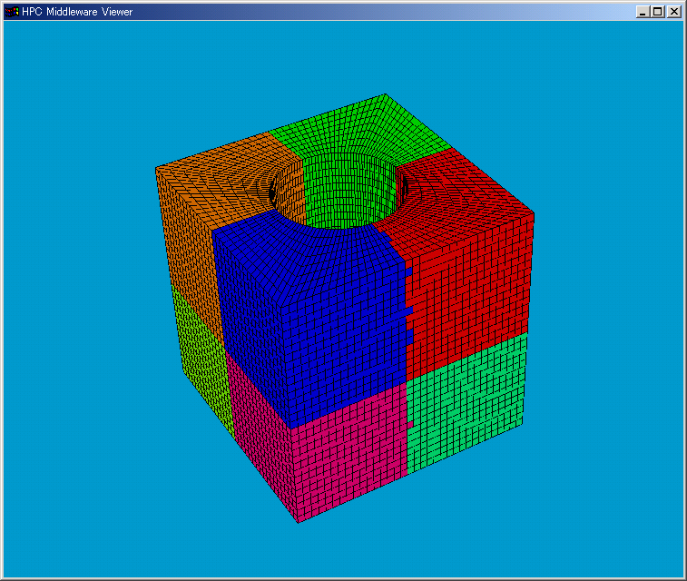

Figure 9.2.11: Eight Domain Partitioned Results of EX02 by RCB Method

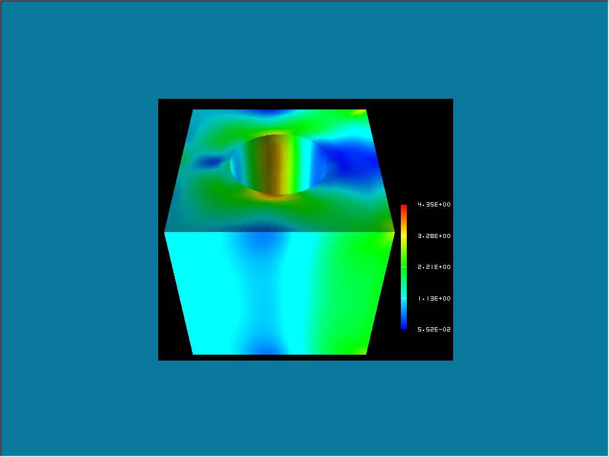

\(a) Single Domain Model

\(b) Eight Domain Partitioned Model

Figure 9.2.12: Difference of Mises Stress Distribution by Domain
Partitioning

Figure 9.2.12 shows no difference between both models, and it is clear
that both models are in complete agreement.

Next, the comparison results of the execution time by setting the HEC-MW
solver is shown in Table 9.2.2. The convergence history to the solution
is shown in Figure 9.2.13.

Table 9.2.2: Comparison of Execution Time by HEC-MW Solver

  --------- --------------------
  Solver    Execution Time (s)
  CGI       38.79
  CGscale   52.75
  BCGS      60.79
  CG8       6.65
  --------- --------------------

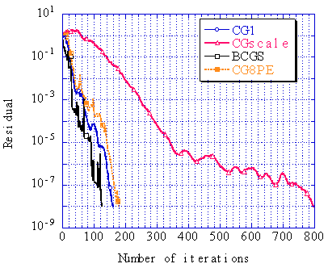

Figure 9.2.13: Comparison of Convergence History by HEC-MW Solver

(Convergence judgment threshold: 1.0x10^-8^)

#### Comparison of Computing Time by Verification Example EX01A

Verification example EX01A (connecting rod) was used to verify the
acceleration rate of the calculating speed by domain partitioning. A
Xeon 2.8 GHz 24 node cluster computing system was used for the
calculations. The results are shown in Figure 9.2.14. In this figure, it
is clear that the calculating speed accelerated in proportion to the
number of domains.

The difference in the computing time by the environment of the computing
system was also examined. The results are shown in Table 9.2.3.

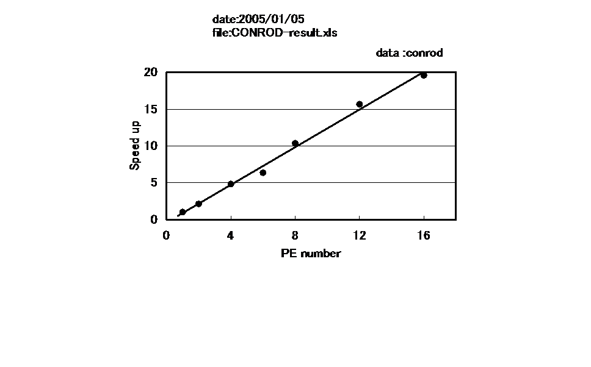

Figure 9.2.14: Accelerating Effectiveness by Domain Partitioning

Table 9.2.3: Comparison of Computing Time by Computing System (1 CPU)

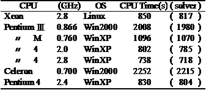
