## Example of Actual Model for Eigenvalue Analysis

### Analysis Model

A list of the verification examples of an actual model for the
eigenvalue analysis is shown in Table 9.3.1. Among these models, the
shapes of the model of EX07 (turbine rotor) and EX08 (spring) are shown
in Figure 9.3.1 and Figure 9.3.2. The same shapes as in the verification
example for the elastic static analysis where the verification contents
are the same is used for the shape of the other models, and is already
shown in the above. In order to execute an example of element type 731
and 741, a separate direct method solver is required.

Table 9.3.1: Verification Example of Actual Model for Eigenvalue
Analysis

  ------- --------- --------------------- --------- ----------------
  Case    Element   Verification Model    No. of    No. of Degrees

  Name    Type                            Nodes     of Freedom

  EX06    342       Turbine blade         10,095    30,285

  EX07    361       Turbine rotor         127,440   382,320

  EX08    342       Spring                78,771    236,313

  EX09    741       Cylindrical shell     10,100    60,600

  EX10A   731       Wine glass (coarse)   7,240     43,440

  EX10B   731       Wine glass (medium)   48,803    292,818
  ------- --------- --------------------- --------- ----------------

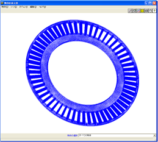

Figure 9.3.1: Turbine Rotor (EX07)

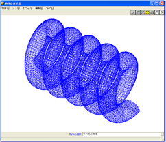

Figure 9.3.2: Spring (EX08)

### Analysis Results

The vibration mode and natural frequency are shown in the following.

##### EX06 Turbine blade

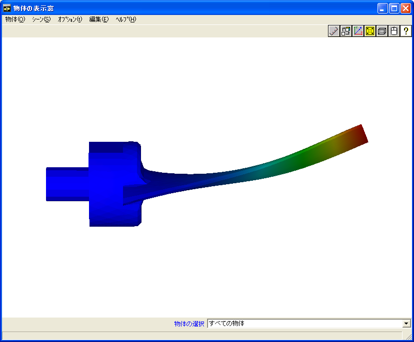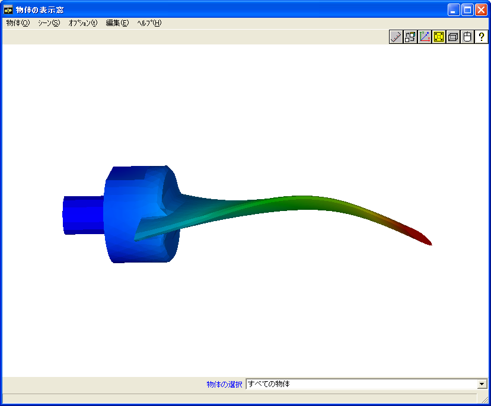

\(a) Mode 1 (1170 kHz) 　　(b) Mode 2（3250kHz）

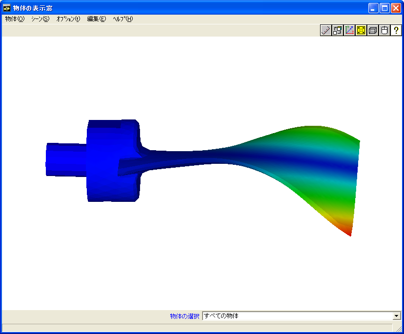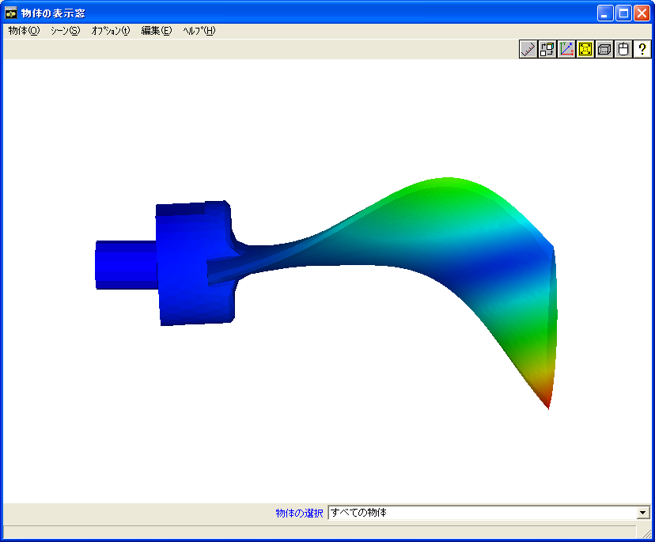

\(c) Mode 3（4130kHz） 　　(d) Mode 4（4140kHz）

> 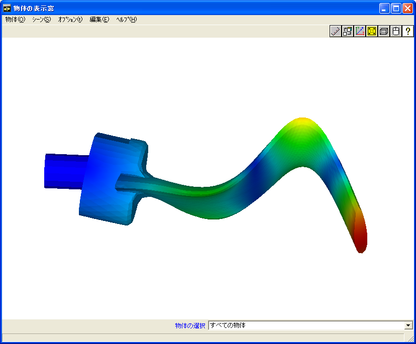
>
> \(e) Mode 5（8210kHz）

Figure 9.3.3: EX06 Turbine Blade Vibration Mode

##### EX07 Turbine rotor

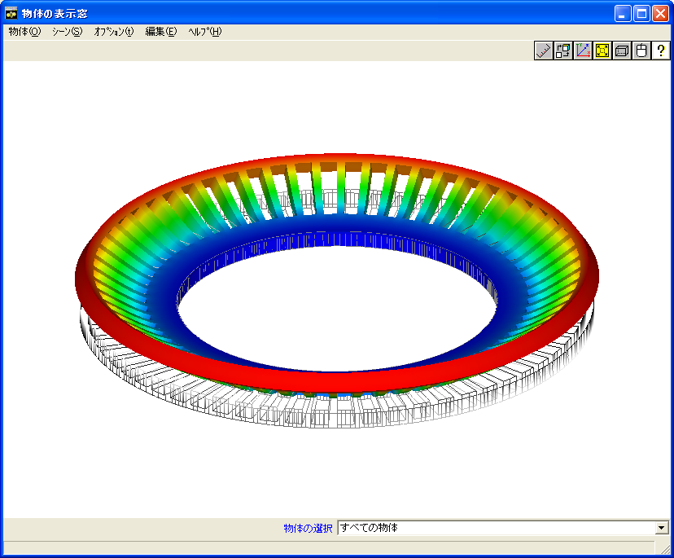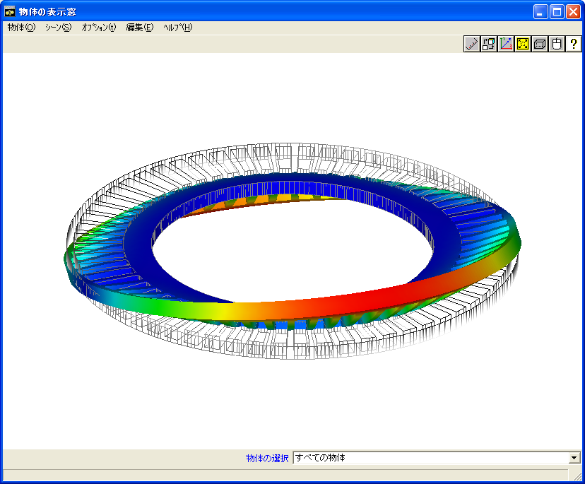

\(a) Mode 1（1067Hz） 　　(b) Mode 2（1072Hz）

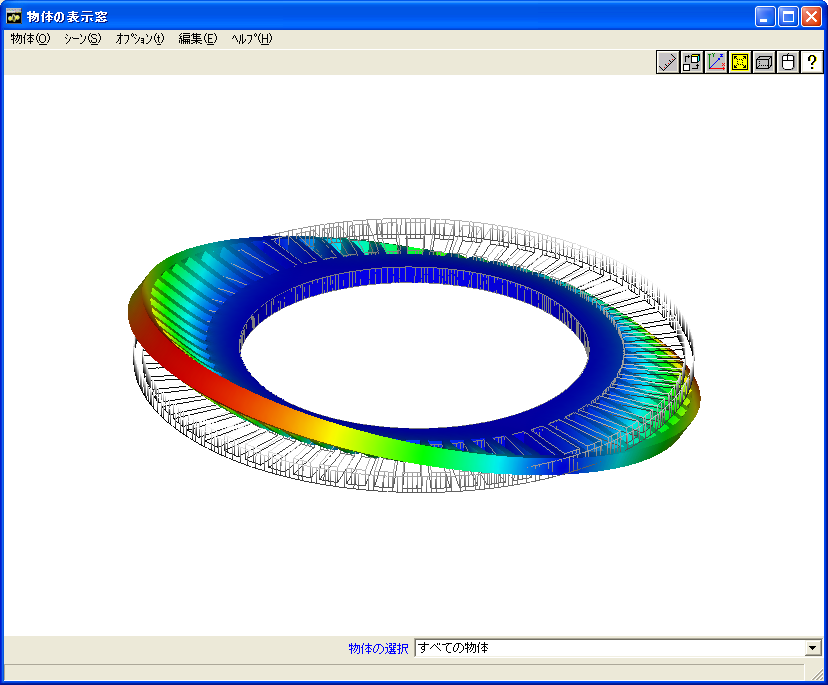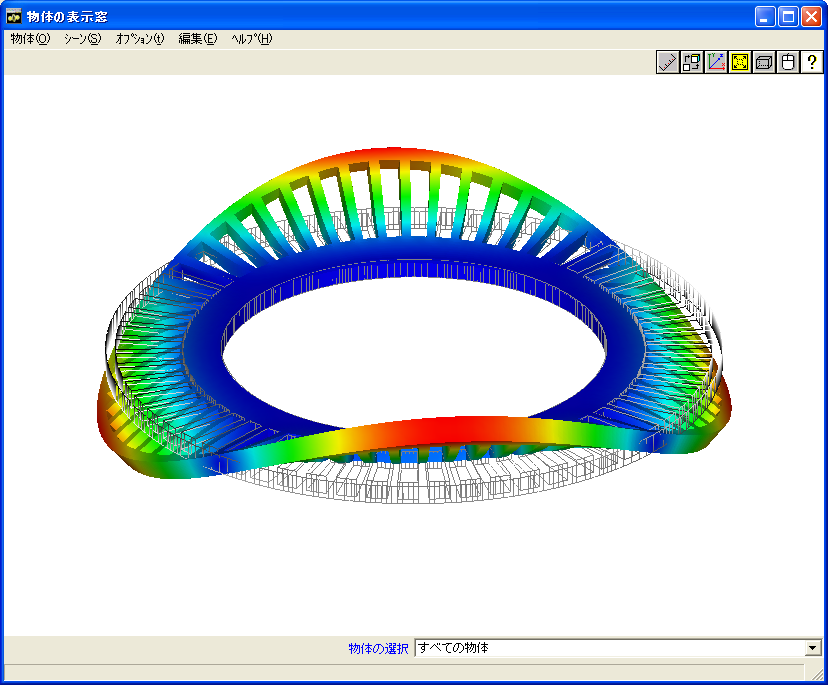

\(c) Mode 3（1072Hz） 　　(d) Mode 4（1093Hz）

> 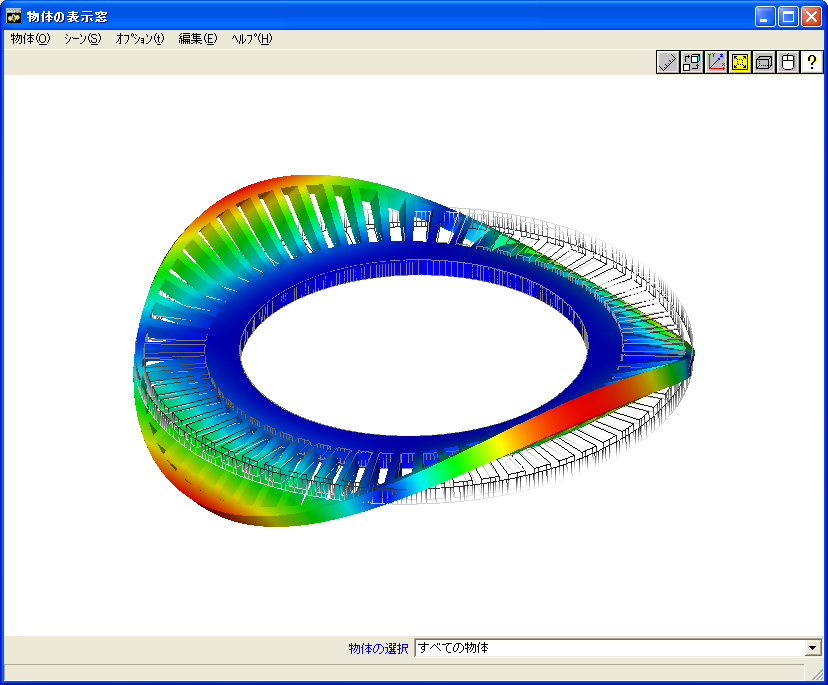
>
> \(e) Mode 5（1093Hz）

Figure 9.3.4: EX07 Turbine Rotor Vibration Mode

##### EX08 Spring

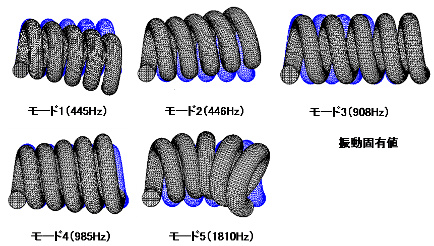

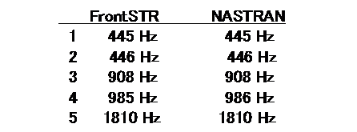

Figure 9.3.5: EX08 Spring Vibration Mode

##### EX09 Cylindrical shell

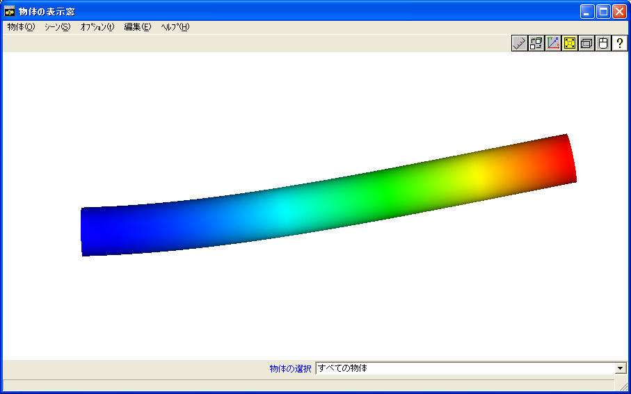

\(a) Mode 1,2（109Hz）

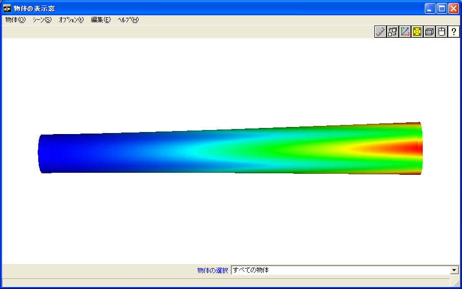

\(b) Mode 3,4（570Hz）

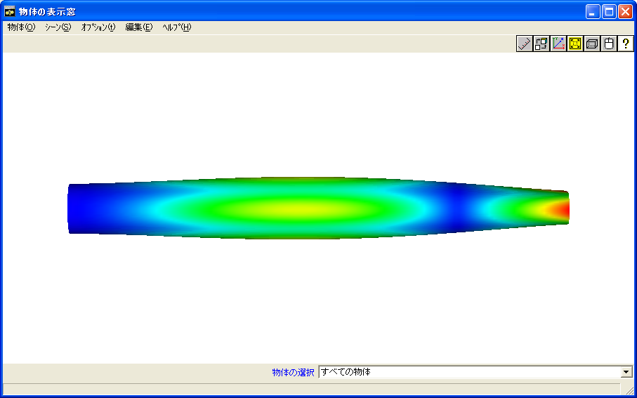

\(c) Mode 5（615Hz）

Figure 9.3.6: EX09 Cylindrical Shell Vibration Mode

##### EX10A Wine glass

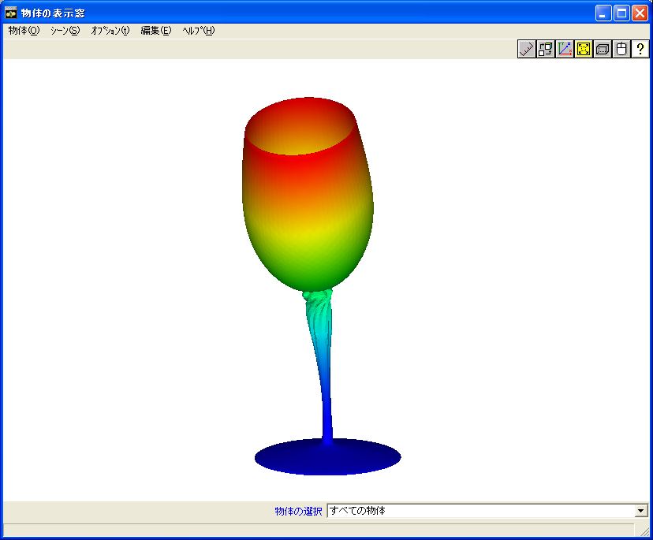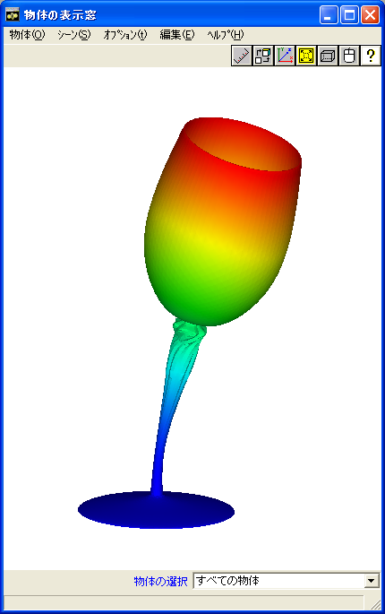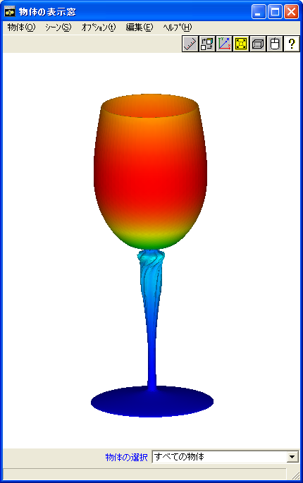

\(a) Mode 1（101Hz） (b) Mode 2（102Hz） (c) Mode 3（354Hz）

> 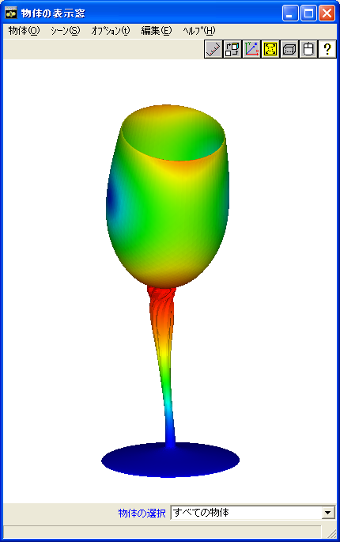 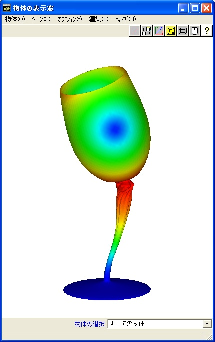
>
> \(d) Mode 4（1335Hz） (e) Mode 5（1336Hz）

Figure 9.3.7: EX10A Wine Glass Vibration Mode
