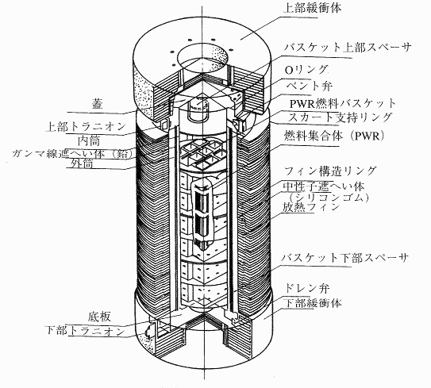
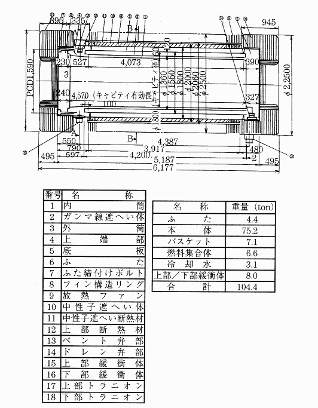
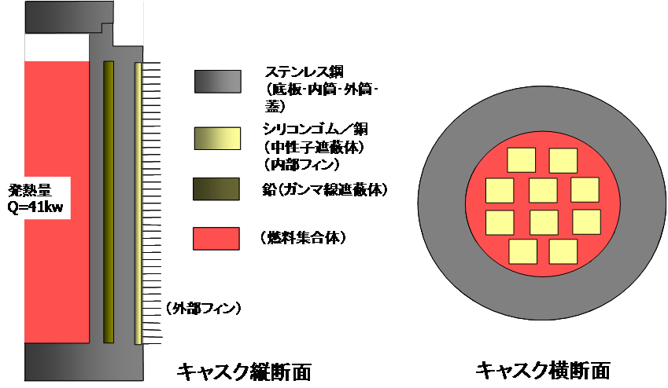
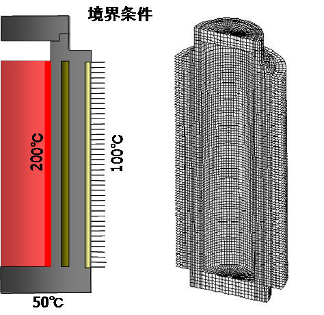
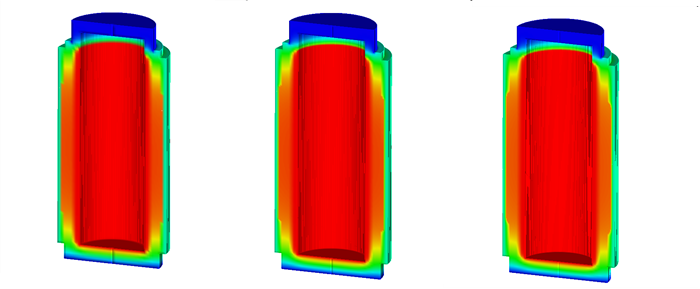
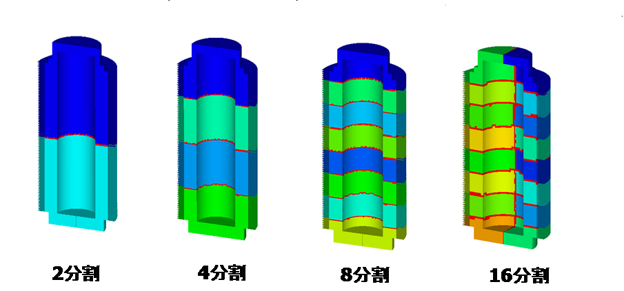
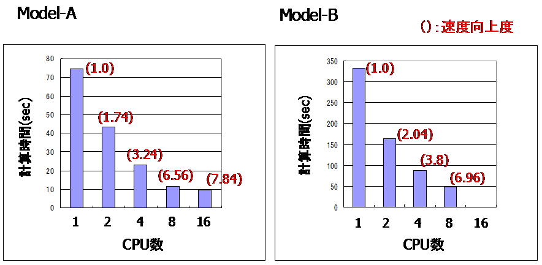

## Example of Actual Model for Heat Conduction Analysis

### Analysis Model

In heat conduction analysis, a spent nuclear fuel shipping container was
used as the actual model. A verification example of three types of
actual models where the roughness of the mesh was changed was used for
verification. A list is shown in Table 9.4.1. The shape of the models is
shown in Figure 9.4.1 \~ Figure 9.4.4.

Table 9.4.1: Verification Example of Actual Model for Heat Conduction
Analysis

  ------- --------- --------------------------------------- ----------- ----------------
  Case    Element   Verification Model                      No. of      No. of Degrees

  Name    Type                                              Nodes       of Freedom

  EX21A   361       Spent nuclear fuel shipping container   88,938      79,920

  EX21B   361                                               309,941     289,800

  EX21C   361                                               1,205,765   1,159,200
  ------- --------- --------------------------------------- ----------- ----------------

Figure 9.4.1: Spent Nuclear Fuel Shipping Container

Reference: *Transport Engineering of Nuclear Fuel Materials* (Nikkan
Kogyo Shimbun) 1998

Figure 9.4.2: Dimensions of Spent Nuclear Fuel Shipping Container

{width="1.7108737970253718in"
height="1.6219510061242344in"}

Figure 9.4.3: Conceptual Diagram of Model

Figure 9.4.4: Model Boundary Conditions and Mesh Partitioning Figure
(EX21A)

### Analysis Results

An example of the analysis results is shown in Figure 9.4.5 \~ Figure
9.4.7.

EX21A EX21B EX21C

Figure 9.4.5: Temperature Distribution Figure

Figure 9.4.6: Distributed Model Figure

Figure 9.4.7: Level of Speed Improvement by Distribution Process
