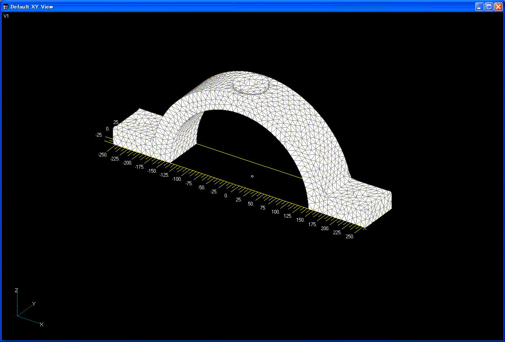
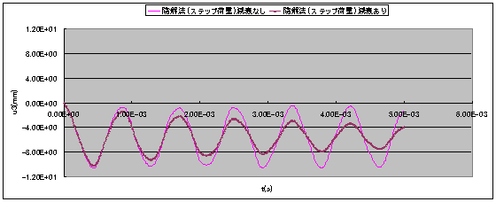
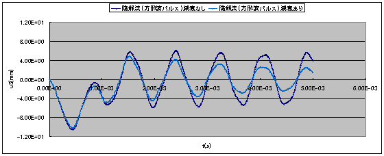
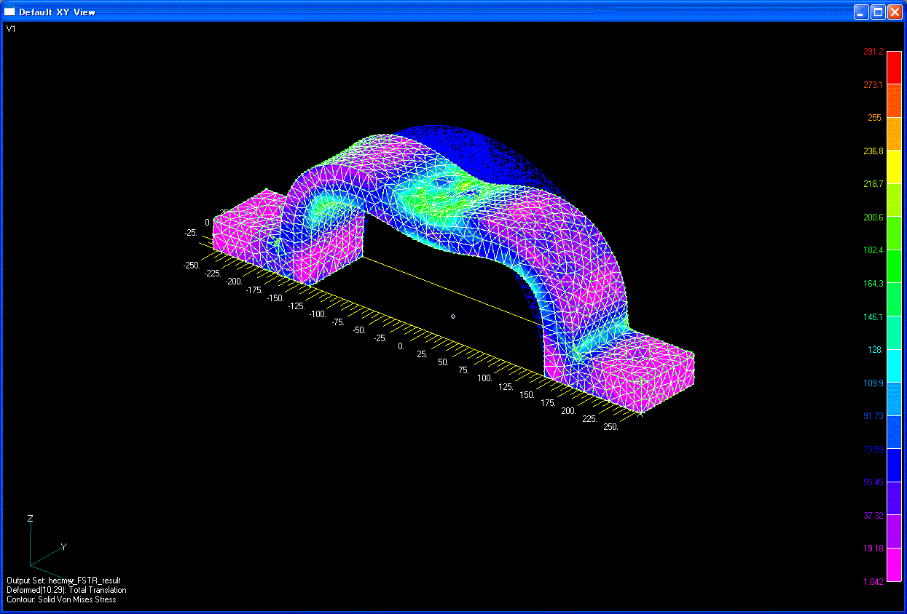
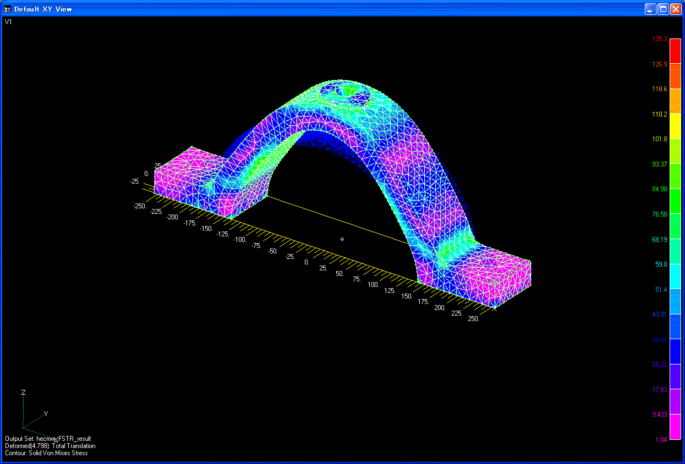

## Example of Actual Model for Linear Dynamic Analysis

### Analysis Model

In the linear dynamic analysis, the machine parts shown in Figure 9.5.1
were used as the actual model. In this actual model, a verification
example was set for four cases with different load conditions and
damping coefficients. A list is shown in Table 9.5.1.

Table 9.5.1: Verification Example of Actual Model for Linear Dynamic
Analysis

  ------- --------- -------------------- ------------------------ -------------------- -------- ----------------
  Case    Element   Verification Model   Loading Conditions       Damping Conditions   No. of   No. of Degrees

  Name    Type                                                                         Nodes    of Freedom

  EX31A   342       Mesh model           Step load (F0)           No                   15,214   45,642

  EX31B   342                            Step load (F0)           Yes                  15,214   45,642

  EX31C   342                            Square wave pulse (F1)   No                   15,214   45,642

  EX31D   342                            Square wave pulse (F1)   Yes                  15,214   45,642
  ------- --------- -------------------- ------------------------ -------------------- -------- ----------------

> 

Figure 9.5.1: Mesh Model

### Analysis Results

Examples of the analysis results are shown in Figure 9.5.2 \~ Figure
9.5.3.

\(a) In the case of Step Load

\(b) In the case of Square Wave Pulse Load

Figure 9.5.2: Time History of Vibration Point Displacement u~z~

\(a) t=5.0E-04(s)

\(b) t=4.0E-03(s)

Figure 9.5.3: Deformed Figure and Equivalent Stress Distribution

(Deformed Magnification 5.0): EX31C
