## Infinitesimal Deformation Linear Elasticity Static Analysis

The formulation for the elastic static analysis based on the
infinitesimal deformation theory is described in this section. The
linear elasticity is assumed as the stress and strain relationship.

### Basic Equation

The equilibrium equation of solid mechanics, dynamic boundary conditions
and the geometric boundary conditions (basic boundary conditions) are
given by the following equation (Refer to Figure 2.1.1).

  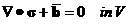   (2.1.1)
  ----------------------- ---------
  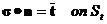   (2.1.2)
  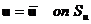   (2.1.3)

Herein,  is the stress,  is
the surface force,  is the body force, and
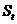 expresses the dynamic boundary and
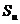 expresses the geometric boundary.

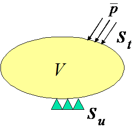{width="1.7902777777777779in"
height="1.7083333333333333in"}

Figure 2.1.1:　Boundary Value Problem in Solid Mechanics (Infinitesimal
Deformation Problem)

The strain and displacement relational expression in the infinitesimal
deformation problem is given by the following equation.

  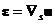   (2.1.4)
  ------------------------ ---------

The stress and strain relational expression (constitutive equation) in
the linear elastic body is given by the following equation.

  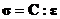   (2.1.5)
  ------------------------ ---------

 Herein, C is the fourth order elastic tensor.

### Principle of Virtual Work

The principle of the virtual work regarding the infinitesimal
deformation linear elasticity problem equivalent to the basic equations
(2.1), (2.1.2) and (2.1.3), is expressed as in the following equation.

  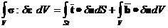   (2.1.6)
  ------------------------ ---------
  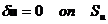   (2.1.7)

Furthermore, in consideration of the constitutive equation (2.1.5),
equation (2.1.6) is expressed as in the following equation.

  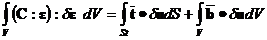   (2.1.8)
  ------------------------ ---------

In equation (2.1.8),  is the strain tensor and C
is the forth order elastic tensor. In this case, when stress tensor
 and strain tensor  are
expressed by each vector forms  and
, the constitutive equation (2.1.5) is expressed
as in the following equation.

  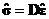   (2.1.9)
  ------------------------ ---------

Herein, D is the elastic matrix.

In consideration of stress  and
 expressed by the vector forms and equation
(2.1.9), equation (2.1.8) is expressed as in the following equation.

  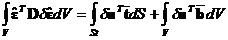   (2.1.10)
  ------------------------ ----------

Equation (2.1.10) and equation (2.1.7) are the principles of the virtual
work discretized in this development code.

### Formulation

The principle equation (2.1.10) of the virtual work is discretized for
each finite element to acquire the following equation.

  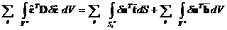   (2.1.11)
  ------------------------ ----------

Using the displacement of the nodes which consist of elements, the
displacement field is interpolated for each element as in the following
equation.

  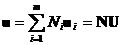   (2.1.12)
  ------------------------ ----------

The strain in this case, is given as in the following equation using
equation (2.1.4).

     (2.1.13)
  ------------------------ ----------

Equations (2.1.12) and (2.1.13) are substituted with equation (2.1.11)
to acquire the following equation.

  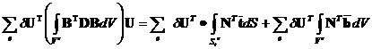   (2.1.14)
  ------------------------ ----------

Equation (2.1.14) can be summarized as in the following equation.

     (2.1.15)
  ------------------------ ----------

Where,

  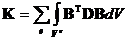   (2.1.16)
  ------------------------ ----------
  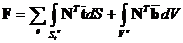   (2.1.17)

The components of the matrix and vectors defined by the following
equations (2.1.16) and (2.1.17) can be calculated and overlapped for
each finite element.

The following equation can be acquired by forming equation (2.1.15) for
the arbitrary virtual displacement.

     (2.1.18)
  ------------------------ ----------

On the other hand, the displacement boundary condition equation (2.1.3)
is expressed as in the following equation.

  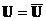   (2.1.19)
  ------------------------ ----------

Node displacement **U** can be determined by solving equation (2.1.18)
by the restriction condition equation (2.1.19).
