## Nonlinear Static Analysis Method

As mentioned above, in the analysis of the infinitesimal deformation
problem, the finite element analysis can be performed by discretizing
this equation with the finite element, using the principle of virtual
work equivalent to a basic equation, such as the equilibrium equation.
Even in the analysis of a finite deformation problem which handles
finite deformation of structures, the point of using the principle of
virtual work is basically the same. However, in a finite deformation
problem, even though linearity of the material is assumed, the principle
equation of virtual work will become a nonlinear equation regarding the
displacement. In order to solve the nonlinear equation, repeated
calculations by an iterative method is generally used. In the iterative
calculation, an incremental analysis method is used, where a calculation
is sectionally performed for certain small load increments, and
repeating this calculation results in a final deformed state. When an
infinitesimal deformation problem is assumed, the layout before and
after deformation to define the strain and stress has not been
distinguished in particular. Thus, when an infinitesimal deformation is
assumed, the layout to describe the basic equation has not been a
problem, even though it was before or after the deformation. However,
when implementing an incremental analysis in a finite deformation
problem, whether to refer to the initial status as a reference layout,
or refer to the starting point of the increments can be selected. The
former is called the total Lagrange method, and the latter is called the
updated Lagrange method. For details, refer to the references and etc.
at the end of this Chapter.

Both the total Lagrange method and updated Lagrange method have been
adopted for this development code.

### Geometric Nonlinear Analysis Method

#### Decomposition of Increments of Virtual Work Equation

The status to time ｔ is already known. The incremental analysis assumed
here is where the status of t’ = t + Δｔ is unknown. (Refer to Figure
2.2.1) The equilibrium equation, dynamic boundary conditions and
geometric boundary conditions (basic boundary conditions) of the static
boundary value problem are as follows.

  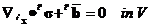   (2.2.1)
  ------------------------ ---------
  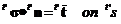   (2.2.2)
     (2.2.3)

However, 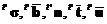 are the Cauchy stress (true stress),
body force, outward normal vector of the object's surface, fixed surface
force and fixed displacement in each time t’. These equations are
described for the layout of 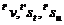 in time t’.

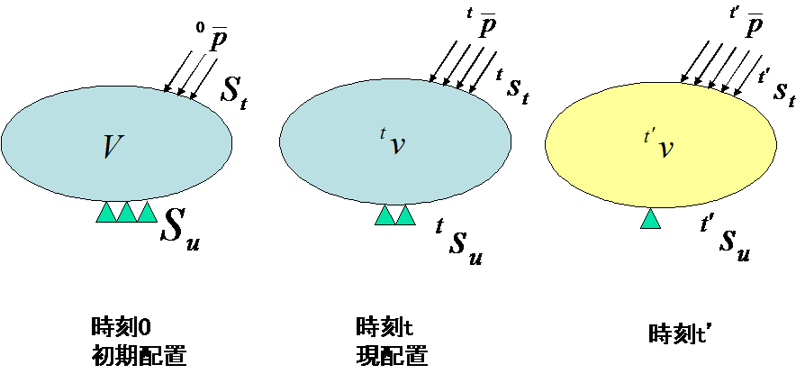{width="3.40625in" height="1.5833333333333333in"}

Figure 2.2.1:　Concept of Incremental Analysis

#### Principle of Virtual Work

The principle of virtual work equivalent to the equilibrium equation of
equation (2.2.1) and the dynamic boundary conditions of equation (2.2.2)
is given by the following equation.

  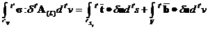   (2.2.4)
  ------------------------ ---------

Herein, 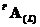 is the linear portion of the Almansi
strain tensor, and is specifically expressed by the following equation.

  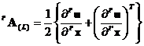   (2.2.5)
  ------------------------ ---------

Equation (2.2.4) 2.4) should be solved with the geometric boundary
conditions, strain displacement relational expression and the stress
strain relational expression; however, equation (2.2.4) 2.4) is
described in the layout of time t’, and the layout of time t’ is unknown
at the present stage. Therefore, the formulation is performed referring
to layout V of time 0, or layout 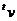 at time t.

#### Formulation of Total Lagrange Method

The formulation based on the total Lagrange method used in the
development code is described in this section.

The principle equation of the virtual work at time t’ assuming the
initial layout of time 0 is the reference, is given by the following
equation.

  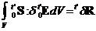   (2.2.6)
  ------------------------ ---------
  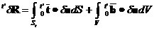   (2.2.7)

However, 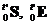 respectively express the 2nd
Piola-Kirchhoff stress tensor and the Green-Lagrange strain tensor at
time t’, assuming the initial layout of time 0 is the reference.
Moreover,  is the body force converted per unit
volume of the nominal surface force vector and the initial layout, and
is given by the following equation in connection with equations (2.2.1),
(2.2.2) and (2.2.3).

  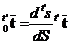   (2.2.8)
  ------------------------ ---------
  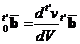   (2.2.9)

The Green-Lagrange strain tensor at time t is defined by the following
equation.

  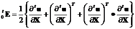   (2.2.10)
  ------------------------ ----------

Thus, the displacement and the 2nd Piola-Kirchhoff stress
 at time t’ are expressed by the decomposed
increments as in the following equation.

     (2.2.11)
  ------------------------ ----------
  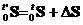   (2.2.12)

In this case, in relation to the displacement increment, the increment
of the Green-Lagrange strain is defined by the following equation.

  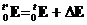   (2.2.13)
  ------------------------ ----------
  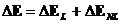   (2.2.14)
  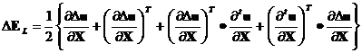   (2.2.15)
  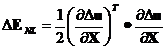   (2.2.16)

Equations (2.2.11)(2.2.12)(2.2.13)(2.2.14)(2.2.15) and (2.2.16)を、are
substituted with equations (2.2.6) and (2.2.7) to acquire the following
equation.

  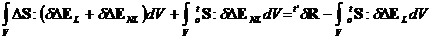   (2.2.17)
  ------------------------ ----------

Herein,  is assumed to be expressed as in the
following equation in connection with  and the
forth order tensor 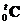.

     (2.2.18)
  ------------------------ ----------

Equation (2.2.17) is substituted with equation (2.2.18) and
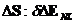 having two or more polynomials of Δu are omitted
to acquire the following equation.

  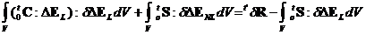   (2.2.19)
  ------------------------ ----------

Equation (2.2.19) is discretized by the finite element to acquire the
following equation.

     (2.2.20)
  ------------------------ ----------

Herein, 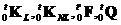 are the initial displacement matrix,
initial stress matrix, external force vector and internal force vector
respectively.

Therefore, the recurrence equation to acquire the time t’ status from
the time t status is given by the following equation.

Step1 : 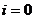

Step2 : 

Step3 : 

#### Formulation of Updated Lagrange Method

The principle equation of the virtual work at time t’ assuming the
current layout of time t is the reference, is given by the following
equation.

  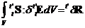   (2.2.21)
  ------------------------ ----------
  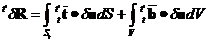   (2.2.22)

However,

  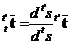   (2.2.23)
  ------------------------ ----------
  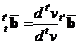   (2.2.24)

although tensor 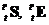 and vector
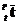, 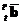 are using the current
layout of time t as the reference, the Green-Lagrange strain does not
include the initial displacement (displacement to time t)
;

     (2.2.25)
  ------------------------ ----------

however, the equation becomes as follows.

  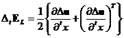   (2.2.26)
  ------------------------ ----------
  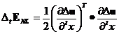   (2.2.27)

On the other hand,

  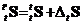   (2.2.28)
  ------------------------ ----------

since the equation becomes as above, when this is arranged by
substituting with equations (2.2.21) and (2.2.22), and equation
(2.2.25), the equation which must be solved is given as follows.

  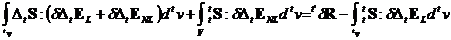   (2.2.29)
  ------------------------ ----------

In this case, 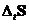 is assumed to be expressed as in
the following equation in connection with  and the
forth order tensor 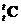.

  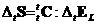   (2.2.30)
  ------------------------ ----------

This is substituted with equation (2.2.29) to acquire the following
equation.

  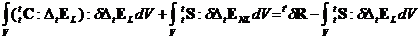   (2.2.31)
  ------------------------ ----------

Equation (2.2.31) is discretized by the finite element to acquire the
following equation.

  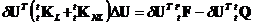   (2.2.32)
  ------------------------ ----------

Herein, 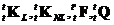 are the initial displacement matrix,
initial stress matrix, external force vector and internal force vector
respectively.

Therefore, the recurrence equation to acquire the time t’ status from
the time t status is given by the following equation.

Step1 : 

Step2 : 

Step3 : 

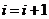

### Material Nonlinear Analysis Method

In this development code, 2 types of analysis, such as isotropic
hyperelasticity and the elastoplasticity can be performed for nonlinear
materials. When the material applicable for analysis is an elastoplastic
material, the updated Lagrange method is applied, and the total Lagrange
method is applied for hyperelastic material. Moreover, the
Newton-Raphson method is applied to the repetitive analysis method.

The outline of these constitutive equations of materials is shown in the
following.

#### Hyperelastic Material

The elastic potential energy in isotropic hyperelastic material can
acquire the isotropic response from the initial state without the
activation of stress. Therefore, the function of the main invariable of
the right Cauchy-Green deformation tensor
C$\mathbf{\ }\left( \mathbf{\ }\mathbf{I}_{\mathbf{1}}\mathbf{,}\mathbf{I}_{\mathbf{2}}\mathbf{,}\mathbf{I}_{\mathbf{3}}\mathbf{\ } \right)\mathbf{\ }$,
or the main invariable of the deformation tensor excluding the change in
volume
$\left( \mathbf{\ }{\overset{\overline{}}{\mathbf{I}}}_{\mathbf{1}}\mathbf{,\ \ }{\overset{\overline{}}{\mathbf{I}}}_{\mathbf{2}}\mathbf{,\ }{\overset{\overline{}}{\mathbf{I}}}_{\mathbf{3}}\mathbf{\ } \right)$,
can be expressed as
$\mathbf{\ W = W}\left( \mathbf{\ }\mathbf{I}_{\mathbf{1}}\mathbf{,\ }\mathbf{I}_{\mathbf{2}}\mathbf{,\ }\mathbf{I}_{\mathbf{3}} \right)\mathbf{\ }$,
or
$\mathbf{W = W}\left( \mathbf{\ }{\overset{\overline{}}{\mathbf{I}}}_{\mathbf{1}}\mathbf{,\ }{\overset{\overline{}}{\mathbf{I}}}_{\mathbf{2}}\mathbf{,\ }{\overset{\overline{}}{\mathbf{I}}}_{\mathbf{3}} \right)$.

The constitutive equation of hyperelastic material is defined by the
relationship between the 2nd Piola-Kirchhoff stress and the
Green-Lagrange strain, and the total Lagrange method is applied for the
deformation analysis.

The elastic potential energy W of the hyperelasticity model included in
this development code is listed in the following. If the elastic
potential energy W is known, the 2nd Piola-Kirchhoff stress and the
stress-strain relationship can be calculated as follows.

  $$S = 2\frac{\partial W}{\partial C}$$                (2.2.33)
  ----------------------------------------------------- ----------
  $$C = 4\frac{\partial^{2}W}{\partial C\partial C}$$   (2.2.34)

\(1) Neo Hookean Hyperelasticity Model

The Neo-Hookean hyperelasticity model is a material model with an
expanded linear rule (Hooke rule) having isotropy so that it can respond
to finite deformation problems. The elastic potential is as follows.

  $$W = C_{10}\left( {\overset{\overline{}}{I}}_{1} - 3 \right) + \frac{1}{D_{1}}\left( J - 1 \right)^{2}$$   (2.2.35)
  ----------------------------------------------------------------------------------------------------------- ----------

Herein, $\ C_{10}$ and $\ D_{1}\ $ are the material constants.

\(2) Mooney Rivlin Hyperelasticity Model

  $$W = C_{10}\left( {\overset{\overline{}}{I}}_{1} - 3 \right) + C_{01}\left( {\overset{\overline{}}{I}}_{2} - 3 \right) + \frac{1}{D_{1}}\left( J - 1 \right)^{2}$$   (2.2.36)
  --------------------------------------------------------------------------------------------------------------------------------------------------------------------- ----------

Herein, $\ C_{10,}\ C_{01}$ and $\ D_{1}\ $ are the material constants.

\(3) Arruda Boyce Hyperelasticity Model

  $$W = \mu\ \left\lbrack \ \frac{1}{2}\left( \ {\overset{\overline{}}{I}}_{1} - 3 \right) + \frac{1}{20\lambda_{m}^{2}}\ \left( \ {\overset{\overline{}}{I}}_{1}^{2} - 9 \right) + \frac{11}{1050\lambda_{m}^{2}}\left( \ {\overset{\overline{}}{I}}_{1}^{3} - 27 \right) + \frac{19}{7000\lambda_{m}^{2}}\left( \ {\overset{\overline{}}{I}}_{1}^{4} - 81 \right) + \frac{519}{673750\lambda_{m}^{2}}\left( \ {\overset{\overline{}}{I}}_{1}^{5} - 243 \right)\  \right\rbrack + \frac{1}{D}\left( \ \frac{J^{2} - 1}{2} - \ln J\  \right)$$   (2.2.37)
  ---------------------------------------------------------------------------------------------------------------------------------------------------------------------------------------------------------------------------------------------------------------------------------------------------------------------------------------------------------------------------------------------------------------------------------------------------------------------------------------------------------------------------------------------- ----------
  $$\mu = \frac{\mu_{0}}{1 + \frac{3}{5{\lambda_{m}}^{2}} + \frac{99}{175{\lambda_{m}}^{4}} + \frac{513}{875{\lambda_{m}}^{6}} + \frac{42039}{67375{\lambda_{m}}^{8}}}$$                                                                                                                                                                                                                                                                                                                                                                         (2.2.38)

Herein, $\ \mu$, $\lambda_{m}$ and $\text{\ D\ }$ are the material
constants.

#### Elastoplastic Material

In this development code, the elastoplasticity constitutive equation
according to the associated flow rule is applied. Moreover, the
constitutive equation expresses the relationship between the Jaumman
rate and the deformation rate tensor of the Kirchhoff stress, and the
updated Lagrange method is applied in the deformation analysis.

\(1) Elastoplastic Constitutive Equation

The yield criteria of an elasto-plastic solid is assumed to be given as
follows.

Initial Yield Criteria

  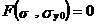   (2.2.39)
  ------------------------ ----------

Consecutive Yield Criteria

  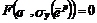   (2.2.40)
  ------------------------ ----------

Where,

*F*:　Yield function

σ~y0~: Initial yield stress,　　　　σ~y~: Consecutive yield stress

**σ**: Stress tensor,　　　 **e**: Infinitesimal strain tensor

$\text{\ \ \ \ \ \ \ \ \ }\mathbf{e}^{p}$: Plastic strain tensor,
${\overset{\overline{}}{e}}^{p}:$ Equivalent plastic strain

The yield stress-equivalent plastic strain relationship is assumed to
conform to the stress-plastic strain relationship in a single axis
state.

Stress-plastic strain relationship in a single axis state:

  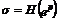   (2.2.41)
  ------------------------ ----------
  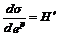   (2.2.42)

Equivalent stress-equivalent plastic strain relationship:

      (2.2.43)
  ------------------------- ----------
  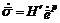   (2.2.44)

The consecutive yield function is generally a function of temperature
and plastic strain work. However, for simplification, the function is
only assumed to be the equivalent plastic strain 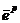
in this section. Since F=0 continues to be satisfied during the
progression of the plastic deformation, the following equation must be
established.

     (2.2.44)
  ------------------------- ----------

 in equation (2.2.44) expresses the time
derivative function of F, and the time derivative function of a certain
amount of A is expressed as  hereafter.

In this case, assuming the existence of plastic potentialΘ, the plastic
strain rate is expressed by the following equation.

     (2.2.45)
  ------------------------- ----------

Herein,  is the factor.

Furthermore, assuming that plastic potentialΘis equivalent to yield
function F, the associated flow rule is assumed as in the following
equation.

     (2.2.46)
  ------------------------- ----------

When this equation is substituted with equation (2.4.44), the following
equation can be acquired.

     (2.2.47)
  ------------------------- ----------

Where, **D** is the elastic matrix,

       (2.2.48)
  ------------------------------------------------------------------------- ----------

the stress-strain relational expression of the elastoplasticity can be
written as follows.

     (2.2.49)
  ------------------------- ----------

When the yield function (2.2.49) of an elastoplastic material is known,
the constitutive equation can be acquired from this equation.

\(1) Yield Function

The elastoplastic yield functions included in this development code are
listed in the following.

・Von Mises Yield Function

  $$F = \ \sqrt{3\mathbf{J}_{2}} - \sigma_{y} = 0$$   (2.2.50)
  --------------------------------------------------- ----------

・Mohr-Coulomb Yield Function

  $$F = \ \sigma_{1} - \sigma_{3} + \ \left( \ \sigma_{1} + \sigma_{3}\  \right)\sin\phi - 2\ c\cos\phi = 0$$   (2.2.51)
  ------------------------------------------------------------------------------------------------------------- ----------

・Drucker-Prager Yield Function

  $$F = \ \sqrt{\mathbf{J}_{2}} - \ \alpha\ \mathbf{\sigma}\ :\mathbf{I} - \sigma_{y} = 0$$   (2.2.52)
  ------------------------------------------------------------------------------------------- ----------

In this case, material constant α and σ~y~ are calculated as follows
from the viscosity and friction angle of the material.

  $$\alpha = \frac{2\sin\phi}{3 + \sin\phi}\ \ ,\ \ \ \ \ \ \ \ \sigma_{y} = \frac{6\ c\cos\phi}{3 + \sin\phi}$$   (2.2.53)
  ---------------------------------------------------------------------------------------------------------------- ----------

#### Viscoelastic Material

A generalized Maxwell model is applied in this development code. As
shown in the following, the constitutive equation becomes a function of
deviatoric strain **e** and deviatoric viscosity strain **q**.

  > $\mathbf{\sigma}\ \left( \text{\ t\ } \right) = \ Ktr\mathbf{\varepsilon I +}2G\left( \mu_{0}\mathbf{e} + \mu\mathbf{q} \right)$   (2.2.54)
  ------------------------------------------------------------------------------------------------------------------------------------ ----------

Which becomes,

  > $\mu\mathbf{q =}\sum_{\mathbf{m = 1}}^{\mathbf{M}}\mu_{\mathbf{m}}\mathbf{q}^{\mathbf{(m)}}\mathbf{;\ \ \ \ \ \ \ \ }\sum_{\mathbf{m = 0}}^{\mathbf{M}}\mu_{\mathbf{m}}\mathbf{=}1$   (2.2.55)
  --------------------------------------------------------------------------------------------------------------------------------------------------------------------------------------- ----------

Moreover, q can be calculated from the following equation.

  $${\dot{\mathbf{q}}}^{(m)} + \frac{1}{\lambda_{m}}\mathbf{q}^{\left( m \right)} = \dot{\mathbf{e}}$$   (2.2.56)
  ------------------------------------------------------------------------------------------------------ ----------

Herein, $\lambda_{m}$ is the relaxation. Relaxation factor G is
expressed by the following Prony series.

  $$\text{\ \ \ \ \ \ \ G\ }\left( \text{\ t\ } \right) = \ G\left\lbrack \mu_{0} + \sum_{i = 1}^{M}{\mu_{m}\exp\left( \frac{- t}{\lambda_{m}\ } \right)} \right\rbrack$$   (2.2.57)
  ------------------------------------------------------------------------------------------------------------------------------------------------------------------------- ----------

#### Creep Material

Time dependent displacement under constant stress conditions is a
phenomenon called "creep". The viscoelasticity behavior mentioned above
can also be considered as a type of linear creep phenomenon. Several
types of nonlinear creeping are described in this section. The method to
form the constitutive equation by adding to the strain generated
momentarily is generally used for this phenomenon, and the strain while
a certain constant load is continued, is assumed to be creep
strain$\mathbf{\ }\mathbf{\varepsilon}^{c}\ $. The creep strain rate
 which is defined as a function of the stress and
overall creep strain, is generally used in the constitutive equation in
consideration of the creep.

  $${\dot{\mathbf{\varepsilon}}}^{c} \equiv \frac{\partial\mathbf{\varepsilon}^{c}}{\partial t} = \mathbf{\beta}\ \left( \ \mathbf{\sigma},\ \mathbf{\varepsilon}^{c}\  \right)$$   (2.2.58)
  --------------------------------------------------------------------------------------------------------------------------------------------------------------------------------- ----------

In this case, assuming the strain generated momentarily is the elastic
strain $\ \mathbf{\varepsilon}^{e}\ $, the overall strain can be
expressed as in the following equation where the creep strain is added.

  $$\mathbf{\varepsilon} = \mathbf{\varepsilon}^{e} + \ \mathbf{\varepsilon}^{c}$$   (2.2.59)
  ---------------------------------------------------------------------------------- ----------

Which becomes,

  $$\mathbf{\varepsilon}^{e} = {\mathbf{c}^{e}}^{- 1}\ :\mathbf{\sigma}$$   (2.2.60)
  ------------------------------------------------------------------------- ----------

As mentioned in the above plastic material, the time integration method
for the numerical analysis must be indicated for the constitutive
equation which indicates the creep. The constitutive equation when creep
is taken into consideration is,

  $$\mathbf{\sigma}_{n + 1} = \mathbf{c}\ :\ \left( \ \mathbf{\varepsilon}_{n + 1} - \mathbf{\varepsilon}_{n + 1}^{c}\  \right)$$   (2.2.61)
  --------------------------------------------------------------------------------------------------------------------------------- ----------
  $$\mathbf{\varepsilon}_{n + 1}^{c} = \mathbf{\varepsilon}_{n}^{c} + \ \Delta\text{t\ }\mathbf{\beta}_{n + \theta}$$               (2.2.62)

where, $\ \mathbf{\beta}_{n + \theta}\ $ becomes as follows.

  $$\mathbf{\beta}_{n + \theta} = \left( \ 1 - \theta\  \right)\ \mathbf{\beta}_{n} + \theta\ \mathbf{\beta}_{n + 1}$$   (2.2.63)
  ---------------------------------------------------------------------------------------------------------------------- ----------

Moreover, the creep strain increment  is assumed
to be a simplified nonlinear equation.

  $$\mathbf{R}_{n + 1} = \mathbf{\varepsilon}_{n + 1} - \ \mathbf{c}^{- 1}\ :\mathbf{\sigma}_{n + 1} - \ \mathbf{\varepsilon}_{n}^{c} - \ \Delta\text{t\ }\mathbf{\beta}_{n + \theta} = \mathbf{0}$$   (2.2.64)
  ---------------------------------------------------------------------------------------------------------------------------------------------------------------------------------------------------- ----------

In the iterative calculation of the Newton-Raphson method, the following
equation is used for the iterative solution and the increment solution
as an incremental strain where the initial value is calculated
by$\ \mathbf{\sigma}_{n + 1} = \mathbf{\sigma}_{n}\ $ and the finite
element method.

  $$\mathbf{R}_{n + 1}^{(k + 1)} = \mathbf{0} = \ \mathbf{R}_{n + 1}^{(k)} - \ \left( \ \mathbf{c}^{- 1} + \Delta\text{t\ }\mathbf{c}_{n + 1}^{c}\  \right)\text{\ d}\mathbf{\sigma}_{n + 1}^{(k)}$$   (2.2.65)
  ---------------------------------------------------------------------------------------------------------------------------------------------------------------------------------------------------- ----------

Which becomes,

  $$\mathbf{c}_{n + 1}^{c} = \left. \ \ \frac{\partial\mathbf{\beta}}{\partial\mathbf{\sigma}}\  \right|_{n + \theta} = \theta\left. \ \frac{\partial\mathbf{\beta}}{\partial\mathbf{\sigma}}\  \right|_{n + 1}$$   (2.2.66)
  ----------------------------------------------------------------------------------------------------------------------------------------------------------------------------------------------------------------- ----------

When the solution of equation (2.2.66) and equation (2.2.67) are used to
perform the iterative solution method until the
residual$\ \mathbf{R}\ $becomes$\ \mathbf{0}\ $,
stress$\mathbf{\ }\mathbf{\sigma}_{n + 1}\mathbf{\ }$and the tangent
tensile modulus are used.

  $$\mathbf{c}_{n + 1}^{*} = \left\lbrack \ \mathbf{c}^{- 1} + \Delta\text{t\ }\mathbf{c}_{n + 1}^{c}\  \right\rbrack^{- 1}$$   (2.2.67)
  ----------------------------------------------------------------------------------------------------------------------------- ----------

As a detailed equation of equation (2.2.57), the following Norton model
is applied in this development code. In the constitutive equation, the
equivalent clip strain ${\dot{\varepsilon}}^{\text{cr}}$ as in the
following equation expresses the function of the Mises stress q and time
t.

  $${\dot{\varepsilon}}^{\text{cr}} = Aq^{n}t^{m}$$   (2.2.68)
  --------------------------------------------------- ----------

Herein, A, m and n are the material constants.

### Contact Analysis Method

When two objects are in contact, the contact force **t~c~** is
transmitted via the contact surface. The principle equation (2.2.4) of
the virtual work can be rewritten as follows.

     (2.2.69)
  ------------------------- ----------

In this case, Sc expresses the contact area, and **u**^(1)^ and
**u**^(2)^ express the displacement of contact object 1 and contact
object 2 respectively.

In the contact analysis, the surfaces which may contact are specified in
a pair. One of these surfaces is called the master surface, and the
other surface is the slave surface. In this master slave analysis
method, the contact restriction conditions are assumed as follows.

1)  The slave node does not penetrate the master surface.

2)  When there is contact, the slave node becomes the contact position,
    and the master surface and the slave surface mutually transmit the
    contact force and the frictional force through this point
    of contact.

     (2.2.70)
  ------------------------- ----------

The last term of equation (2.2.54) is discretized by the finite element
to acquire the following equation.

In this case, **K**~c~ and **F**~c~ express the contact rigid matrix and
contact force respectively. When this equation is substituted with
equation (2.2.20) or (2.2.32), the finite element method of the total
Lagrange method and the updated Lagrange method in consideration of the
contact restraint becomes as follows.

     (2.2.71)
  ------------------------- ----------
     (2.2.72)

This development software allows for contact deformation analysis
between deformable bodies, and the following analysis functions can be
selected by the user.

・　Infinitesimal sliding contact problem: This analysis assumes that
there is no position change of the point of contact.

・　Limited sliding contact problem: This analysis can be used when
there is a change of the point of contact accompanying the deformation.

・　Frictionless contact problem

・　Friction contact problem: This analysis supports the Coulomb
friction rule.

However, when the infinitesimal deformation linear elastic analysis is
selected, it becomes an infinitesimal sliding frictionless problem.

Moreover, it only corresponds to the contact analysis of a linear solid
element (element numbers 341,351,361) at present.
