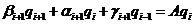

## Eigenvalue Analysis

### Generalized Eigenvalue Problem

When conducting a free oscillation analysis of the continuum, spatial
discretization is performed, and a model is created with the multi
degrees of freedom system by a central mass point as shown in Figure
2.3.1. In the case of the free oscillation problem without attenuation,
the governing equation (equation of motion) is as follows.

     (2.3.1)
  ------------------------- ---------

However, **u** is the generalized displacement vector, **M** is the mass
matrix and **K** is the stiffness matrix. Now, the function is defined
assuming the natural angular frequency as *ω*, *a* and *b* as the
arbitrary constants, and **x** as the vector as follows.

     (2.3.2)
  ------------------------- ---------

Herein, when this equation and this second order differential,

     (2.3.3)
  ------------------------- ---------

is substituted with equation (2.3.1), it will become as follows.

     (2.3.4)
  ------------------------- ---------

Which becomes,

     (2.3.5)
  ------------------------- ---------

That is to say, if factor λ (= ω ^2^) and vector **x** which satisfies
equation (2.3.5) can be found, function **u**(t) becomes the solution of
equation (2.3.1). Factor λ is called the eigenvalue, vector **x** is
called the eigenvector, and the problem in which these values are
calculated by equation (2.3.1) is called the generalized eigenvalue
problem.

{width="4.593167104111986in"
height="0.9520002187226597in"}

Figure 2.3.1:　Example of Multi Degrees of Freedom System

of Free Oscillation without Attenuation

### Problem Settings

Equation (2.3.5) can be expanded to arbitrary order frequencies, and
appears in many situations. In order to handle many physical problems,
there are many cases where the matrix is Hermitian (symmetrical). Thus,
in a complex matrix, the transposed matrix is transposed into a
conjugate complex number, and a symmetric matrix in the real matrix.
That is to say, when the ij component of matrix *K* is assumed to be
*k~ij~*, if the conjugate complex number of *k* is transposed to
, the relationship becomes as in the following
equation.

     (2.3.6)
  ------------------------- ---------

In this manual, the matrix is symmetrical, and assumes a positive
definite. Positive definite means that all the eigenvalues are positive,
in other words, it refers to a matrix which always satisfies the
following equation (2.3.7).

     (2.3.7)
  ------------------------- ---------

### Shifted Inverse Iteration Method

In the structural analysis by the finite element method, all the
eigenvalues are not required in practical use, and there are many cases
where an extensive number of low order eigenvalues is sufficient. Now,
the handling of large-scale problems is assumed in HEC-MW, and the size
of the matrix is large and extremely sparse (many zero elements).
Therefore, considering this fact, it is important to efficiently
calculate the eigenvalues of the low order modes.

When the lower limit of the eigenvalue is set toσ, equation (2.3.5) is
deformed as in the following equation (mathematically equivalent
equation).

     (2.3.8)
  ------------------------- ---------

In this case, there are the following convenient characteristics for
calculation.

(1) The mode is reversed.

(2) The eigenvalue around *ρ* is maximized.

In actual calculations, there are many cases where the maximum
eigenvalue is calculated first. For this reason, the main convergence
calculation is applied to equation (2.3.8), rather than equation
(2.3.5), aiming to calculate from the eigenvalues around ρ. This method
is called the shifted inverse iteration.

### Algorithm to Solve Eigenvalues

The Jacobi method is well known as a classic method. This method is
effective when the size of the matrix is small and dense. However, since
large-scale and sparse matrices are handled by HEC-MW, this method is
not used, and the Lanczos iterative solution method is adopted.

### Lanczos Method

This method was proposed by C. Lanczos in the 1950s, and is a
calculation algorithm which performs tridiagonalization of matrices, and
has the following features.

(1) This is an iterative convergence solution, where calculations can be
    advanced with sparse matrices.

(2) The algorithm is mainly structured with matrix and vector products,
    and is suitable for parallelization.

(3) This is suitable for the geometric domain decomposition method (DDM)
    accompanying the finite element mesh.

(4) The number of the eigenvalues to be calculated and the mode range
    can be restricted, and efficient calculations can be performed.

The Lanczos method is for performing calculations to acquire the base of
partial spaces, by sequentially creating orthogonal vectors starting
from the initial vector. This method is said to be faster than the sub
space method which is another iterative solution method, and is
extensively used in the finite element method program. However, this
method is easily affected by errors of the calculator, which impairs the
orthogonality of the vector, and the risks of failing in the middle can
not be avoided. Therefore, it is essential to take measure against
errors.

### Geometric Meaning in the Lanczos Method

Transforming the variables of equation (2.3.8) as follows,

     (2.3.9)
  ------------------------- ---------

to rewrite the problem, the following equation can be acquired.

     (2.3.10)
  ------------------------- ----------

The linear transformation with matrix **A** is performed for proper
vector **qo** (refer to Figure 2.3.2).

Figure 2.3.2:　Linear Transformation of **q**~0~ with Matrix **A**

The transformed vector is orthogonalized in the space created with the
original vector. Thus, as in Figure 2.3.2 the so called Gram-Schmidt
orthogonalization is performed. The vector acquired in such a way, is
normalized as **r**~1~ (to length 1), to acquire **q**~1~ (Figure
2.3.3). **q**~2~ is acquired from **q**~1~ with the same algorithm. At
this time, **q**~2~ is orthogonal to both **q**~1~ and **q**~0~ (Figure
2.3.4). When the same calculation is continued, the mutually orthogonal
vectors can be acquired up to the order frequency of the maximum matrix.

Figure 2.3.3:　Vector **q**~1~ Orthogonal to **q~o~**

Figure 2.3.4:　Vector **q**~2~ Orthogonal to **q**~1~ and **q~o~**

Particularly, the algorithm of the Lanczos method is the Gram-Schmidt
orthogonalization for column vectors {**Aq**~o~, **A^2^q~o~,A^3^q~o~, …
, A^n^q~o~**} rephrased from {**Aq~o~, Aq~1~, Aq~2~, …**}. This column
vector is called the columns of Krylov, and the space created by this is
called the Krylov subspace. When the Gram-Schmidt orthogonalization is
performed in this space, the vectors can be acquired using the two
nearest vectors. This is called the principle of Lanczos.

### Tridiagonalization

While repeating the above calculation, the i + 1th calculation can be
expressed as follows.

     (2.3.11)
  ------------------------- ----------

However,

     (2.3.12)
  ------------------------- ----------

When the above equation is indicated in the matrix, it becomes as
follows.

     (2.3.13)
  ------------------------- ----------

Which becomes,

     (2.3.14)
  ------------------------- ----------

Thus, the eigenvalue can be acquired by performing the eigenvalue
calculation for the tridiagonal matrix acquired by equation (2.3.13).
