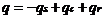
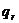
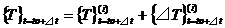

## Heat Conduction Analysis

The heat conduction analysis method for solids by the finite element
method used in this development code is shown in the following.

### Basic Equation

The heat conduction equation during the continuum is as follows.

     (2.4.1)
  ------------------------- ---------

However,

　　　　　　　Mass (Density)

 　　　　　　Specific heat

 　　　　　　Temperature

　　　　　　Thermal conductivity

　　　　　Calorific value

Herein,  expresses the position,
 is the temperature and 
is the time.

The area being considered is  and the periphery
is . When assuming the boundary conditions of
either the Dirichet type or the Neumann type is given everywhere on
, the boundary conditions become as follows.

     (2.4.2)
  ------------------------- ---------
     (2.4.3)

However, the function form , q is already known.
ｑ is the heat flux outflow from the boundary. Three types of heat flux
can be considered in this program.

     (2.4.4)
  ------------------------- ---------
     (2.4.5)
     (2.4.6)
     (2.4.7)

 is the distributed heat flux,
 is the heat flux by the convective heat
transfer, and  is the heat flux by the radiant
heat transfer.

However,

 Convective heat transfer coefficient ambient
temperature

 Convective heat transfer factor

 Radiant heat transfer coefficient ambient
temperature

 Radiant heat transfer factor

ε: Radiant rate, σ: Stefan-Boltzmann constant, :
Shape factor

### Discretization

When equation (2.4.1) is discretized by the Galerkin method, it becomes
as follows.

     (2.4.8)
  ------------------------- ---------

However,

  ---------------------------------------------------
                    (2.4.9)

                    
  ---------------------------------------- ----------
                    (2.4.10)

                    (2.4.11)

                    

  : Form function   (2.4.12)
  ---------------------------------------------------

Equation (2.4.8) is a nonlinear and unsteady equation. Now, when the
time is discretized by the backward Euler's rule and the temperature at
time  is already known, the temperature at
 is calculated using the following equation.

     (2.4.13)
  ------------------------- ----------

The acquisition of a solution with better
accuracy, is considered by improving the
temperature vector  which satisfies the
approximation of equation (2.4.13).

Therefore, first, the temperature vector is expressed as follows.

     (2.4.14)
  ------------------------- ----------

The product of the heat conduction matrix and temperature vector, mass
matrix and etc. are expressed in approximation as in the following
equation.

  ------------------------------------
     (2.4.15)

     
  ------------------------- ----------
     (2.4.16)
  ------------------------------------

When equations (2.4.14) (2.4.15) and (2.4.16) are substituted with
equation (2.4.13) and two or more polynomials are omitted, the following
equation can be acquired.

  ------------------------------------
     (2.4.17)

     
  ------------------------- ----------
  ------------------------------------

Furthermore, an approximation evaluation is performed for the left
factor matrix using the following equation.

  ------------------------------------
     (2.4.18)

     
  ------------------------- ----------
  ------------------------------------

In this case, is the tangent stiffness matrix.

Finally, the temperature at time  can be
calculated by performing an iterative calculation using the following
equation.

  ------------------------------------
     (2.4.19)

     

     
  ------------------------- ----------
  ------------------------------------

Particularly, in the analysis for a steady state, the following equation
is used to perform the iterative calculation.

  ------------------------------------
     (2.4.20)

     
  ------------------------- ----------
  ------------------------------------

Since an implicit method is used for the discretization regarding the
time to select time increment ⊿ｔ in the unsteady state analysis,
generally, there are no concerns in the restrictions of the size.
However, if time increment ⊿ｔ is too large, the convergence frequency
will increase in the iterative calculation. Therefore, this program is
equipped with an automatic increment function to always monitor the size
of the residual vectors during the iterative calculation process, and if
the convergence of the iterative calculation is too slow, time increment
⊿ｔ is decreased, and if the iterative calculation frequency decreases,
time increment ⊿ｔ is increased.
