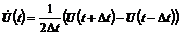
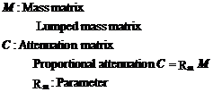

## Dynamic Analysis Method

The dynamic problem analysis method with direct time integration applied
is described in this section. As shown in the following, time history
response analysis with an implicit method and explicit method can be
performed in this development code.

### Formulation of Implicit Method

Direct time integration is applied to the solution of the equation of
motion as shown in the following equation, targeting dynamic problems.

  $$\mathbf{M}\left( t + \Delta t \right)\ddot{\mathbf{U}}(t + \Delta t) + \mathbf{C}\left( t + \Delta t \right)\dot{\mathbf{U}}(t + \Delta t) + \mathbf{Q}\left( t + \Delta t \right) = \mathbf{F}\left( t + \Delta t \right)$$   (2.5.1)
  -------------------------------------------------------------------------------------------------------------------------------------------------------------------------------------------------------------------------------- ---------

Herein, **M** and **C** is the mass matrix and attenuation matrix, and
**Q** and **F** are the internal force vector and external force vector.
In addition, the change of mass is not considered in this software, and
the mass matrix becomes constant regardless of the deformation in
non-linearity.

The displacement within time increment Δｔ, and the change of rate and
acceleration are approximated as shown in equation (2.5.2) and equation
(2.5.3) using the Newmark-β method.

  $$\dot{\mathbf{U}}\left( t + \Delta t \right) = \frac{\gamma}{\text{βΔ}t}\Delta\mathbf{U}\left( t + \Delta t \right) - \frac{\gamma - \beta}{\beta}\dot{\mathbf{U}}\left( t \right) - \Delta t\frac{\gamma - 2\beta}{2\beta}\ddot{\mathbf{U}}(t)$$   (2.5.2)
  ---------------------------------------------------------------------------------------------------------------------------------------------------------------------------------------------------------------------------------------------------- ---------
  $$\ddot{\mathbf{U}}(t + \Delta t) = \frac{1}{\text{βΔ}t^{2}}\Delta\mathbf{U}(t + \Delta t) - \frac{1}{\text{βΔ}t}\dot{\mathbf{U}}(t) - \frac{1 - 2\beta}{2\beta}\ddot{\mathbf{U}}(t)$$                                                               (2.5.3)

As it is already known, when γ andβare substituted into the following
values, it will match the linear acceleration method, or the trapezoid
rule.

γ=1/2、β=1/6 (Linear acceleration method)

γ=1/2、β=1/4 (Trapezoid rule)

When equation (2.5.2) and equation (2.5.3) are substituted with equation
(2.5.1), the following equation can be acquired.

  $$\left( \frac{1}{\text{βΔ}t^{2}}\mathbf{M} + \frac{\gamma}{\text{βΔ}t}\mathbf{C} + \mathbf{K} \right)\Delta\mathbf{U}\left( t + \Delta t \right) = \mathbf{F}\left( t + \Delta t \right) - \mathbf{Q}\left( t + \Delta t \right) + \frac{1}{\text{βΔ}t}\mathbf{M}\dot{\mathbf{U}}\left( t \right) + \frac{1 - 2\beta}{2\beta}\mathbf{M}\ddot{\mathbf{U}}\left( t \right) + \frac{\gamma - \beta}{\beta}\mathbf{C}\dot{\mathbf{U}}\left( t \right) + \Delta t\frac{\gamma - 2\beta}{2\beta}\mathbf{C}\ddot{\mathbf{U}}(t)$$   (2.5.4)
  ----------------------------------------------------------------------------------------------------------------------------------------------------------------------------------------------------------------------------------------------------------------------------------------------------------------------------------------------------------------------------------------------------------------------------------------------------------------------------------------------------------------------------- ---------

Particularly, when **K**~L~ is assumed as the linear stiffness matrix
for a linear problem, the equation becomes
$\mathbf{Q}\left( t + \Delta t \right) = \mathbf{K}_{L}\mathbf{U}(t + \Delta t)$.
When this equation is substituted with the above equation, the following
equation can be acquired.

     (2.5.5)
  ------------------------- ---------

In addition, in locations where the acceleration is specified as a
geometric boundary condition, the displacement of the following equation
can be acquired from equation (2.5.2).

     (2.5.6)
  ------------------------- ---------

Similarly, in locations where the rate is specified, the displacement of
the following equation can be acquired from equation (2.76).

     (2.5.7)
  ------------------------- ---------

Where,

The handling of the mass terms and the attenuation terms are as follows.

##### Handling of Mass Term

Regarding mass matrices, it is handled as lumped mass matrices as a
general rule.

##### Handling of Attenuation Term

Regarding the attenuation term, it is handled as the Rayleigh
attenuation expressed in equation (2.5.8).

     (2.5.8)
  ------------------------- ---------

### Formulation of Explicit Method

The equation of motion at time t shown in the following equation is used
as a reference in the explicit method.

  $$\mathbf{M}\ddot{\mathbf{U}}(t) + \mathbf{C}\left( t \right)\dot{\mathbf{U}}(t) + \mathbf{Q}\left( t \right) = \mathbf{F}\left( t \right)$$   (2.5.9)
  ---------------------------------------------------------------------------------------------------------------------------------------------- ---------

In this case, when the displacement at time t+Δt and time t-Δt is
expressed by the Taylor expansion at time t, and is taken to the second
polynomial regardingΔt, the equation becomes as follows.

     (2.5.10)
  ------------------------- ----------
     (2.5.11)

The following equation can be acquired from the difference and sum of
equation (2.83) and equation (2.84).

     (2.5.12)
  ------------------------- ----------
     (2.5.13)

When equation (2.5.12) and equation (2.5.13) are substituted with
equation (2.5.9), the following equation can be acquired.

  $$\left( \frac{1}{\Delta t^{2}}\mathbf{M} + \frac{1}{2\Delta t}\mathbf{C} \right)\mathbf{U}\left( t + \Delta t \right) = \mathbf{F}(t) - \mathbf{Q}(t) - \frac{1}{\Delta t^{2}}\mathbf{M\lbrack}2\mathbf{U}\left( t \right)\mathbf{-}\mathbf{U}\left( t - \Delta t \right)\rbrack - \frac{1}{2\Delta t}\mathbf{\text{CU}}(t - \Delta t)$$   (2.5.14)
  ------------------------------------------------------------------------------------------------------------------------------------------------------------------------------------------------------------------------------------------------------------------------------------------------------------------------------------------- ----------

Particularly, the equation becomes
$\mathbf{Q}\left( t \right) = \mathbf{K}_{L}\mathbf{U}(t)$ for a linear
problem, and the above equation becomes as follows.

  $$\left( \frac{1}{\Delta t^{2}}\mathbf{M} + \frac{1}{2\Delta t}\mathbf{C} \right)\mathbf{U}\left( t + \Delta t \right) = \mathbf{F}(t) - \mathbf{K}_{L}\mathbf{U}(t) - \frac{1}{\Delta t^{2}}\mathbf{M\lbrack}2\mathbf{U}\left( t \right)\mathbf{-}\mathbf{U}\left( t - \Delta t \right)\rbrack - \frac{1}{2\Delta t}\mathbf{C}(t - \Delta t)\mathbf{U}$$   (2.5.15)
  ----------------------------------------------------------------------------------------------------------------------------------------------------------------------------------------------------------------------------------------------------------------------------------------------------------------------------------------------------------- ----------

In this case, when the mass matrix and the attenuation matrix are set as
follows, problem solving operations of simultaneous equations is not
required in equation (2.5.15).

     (2.5.16)
  ------------------------- ----------

Therefore, from equation (2.5.15), **U**(t+Δt) can be calculated by the
following equation.

  $$\mathbf{U}\left( t + \Delta t \right) = \frac{1}{\left( \frac{1}{\Delta t^{2}}\mathbf{M} + \frac{1}{2\Delta t}\mathbf{C} \right)}\left\{ \mathbf{F}(t) - \mathbf{Q}(t) - \frac{1}{\Delta t^{2}}\mathbf{M\lbrack}2\mathbf{U}\left( t \right)\mathbf{-}\mathbf{U}\left( t - \Delta t \right)\rbrack - \frac{1}{2\Delta t}\mathbf{C}(t - \Delta t)\mathbf{U} \right\}$$   (2.5.17)
  ------------------------------------------------------------------------------------------------------------------------------------------------------------------------------------------------------------------------------------------------------------------------------------------------------------------------------------------------------------------------ ----------
