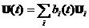
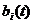
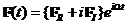
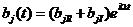
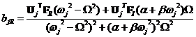
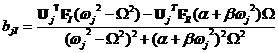

## Frequency Response Analysis

### Formulation

When damping is not considered, the equatios of motion for natural
frequency analysis are given by

  $\mathbf{M}\ \ddot{\mathbf{U}} + \mathbf{\text{KU}} = \mathbf{0}$**.**   (2.6.1)
  ------------------------------------------------------------------------ ---------

In the frequency domain, the solution of Eq. (2.6.1) can be expressed by

  $\mathbf{U} = \mathbf{U}_{j}e^{i\omega_{j}t}$.   (2.6.2)
  ------------------------------------------------ ---------

Substituting Eq. (2.6.2) into Eq. (2.6.1) gives

  $\mathbf{K}\mathbf{U}_{j} = \omega_{j}^{2}\mathbf{M}\mathbf{U}_{j}$.   (2.6.3)
  ---------------------------------------------------------------------- ---------

The following derivation shows that the natural frequency is a real
value. Substituting $\omega_{j}^{2} = \lambda_{j}$ into Eq. (2.6.3) and
complex conjugates are given by

  --------------------------------------------------------------------------------------------------------------------------------------------------
  $$\mathbf{K}\ \mathbf{U}_{j} = \lambda_{j}\mathbf{M}\mathbf{U}_{j}$$                                                                     (2.6.4)

  $\mathbf{K}\overset{\overline{}}{\mathbf{U}_{j}} = \overset{\overline{}}{\lambda_{j}}\mathbf{M}\overset{\overline{}}{\mathbf{U}_{j}}$.   
  ---------------------------------------------------------------------------------------------------------------------------------------- ---------
  --------------------------------------------------------------------------------------------------------------------------------------------------

Multiplying Eq. (2.6.4) by ${\overset{\overline{}}{\mathbf{U}_{j}}}^{T}$
gives

  ---------------------------------------------------------------------------------------------------------------------------------------------------------------------------------------
  $$\mathbf{U}_{j}^{T}\mathbf{K}\overset{\overline{}}{\mathbf{U}_{j}} = \overset{\overline{}}{\lambda_{j}}\mathbf{U}_{j}^{T}\mathbf{M}\overset{\overline{}}{\mathbf{U}_{j}}$$   (2.6.5)

  ${\overset{\overline{}}{\mathbf{U}_{j}}}^{T}\mathbf{K}\mathbf{U}_{j} = {\lambda_{j}\overset{\overline{}}{\mathbf{U}_{j}}}^{T}\mathbf{M}\mathbf{U}_{j}$.                       
  ----------------------------------------------------------------------------------------------------------------------------------------------------------------------------- ---------
  ---------------------------------------------------------------------------------------------------------------------------------------------------------------------------------------

Accordingly, we get

  $0 = \left( \lambda_{j} - \overset{\overline{}}{\lambda_{j}} \right){\overset{\overline{}}{\mathbf{U}_{j}}}^{T}\mathbf{M}\mathbf{U}_{j}$.   (2.6.6)
  ------------------------------------------------------------------------------------------------------------------------------------------- ---------

Since mass matrix is a positive definite, we have the following relation
for non-zero eigen vector.

  $$\overset{\overline{}}{\mathbf{U}_{j}}\ \mathbf{M}\mathbf{U}_{j}\  > 0$$   (2.6.7)
  --------------------------------------------------------------------------- ---------

Consequently, we get

  $\lambda_{j} = \overset{\overline{}}{\lambda_{j}}$.   (2.6.8)
  ----------------------------------------------------- ---------

It also gives that $\omega_{j}^{2} = \lambda_{j}$ is a real value. Let
us consider two distinct eigenvalues.

  -------------------------------------------------------------------------------------------
  $$\mathbf{K}\mathbf{U}_{i} = \lambda_{i}\ \mathbf{\text{M\ }}\mathbf{U}_{i}$$     (2.6.9)

  $$\mathbf{K}\mathbf{U}_{j}\  = \lambda_{j}\ \mathbf{\text{M\ }}\mathbf{U}_{j}$$   
  --------------------------------------------------------------------------------- ---------
  -------------------------------------------------------------------------------------------

From Eq. (2.6.9), we get

  $\left( \lambda_{i} - \lambda_{j} \right)\mathbf{U}_{j}^{T}\mathbf{M}\mathbf{U}_{i} = 0$.   (2.6.10)
  ------------------------------------------------------------------------------------------- ----------

In case the eigen values are distinct, we get

  $\mathbf{U}_{j}^{T}\mathbf{\text{M\ }}\mathbf{U}_{i} = 0$.   (2.6.11)
  ------------------------------------------------------------ ----------

which means that the eigenvectors are said to be orthonormal with
respsect to the mass matrix. For the same eigenvectors, it can be easily
handled by normalizing with respect to the mass matrix as shown by

  $\mathbf{U}_{i}^{T}\ \mathbf{M}\mathbf{U}_{i}\  = 1$.   (2.6.12)
  ------------------------------------------------------- ----------

In the next derivation, we formulate the case considering a damping
matrix in the equations of motion.

     (2.6.13)
  ------------------------- ----------

Here we uses Rayleigh damping and the damping matrix can be obtained by

  .   (2.6.14)
  -------------------------- ----------

By using the eigenvector obtained by eigenvalue analysis, the
displacement in time domain can be expressed by

  .   (2.6.15)
  -------------------------- ----------

Now, we determine  in case the external forces is
a harmonic function.

     (2.6.16)
  ------------------------- ----------

Eq. (2.6.13) can be considered forced vibration

     (2.6.17)
  ------------------------- ----------

The real and imaginary parts of  are given by

  , and   (2.6.18)
  ------------------------------ ----------
  .       (2.6.19)

References

> ・Hisada, Noguchi: *Foundations and Applications of Nonlinear Finite
> Element Method*, Maruzen, 1995 (in Japanese)

・O.C.Zienkiewicz, R.L.Taylor: *The Finite Element Method*, 6^th^ Ed.,
Vol.2: McGraw-Hill, 2005

> ・JSME Computational Mechanics Handbook (Vol.I) *Finite Element Method
> (Structure Ver.)*, Japan Society of Mechanical Engineers, 1998 (in
> Japanese)
>
> ・Kyuichiro Washizu, Hiroshi Miyamoto, Yoshiaki Yamada, Yoshiyuki
> Yamamoto, Tadahiko Kawai: *A Handbook of Finite Element Method*, (I
> Theory), BAIFUKAN, 1982 (in Japanese)
>
> ・Masatake Mori, Masaaki Sugihara, Kazuo Murota: *Linear Computation*,
> Iwanami Shoten, 1994 (in Japanese)

・Lois Komzsik: *The Lanczos Method Evolution and Application*: Siam,
2003.

> ・Hayato Togawa: *Vibration Analysis by Finite Element Method*,
> SAIENSU-SHA Co., Ltd., 1997 (in Japanese)
>
> ・Genki Yagawa, Noriyuki Miyazaki: *Thermal Stress, Creep and Heat
> Transfer Analysis by Finite Element Method*, SAIENSU-SHA Co., Ltd.,
> 1985 (in Japanese)
