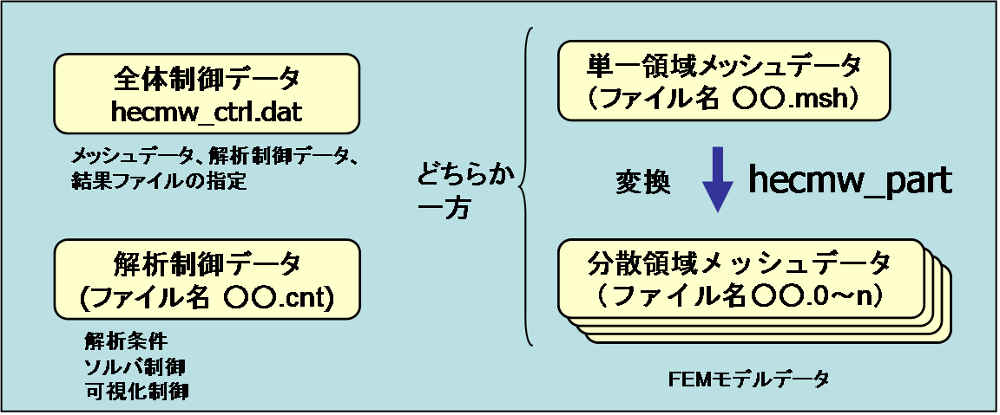
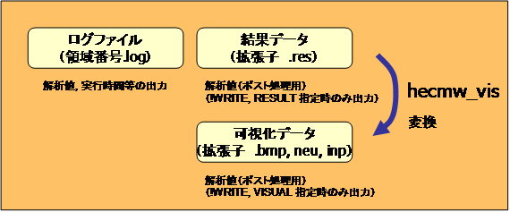

# Analysis Flow and Input/Output File

## Analysis Flow

The input and output file of the structural analysis code FrontISTR is
shown in Figure 3.1.1.

{width="5.945138888888889in"
height="2.4722222222222223in"}

\(a) Input File

{width="5.945138888888889in"
height="2.4722222222222223in"}

\(b) Output File

Figure 3.1.1: FrontISTR Input/Output File

FrontISTR requires three files, such as the overall control data, mesh
data and analysis control data as input files. When analyzing the
overall model with a single CPU, the single domain mesh file is used.
When performing parallel execution with multiple CPUs, the distributed
domain mesh data as a result of performing domain partitioning of the
single domain mesh data in advance by the hecmw\_part program which is
the partitioner of HEC-MW is used. The overall control data, analysis
control data and single domain mesh data are text data. The user can
create and edit using the proper editor, according to the description in
this manual. The user can also create files using neu2fstr which
converts a neutral file (\*.neu) supported by Femap which is a pre-post
processor sold commercially as an attachment tool for FrontISTR, into
FrontISTR input data.

Executing FrontISTR will output the log data file, results data file and
visualization data. The existence and content of these outputs, depends
on the description and analysis content in the analysis control file.

After FrontISTR is executed, the visualization data can also be created
from the created results file by the hecmw\_vis program which is a tool
included in HEC-MW.

The outline of the above input/output files is described in the
following.

## Overall Control Data

This file specifies the input file and results output file of the mesh
data and analysis control data.

The details of the overall control data are described in Chapter 5.

(Example)

!MESH, NAME=fstrMSH,TYPE=HECMW-DIST　

> ・・・・・Definition of header of the distributed mesh data file
> (mandatory in the domain distribution model)

Foo\_P16

!MESH, NAME=fstrMSH,TYPE=HECMW-ENTIRE　

・・・・・Definition of mesh data file name (mandatory in the single
domain model)

Foo.msh

!CONTROL,NAME=fstrCNT ・・・・Definition of analysis control data file
name (mandatory)

Foo.cnt

> !RESULT,NAME=fstrRES,IO=OUT ・・・・・Definition of analysis results
> data file name (arbitrary)

Foo.res

!RESULT,NAME=vis\_out,IO=OUT ・・・・・Definition of visualization file
name (arbitrary)

Foo.vis

## Mesh Data

This file defines the finite element mesh, and defines the material data
and section data. This file also defines the group data used in analysis
control data.

The details of the mesh data are described in Chapter 6

**(Example)**

!HEADER ---------　　Setting of mesh title

TEST MODEL A361

!NODE ---------　　Definition of node coordinates

0.0,0.0,0.0

!ELEMENT, TYPE=361 ---------　　Definition of element connectivity

1001,1,2,3,4,5,6,7,8

!SECTION, TYPE=SOLID, EGRP=ALL, MATERIAL=M1　　----　Definition of
section data

!MATERIAL, NAME=M1, ITEM=1 ---------　　Definition of material data

!ITEM=1, SUBITEM=2

4000., 0.3

!NGROUP, NGRP=FIX, GENERATE ---------　　Definition of node group

1001, 1201, 50

!EGROUP, EGRP=TOP, GENERATE ---------　　Definition of element group

1001, 1201, 1

!END

## Analysis Control Data

This file defines analysis control data, such as the type of analysis,
displacement boundary conditions, concentrated load and etc. Control of
the solver and the control data of the visualizer are also included in
the analysis control data.

The details of the analysis control data are described in Chapter 7

(Example)

!!Analysis Type

!SOLUTION, TYPE=STATIC ---------　Specification of analysis type

!! Analysis control data

!BOUNDARY ---------　Definition of displacement boundary conditions

FIX,1,3,0.0

!CLOAD ---------　Definition of concentrated load conditions

CL1,1,-1.0

!DLOAD ---------　Definition of distributed load conditions

ALL,BX,1.0

!REFTEMP ---------　Definition of reference temperature

20.0

!TEMPERATURE ---------　Definition of heat load (temperature) conditions

ALL,100.0

!! Solver Control Data

!SOLVER,METHOD=CG,PRECOND=1,TIMELOG=YES, ITERLOG=YES

---------　Control of Solver

10000,2

1.0e-8,1.0,0.0

!! Post Control Data

!WRITE,RESULT 　　　 -------　Analysis results data output

!WRITE,VISUAL　　　 -------　Visualizer control

!! Visualizer　　　　　　　　　　　　　　　　　　　　　

!visual 　 -------　Hereinafter, the control data of the visualizer

!surface\_num =1

!surface\_style =1

!END

## Output File

When the execution is completed, the log file (Ext.log) will be output.
The analysis results file (Ext.res) for visualization will also be
output by specifying the output.

The contents of the log files shown in the following will be output.

･　Displacement, strain, Max/Min values of stress component

･　Eigenvalues

･　Eigenvector values

## Execution Procedure

##### Preparation of FrontISTR

Save the main body of FrontISTR (Linux Ver.: fistr1, Windows Ver.:
fistr1.exe) in the path directory, or the current directory at the time
of execution.

##### Preparation of Input Files

Prepare three types of input files hecmw\_ctrl.dat, analysis control
data and (single or distributed domain) mesh data, and enter the file
name (pathname) of the analysis control data and mesh data in
hecmw\_ctrl.dat. If necessary, also specify the analysis results data
file and the visualization data file.

##### Execution of Single Domain Analysis

Start the Linux terminal or the command prompt of Windows, move the
current directory to the directory with the input file, and execute the
analysis as follows (however, '&gt;' refers to the prompt).

Example: In the case of Linux

&gt; ./fistr1

Example: In the case of Windows

&gt; fistr1

##### Parallel Execution on Linux

In the Linux Ver., the MPI must be installed in advance, and compiled
for parallel execution. For details of the compiling method, refer to
the Installation Manual. The execution depends on the settings of the
execution environment of MPI. An example of execution in four domains is
shown in the following.

&gt; mpirun -np 4 ./fistr1

##### Parallel Execution on Windows

In the Windows Ver., it is necessary to download the library of MPICH2
from the following URL and install. For the method of parallel
execution, refer to the MPICH2 Manual.

[*http://www-unix.mcs.anl.gov/mpi/mpich/*](http://www-unix.mcs.anl.gov/mpi/mpich/)

##### Excution of Parallel Domain Contact Analysis

FrontISTR requires hecmw\_ctrl.dat, analysis control data and
distributed domain mesh data for parallel execution in general. Parallel
domain contact analysis does not requires distributed domain mesh as it
partitions the domain after reading the single domain mesh data.

!MESH, NAME=fstrMSH,TYPE=HECMW-ENTIRE

The all other processes of execution procedure are the same as the other
analyses.

## Restrictions at Time of Execution

The functions which are normally executed in FrontISTR Ver.3.5 and the
element types are shown in Table 3.7.1.

Table 3.7.1: Element List for each Analysis Function

  ----------------------------------------------------------------------------------------------------------------------------------------------------------------------------------------------------------------------------------
  Element No.   Linear Elastic Static Analysis   Eigen　value Analysis   Heat Conduction Analysis   Linear Elastic Dynamic Analysis   Frequency Response Analysis   Geometric/Material Nonlinear   Static/Dynamic Contact Analysis

                                                                                                                                                                    Static Analysis                
  ------------- -------------------------------- ----------------------- -------------------------- --------------------------------- ----------------------------- ------------------------------ ---------------------------------
  111           ×                                ×                       ○                          ×                                 ×                             ×                              ×

  112           ×                                ×                       ×                          ×                                 ×                             ×                              ×

  231           ○                                ○                       ○                          ○                                 ×                             ×                              ×

  232           ○                                ○                       ○                          ○                                 ×                             ×                              ×

  241           ○                                ○                       ○                          ○                                 ×                             ×                              ×

  242           ○                                ○                       ○                          ○                                 ×                             ×                              ×

  301           ○                                ×                       ×                          ○                                 ×                             ○                              ○

  341           ○                                ○                       ○                          ○                                 ○                             ○                              ○

  342           ○                                ○                       ○                          ○                                 ○                             ○                              ×

  351           ○                                ○                       ○                          ○                                 ○                             ○                              ○

  352           ○                                ○                       ○                          ○                                 ○                             ○                              ×

  361           ○                                ○                       ○                          ○                                 ○                             ○                              ○

  362           ○                                ○                       ○                          ○                                 ○                             ○                              ×

  541           ×                                ×                       ○                          ×                                 ×                             ×                              ×

  542           ×                                ×                       ×                          ×                                 ×                             ×                              ×

  611           ○                                ×                       ×                          ○                                 ×                             ×                              ×

  641           ○                                ×                       ×                          ○                                 ×                             ×                              ×

  731           ○                                ○                       ○                          ○                                 ×                             ×                              ×

  732           ×                                ×                       ×                          ×                                 ×                             ×                              ×

  741           ○                                ○                       ○                          ○                                 ×                             ×                              ×

  743           ○                                ○                       ×                          ○                                 ×                             ×                              ×

  761           ○                                ×                       ×                          ×                                 ×                             ×                              ×

  781           ○                                ×                       ×                          ×                                 ×                             ×                              ×
  ----------------------------------------------------------------------------------------------------------------------------------------------------------------------------------------------------------------------------------

Note: ○: Compatible; ×: Not compatible

-   In the linear dynamic analysis, element numbers 731, 741 and 743 are
    not compatible to parallel computing; however, all other element
    numbers are compatible to parallel computing.

-   The direct method is only compatible to parallel computing for
    contact analysis.

-   Element number 611 is not compatible with stress analysis
    considering thermal stress, gravity, pressure, or centrifugal loads.

-   Element number 641 is not compatible with stress analysis
    considering pressure and centrifugal loads.

-   When analyzing beam elements with solid elements, the comopatible
    beam element is 641.

-   When analyzing shell elements with solid elements, the compatible
    shell elements are 761 and 781.

　
