# Element Library and Material Data

## Element Library

In FrontISTR, the element groups shown in Table 4.1.1 can be used for
analysis. Since HEC-MW is used to input the mesh data into FrontISTR,
the following descriptions of the element library is based on the
description of HEC-MW. The element library is shown in Figure 4.1.1, and
the element connectivity and the definitions of the surface number are
shown in Figure 4.1.2.

Table 4.1.1: Element Library List

  ------------------- ------------- -----------------------------------------------
  Element Types       Element No.   Description

  Line element        111           Two node link element

                      112           Three node link element

  Plane element       231           Three node triangular element

                      232           Six node triangular quadratic element

                      241           Four node quadrilateral element

                      242           Eight node quadrilateral quadratic element

  Solid element       301           Two node truss element

                      341           Four node tetrahedral element

                      342           Ten node tetrahedral quadratic element

                      351           Six node pentahedral element

                      352           Fifteen node pentahedral quadratic element

                      361           Eight node hexahedral element

                      362           Twenty node hexahedral quadratic element

  Interface element   541           Quadrilateral cross section linear element

                      542           Quadrilateral cross section quadratic element

  Beam element        611           Two node beam element

                      641           Two node beam element (with four 3-dof nodes)

  Shell element       731           Three node three-dimensional linear element

                      732           Six node three-dimensional quadratic element

                      741           Four node three-dimensional linear element

                      743           Nine node three-dimensional quadratic element

                      761           Three node three-dimensional linear element

                                    (with six 3-dof nodes)

                      781           Four node three-dimensional linear element

                                    (with eight 3-dof nodes)
  ------------------- ------------- -----------------------------------------------

Figure 4.1.1: Element Library

(Line Element)

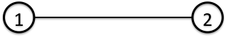{width="1.7666666666666666in"
height="0.29444444444444445in"}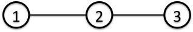{width="1.7666666666666666in"
height="0.29444444444444445in"}

(Triangular Plane Element)

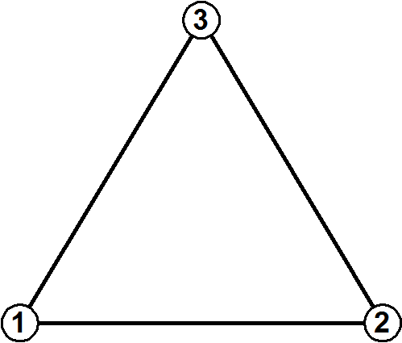{width="1.7361111111111112in"
height="1.4944444444444445in"}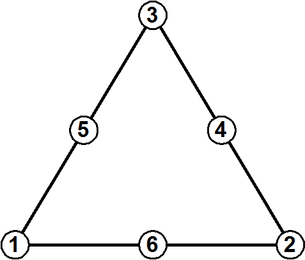{width="1.7361111111111112in"
height="1.4944444444444445in"}

(Quadrilateral Plane Element)

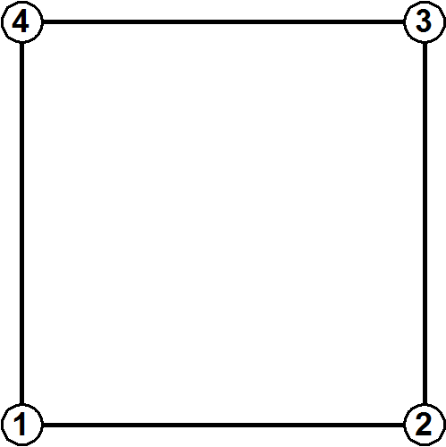{width="1.582638888888889in"
height="1.582638888888889in"}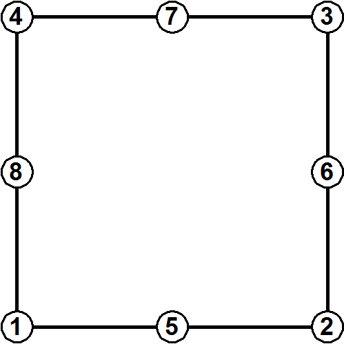{width="1.582638888888889in"
height="1.582638888888889in"}

(Tetrahedral Element)

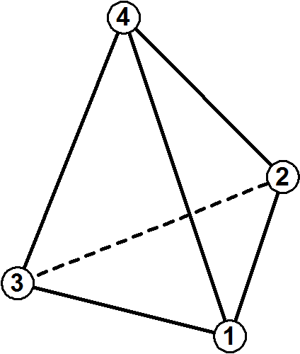{width="1.648611111111111in"
height="1.9340277777777777in"}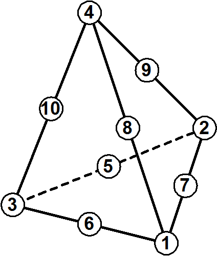{width="1.648611111111111in"
height="1.9340277777777777in"}

(Pentahedral Element)

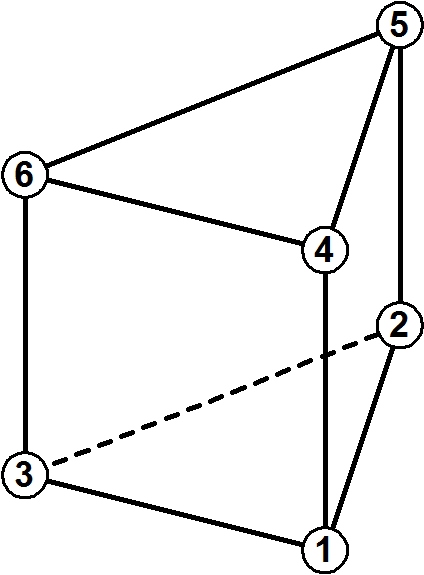{width="1.6923611111111112in"
height="2.296527777777778in"}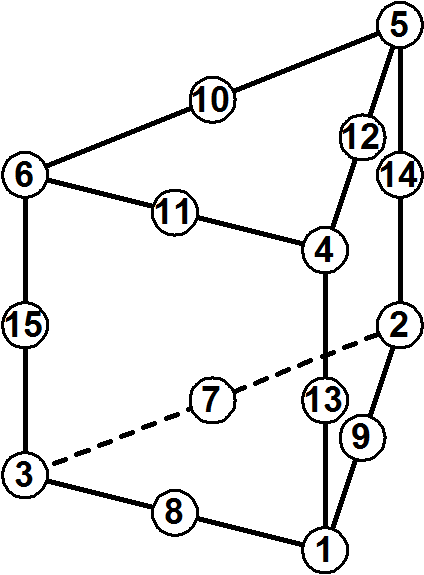{width="1.6923611111111112in"
height="2.296527777777778in"}

(Hexahedral Element)

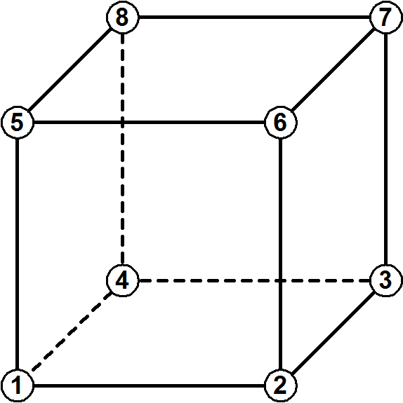{width="2.263888888888889in"
height="2.263888888888889in"}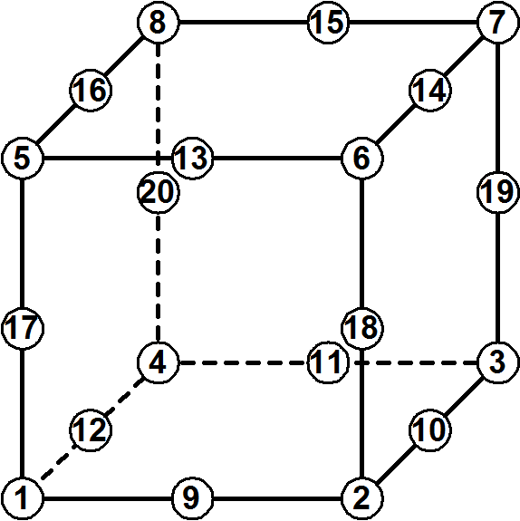{width="2.263888888888889in"
height="2.263888888888889in"}

(Beam Element)

{width="1.7666666666666666in"
height="0.28888888888888886in"}

(Beam Element with 3-dof nodes)

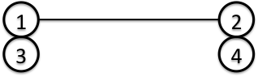{width="1.7666666666666666in"
height="0.5277777777777778in"}

Nodes 1 and 2 for translational DOF, nodes 3 and 4 for rotational DOF.

(Triangular Shell Element)

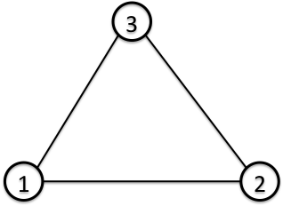{width="1.7666666666666666in"
height="1.288888888888889in"}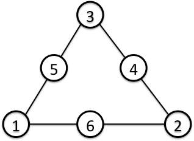{width="1.7666666666666666in"
height="1.288888888888889in"}

  Surface No.   Linear                Quadratic
  ------------- --------------------- ---------------------------------
  1             1 – 2 – 3 \[front\]   1 – 6 – 2 – 4 – 3 – 5 \[front\]
  2             3 – 2 – 1 \[back\]    3 – 4 – 2 – 6 – 1 – 5 \[back\]

(Triangular Shell Element with 3-dof nodes)

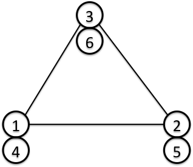{width="1.7666666666666666in"
height="1.5277777777777777in"}

Nodes 1, 2 and 3 for translational DOF, nodes 4, 5 and 6 for rotational
DOF.

  Surface No.   Linear
  ------------- ---------------------
  1             1 – 2 – 3 \[front\]
  2             3 – 2 – 1 \[back\]

(Quadrilateral Shell Element)

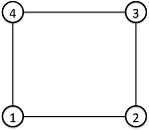{width="1.6944444444444444in"
height="1.4777777777777779in"}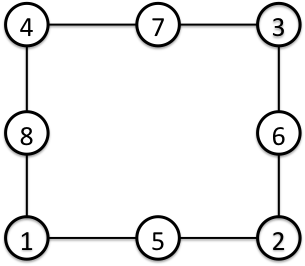{width="1.6944444444444444in"
height="1.4777777777777779in"}

  Surface No.   Linear                    Quadratic
  ------------- ------------------------- -----------------------------------------
  1             1 – 2 – 3 – 4 \[front\]   1 – 5 – 2 – 6 – 3 – 7 – 4 – 8 \[front\]
  2             4 – 3 – 2 – 1 \[back\]    4 – 7 – 3 – 6 – 2 – 5 – 1 – 8 \[back\]

(Quadrilateral Shell Element with 3-dof nodes)

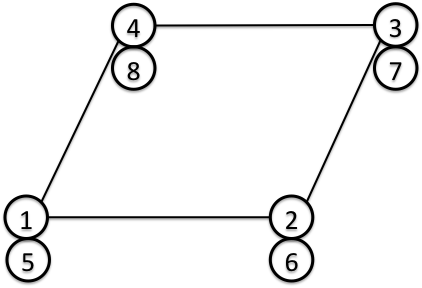{width="2.3444444444444446in" height="1.6in"}

Nodes 1, 2, 3 and 4 for translational DOF, nodes 5, 6, 7 and 8 for
rotational DOF.

  Surface No.   Linear
  ------------- -------------------------
  1             1 – 2 – 3 – 4 \[front\]
  2             4 – 3 – 2 – 1 \[back\]

Figure 4.1.2: Connectivity and Surface Number

## Material Data

### Elastic Static Analysis, Linear Dynamic Analysis and Eigenvalue Analysis

In the elastic static analysis and eigenvalue analysis of FrontISTR, it
is necessary to use isotropic elastic material and define the Young's
modulus, Poisson's ratio density and the coefficient of linear expansion
for each element. The property values of these materials is defined in
the header !SECTION and !MATERIAL of the mesh data. An example of the
definition is shown in the following.

(Example)

!SECTION, TYPE=SOLID, EGRP=ALL, MATERIAL=M1　　----　Definition of
SECTION

In the above !SECTION, the material data name of the element belonging
to the “group name = ALL” in the solid type element is defined as M1.

Next, the definition method of the material data is shown in the
following.

(Example)

> !MATERIAL, NAME=M1, ITEM=3　　　---　Intention of defining three types
> of property values in the material of material name M1
>
> !ITEM=1, SUBITEM=2 ---　Young's modulus and Poisson's ratio are
> defined in !ITEM=1 (mandatory)

4000., 0.3

> !ITEM=2　　　　　　　　---　The mass density must be defined in
> !ITEM=2 (mandatory in the case of ITEM=3)

8.0102E‐10

> !ITEM=3　　　　　　　 ---　The coefficient of linear expansion must be
> defined in !ITEM=3

1.0E‐5　

As long as each item number and the type of physical property are
compatible, and the ITEM number is correct, it can be defined in any
order. However, ITEM=1 must be defined in the order of the Young's
modulus and Poisson's ratio.

### \
Heat Conduction Analysis

In the heat conduction analysis of FrontISTR, isotropic material taking
into consideration the temperature dependency can be used. Regarding the
property values to be defined, the density, specific heat and thermal
conductivity are defined for the link, plane surface, solid and shell
element, and the gap heat transfer coefficient and the gap radiation
factor are defined in the interface element. An example of the
definition method of these property values is shown in the following.

##### In the case of link, plane surface and solid element

Defined in the !SECTION and !MATERIAL header.

　

(Example)

!SECTION, TYPE=SOLID, EGRP=ALL, MATERIAL=M1　---　Definition of section

In the above !SECTION, the material data name of the element belonging
to the “group name = ALL” in the solid type element is defined as M1.
The following shows the definition method of the material data.

(Example)

> !MATERIAL, NAME=M1, ITEM=3　　　　---　Intention of defining three
> types of property values in the material of material name M1
>
> !ITEM=1, SUBITEM=1　 ---　The density and temperature are defined in
> !ITEM=1 (mandatory)

7850., 300.

7790., 500.

7700., 800.

> !ITEM=2　 ---　The specific heat and temperature are defined in
> !ITEM=2 (mandatory)

0.465, 300.

0.528, 500.

0.622, 800.

> !ITEM=3　 ---　The thermal conductivity and temperature are defined in
> !ITEM=3 (mandatory)

43., 300.

38.6, 500.

27.7, 800.

Since the types of physical properties are identified by each item
number in FrontISTR, it can be defined in any order as long as both are
consistent.

##### In the case of an interface element

Defined in the !SECTION header. (Material data is not required)

(Example)

!SECTION, TYPE=INTERFACE, EGRP=GAP　 ---　Definition of section

1.0, 20.15, 8.99835E-9, 8.99835E-9

In the above !SECTION, the gap parameter of the element belonging to the
"group name = GAP" in the interface element is defined.

1st parameter : Gap width

2nd parameter : Gap heat transfer coefficient

3rd parameter : Gap radiation factor 1

4th parameter : Gap radiation factor 2

##### In the case of a shell element

Defined in the !SECTION and MATERIAL header.

(Example)

!SECTION, TYPE=SHELL, EGRP=SH, MATERIAL=M2 ---　Definition of section

10.0, 5

In the above !SECTION, the shell characteristics of the element
belonging to the "group name = SH" in the shell type element is defined.

1st parameter : Shell thickness

2nd parameter :Integration points in the thickness direction

This also means that the material data name of the material physical
properties of the element which belong to this group is defined as M2.

For single layered isotropic shell, the definition method of the
material physical properties is the same as in the case of the solid
element. Refer to the description of the solid element.

In addition, another definition method stated below is available for
multi-layered and/or orthotropic shell.

(Example) Isotropic, single-layered shell

!MATERIAL, NAME=M1, ITEM=1

!ITEM=1,SUBITEM=4

0, 200000, 0.3, 2.0

1st parameter : 0=isotropic

2nd parameter : Young’s modulus

3rd parameter : Poisson’s ratio

4th parameter : Shell thickness

(Example) Isotropic, double-layered shell

!MATERIAL, NAME=M1, ITEM=1

!ITEM=1,SUBITEM=7

0, 200000, 0.3, 2.0, 200000, 0.3, 2.0

1st parameter : 0=isotropic

2nd parameter : Young’s modulus (1st layer)

3rd parameter : Poisson’s ratio (1st layer)

4th parameter : Shell thickness (1st layer)

5th parameter : : Young’s modulus (2nd layer)

6th parameter : Poisson’s ratio (2nd layer)

7th parameter : Shell thickness (2nd layer)

By specifying as many material constants as needed for the number of
layers, the material is automatically treated as multi-layered shell.
The total thickness of the shell is the sum of the thickness of all the
layers. The layers are ordered from the top surface of the shell with
respect to the normal direction.

(Example) Orthotropic, single-layered shell

!MATERIAL, NAME=M1, ITEM=1

!ITEM=1, SUBITEM=9

1, 28600., 0.15, 32.3 , 28600., 12434., 12434., 12434., 0.0

1st parameter : 1=orthotropic

2nd parameter : Young’s modulus E1

3rd parameter : Poisson’s ratio n12

4th parameter : Shell thickness

5th parameter : : Young’s modulus E2

6th parameter : Shear modulus G12

7th parameter : Shear modulus G23

8th parameter : Shear modulus G13

9th parameter : Orthotropy angle θ

Orthotropy angle is specified in \[degree\].

(Example) Orthotropic, double-layered shell

!MATERIAL, NAME=M1, ITEM=1

!ITEM=1, SUBITEM=17

1, 28600., 0.15, 32.3 , 28600., 12434., 12434., 12434., 0.0, 28600.,
0.15, 32.3 , 28600., 12434., 12434., 12434., 0.0

1st parameter : 1=orthotropic

2nd parameter : Young’s modulus E1 (1st layer)

3rd parameter : Poisson’s ratio n12 (1st layer)

4th parameter : Shell thickness (1st layer)

5th parameter : : Young’s modulus E2 (1st layer)

6th parameter : Shear modulus G12 (1st layer)

7th parameter : Shear modulus G23 (1st layer)

8th parameter : Shear modulus G13 (1st layer)

9th parameter : Orthotropy angle θ (1st layer)

10th parameter : Young’s modulus E1 (2nd layer)

11th parameter : Poisson’s ratio n12 (2nd layer)

12th parameter : Shell thickness (2nd layer)

13th parameter : Young’s modulus E2 (2nd layer)

14th parameter : Shear modulus G12 (2nd layer)

15th parameter : Shear modulus G23 (2nd layer)

16th parameter : Shear modulus G13 (2nd layer)

17th parameter : Orthotropy angle θ (2nd layer)

### Nonlinear Static Analysis

In the nonlinear static analysis of FrontISTR, in addition to the method
to define the !SECTION and !MATERIAL shown in item 4.2.1, !ELASTIC,
!HYPERELASTIC, !PLASTIC and etc. in the analysis control data can also
be defined. An example of the definition is shown in the following.

(Example) Definition of hyperelastic material

　!MATERIAL

> !HYPERELASTIC, TYPE=NEOHOOKE　---　Definition of the Neo Hooke
> hyperelastic material

1000.0, 0.00005 ---　 C~10~ and D are defined (mandatory)

(Example) Definition of the elastoplastic material

!MATERIAL

!ELASTIC, TYPE=ISOTROPIC　　　　　---　Definition of the isotropic
elastic material

> 21000.0, 0.3 　　　---　The Young's modulus and the Poisson's ratio
> are defined (mandatory)
>
> !PLASTIC, TYPE=DRUCKER-PRAGER　---　Definition of the Drucker-Prager
> plastic material
>
> 500.0, 4.0, 10.0 　　　 ---　Viscosity, angle of friction and
> hardening factor are defined (mandatory)
