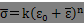

# Analysis Control Data

## Outline of Analysis Control Data

In FrontISTR, an analysis control data file is input to acquire the
computing control data, solver control data and post process
(visualization) control data as shown in the following figure, in order
to implement the analytical calculations.

The features of the analysis control data file are as follows.

・This is an ASCII format file based on a free format.

・This file consists of a header which starts with "!" and the data
following this.

・The order of description of the header is basically free.

・A "," is used as a punctuation mark of the data.

・The inside of the file is briefly divided into three zones.

・"!END" is input at the end of the file for completion.

&lt;Example of Analysis Control Data&gt;

\#\#\# Control File for HEAT solver

!SOLUTION,TYPE=HEAT

!FIXTEMP

XMIN, 0.0

XMAX, 500.0　　　　　　　　　　　　　　　　　　　**(1) Computing control
data portion**

-------------------------------------------------------------------------------------

\#\#\# Solver Control

!SOLVER,METHOD=1,PRECOND=2,ITERLOG=NO,TIMELOG=NO

100, 2

1.0e-8,1.0,0.0　　　　　　　　　　　　　　　　　　　**(2) Solver control
data portion**

-------------------------------------------------------------------------------------

\#\#\# Post Control

!WRITE,RESULT

!WRITE,VISUAL

!VISUAL, method=PSR

!surface\_num = 1

!surface 1

!surface\_style = 1

!display\_method 1

!color\_comp\_name = TEMPERATURE

!color\_subcomp = 1

!output\_type = BMP

!x\_resolution = 500

!y\_resolution = 500

!num\_of\_lights = 1

!position\_of\_lights = -20.0, 5.8, 80.0

!viewpoint = -20.0 10.0 8.0

!up\_direction = 0.0 0.0 1.0

!ambient\_coef= 0.3

!diffuse\_coef= 0.7

!specular\_coef= 0.5

!color\_mapping\_style= 1

!!interval\_mapping= -0.01, 0.02

!color\_mapping\_bar\_on = 1

!scale\_marking\_on = 1

!num\_of\_scale = 5

!font\_size = 1.5

!font\_color = 1.0 1.0 1.0

!END **(3) Post control (visualization) data portion**

-------------------------------------------------------------------------------------

## Input Rules

The analysis control data consists of a header line, data line and a
comment line.

One header is always included in the header line.

&lt;Header&gt;

The header specifies the meaning of the data and the data block in the
analysis control data.

When the head of the term starts with a "!", it is considered to be a
header.

&lt;Header Line&gt;

The header and the parameter accompanying this are described in this
line.

The header line must start with a header. When a parameter is required,
a "," must be used to continue after that. When the parameter takes on a
value, use an "=" after the parameter and describe the value after that.

The header line can not be described in more than two lines.

&lt;Data Line&gt;

The data line starts after the header line, and the necessary data is
described.

The data lines may be in multiple lines; however, this is determined
according to the rules of the data description defined by each header.

There are cases where data lines are not required.

&lt;Punctuation&gt;

A comma ( , ) is used as a punctuation of the data.

&lt;Handling of Blanks&gt;

Blanks are disregarded.

&lt;Name&gt;

Regarding the characters which can be used for the name, there is the
underscore "\_", hyphen "-", and alphanumeric characters "a - z, A - Z,
0 - 9"; however, the first letter of the name must start with "\_", or
an alphabetic character "a - z, A - Z". There is no distinction between
uppercase and lowercase letters, and all letters are internally handled
as uppercase letters.

The maximum length of the name is 63 characters.

&lt;File Name&gt;

Regarding the characters which can be used for the file name, there are
the underscore "\_", hyphen "-", period ".", slash "/", and the
alphanumeric characters "a - z, A - Z, 0 - 9".

As long as there is no specific description, a path can be included in
the file name. Both the relative path and the absolute path can be
specified.

The maximum length of the file name is 1,023 characters.

&lt;Floating Point Data&gt;

Exponents are optional. An "E" or "e" character must be added before the
exponent.

The selection of "E" or "e" is optional.

&lt;!!, \# Comment Line&gt;

Lines starting with "!!" or "\#" are considered to be comment lines, and
are disregarded.

A comment line can be inserted in any position in the file, and there
are no restrictions on the number of lines.

&lt;!END&gt;

End of mesh data

When this header is displayed, the reading of the mesh data is
completed.

## \
Analysis Control Data

### Header List of Computing Control Data

In FrontISTR, the following items can be mentioned as the boundary
conditions which can be used for the computing control data.

・Distributed load conditions (body force, pressure loading, gravity,
centrifugal force)

・Concentrated load conditions

・Heat load

・Single point restriction conditions (SPC conditions)

・Spring boundary conditions

・Contact

・Concentrated heat flux

・Distributed heat flux

・Convective heat transfer boundary

・Radiant heat transfer boundary

・Specified temperature boundary

The same as the mesh data, the !HEADER format is used as the definition
method of the above boundary conditions.

The header list of the common control data is shown in the following
Table 7.3.1, and the header list for each analysis type is shown in
Table 7.3.2.

Table 7.3.1: Control Data Common to All Analyses

  --------------- ------------------------------------------------------------------- ----------- -------------
  Header          Meaning                                                             Remarks     Description

                                                                                                  No.

  !VERSION        Solver version number                                                           1-1

  !SOLUTION       Specification of analysis type                                      Mandatory   1-2

  !WRITE,VISUAL   Specification of visualization output                                           1-3

  !WRITE,RESULT   Specification of results output                                                 1-4

  !WRITE,LOG      Specification of results output                                                 1-5

  !OUTPUT\_VIS    Control of visualization output items                                           1-6

  !OUTPUT\_RES    Control of results output items                                                 1-7

  !RESTART        Control of restarting                                                           1-8

  !ECHO           Echo output                                                                     1-9

  !ORIENTATION    Definition of local coordinate system                                           1-10

  !SECTION        Definition of local coordinate system the sction correspondent to               1-11

  !END            Ending specification of control data                                            1-12
  --------------- ------------------------------------------------------------------- ----------- -------------

Table 7.3.2: Control Data for Static Analysis

  ------------------- ---------------------------------------------------------- --------- -------------
  Header              Meaning                                                    Remarks   Description

                                                                                           No.

  !STATIC             Static analysis control                                    　        2-1

  !MATERIAL           Material name                                                        2-2

  !ELASTIC            Elastic material physical properties                                 2-2-1

  !PLASTIC            Plastic material physical properties                                 2-2-2

  !HYPERELASTIC       Hyperelastic material physical properties                            2-2-3

  !VISCOELASTIC       Viscoelastic material physical properties                            2-2-4

  !CREEP              Creep material physical properties                                   2-2-5

  !DENSITY            Mass density                                                         2-2-6

  !EXPANSION\_COEFF   Coefficient of linear expansion                                      2-2-7

  !USE\_MATERIAL      User defined material                                                2-2-8

  !BOUNDARY           Displacement boundary conditions                                     2-3

  !SPRING             Spring boundary conditions                                           2-3-1

  !CLOAD              Concentrated load                                                    2-4

  !DLOAD              Distributed load                                                     2-5

  !ULOAD              User defined external load                                           2-6

  !CONTACT\_ALGO      Contact analytic algorithm                                           2-7

  !CONTACT            Contact                                                              2-8

  !TEMPERATURE        Nodal temperature in thermal stress analysis                         2-9

  !REFTEMP            Reference temperature in thermal stress analysis                     2-10

  !STEP               Analysis step control                                      　        2-11

  !TRS                Tempearture dependent behaviour of viscoelastic material             2-12
  ------------------- ---------------------------------------------------------- --------- -------------

Table 7.3.3: Control Data for Eigenvalue Analysis

  -------- ----------------------------- ---------------------------------- -------------
  Header   Meaning                       Remarks                            Description

                                                                            No.

  !EIGEN   Eigenvalue analysis control   Mandatory in eigenvalue analysis   3-1
  -------- ----------------------------- ---------------------------------- -------------

Table 7.3.4: Control Data for Heat Conduction Analysis

  ------------- --------------------------------------------------------------------------- --------------------------------------- -------------
  Header        Meaning                                                                     Remarks                                 Description

                                                                                                                                    No.

  !HEAT         Heat conduction analysis control                                            Mandatory in heat conduction analysis   4-1

  !FIXTEMP      Nodal temperature                                                                                                   4-2

  !CFLUX        Concentrated heat flux given to node                                                                                4-3

  !DFLUX        Distributed heat flux / internal heat generation given to element surface                                           4-4

  !SFLUX        Distributed heat flux by surface group                                                                              4-5

  !FILM         Heat transfer coefficient given to boundary plane                                                                   4-6

  !SFILM        Heat transfer coefficient by surface group                                                                          4-7

  !RADIATE      Radiation factor given to boundary plane                                                                            4-8

  !SRADIATE     Radiation factor by surface group                                                                                   4-9

  !WELD\_LINE   Weld line                                                                                                           4-10
  ------------- --------------------------------------------------------------------------- --------------------------------------- -------------

Table 7.3.5: Control Data for Dynamic Analysis

  --------------- ----------------------------------------------------------------- ------------------------------------------ -------------
  Header          Meaning                                                           Remarks                                    Description

                                                                                                                               No.

  !DYNAMIC        Dynamic analysis control                                          Mandatory in dynamic analysis              5-1

  !VELOCITY       Velocity boundary conditions                                                                                 5-2

  !ACCELERATION   Acceleration boundary conditions                                                                             5-3

  !COUPLE         Coupled surface definition                                        Required in coupled analysis               5-4

  !EIGENREAD      Specification of eigenvalues and eigenvactors                     Mandatory in frequency response analysis   5-5

  !FLOAD          Definition of concentrated load for frequency response analysis                                              5-6
  --------------- ----------------------------------------------------------------- ------------------------------------------ -------------

In each header, there are data items which comply with the parameter and
each header.

Each of the above headers is described in the following with examples of
data creation for each analysis type. The description number in the
above Table is the number indicated on the right end of the example of
the data creation.

##### Control data common to all analyses

&lt;Example of Analysis Control Data&gt;

\#\#\# Control File for FISTR

!VERSION 1-1

3

!SOLUTION, TYPE=STATIC 1-2

!WRITE, VISUAL 1-3

!WRITE, RESULT 1-4

!ECHO 1-9

!BOUNDARY　　 2-3

FIX, 1, 3, 0.0

!CLOAD 2-4

CL1, 3, -1.0

!END 1-12

&lt;Description of Header&gt;

> 1-1　!VERSION
>
> Refers to the solver version.

1-2　!SOLUTION, TYPE=STATIC

◆TYPE = analysis type

1-3　!WRITE, VISUAL

◆Output of data by visualizer via memory

Outputs the file just by entering

1-4　!WRITE, RESULT

◆Output of analysis results file

Outputs the file just by entering

1-6　!ECHO

◆Output of node data, element data and material data to log file

Outputs to the file just by entering

1-8　!END

◆Indicates the end of control data

##### Static analysis control data

&lt;Example of Static Analysis Control Data&gt;

\#\#\# Control File for FISTR

!SOLUTION, TYPE=STATIC 1-2

!WRITE, VISUAL 1-3

!WRITE, RESULT 1-4

!ECHO 1-9

!MATERIAL, NAME=M1 2-2

!ELASTIC, TYPE=ISOTROPIC 2-2-1

210000.0, 0.3

!BOUNDARY　　 2-3

FIX, 1, 3, 0.0

!SPRING 2-3-1

200, 1, 0.03

!CLOAD 2-4

CL1, 3, -1.0

!DLOAD 2-5

1, P1, 1.0

!TEMPERATURE 2-9

1, 10.0

!REFTEMP 2-10

!STEP, CONVERG=1.E-5, MAXITER=30 2-11

!END 1-12

&lt;Description of Header&gt;

\* Red figures are the values indicated in the example.

\* Alphabetic characters in the 2nd line of the table express the
parameter name.

2-1　!STATIC

◆Setting of static analysis method

2-2　!MATERIAL

◆Definition of material physical properties

NAME = name of material physical properties

2-2-1 !ELASTIC, TYPE=ISOTROPIC

◆Definition of elastic substance

TYPE = elastic type

  Young's Modulus   Poisson's Ratio
  ----------------- -----------------
  YOUNG\_MODULUS    POISSON\_RATIO
  210000.0          0.3

2-3 !BOUNDARY

◆Definition of displacement boundary conditions

  --------------------------------------------------------------------------------------------------------------------------
  Node ID or        Start No. of Restricted Degree of Freedom   End No. of Restricted Degree of Freedom   Restricted Value

  Node Group Name                                                                                         
  ----------------- ------------------------------------------- ----------------------------------------- ------------------
  NODE\_ID          DOF\_idS                                    DOF\_idE                                  Value

  FIX,              1,                                          3,                                        0.0
  --------------------------------------------------------------------------------------------------------------------------

2-3-1 !SPRING

◆Definition of spring boundary conditions

  -------------------------------------------------------
  Node ID or        Restricted          Spring Constant

  Node Group Name   Degree of Freedom   
  ----------------- ------------------- -----------------
  NODE\_ID          DOF\_id             Value

  200,              1,                  0.03
  -------------------------------------------------------

2-4　!CLOAD

◆Definition of concentrated load

  -------------------------------------------------------
  Node ID or Node Group Name   Degree of     Load Value

                               Freedom No.   
  ---------------------------- ------------- ------------
  NODE\_ID                     DOF\_id       Value

  CL1,                         3,            -1.0
  -------------------------------------------------------

2-5　!DLOAD

◆Definition of distributed load

  -----------------------------------------------------
  Element ID or        Load Type No.   Load Parameter

  Element Group Name                   
  -------------------- --------------- ----------------
  ELEMENT\_ID          LOAD\_type      param

  1,                   P1,             1.0
  -----------------------------------------------------

2-9　!TEMPERATURE

◆Specification of nodal temperature used for thermal stress analysis

  Node ID or Node Group Name   Temperature
  ---------------------------- -------------
  NODE\_ID                     Temp\_Value
  1,                           10

2-10　!REFTEMP

◆Definition of reference temperature in thermal stress analysis

2-11 !STEP

◆Control of nonlinear static analysis (Omissible in the case of linear
analysis)

  ----------------------------------------------------------------------------------------------------------------------------------------------
  Convergence Value Judgment Threshold   No. of Sub Steps                      > Max No. of Iterative Calculations   Time Function Name

  (Default: 1.0E-06)                     (When AMP exists, AMP has priority)                                         (Specified in !AMPLITUDE)
  -------------------------------------- ------------------------------------- ------------------------------------- ---------------------------
  CONVERG                                SUBSTEPS                              MAXITER                               AMP

  1.E-5                                  10                                    30                                    
  ----------------------------------------------------------------------------------------------------------------------------------------------

##### Eigenvalue analysis control data

&lt;Example of Eigenvalue Analysis Control Data&gt;

\#\#\# Control File for FISTR

!SOLUTION, TYPE=EIGEN 1-2

!WRITE, VISUAL 1-3

!WRITE, RESULT 1-4

!ECHO 1-9

!EIGEN 3-1

3, 1.0E-8, 60

!BOUNDARY 2-3

FIX, 1, 2, 0.0

!END 1-12

&lt;Description of Header&gt;

\* Red figures are the values indicated in the example.

3-1　!EIGEN

◆Parameter settings of eigenvalue analysis

  No. of Eigenvalue   Allowance   Max No. of Iterations
  ------------------- ----------- -----------------------
  NSET                LCZTOL      LCZMAX
  3,                  1.0E-8,     60

2-3 !BOUNDARY (Same items as in Static Analysis)

◆Definition of displacement boundary conditions

  --------------------------------------------------------------------------------------
  Node ID or        Start No. of Restricted   End No. of Restricted   Restricted Value

  Node Group Name   Degree of Freedom         Degree of Freedom       
  ----------------- ------------------------- ----------------------- ------------------
  NODE\_ID          DOF\_idS                  DOF\_idE                Value

  FIX,              1,                        3,                      0.0
  --------------------------------------------------------------------------------------

##### Heat conduction analysis control data

&lt;Example of Heat Conduction Analysis Control Data&gt;

\#\#\# Control File for FISTR

!SOLUTION, TYPE=HEAT 1-2

!WRITE, VISUAL 1-3

!WRITE, RESULT 1-4

!ECHO 1-9

!HEAT 4-1

!FIXTEMP 4-2

XMIN, 0.0

XMAX, 500.0

!CFLUX 4-3

　ALL, 1.0E-3

!DFLUX 4-4

　ALL, S1, 1.0

!SFLUX 4-5

　SURF, 1.0

!FILM 4-6

FSURF, F1, 1.0, 800

!SFILM 4-7

　SFSURF, 1.0, 800.0

!RADIATE 4-8

　RSURF, R1, 1.0E-9, 800.0

!SRADIATE 4-9

　RSURF, R1, 1.0E-9, 800.0

!END 1-12

&lt;Description of Header&gt;

\* Red figures are the values indicated in the example.

4-1　!HEAT

◆Definition of control data for calculation

!HEAT

(No data) --- Steady calculation

!HEAT

0.0 --- Steady calculation

!HEAT

10.0, 3600.0 --- Fixed time increment unsteady calculation

!HEAT

10.0, 3600.0, 1.0 --- Automatic time increment unsteady calculation

!HEAT

10.0, 3600.0, 1.0, 20.0 --- Automatic time increment unsteady
calculation

4-2　!FIXTEMP

◆Node group name, or node ID and fixed temperature

4-3　!CFLUX

◆Definition of concentrated heat flux given to node

  Node Group Name or Node ID   Heat Flux Value
  ---------------------------- -----------------
  NODE\_GRP\_NAME              Value
  ALL,                         1.0E-3

4-4　!DFLUX

◆Definition of distributed heat flux and internal heat generation given
to surface of element

  ---------------------------------------------------------
  Element Group Name or   Load Type No.   Heat Flux Value

  Element ID                              
  ----------------------- --------------- -----------------
  ELEMENT\_GRP\_NAME      LOAD\_type      Value

  ALL,                    S1,             1.0
  ---------------------------------------------------------

Load Parameter

  --------------- ----------------- -----------------
  Load Type No.   Applied Surface   Parameter
  BF              Element Overall   Calorific value
  S1              Surface No. 1     Heat flux value
  S2              Surface No. 2     Heat flux value
  S3              Surface No. 3     Heat flux value
  S4              Surface No. 4     Heat flux value
  S5              Surface No. 5     Heat flux value
  S6              Surface No. 6     Heat flux value
  S0              Shell surface     Heat flux value
  --------------- ----------------- -----------------

4-5 !SFLUX

◆Definition of distributed heat flux by surface group

  Surface Group Name   Heat Flux Value
  -------------------- -----------------
  SURFACE\_GRP\_NAME   Value
  SURF,                1.0

4-6　!FILM

◆Definition of heat transfer coefficient given to boundary plane

  ---------------------------------------------------------------------
  Element Group Name or   Load Type No.   Heat Transfer   Ambient

  Element ID                              Coefficient     Temperature
  ----------------------- --------------- --------------- -------------
  ELEMENT\_GRP\_NAME      LOAD\_type      Value           Sink

  FSURF,                  F1,             1.0,            800.0
  ---------------------------------------------------------------------

Load Parameter

  --------------- ----------------- ---------------------------------------------------
  Load Type No.   Applied Surface   Parameter
  F1              Surface No. 1     Heat transfer coefficient and ambient temperature
  F2              Surface No. 2     Heat transfer coefficient and ambient temperature
  F3              Surface No. 3     Heat transfer coefficient and ambient temperature
  F4              Surface No. 4     Heat transfer coefficient and ambient temperature
  F5              Surface No. 5     Heat transfer coefficient and ambient temperature
  F6              Surface No. 6     Heat transfer coefficient and ambient temperature
  F0              Shell surface     Heat transfer coefficient and ambient temperature
  --------------- ----------------- ---------------------------------------------------

4-7　!SFILM

◆Definition of heat transfer coefficient by surface group

  Surface Group Name   Heat Transfer Rate   Ambient Temperature
  -------------------- -------------------- ---------------------
  SURFACE\_GRP\_NAME   Value                Sink
  SFSURF,              1.0,                 800.0

4-8　!RADIATE

◆Definition of radiation factor given to boundary plane

  -----------------------------------------------------------------
  Element Group Name or   Load Type No.   Radiation   Ambient

  Element ID                              Factor      Temperature
  ----------------------- --------------- ----------- -------------
  ELEMENT\_GRP\_NAME      LOAD\_type      Value       Sink

  RSURF,                  R1,             1.0E-9,     800.0
  -----------------------------------------------------------------

Load Parameter

  --------------- ----------------- ------------------------------------------
  Load Type No.   Applied Surface   Parameter
  R1              Surface No. 1     Radiation factor and ambient temperature
  R2              Surface No. 2     Radiation factor and ambient temperature
  R3              Surface No. 3     Radiation factor and ambient temperature
  R4              Surface No. 4     Radiation factor and ambient temperature
  R5              Surface No. 5     Radiation factor and ambient temperature
  R6              Surface No. 6     Radiation factor and ambient temperature
  R0              Shell surface     Radiation factor and ambient temperature
  --------------- ----------------- ------------------------------------------

4-9　!SRADIATE

◆Definition of radiation factor by surface group

  Surface Group Name   Radiation Factor   Ambient Temperature
  -------------------- ------------------ ---------------------
  SURFACE\_GRP\_NAME   Value              Sink
  SRSURF,              1.0E-9,            800.0

##### Dynamic analysis control data

&lt;Example of Dynamic Analysis Control Data&gt;

\#\#\# Control File for FISTR

!SOLUTION, TYPE=DYNAMIC 1-2

!DYNAMIC, TYPE=NONLINEAR 5-1

1 , 1

0.0, 1.0, 500, 1.0000e-5

0.5, 0.25

1, 1, 0.0, 0.0

100, 5, 1

0, 0, 0, 0, 0, 0

!BOUNDARY, AMP=AMP1 2-3

FIX, 1, 3, 0.0

!CLOAD, AMP=AMP1 2-4

CL1, 3, -1.0

!COUPLE, TYPE=1 5-4

SCOUPLE

!STEP, CONVERG=1.E-6, ITMAX=20 2-11

!END 1-12

&lt;Description of Header&gt;

\* Red figures are the values indicated in the example.

\* Alphabetic characters in the 2nd line of the table express the
parameter name.

5-1　!DYNAMIC

◆Controlling the linear dynamic analysis

  -------------------------------------
  Solution of          Analysis Types

  Equation of Motion   
  -------------------- ----------------
  idx\_eqa             idx\_resp

  11                   1
  -------------------------------------

  ---------------------------------------------------------------------------
  Analysis Start Time   Analysis End Time   Overall No. of   Time Increment

                                            STEPS            
  --------------------- ------------------- ---------------- ----------------
  t\_start              t\_end              n\_step          t\_delta

  0.0                   1.0                 500              1.0000e-5
  ---------------------------------------------------------------------------

  Parameterγof Newmark-β Method   Parameter β of Newmark-β Method
  ------------------------------- ---------------------------------
  ganma                           beta
  0.5                             0.25

  ------------------------------------------------------------------------------
  Type of Mass Matrix   Type of Damping   Parameter R~m~ of   Parameter Rk of

                                          Rayleigh Damping    Rayleigh Damping
  --------------------- ----------------- ------------------- ------------------
  idx\_mas              idx\_dmp          ray\_m              ray\_k

  1                     1                 0.0                 0.0
  ------------------------------------------------------------------------------

  ---------------------------------------------------------------------
  Results Output   Monitoring Node ID or   Results Output Interval of

  Interval         Node Groupe Name        Displacement Monitoring
  ---------------- ----------------------- ----------------------------
  nout             node\_monit\_1          nout\_monit

  100              55                      1
  ---------------------------------------------------------------------

  Output Control Displacement   Output Control Velocity   Output Control Acceleration   Output Control Reaction Force   Output Control Strain   Output Control Stress
  ----------------------------- ------------------------- ----------------------------- ------------------------------- ----------------------- -----------------------
  iout\_list(1)                 iout\_list(2)             iout\_list(3)                 iout\_list(4)                   iout\_list(5)           iout\_list(6)
  0                             0                         0                             0                               0                       0

2-3 !BOUNDARY (Same items as in Static Analysis)

◆Definition of displacement boundary conditions

  --------------------------------------------------------------------------------------------------------------------------
  Node ID or        Start No. of Restricted Degree of Freedom   End No. of Restricted Degree of Freedom   Restricted Value

  Node Group Name                                                                                         
  ----------------- ------------------------------------------- ----------------------------------------- ------------------
  NODE\_ID          DOF\_idS                                    DOF\_idE                                  Value

  FIX,              1,                                          3,                                        0.0
  --------------------------------------------------------------------------------------------------------------------------

2-4 !CLOAD (Same items as in Static Analysis)

◆Definition of concentrated load

  -------------------------------------------------------
  Node ID or Node Group Name   Degree of     Load Value

                               Freedom No.   
  ---------------------------- ------------- ------------
  NODE\_ID                     DOF\_id       Value

  CL1,                         3,            -1.0
  -------------------------------------------------------

5-4　!COUPLE, TYPE=1

◆Definition of coupled surface

  Coupling Surface Group Name
  -----------------------------
  COUPLING\_SURFACE\_ID
  SCOUPLE

2-11　!STEP, CONVERG=1.E-10, ITMAX=20

◆Control of nonlinear static analysis

(Omissible in the case of linear analysis, and unnecessary for explicit
method)

  ------------------------------------------------------------------------------------------------------------------
  Convergence Value Judgment Threshold   No. of Sub Steps                      > Max No. of Iterative Calculations

  (Default: 1.0E-06)                     (When AMP exists, AMP has priority)   
  -------------------------------------- ------------------------------------- -------------------------------------
  CONVERG                                SUBSTEPS                              ITMAX

  1.E-10                                                                       20
  ------------------------------------------------------------------------------------------------------------------

##### Dynamic analysis　(Frequency Response Analysis) Control Data

＜Example of Dynamic analysis(Frequency Reseponse Analysis＞

!SOLUTION, TYPE=DYNAMIC　　　　　　　　　　　　　　　　　　　　　　1-2

!DYNAMIC　　　　　　　　　　　　　　　　　　　　　　　　　　　　　　　
5-1

　11 , 2

　14000, 16000, 20, 15000.0

　0.0, 6.6e-5

　1, 1, 0.0, 7.2E-7

　10, 2, 1

　1, 1, 1, 1, 1, 1

!EIGENREAD　　　　　　　　　　　　　　　　　　　　　　　　　　　　　 5-5

　eigen0.log

　1, 5

!FLOAD, LOAD CASE=2 5-6

\_PickedSet5, 2, 1.

!FLOAD, LOAD CASE=2

\_PickedSet6, 2, 1.

&lt;Description of Header&gt;

\* Red figures are the values indicated in the example.

\* Alphabetic characters in the 2nd line of the table express the
parameter name.

5-1　!DYNAMIC

◆Controlling the frequency response analysis

  -------------------------------------
  Solution of          Analysis Types

  Equation of Motion   
  -------------------- ----------------
  idx\_eqa             idx\_resp

  11                   2
  -------------------------------------

  Minimum Frequency   Maximum Frequency   Number of divisions for the frequency range   Frequency to obtain displacement
  ------------------- ------------------- --------------------------------------------- ----------------------------------
  f\_start            f\_end              n\_freq                                       f\_disp
  14000               16000               20                                            15000.0

  Analysis Start Time   Analysis End Time
  --------------------- ------------------- ------------------- ------------------
  t\_start              t\_end
  0.0                   6.6e-5

  Type of Mass Matrix   Type of Damping
  idx\_mas              idx\_dmp
  1                     1

  -----------------------------------------------------------------------------------------------------------------------
  Results Output            Visualization Type                                   Monitoring Node ID in Frequency Domain

  Interval in Time Domain   (1-Mode shapes, 2-Time history results at f\_disp)   
  ------------------------- ---------------------------------------------------- ----------------------------------------
  nout                      vistype                                              nodeout

  10                        2                                                    1
  -----------------------------------------------------------------------------------------------------------------------

  ----------------------------------------------------------------------------------------------------------------------------------------
  Output Control Displacement   Output Control Velocity   Output Control Acceleration   Output Control   Output Control   Output Control

                                                                                        ignored          ignored          ignored
  ----------------------------- ------------------------- ----------------------------- ---------------- ---------------- ----------------
  iout\_list(1)                 iout\_list(2)             iout\_list(3)                 iout\_list(4)    iout\_list(5)    iout\_list(6)

  1                             1                         1                             1                1                1
  ----------------------------------------------------------------------------------------------------------------------------------------

5-5　!EIGENREAD

◆Controlling the input file for frequency response analysis

  The name of eigenvalue analysis log
  -------------------------------------
  eigenlog\_filename
  eigen0.log

  lowest mode to be used in frequency response analysis   highest mode to be used frequency response analysis
  ------------------------------------------------------- -----------------------------------------------------
  start\_mode                                             end\_mode
  1                                                       5

5-6　 !FLOAD

◆Defining external forces applied in frequency response analysis

  -----------------------------------------------
  Node ID,             Degree of     Load Value

  Node Group Name or   Freedom No.   

  Surface Group Name                 
  -------------------- ------------- ------------
  NODE\_ID             DOF\_id       Value

  \_PickedSet5         2             1.
  -----------------------------------------------

### Solver Control Data

&lt;Example of Solver Control Data&gt;

\#\#\# SOLVER CONTROL

!SOLVER, METHOD=CG, PRECOND=1, ITERLOG=YES, TIMELOG=YES 6-1

10000, 2 6-2

1.0e-8, 1.0, 0.0 6-3

&lt;Description of Header&gt;

\* Red figures are the values indicated in the example.

6-1　!SOLVER

METHOD = method

> (DIRECT is the direct method, in addition there are CG, BiCGSTAB,
> GMRES, GPBiCG, etc.)

DUMPTYPE = type of matrix dumping

DUMPEXIT = whether program exits right after dumping matrix

The following parameters will be disregarded when a direct solver is
selected in the method.

PRECOND = preconditioner

ITERLOG = whether solver convergence history is output

TIMELOG = whether solver computation time is output

SCALING = whether matrix is scaled so that each diagonal element becomes
1

USEJAD = whether matrix ordering optimized for vector processors is
performed

MPCMETHOD= method for multipoint constraints

(1: Penalty method, 2: MPC-CG method, 3: Explicit master-slave
elimination)

ESTCOND= frequency for estimating condition number

> (Estimation performed at every specified number of iterations and at
> the last iteration. No estimation when 0 is specified.)

6-2

  -------------------------------------------------------------------------------
  No. of Iterations   Iteration Count of   No. of Krylov   No. of Colors for

                      Priconditioning      Subspaces       Multi-Color ordering
  ------------------- -------------------- --------------- ----------------------
  NIER                iterPREMAX           NREST           NCOLOR\_IN

  10000               2                                    
  -------------------------------------------------------------------------------

6-3

  ---------------------------------------------------------
  Truncation Error   Scale Factor for Diagonal   Not Used

                     Elements when computing     

                     Preconditioning Matrix      
  ------------------ --------------------------- ----------
  RESID              SIGMA\_DIAG                 SIGMA

  1.0e-8,            1.0,                        0.0
  ---------------------------------------------------------

### Post Process (Visualization) Control Data

An example of the post process (visualization) control data and the
contents are shown in the following.

&lt;Example of Visualization Control Data&gt;

> ・Each description number (P1-0, P1-1, etc.) is linked to the number
> of the detailed descriptions in the following.
>
> ・P1-○ expresses the common data, and P2-○ expresses the parameter for
> the purpose of the rendering.
>
> In addition, the rendering will become valid only when the
> output\_type=BMP.
>
> ・When the surface\_style is !surface\_style = 2 (isosurface)
> !surface\_style = 3 (user specified curved surface), a separate
> setting is required. The data is indicated collectively after the
> common data.
>
> (P3-○ is a description of the isosurface in !surface\_style = 2. P4-○
> is a description of the user specified curved surface in
> !surface\_style = 3.)
>
> ・The items indicated with two ! like "!!", will be recognized as a
> comment and will not affect the analysis.

\#\#\# Post Control 　Description No.

!VISUAL, method=PSR P1-0

!surface\_num = 1 P1-1

!surface 1 P1-2

!surface\_style = 1 P1-3

!display\_method = 1 P1-4

!color\_comp\_name = STRESS P1-5

!colorsubcomp\_name P1-6

!color\_comp 7 P1-7

!!color\_subcomp = 1 P1-8

!iso\_number P1-9

!specified\_color P1-10

!deform\_display\_on = 1 P1-11

!deform\_comp\_name P1-12

!deform\_comp P1-13

!deform\_scale = 9.9e-1 P1-14

!initial\_style = 1 P1-15

!deform\_style = 3 P1-16

!initial\_line\_color P1-17

!deform\_line\_color P1-18

!output\_type = BMP P1-19

!x\_resolution = 500 P2-1

!y\_resolution = 500 P2-2

!num\_of\_lights = 1 P2-3

!position\_of\_lights = -20.0, 5.8, 80.0 P2-4

!viewpoint = -20.0 -10.0 5.0 P2-5

!look\_at\_point P2-6

!up\_direction = 0.0 0.0 1.0 P2-7

!ambient\_coef= 0.3 P2-8

!diffuse\_coef= 0.7 P2-9

!specular\_coef= 0.5 P2-10

!color\_mapping\_style= 1 P2-11

!!interval\_mapping\_num P2-12

!interval\_mapping= -0.01, 0.02 P2-13

!rotate\_style = 2 P2-14

!rotate\_num\_of\_frames P2-15

!color\_mapping\_bar\_on = 1 P2-16

!scale\_marking\_on = 1 P2-17

!num\_of\_scale = 5 P2-18

!font\_size = 1.5 P2-19

!font\_color = 1.0 1.0 1.0 P2-20

!background\_color P2-21

!isoline\_color P2-22

!boundary\_line\_on P2-23

!color\_system\_type P2-24

!fixed\_range\_on = 1 P2-25

!range\_value = -1.E-2, 1.E-2 P2-26

Common Data List &lt;P1-1 - P1-19&gt;

+--------------------+--------------------+--------------------+--------------------+
| No.                | Keywords           | Types              | Contents           |
+====================+====================+====================+====================+
| P1-0               | !VISUAL            |                    | Specification of   |
|                    |                    |                    | the visualization  |
|                    |                    |                    | method             |
+--------------------+--------------------+--------------------+--------------------+
| P1-1               | surface\_num       |                    | No. of surfaces in |
|                    |                    |                    | one surface        |
|                    |                    |                    | rendering          |
+--------------------+--------------------+--------------------+--------------------+
| P1-2               | surface            |                    | Setting of the     |
|                    |                    |                    | contents of        |
|                    |                    |                    | surface            |
+--------------------+--------------------+--------------------+--------------------+
| P1-3               | surface\_style     | integer            | Specification of   |
|                    |                    |                    | the surface type   |
|                    |                    |                    | (Default: 1)       |
+--------------------+--------------------+--------------------+--------------------+
|                    |                    |                    | 1: Boundary        |
|                    |                    |                    | surface            |
+--------------------+--------------------+--------------------+--------------------+
|                    |                    |                    | 2: Isosurface      |
|                    |                    |                    |                    |
|                    |                    |                    | 3: Curved surface  |
|                    |                    |                    | defined by user    |
|                    |                    |                    | based on the       |
|                    |                    |                    | equation           |
+--------------------+--------------------+--------------------+--------------------+
| P1-4               | display\_method    | integer            | Display method     |
|                    |                    |                    | (Default: 1)       |
|                    |                    |                    |                    |
|                    |                    |                    | 1\. Color code dis |
|                    |                    |                    | play               |
|                    |                    |                    |                    |
|                    |                    |                    | 2\. Boundary line  |
|                    |                    |                    | display            |
|                    |                    |                    |                    |
|                    |                    |                    | 3\. Color code and |
|                    |                    |                    |  boundary line dis |
|                    |                    |                    | play               |
|                    |                    |                    |                    |
|                    |                    |                    | 4\. Display of 1 s |
|                    |                    |                    | pecified color     |
|                    |                    |                    |                    |
|                    |                    |                    | 5\. Isopleth line  |
|                    |                    |                    | display by classif |
|                    |                    |                    | ication of color   |
+--------------------+--------------------+--------------------+--------------------+
| P1-5               | color\_comp\_name  | character(100)     | Compatible with    |
|                    |                    |                    | parameter name and |
|                    |                    |                    | color map          |
|                    |                    |                    |                    |
|                    |                    |                    | (Default: 1st      |
|                    |                    |                    | parameter name)    |
+--------------------+--------------------+--------------------+--------------------+
| P1-6               | color\_subcomp\_na | character(4)       | When the parameter |
|                    | me                 |                    | is a vector,       |
|                    |                    |                    | specifies the      |
|                    |                    |                    | component to be    |
|                    |                    |                    | displayed.         |
|                    |                    |                    | (Default: x)       |
|                    |                    |                    |                    |
|                    |                    |                    | norm: Norm of the  |
|                    |                    |                    | vector             |
|                    |                    |                    |                    |
|                    |                    |                    | x: x component     |
|                    |                    |                    |                    |
|                    |                    |                    | y: y component     |
|                    |                    |                    |                    |
|                    |                    |                    | z: z component     |
+--------------------+--------------------+--------------------+--------------------+
| P1-7               | color\_comp        | integer            | Provides an ID     |
|                    |                    |                    | number to the      |
|                    |                    |                    | parameter name     |
|                    |                    |                    |                    |
|                    |                    |                    | (Default: 0)       |
+--------------------+--------------------+--------------------+--------------------+
| P1-8               | color\_subcomp     | integer            | When the degree of |
|                    |                    |                    | freedom of the     |
|                    |                    |                    | parameter is 1 or  |
|                    |                    |                    | more, specifies    |
|                    |                    |                    | the degree of      |
|                    |                    |                    | freedom number to  |
|                    |                    |                    | be displayed.      |
|                    |                    |                    |                    |
|                    |                    |                    | 0: Norm            |
|                    |                    |                    |                    |
|                    |                    |                    | (Default: 1)       |
+--------------------+--------------------+--------------------+--------------------+
| P1-9               | iso\_number        | integer            | Specifies the      |
|                    |                    |                    | number of isopleth |
|                    |                    |                    | lines. (Default:   |
|                    |                    |                    | 5)                 |
+--------------------+--------------------+--------------------+--------------------+
| P1-10              | speci\             | real               | Specifies the      |
|                    | fied\_color        |                    | color when the     |
|                    |                    |                    | display\_method =  |
|                    |                    |                    | 4.                 |
+--------------------+--------------------+--------------------+--------------------+
|                    |                    |                    | 0.0 &lt;specifi\   |
|                    |                    |                    | ed\_color &lt; 1.0 |
+--------------------+--------------------+--------------------+--------------------+
| P1-11              | !deform\_display\_ | integer            | Specifies the      |
|                    | on                 |                    | existence of       |
|                    |                    |                    | deformation.       |
|                    |                    |                    |                    |
|                    |                    |                    | 1: On, 0: Off      |
|                    |                    |                    | (Default: 0)       |
+--------------------+--------------------+--------------------+--------------------+
| P1-12              | !deform\_          | character(100)     | Specifies the      |
|                    | comp\_name         |                    | attribution to be  |
|                    |                    |                    | adopted when       |
|                    |                    |                    | specifying         |
|                    |                    |                    | deformation.       |
|                    |                    |                    |                    |
|                    |                    |                    | (Default:          |
|                    |                    |                    | Parameter called   |
|                    |                    |                    | DISPLCEMENT)       |
+--------------------+--------------------+--------------------+--------------------+
| P1-13              | !deform\_ comp     | integer            | ID number of the   |
|                    |                    |                    | parameter when     |
|                    |                    |                    | specifying         |
|                    |                    |                    | deformation.       |
|                    |                    |                    |                    |
|                    |                    |                    | (Default: 0)       |
+--------------------+--------------------+--------------------+--------------------+
| P1-14              | !deform\_scale     | real               | Specifies the      |
|                    |                    |                    | displacement scale |
|                    |                    |                    | when displaying    |
|                    |                    |                    | deformation.       |
|                    |                    |                    |                    |
|                    |                    |                    | Default: Auto      |
|                    |                    |                    |                    |
|                    |                    |                    | 　 standard\_scale |
|                    |                    |                    | = 0.1 \*           |
|                    |                    |                    | */max\_deform |
|                    |                    |                    | *                  |
|                    |                    |                    |                    |
|                    |                    |                    | user\_defined:     |
|                    |                    |                    | real\_scale=       |
|                    |                    |                    | standard\_scale \* |
|                    |                    |                    | deform\_scale      |
+--------------------+--------------------+--------------------+--------------------+
| P1-15              | !initial\_style    | integer            | Specifies the type |
|                    |                    |                    | of deformation     |
|                    |                    |                    | display. (Default: |
|                    |                    |                    | 1)                 |
|                    |                    |                    |                    |
|                    |                    |                    | 0: Not specified   |
|                    |                    |                    |                    |
|                    |                    |                    | 1: Solid line mesh |
|                    |                    |                    | (Displayed in blue |
|                    |                    |                    | if not specified)  |
|                    |                    |                    |                    |
|                    |                    |                    | 2: Gray filled     |
|                    |                    |                    | pattern            |
|                    |                    |                    |                    |
|                    |                    |                    | 3: Shading         |
|                    |                    |                    |                    |
|                    |                    |                    | (Let the physical  |
|                    |                    |                    | attributions       |
|                    |                    |                    | respond to the     |
|                    |                    |                    | color)             |
|                    |                    |                    |                    |
|                    |                    |                    | 4: Dotted line     |
|                    |                    |                    | mesh (Displayed in |
|                    |                    |                    | blue if not        |
|                    |                    |                    | specified)         |
+--------------------+--------------------+--------------------+--------------------+
| P1-16              | !deform\_style     | integer            | Specifies the      |
|                    |                    |                    | shape display      |
|                    |                    |                    | style after the    |
|                    |                    |                    | initial            |
|                    |                    |                    | deformation.       |
|                    |                    |                    | (Default: 4)       |
|                    |                    |                    |                    |
|                    |                    |                    | 0: Not specified   |
|                    |                    |                    |                    |
|                    |                    |                    | 1: Solid line mesh |
|                    |                    |                    | (Displayed in blue |
|                    |                    |                    | if not specified)  |
|                    |                    |                    |                    |
|                    |                    |                    | 2: Gray filled     |
|                    |                    |                    | pattern            |
|                    |                    |                    |                    |
|                    |                    |                    | 3: Shading         |
|                    |                    |                    |                    |
|                    |                    |                    | (Let the physical  |
|                    |                    |                    | attributions       |
|                    |                    |                    | respond to the     |
|                    |                    |                    | color)             |
|                    |                    |                    |                    |
|                    |                    |                    | 4: Dotted line     |
|                    |                    |                    | mesh (Displayed in |
|                    |                    |                    | blue if not        |
|                    |                    |                    | specified)         |
+--------------------+--------------------+--------------------+--------------------+
| P1-17              | !initial\_line\_co | real (3)           | Specifies the      |
|                    | lor                |                    | color when         |
|                    |                    |                    | displaying the     |
|                    |                    |                    | initial mesh. This |
|                    |                    |                    | includes both the  |
|                    |                    |                    | solid lines and    |
|                    |                    |                    | dotted lines.      |
|                    |                    |                    |                    |
|                    |                    |                    | (Default: Blue     |
|                    |                    |                    | (0.0, 0.0, 1.0))   |
+--------------------+--------------------+--------------------+--------------------+
| P1-18              | !deform\_line\_col | real (3)           | Specifies the      |
|                    | or                 |                    | color when         |
|                    |                    |                    | displaying the     |
|                    |                    |                    | deformed mesh.     |
|                    |                    |                    | This includes both |
|                    |                    |                    | the solid lines    |
|                    |                    |                    | and dotted lines.  |
|                    |                    |                    |                    |
|                    |                    |                    | (Yellow (1.0, 1.0, |
|                    |                    |                    | 0.0))              |
+--------------------+--------------------+--------------------+--------------------+
| P1-19              | output\_type       | character(3)       | Specifies the type |
|                    |                    |                    | of output file.    |
|                    |                    |                    | (Default: AVS)     |
|                    |                    |                    |                    |
|                    |                    |                    | AVS: UCD data for  |
|                    |                    |                    | AVS (only on       |
|                    |                    |                    | object surface)    |
|                    |                    |                    |                    |
|                    |                    |                    | BMP: Image data    |
|                    |                    |                    | (BMP format)       |
|                    |                    |                    |                    |
|                    |                    |                    | COMPLETE\_AVS: UCD |
|                    |                    |                    | data for AVS       |
|                    |                    |                    |                    |
|                    |                    |                    | COMPLETE\_REORDER\ |
|                    |                    |                    | _AVS:              |
|                    |                    |                    | Rearranges the     |
|                    |                    |                    | node and element   |
|                    |                    |                    | ID                 |
|                    |                    |                    |                    |
|                    |                    |                    | SEPARATE\_COMPLETE |
|                    |                    |                    | \_AVS:             |
|                    |                    |                    | For each           |
|                    |                    |                    | decomposed domain  |
|                    |                    |                    |                    |
|                    |                    |                    | COMPLETE\_MICROAVS |
|                    |                    |                    | :                  |
|                    |                    |                    | Outputs the        |
|                    |                    |                    | physical value     |
|                    |                    |                    | scalar             |
|                    |                    |                    |                    |
|                    |                    |                    | FSTR\_FEMAP\_NEUTR |
|                    |                    |                    | AL:                |
|                    |                    |                    | Neutral file for   |
|                    |                    |                    | FEMAP              |
+--------------------+--------------------+--------------------+--------------------+

Rendering Data List &lt;P2-1 - P2-26&gt;

(Valid only when the output\_type = BMP)

  --------------------------------------------------------------------------------------------------------------------------------------------------------------------
          Keywords                Types      Contents
  ------- ----------------------- ---------- -------------------------------------------------------------------------------------------------------------------------
  P2-1    x\_resolution           integer    Specifies the width of final figure. (Default: 512)

  P2-2    y\_resolution           integer    Specifies the height of final figure. (Default: 512)

  P2-3    num\_of\_lights         integer    Specifies the number of lights. (Default: 1)

  P2-4    position\_of\_lights    real(:)    Specifies the position of the lights by coordinates. (Default: Directly above front)

                                             Specification method

                                             !position\_of\_lights= x, y, z, x, y, z, …

                                             Ex: !position\_of\_lights=100.0, 200,0, 0.0

  P2-5    viewpoint               real(3)    Specifies the viewpoint position by coordinates.

                                             (Default: x = (x~min~ + x~max~)/2.0

                                             y = y~min~ + 1.5 \*( y~max~ – y~min~)

                                             z = z~min~ + 1.5 \*( z~max~ – z~min~))

  P2-6    look\_at\_point         real(3)    Specifies the look at point position.

                                             (Default: Center of data)

  P2-7    up\_direction           real(3)    Defines the view frame at the Viewpoint, look\_at\_point and up\_direction. (Default: 0.0, 0.0, 1.0)

  P2-8    ambient\_coef           real       Specifies the peripheral brightness. (Default: 0.3)

  P2-9    diffuse\_coef           real       Specifies the intensity of the diffused reflection light by coefficient. (Default: 0.7)

  P2-10   specular\_coef          real       Specifies the intensity of specular reflection by coefficient. (Default: 0.6)

  P2-11   color\_mapping\_style   integer    Specifies the color mapping style. (Default: 1)

                                             1: Complete linear mapping (Maps overall color in RGB linear)

                                             2: Clip linear mapping (Maps from mincolor to maxcolor in the RGB color space)

                                             3: Nonlinear color mapping (Patitions all domains into multiple sections, and performs linear mapping for each section)

                                             4\. Optimum auto adjustment (Performs a statistical process of the data
                                             distribution to determine the color mapping)

  P2-12   interval\_              integer    Specifies the number of sections when the color\_mapping\_style = 3.

          mapping\_num                       

  P2-13   interval\_mapping       real(:)    Specifies the section position and color number when the color\_mapping\_style = 2 or 3.

                                             If the color\_mapping\_style = 2;

                                             !interval\_mapping = \[minimum color\], \[maximum color\]

                                             If the color\_mapping\_style = 3;

                                             !interval\_mapping = \[section, compatible color value\] . . . repeats number specified

                                             Note: Must be described in one line.

  P2-14   rotate\_style           integer    Specifies the rotating axis of animation.

                                             1: Rotates at x-axis.

                                             2: Rotates at y-axis.

                                             3: Rotates at z axis.

                                             4: Particularly, specifies the viewpoint to perform animation. (8 frames)

  P2-15   rotate\_num\_of         integer    Specifies the cycle of animation. (rotate\_style = 1, 2, 3)

          \_frames                           (Default: 8)

  P2-16   color\_mapping          integer    Specifies the existence of color mapping bar.

          \_bar\_on                          0: Off, 1: On, Default: 0

  P2-17   scale\_marking\_on      integer    Specifies whether to display the value on the color mapping bar.

                                             0: Off; 1: On; Default: 0

  P2-18   num\_of\_scale          integer    Specifies the number of memories of the color bar. (Default: 3)

  P2-19   font\_size              real       Specifies the font size when displaying the value of the color mapping bar.

                                             Range: 1.0 - 4.0 (Default: 1.0)

  P2-20   font\_color             real(3)    Specifies the display color when displaying the value of the color mapping bar.

                                             (Default: 1.0, 1.0, 1.0 (White))

  P2-21   background              real(3)    Specifies the background color.

          \_color                            (Default: 0.0, 0.0, 0.0 (Black))

  P2-22   isoline\_color          read (3)   Specifies the color of the isopleth line. (Default: Same color as the value)

  P2-23   boundary\_line\_on      integer    Specifies whether to display the zone of the data.

                                             0: Off; 1: On; Default: 0

  P2-24   color\_system           integer    Specifies the color mapping style. (Default: 1)

          \_type                             1: (Blue - Red) (in ascending order)

                                             2: Rainbow mapping (Ascending order from red to purple)

                                             3: (Black - White) (in ascending order)

  P2-25   fixed\_range\_          integer    Specifies whether to maintain the color mapping style for other time steps.

          on                                 0: Off; 1: On (Default: 0)

  P2-26   range\_value            real (2)   Specifies the section.
  --------------------------------------------------------------------------------------------------------------------------------------------------------------------

Data List by Setting Values of surface\_style

(In the case of isosurface (surface\_style=2))

  -----------------------------------------------------------------------------------------------------------------------------------------------------------------
         Keywords              Types            Contents
  ------ --------------------- ---------------- -------------------------------------------------------------------------------------------------------------------
  P3-1   data\_comp\_name      character(100)   Provides the name to the attribution of the isosurface.

  P3-2   data\_subcomp\_name   character(4)     When the parameter is a vector, specifies the component to be displayed. (Default: x)

                                                norm: Norm of the vector

                                                x: x component

                                                y: y component

                                                z: z component

  P3-3   data\_comp            integer          Provides an ID number to the parameter name (Default: 0)

  P3-4   data\_subcomp         integer          When the degree of freedom of the parameter is 1 or more, specifies the degree of freedom number to be displayed.

                                                0: Norm

                                                (Default: 1)

  P3-5   iso\_value            real             Specifies the value of the isosurface.
  -----------------------------------------------------------------------------------------------------------------------------------------------------------------

(In the case of a curved surface (surface\_sytle = 3) specified by the
equation of the user)

  --------------------------------------------------------------------------------------------------------------------------
         Keywords   Types     Contents
  ------ ---------- --------- ----------------------------------------------------------------------------------------------
  P4-1   method     integer   Specifies the attribution of the curved surface.

                              (Default: 5)

                              1\. Spherical surface

                              2\. Ellipse curved surface

                              3\. Hyperboloid

                              4\. Paraboloid

                              5\. General quadric surface

  P4-2   point      real(3)   Specifies the coordinates of the center when method = 1, 2, 3 or 4. (Default: 0.0, 0.0, 0.0)

  P4-3   radius     real      Specifies the radius when method = 1. (Default: 1.0)

  P4-4   length     real      Specifies the length of the diameter when method = 2, 3, or 4.

                              Note: The length of one diameter in the case the ellipse curved surface is 1.0.

  P4-5   coef       real      Specifies the coefficient of a quadric surface when method=5.

                              coef\[1\]x^2^ + coef\[2\]y^2^ + coef\[3\]z^2^ + coef\[4\]xy + coef\[5\]xz

                              + coef\[6\]yz + coef\[7\]x + coef\[8\]y + coef\[9\]z + coef\[10\]=0

                              Example: coef=0.0, 0.0, 0.0, 0.0, 0.0, 0.0, 0.0, 1.0, 0.0, -10.0

                              This means the plane surface of y=10.0.
  --------------------------------------------------------------------------------------------------------------------------

## Details of Analysis Control Data Parameters

The details of each parameter explained in item 7.3 are described in the
following.

The analysis control data is classified as follow.

\(1) Common control data

\(2) Control data for static analysis

\(3) Control data for eigenvalue analysis

\(4) Control data for heat conduction analysis

\(5) Control data for dynamic analysis

\(6) Solver control data

\(7) Post process (visualization) control data

### Common Control Data

##### !VERSION (1-1)

Specifies the solver version number. The current version number is 3.

Example of Use

　　!VERSION

3

##### !SOLUTION (1-2)

Specifies the type of analysis.

Parameter

TYPE = STATIC : Linear static analysis

NLSTATIC : Nonlinear static analysis

HEAT : Heat conduction analysis

EIGEN : Eigenvalue analysis

DYNAMIC : Dynamic analysis

STATICEIGEN: Nonlinear static analysis → Eigenvalue analysis

ELEMCHECK : Element shape check

Example of Use

　　!SOLUTION, TYPE=STATIC

##### !WRITE, VISUAL (1-3)

Specifies the output data by the visualizer via memory.

Parameter

FREQUENCY = step interval of output ( Default:1)

Example of Use

　　!WRITE, VISUAL, FREQUENCY=2

##### !WRITE, RESULT (1-4)

Specifies the output of the analysis results file.

Parameter

FREQUENCY = step interval of output ( Default:1)

Example of Use

　　!WRITE, RESULT, FREQUENCY=2

##### !WRITE, LOG (1-5)

Specifies the step interval for output to the log file.

Parameter

FREQUENCY = step interval of output ( Default:1)

Example of Use

　　!WRITE, LOG, FREQUENCY=2

##### !OUTPUT\_VIS (1-6)

Output item control of the visualization

!WRITE, VISUAL must be specified

Parameter

N/A

2nd Line or later

(2nd line or later) Parameter name, ON/OFF

The following parameter names can be specified.

Parameter Names Physical Values

DISP Displacement (Default output)

ROT Rotation (Only for 781,761 shell)

REACTION Reaction force of nodes

NSTRAIN Strain of nodes

NSTRESS Stress of nodes (Default output)

NMISES Mises stress of nodes (Default output)

TH\_NSTRAIN Thermal strain of nodes (Not included)

VEL Velocity

ACC Acceleration

Example of Use

!OUTPUT\_VIS

NSTRAIN, ON

NSTRESS, OFF

##### !OUTPUT\_RES　(1-7)

Output item control of the result

!WRITE, RESULT must be specified

Parameter

N/A

2nd Line or later

(2nd line or later) Parameter name, ON/OFF

The following parameter names can be specified.

Parameter Names Physical Values

DISP Displacement (Default output)

ROT Rotation (Only for 781,761 shell)

REACTION Reaction force of nodes

NSTRAIN Strain of nodes

NSTRESS Stress of nodes (Default output)

NMISES Mises stress of nodes (Default output)

ESTRAIN Strain of elements

ESTRESS Stress of elements (Default output)

EMISES Mises stress of elements (Default output)

ISTRAIN Strain of integration points

ISTRESS Stress of integration points

PL\_ISTRAIN Plastic strain of integration points

TH\_NSTRAIN Thermal strain of nodes (Not included)

TH\_ESTRAIN Thermal strain of elements (Not included)

TH\_ISTRAIN Thermal strain of integration points (Not included)

VEL Velocity

ACC Acceleration

Example of Use

! OUTPUT\_RES

ESTRESS, OFF

ISTRESS, ON

##### !RESTART　(1-8)

Controls the writing of the restart file. When not specified, the
restart file can not be written.

Parameter

FREQUENCY = n : step interval of output (Default: 0)

> n&gt;0 : Output for each n step
>
> n&lt;0 : First, reads the restart file, then outputs for each n step

Example of Use

!RESTART, FREQUENCY=-2,

##### !ECHO (1-9)

Outputs the node data, element data and material data to the log file.

Parameter

N/A

##### !ORIENTATION (1-10)

Definition of local coordinate system

Parameter

NAME = Name of lcoal coordinate system

DEFINITION = COORDINATE (Default) / NODES

2nd Line or later

・In case of DEFINTION=COORDINATES

(2nd line or later) a1, a2, a3, b1, b2, b3, c1, c2, c3

・In case of DEFINTIION=NODES

(2nd line or later) a, b, c

*Parameter Name Attributions Contents *

a1, a2, a3 R coodinate of point a

b1, b2, b3 R coodinate of point b

c1, c2, c3 R coodinate of point c

a,b,c I Node ID of a,b,c, respectively

##### !SECTION (1-11)

Definition of local coordinate system the sction correspondent to.

Parameter

SECNUM = Index of section defined in M1-10 in chapter 6.3.

ORIENTATION = Name of local coordinate system defined in (1-10) above.

2nd Line or later

N/A

##### !END (1-12)

Displays the end of the control data.

Parameter

N/A

### Control Data for Static Analysis

##### !STATIC (2-1)

Performs the static analysis. (Default: omissible)

Parameter

N/A

##### !MATERIAL (2-2)

Definition of material physical properties

The definition of the material physical properties is used in a set with
the !MATERIAL and the !ELASTICITY, !PLASTICITY and etc. entered next.
The !ELASTICITY, !PLASTICTY and etc. entered before !MATERIAL will be
disregarded.

Note: When the !MATERIAL is defined in the analysis control data, the
!MATERIAL definition in the mesh data will be disregarded. When the
!MATERIAL is not defined in the analysis control data, the !MATERIAL
definition in the mesh data is used.

Parameter

NAME = Material name

##### !ELASTIC (2-2-1)

Definition of elastic material

Parameter

TYPE = ISOTROPIC (Default)/ ORTHOTROPIC / USER

DEPENDENCIES = 0 (Default)/1

2nd Line or later

・In the case of TYPE = ISOTROPIC

(2nd Line) YOUNGS, POISSION, Temperature

*Parameter Name Attributions Contents *

YOUNGS 　 R Young's Modulus

POISSON 　 R Poisson's Ratio

Temperature R Temperature (required when DEPENDENCIES = 1)

In case of TYPE=ORTHOTROPIC

(2nd Line) E1, E2, E3, ν12, ν13, ν23, G12, G13, G23, Temperature

$$\begin{bmatrix}
\varepsilon_{11} \\
\varepsilon_{22} \\
\varepsilon_{33} \\
2\ \varepsilon_{12} \\
2\ \varepsilon_{23} \\
2\ \varepsilon_{31} \\
\end{bmatrix} = \begin{bmatrix}
1/E_{1} & - \nu_{12}/E_{1} & - \nu_{13}/E_{1} & 0 & 0 & 0 \\
 & 1/E_{2} & - \nu_{23}/E_{2} & 0 & 0 & 0 \\
 & & 1/E_{3} & 0 & 0 & 0 \\
 & & & 1/G_{12} & 0 & 0 \\
 & \text{Symmetric} & & & 1/G_{23} & 0 \\
 & & & & & 1/G_{31} \\
\end{bmatrix}\begin{bmatrix}
\sigma_{11} \\
\sigma_{22} \\
\sigma_{33} \\
\sigma_{12} \\
\sigma_{23} \\
\sigma_{31} \\
\end{bmatrix}$$

・In the case of TYPE = USER

(2nd line - 10th line) v1, v2, v3, v4, v5, v6, v7, v8, v9, v10

##### !PLASTIC (2-2-2)

Definition of plastic material

Parameter

YIELD　 = 　MISES (Default), Mohr-Coulomb, DRUCKER-PRAGER, USER

HARDEN = BILINEAR (Default), MULTILINEAR, SWIFT, RAMBERG-OSGOOD,

KINEMATIC, COMBINED

DEPENDENCIES = 0 (Default)/1

2nd Line or later

・In case of YIELD = MISES (Default)

＊In case of HARDEN = BILINEAR (Default)

(2nd line)　YIELD0, H

・In case of HARDEN = MULTILINEAR

(2nd line)　YIELD, PSTRAIN, Temperature

(3rd line)　YIELD, PSTRAIN, Temperature

...continues

・In case of HARDEN = SWIFT

(2nd line)　ε0, K, n

・In case of HARDEN = RAMBERG-OSGOOD

(2nd line)　ε0, D, n

・In case of HARDEN = KINEMATIC

(2nd line)　YIELD0, C

・In case of HARDEN = COMBINED

(2nd line)　YIELD0, H, C

・In case of YIELD = Mohr-Coulomb or Drucker-Prager

・In case of HARDEN = BILINEAR, (Default)

(2nd line)　c, FAI, H

・In case of HARDEN = MULTILINEAR

(2nd line)　FAI

(3rd line)　PSTRAIN, c

(4th line)　PSTRAIN, c

... continues

> HARDEN = others will be disregarded, and becomes the default
> (BILINEAR).

*Parameter Name Attributions Contents *

YIELD0 R Initial yield stress

H R Hardening factor

PSTRAIN R Plastic strain

YIELD R Yield stress

ε0, K, n R 

ε0, D, n R
$\varepsilon = \frac{\sigma}{E} + \varepsilon_{0}\left( \frac{\sigma}{D} \right)^{n}$

FAI R Internal frictional angle

c R Viscosity

C R Linear motion hardening factor

Tempearture R Temperature (required when DEPENDENCIES = 1)

v1, v2...v10 R Material constant

・In the case of YIELD = USER

(2nd Line or later)　v1, v2, v3, v4, v5, v6, v7, v8, v9, v10

Example of Use

!PLASTIC, YIELD=MISES, HARDEN=MULTILINEAR, DEPENDENCIES=1

276.0, 0.0, 20.

296.0, 0.0018, 20.

299.0, 0.0053, 20.

303.0, 0.008, 20.

338.0, 0.0173, 20.

372.0, 0.0271, 20.

400.0, 0.037, 20.

419.0, 0.0471, 20.

437.0, 0.0571, 20.

450.0, 0.0669, 20.

460.0, 0.0767, 20.

469.0, 0.0867, 20.

477.0, 0.0967, 20.

276.0, 0.0, 100.

276.0, 0.0018, 100.

282.0, 0.0053, 100.

295.0, 0.008, 100.

330.0, 0.0173, 100.

370.0, 0.0271, 100.

392.0, 0.037, 100.

410.0, 0.0471, 100.

425.0, 0.0571, 100.

445.0, 0.0669, 100.

450.0, 0.0767, 100.

460.0, 0.0867, 100.

471.0, 0.0967, 100.

128.0, 0.0, 400.

208.0, 0.0018, 400.

243.0, 0.0053, 400.

259.0, 0.008, 400.

309.0, 0.0173, 400.

340.0, 0.0271, 400.

366.0, 0.037, 400.

382.0, 0.0471, 400.

396.0, 0.0571, 400.

409.0, 0.0669, 400.

417.0, 0.0767, 400.

423.0, 0.0867, 400.

429.0, 0.0967, 400.

The work hardening coefficient will be calculated by inserting the data
from the above input data, regarding the specified temperature or
plastic strain. It is necessary to input the same PSTRAIN array for each
temperature.

##### !HYPERELASTIC (2-2-3)

Definition of hyperelastic material

Parameter

TYPE = NEOHOOKE (Default)

MOONEY-RIVLIN

ARRUDA-BOYCE

USER

2nd Line or later

・In case of TYPE = NEOHOOKE

(2nd line)　C~10~, D

*Parameter Name Attributions Contents *

C~10~ R Material constant

D R Material constant

・In case of TYPE = MOONEY-RIVLIN

(2nd line)　C~10~, C~01~, D

*Parameter Name Attributions Contents *

C~10~ R Material constant

C~01~ R Material constant

D R Material constant

・In case of TYPE = ARRUDA-BOYCE

(2nd line)　mu, lambda\_m, D

*Parameter Name Attributions Contents *

mu R Material constant

lambda\_m R Material constant

D R Material constant

・In case of TYPE = USER

(2nd line \~ 10th line)　v1, v2, v3, v4, v5, v6, v7, v8, v9, v10

##### !VISCOELASTIC (2-2-4)

Definition of viscoelastic material

Parameter

DEPENDENCIES = the number of parameters depended upon (Not included)

2nd Line or later

(2nd line)　g, t

*Parameter Name Attributions Contents *

g R Shear relaxation modulus

t R Relaxation time

##### !CREEP (2-2-5)

Definition of creep material

Parameter

TYPE = NORTON (Default)

DEPENDENCIES = 0 (Default)/1

2nd Line or later

(2nd line)　A, n, m, Tempearature

*Parameter Name Attributions Contents *

A R material modulus

n R material modulus

m R material modulus

Tempearture R Temperature (required when DEPENDENCIES = 1)

##### !DENSITY (2-2-6)

Definition of mass density

Parameter

DEPENDENCIES = the number of parameters depended upon (Not included)

2nd Line or later

(2nd line)　density

*Parameter Name Attributions Contents *

density 　 R Mass density

##### !EXPANSION\_COEFF (2-2-7)

Definition of coefficient of linear expansion

Parameter

TYPE = ISOTROPIC (Default) / ORTHOTROPIC

DEPENDENCIES = 0 (Default)/1

2nd Line or later

・In case of TYPE=ISOTROPIC

(2nd line)　expansion, Temperature

・In case of TYPE=PRTHPTROPIC

(2nd line)　α11, α22, α33, Temperature

*Parameter Name Attributions Contents *

expansion 　 R Coefficient of thermo expansion

α11, α22, α33 　 R Coefficient of thermo expansion

Temperature R Temperature (required when DEPENDENCIES = 1)

##### !USER\_MATERIAL (2-2-8)

Input of user defined material

Parameter

NSTATUS = Specifies the number of state variables of material (Default:
1)

2nd Line or later

(2nd line \~ 10th line)　v1, v2, v3, v4, v5, v6, v7, v8, v9, v10

##### !BOUNDARY (2-3)

Definition of displacement boundary conditions

Parameter

GRPID = Group ID

AMP = Time function name (Specified in !AMPLITUDE, valid in dynamic
analysis)

2nd Line or later

(2nd line)　NODE\_ID, DOF\_idS, DOF\_idE, Value

*Parameter Name Attributions Contents *

NODE\_ID I/C Node ID or node group name

DOF\_idS I Start No. of restricted degree of freedom

DOF\_idE I End No. of restricted degree of freedom

Value R Restricted value (Default: 0)

Example of Use

!BOUNDARY, GRPID=1

1, 1, 3, 0.0

ALL, 3, 3,

※Restricted value is 0.0

##### !SPRING (2-3-1)

Definition of spring boundary conditions

Parameter

GRPID = Group ID

2nd Line or later

(2nd line)　NODE\_ID, DOF\_id, Value

*Parameter Name Attributions Contents *

NODE\_ID I/C Node ID or node group name

DOF\_id I Restricted degree of freedom

Value R Spring constant

Example of Use

!SPRING, GRPID=1

1, 1, 0.5

　

##### !CLOAD (2-4)

Definition of concentrated load

Parameter

GRPID = Group ID

AMP = Time function name (Specified in !AMPLITUDE, valid in dynamic
analysis)

2nd Line or later

(2nd line)　NODE\_ID, DOF\_id, Value

*Parameter Name Attributions Contents *

NODE\_ID I/C Node ID or node group name

DOF\_id I Degree of freedom No.

Value R Load value

Example of Use

!CLOAD, GRPID=1

1, 1, 1.0e3

ALL, 3, 10.0

##### !DLOAD (2-5)

Definition of distributed load

Parameter

GRPID = Group ID

AMP = Time Function Name (Specified in !AMPLITUDE, valid in dynamic
analysis)

FOLLOW = YES (Default) / NO

(whether pressure load follow deformation, valid in finite displacement
analysis)

2nd Line or later

(2nd line)　ID\_NAME, LOAD\_type, param1, param2,…

*Parameter Name Attributions Contents *

ID\_NAME I/C Surface group name, element group name, or element ID

LOAD\_type C Load type No.

param\* R Load parameter (refer to following)

Load Parameters

  --------------- ------------------------------------------------------------ ------------------- ----------------------------------------------------------------------------------------------------------
  Load Type No.   Types                                                        No. of Parameters   Parameter Array & Meaning
  S               Applies pressure to surface specified in the surface group   1                   Pressure value
  P0              Applies pressure to shell element                            1                   Pressure value
  PX              Pressure to shell element along X direction                  1                   Pressure value
  PY              Pressure to shell element along Y direction                  1                   Pressure value
  PZ              Pressure to shell element along Z direction                  1                   Pressure value
  P1              Applies pressure to 1st surface                              1                   Pressure value
  P2              Applies pressure to 2nd surface                              1                   Pressure value
  P3              Applies pressure to 3rd surface                              1                   Pressure value
  P4              Applies pressure to 4th surface                              1                   Pressure value
  P5              Applies pressure to 5th surface                              1                   Pressure value
  P6              Applies pressure to 6th surface                              1                   Pressure value
  BX              Body force in X direction                                    1                   Body force value
  BY              Body force in Y direction                                    1                   Body force value
  BZ              Body force in Z direction                                    1                   Body force value
  GRAV            Gravity                                                      4                   Gravitaional acceleration, gravity direction cosine
  CENT            Centrifugal force                                            7                   Angular velocity, position vector at a point on the rotation axis, vector in the rotating axis direction
  --------------- ------------------------------------------------------------ ------------------- ----------------------------------------------------------------------------------------------------------

Example of Use

!DLOAD, GRPID=1

1, P1, 1.0

ALL, BX, 1.0

ALL, GRAV, 9.8, 0.0, 0.0, -1.0

ALL, CENT, 188.495, 0.0, 0.0, 0.0, 0.0, 0.0, 1.0

##### !ULOAD (2-6)

Input of user definition load

Parameter

FILE = file name (Mandatory)

##### !CONTACT\_ALGO (2-7)

Specification of the contact analysis algorithm

Parameter

TYPE = SLAGRANGE　 : Lagrange multiplier method

ALAGRANGE　 : Extended Lagrange multiplier method

##### !CONTACT (2-8)

Definition of contact conditions

Parameter

GRPID = Boundary conditions group ID

INTERACTION = SSLID (Default)

FSLID

NTOL = Contact normal direction convergence threshold (Default: 1.e-5)

TTOL = Contact tangential direction convergence threshold (Default:
1.e-3)

NPENALTY = Contact normal direction Penalty (Default: stiffness matrix
x1.e3)

TPENALTY = Contact tangential direction Penalty (Default: 1.e3)

2nd Line or later

(2nd line)　PAIR\_NAME, fcoef, factor

*Parameter Name Attributions Contents *

PAIR\_NAME 　 C Contact pair name (Defined in !CONTACT PAIR)

fcoef 　 R Friction coefficient (Default: 0.0)

factor 　 R Friction penalty stiffness

Example of Use

! CONTACT\_ALGO, TYPE=SLAGRANGE

! CONTACT, GRPID=1, INTERACTION=FSLID

CP1, 0.1, 1.0e+5

##### !TEMPERATURE (2-9)

Specification of nodal temperature used for thermal stress analysis

Parameter

READRESULT = Number of result steps of heat conduction analysis.

> When specified, the temperature is sequentially input from the results
> file of the heat conduction analysis, and the 2nd line and later will
> be disregarded.
>
> SSTEP = First step number that performs the reading of the heat
> conduction analysis results (Default: 1)
>
> INTERVAL = Step interval that performs the reading of the heat
> conduction analysis results (Default: 1)

2nd Line or later

(2nd line)　NODE\_ID, Temp\_Value

*Parameter Name Attributions Contents *

NODE\_ID I/C Node ID or node group name

Temp\_Value R Temperature (Default: 0)

Example of Use

!TEMPERATURE

1, 10.0

2, 120.0

3, 330.0

!TEMPERATURE

ALL, 20.0

!TEMPERATURE, READRESULT=1, SSTEP=1

##### !REFTEMP (2-10)

Definition of reference temperature in thermal stress analysis

Parameter

N/A

2nd Line or later

(2nd line)　Value

*Parameter Name Attributions Contents *

Value R Reference temperature (Default: 0)

##### !STEP　(2-11)

Setting of analysis steps

Setting is mandatory in the nonlinear static analysis and nonlinear
dynamic analysis.

> When this definition is omitted in analyses other than the above, all
> the boundary conditions will become valid and is calculated in 1 step.
>
> When the material characteristics have viscoelasticity and creep,
> specify TYPE=VISCO and set the computation time conditions.

Parameter

TYPE = STATIC (default)/VISCO (semi-static analysis)

SUBSTEPS = Number of substeps of the boundary conditions (Default: 1)

CONVERG = Convergence judgment threshold (Default: 1.0e-6)

MAXITER = Maximum number of iterative calculations in nonlinear analysis
(Default: 50)

AMP = Time function name (specified in !AMPLITUDE)

2nd Line or later

(2nd line) DTIME, ETIME (specified when TYPE=VISCO)

*Parameter Name Attributions Contents *

DTIME R Time increment value (Default: 1)

ETIME R End value of time increment in this step (Default: 1)

(3rd line and later)

BOUNDARY, id GRPID defined in id=!BOUNDARY

LOAD, id GRPID defined in id=!CLOAD, !DLOAD, !TEMPERATURE

CONTACT, id GRPID defined in id=!CONTACT

Example of Use

! STEP, CONVERG=1.E-8

0.1, 1.0

BOUNDARY, 1

LOAD, 1

CONTACT, 1

##### !TRS (2-12)

Thermorheological Simplicity description on temperature behavior of
viscoelastic materials

Parameter

DEFINITION = WLF(Default) /ARRHENUS

2nd Line or later

(2nd line) θ~0~, C~1~, C~2~

*Parameter Name Attributions Contents *

θ~0　　　~ R Reference temperature

C~1~, C~2~ R Material constants

　

### Control Data for Eigenvalue Analysis

##### !EIGEN (3-1)

Parameter settings of eigenvalue analysis

Parameter

N/A

2nd Line or later

(2nd line)　NGET, LCZTOL, LCZMAX

*Parameter Name Attributions Contents *

NSET I No. of eigenvalue

LCZTOL R Allowance (Default: 1.0e-8)

LCZMAX I Max No. of iterations (Default: 60)

Example of Use

　　　!EIGEN

　3, 1.0e-10, 40

### Control Data for Heat Conduction Analysis

##### !HEAT (4-1)

Definition of control data regarding calculation

Parameter

N/A

2nd Line or later

(2nd line)　DT, ETIME, DTMIN, DELTMX, ITMAX, ESP

*Parameter Name Attributions Contents *

DT R Initial time increment

≦0: Steady calculation

&gt;0: Unsteady calculation

> ETIME R Unsteady calculation time (mandatory for unsteady
>
> calculation)

DTMIN R Minimum time increment

≦0: Fixed time increment

&gt;0: Auto time increment

DELTMX R Allowable change in temperature

ITMAX I Maximum number of iterations of nonlinear

calculation (Default: 20)

EPS R Convergence judgment value (Default: 1.0e-6)

Example of Use

!HEAT

　　　 (No data) --- Steady calculation

!HEAT

　　　 0.0 --- Steady calculation

!HEAT

　　 10.0, 3600.0 --- Fixed time increment unsteady calculation

!HEAT

　　 10.0, 3600.0, 1.0 --- Auto time increment unsteady calculation

!HEAT

　　 10.0, 3600.0, 1.0, 20.0 --- Auto time increment unsteady
calculation

##### !FIXTEMP (4-2)

Definition of fixed temperature

Parameter

AMP = Flux history table name (specified in !AMPLITUDE)

2nd Line or later

(2nd line)　NODE\_GRP\_NAME, Value

*Parameter Name Attributions Contents *

NODE\_GRP\_NAME　　C/I Node group name or node ID

Value 　R Temperature (Default: 0)

Example of Use

!FIXTEMP

ALL, 20.0

!FIXTEMP, AMP=FTEMP

ALL, 1.0

##### !CFLUX (4-3)

Definition of centralized heat flux given to the node

Parameter

AMP = Flux history table name (specified in !AMPLITUDE)

2nd Line or later

(2nd line)　NODE\_GRP\_NAME, Value

*Parameter Name Attributions Contents *

NODE\_GRP\_NAME C/I Node group name or node ID

Value R Heat flux value

Example of Use

!CFLUX

ALL, 1.0E-3

!CFLUX, AMP=FUX1

ALL, 1.0

##### !DFLUX (4-4)

Definition of distributed heat flux and internal heat generation given
to surface of element

Parameter

AMP = Flux history table name (specified in !AMPLITUDE)

2nd Line or later

(2nd line)　ELEMENT\_GRP\_NAME, LOAD\_type, Value

*Parameter Name Attributions Contents *

ELEMENT\_GRP\_NAME　　　 C/I Element group name or element ID

LOAD\_type 　C Load type No.

Value 　R Heat flux value

Example of Use

!DFLUX

ALL, S1, 1.0

!DFLUX, AMP=FLUX2

ALL, S0, 1.0

Load Parameters

  --------------- ----------------- -----------------
  Load Type No.   Applied Surface   Parameter
  BF              Element overall   Calorific value
  S1              Surface No. 1     Heat flux value
  S2              Surface No. 2     Heat flux value
  S3              Surface No. 3     Heat flux value
  S4              Surface No. 4     Heat flux value
  S5              Surface No. 5     Heat flux value
  S6              Surface No. 6     Heat flux value
  S0              Shell surface     Heat flux value
  --------------- ----------------- -----------------

##### !SFLUX (4-5)

Definition of distributed heat flux by surface group

Parameter

AMP = Flux history table name (specified in !AMPLITUDE)

2nd Line or later

(2nd line)　SURFACE\_GRP\_NAME, Value

*Parameter Name Attributions Contents *

SURFACE\_GRP\_NAME C Surface group name

Value R Heat flux value

Example of Use

!SFLUX

SURF, 1.0

!SFLUX, AMP=FLUX3

SURF, 1.0

##### !FILM (4-6)

Definition of heat transfer coefficient given to the boundary plane

Parameter

AMP1 = Heat transfer coefficient history table name (specified in
!AMPLITUDE)

AMP2 = Ambient temperature history table name (specified in !AMPLITUDE)

2nd Line or later

(2nd line)　ELEMENT\_GRP\_NAME, LOAD\_type, Value, Sink

*Parameter Name Attributions Contents *

ELEMENT\_GRP\_NAME C/I Element group name or element ID

LOAD\_type C Load type No.

Value R Heat transfer coefficient

Sink R Ambient temperature

Example of Use

!FILM

FSURF, F1, 1.0, 800.0

!FILM, AMP1=TFILM

FSURF, F1, 1.0, 1.0

Load Parameters

  --------------- ----------------- ---------------------------------------------------
  Load Type No.   Applied Surface   Parameter
  F1              Surface No. 1     Heat transfer coefficient and ambient temperature
  F2              Surface No. 2     Heat transfer coefficient and ambient temperature
  F3              Surface No. 3     Heat transfer coefficient and ambient temperature
  F4              Surface No. 4     Heat transfer coefficient and ambient temperature
  F5              Surface No. 5     Heat transfer coefficient and ambient temperature
  F6              Surface No. 6     Heat transfer coefficient and ambient temperature
  F0              Shell surface     Heat transfer coefficient and ambient temperature
  --------------- ----------------- ---------------------------------------------------

##### !SFILM (4-7)

Definition of heat transfer coefficient by surface group

Parameter

AMP1 = Heat transfer coefficient history table name (specified in
!AMPLITUDE)

AMP2 = Ambient temperature history table name (specified in !AMPLITUDE)

2nd Line or later

(2nd line)　SURFACE\_GRP\_NAME, Value, Sink

*Parameter Name Attributions Contents *

SURFACE\_GRP\_NAME C Surface group name

Valu R Heat Transfer Rate

Sink R Ambient Temperature

Example of Use

!SFILM

SFSURF, 1.0, 800.0

!SFILM, AMP1=TSFILM, AMP2=TFILM

SFSURF, 1.0, 1.0

##### !RADIATE (4-8)

Definition of radiation factor given to boundary plane

Parameter

AMP1 = Radiation factor history table name (specified in !AMPLITUDE)

AMP2 = Ambient temperature history table name (specified in !AMPLITUDE)

2nd Line or later

(2nd Line)　ELEMENT\_GRP\_NAME, LOAD\_type, Value, Sink

*Parameter Name Attributions Contents *

ELEMENT\_GRP\_NAME C/I Element group name or element ID

LOAD\_type C Load type No.

Value R Rdiation factor

Sink R Ambient temperature

Example of Use

!RADIATE

RSURF, R1, 1.0E-9, 800.0

!RADIATE, AMP2=TRAD

RSURF, R1, 1.0E-9, 1.0

Load Parameters

  --------------- ----------------- ------------------------------------------
  Load Type No.   Applied Surface   Parameter
  R1              Surface No. 1     Radiation factor and ambient temperature
  R2              Surface No. 2     Radiation factor and ambient temperature
  R3              Surface No. 3     Radiation factor and ambient temperature
  R4              Surface No. 4     Radiation factor and ambient temperature
  R5              Surface No. 5     Radiation factor and ambient temperature
  R6              Surface No. 6     Radiation factor and ambient temperature
  R0              Shell surface     Radiation factor and ambient temperature
  --------------- ----------------- ------------------------------------------

##### !SRADIATE (4-9)

Definition of radiation factor by surface group

Parameter

AMP1 = Radiation factor history table name (specified in !AMPLITUDE)

AMP2 = Ambient temperature history table name (specified in !AMPLITUDE)

2nd Line or later

(2nd Line)　SURFACE\_GRP\_NAME, Value, Sink

*Parameter Name Attributions Contents *

SURFACE\_GRP\_NAME C Surface group name

Value R Radiation factor

Sink R Ambient temperature

Example of Use

!SRADIATE

RSURF, 1.0E-9, 800.0

!SRADIATE, AMP2=TSRAD

RSURF, 1.0E-9, 1.0

##### !WELD\_LINE (4-10)

Definition of weld line (Linear)

Parameter

N/A

2nd Line

(2nd line)　I, U, Coef, H,V

*Parameter Name Attributions Contents*

I R Current

U R Voltage

Coef R Heat input coefficient

V R Movement speed of the welding torch

3rd Line

(3rd line)　EGROUP, XYZ, C1, C2,H, tstart

*Parameter Name Attributions Contents*

EGROUP C Element group name for heat input

> XYZ I Movement direction of welding torch (Degree of freedom No.)

C1 R Starting point coordinates of welding torch

C2 R Ending point coordinates of welding torch

H R Width of welding torch, inside which thermo energy inputted

tstart R Welding start time

### Control Data for Dynamic Analysis

##### !DYNAMIC (5-1)

Dynamic analysis control

Time t for each !AMPLITUDE specified in !BOUNDARY, !CLOAD and !DLOAD
must be started from 0.0.

Parameter

TYPE = LINEAR / NONLINEAR (Linear dynamic analysis/Nonlinear dynamic
analysis)

2nd Line or later

(2nd line)　idx\_eqa, idx\_resp

*Parameter Name Attributions Contents *

idx\_eqa I Solution of equation of motion (Direct time

integration)

(Default: 1)

1: Implicit method (Newmark-β method)

11: Explicit method (Center difference method)

idx\_resp I Analysis type (Default: 1)

1: Time history response analysis

2: Frequency response analysis (Not included)

idx\_resp=1 (Time history response analysis)

(3rd line)　t\_start , t\_end , n\_step, t\_delta

*Parameter Name Attributions Contents *

t\_start R Analysis start time (Default: 0.0), not used

t\_end R Analysis end time (Default: 1.0), not used

n\_step I Overall No. of steps (Default: 1)

t\_delta R Time increment (Default: 1.0)

(4th line)　ganma , beta

*Parameter Name Attributions Contents *

ganma R Parameterγof Newmark-β method (Default: 0.5)

beta R Parameterβof Newmark-β method (Default: 0.25)

(5th line)　idx\_mas ,idx\_dmp , ray\_m ,ray\_k

*Parameter Name Attributions Contents *

idx\_mas I Type of mass matrix (Default: 1)

1: Lumped mass matrix

2: Consistent mass matrix

idx\_dmp I 1: Rayleigh damping (Default: 1)

ray\_m R Parameter Rm of Rayleigh damping (Default: 0.0)

ray\_k R Parameter Rk of Rayleigh damping (Default: 0.0)

(6th line)　nout, node\_monit\_1, nout\_monit

*Parameter Name Attributions Contents *

nout I not used

node\_monit\_1 I Monitoring node ID (Global) or node group name

nout\_monit I Results output interval of displacement monitoring

(Default: 1)

Note: Regarding the information of the monitoring node specified in this
line, the displacement is output to the file
&lt;dyna\_disp\_*NID*.txt&gt;, where *NID* is the global ID of the
monitoring node, and each line includes the step number, time of the
step, *NID*, u1, u2, and u3 in this order. The velocity and acceleration
are also output to &lt;dyna\_velo\_*NID*.txt&gt; and
&lt;dyna\_acce\_*NID*.txt&gt;, respectively, in the same format as the
displacement. The nodal strain is output to
&lt;dyna\_strain\_*NID*.txt&gt; and each line includes the step number,
time of the step, *NID*, e11, e22, e33, e12, e23, and e13 in this order.
The nodal stress is output to &lt;dyna\_stress\_*NID*.txt&gt; and each
line includes the step number, time of the step, *NID*, s11, s22, s33,
s12, s23, s13, and s\_mises in this order. When monitoring nodes are
specified by a node group, each of the files stated above is separately
output for each node. When this output is specified, the kinetic energy,
deformation energy and the overall energy of the overall analytic model
will also be output to &lt;dyna\_energy.txt&gt;.

(7th line)　iout\_list(1), iout\_list(2), iout\_list(3), iout\_list(4),
iout\_list(5), iout\_list(6)

*Parameter Name Attributions Contents *

iout\_list(1) I Displacement output specification (Default: 0)

0: Not output, 1: Output

iout\_list(2) I Velocity output specification (Default: 0)

0: Not output, 1: Output

iout\_list(3) I Acceleration output specification (Default: 0)

0: Not output, 1: Output

iout\_list(4) I Reaction force output specification (Default: 0)

0: Not output, 1: Output

iout\_list(5) I Strain output specification (Default: 0)

0: Not output (Element base and node base),

1: Output

2: Output (Node base)

3: Output (Element base)

iout\_list(6) I Stress output specification (Default: 0)

0: Not output (Element base and node base),

1: Output

2: Output (Node base)

3: Output (Element base)

Example of Use

!DYNAMIC, TYPE=NONLINEAR

1 , 1

0.0, 1.0, 500, 1.0000e-5

0.5, 0.25

1, 1, 0.0, 0.0

100, 55, 1

0, 0, 0, 0, 0, 0

idx\_resp=2 (Frequency response analysis)

(3rd line) f\_start, f\_end, n\_freq, f\_disp

*Parameter Name Attributions Contents *

f\_start R Minimum frequency

f\_end R Maximum frequency

n\_freq I Number of divisions for the frequency range

f\_disp R Frequency to obtain displacement

(4th line) t\_start, t\_end

*Parameter Name Attributions Contents *

t\_start R Analysis start time

t\_end R Analysis end time

(5th line) idx\_mas, idx\_dmp, ray\_m ,ray\_k

*Parameter Name Attributions Contents *

idx\_mas I Type of mass matrix (Default: 1)

1: Lumped mass matrix

idx\_dmp I 1: Rayleigh damping (Default: 1)

ray\_m R Parameter Rm of Rayleigh damping (Default: 0.0)

ray\_k R Parameter Rk of Rayleigh damping (Default: 0.0)

(6th line) nout, vistype, nodeout

*Parameter Name Attributions Contents *

nout I Results output interval in time domain

vistype I Visuzalization type

1:Mode shapes

2:Time history results at f\_disp

nodeout I Monitoring NODE ID in frequency domain

(7th line) iout\_list(1), iout\_list(2), iout\_list(3), iout\_list(4),
iout\_list(5), iout\_list(6)

*Parameter Name Attributions Contents *

iout\_list(1) I Displacement output specification (Default: 0)

0: Not output, 1: Output

iout\_list(2) I Velocity output specification (Default: 0)

0: Not output, 1: Output

iout\_list(3) I Acceleration output specification (Default: 0)

0: Not output, 1: Output

iout\_list(4) I not used

iout\_list(5) I not used

iout\_list(6) I not used

Example of Use

!DYNAMIC

11 , 2

14000, 16000, 20, 15000.0

0.0, 6.6e-5

1, 1, 0.0, 7.2E-7

10, 2, 1

1, 1, 1, 1, 1, 1

##### !VELOCITY (5-2)

Definition of velocity boundary conditions

Parameter

TYPE = INITIAL (Initial velocity boundary conditions)

> = TRANSIT (Time history velocity boundary conditions specified in
> !AMPLITUDE; Default)

AMP = Time function name (specified in !AMPLITUDE)

　　　　 Provides the relationship between time t and factor f(t) in
!AMPLITUDE.

> The time multiplied by factor f(t) to the following Value becomes the
> restrained value of that time (when not specified: time and factor
> relationship becomes f(t) = 1.0).

2nd Line or later

(2nd line)　NODE\_ID, DOF\_idS, DOF\_idE, Value

*Parameter Name Attributions Contents *

NODE\_ID I/C Node ID or node group name

DOF\_idS I Start No. of restricted degree of freedom

DOF\_idE I End No. of restricted degree of freedom

Value R Restricted value (Default: 0)

Example of Use

!VELOCITY, TYPE=TRANSIT, AMP=AMP1

1, 1, 1, 0.0

ALL, 3, 3

※Restricted value is 0.0

!VELOCITY, TYPE=INITIAL

1, 3, 3, 1.0

2, 3, 3, 1.0

3, 3, 3, 1.0

Note: The velocity boundary conditions are different than the
displacement boundary conditions, and the multiple degrees of freedom
can not be defined collectively. Therefore, the same number must be used
for DOF\_idS and DOF\_idE.

When the TYPE is INITIAL, AMP becomes invalid.

##### !ACCELERATION (5-3)

Definition of acceleration boundary conditions

Parameter

TYPE = INITIAL (Initial acceleration boundary conditions)

> = TRANSIT (Time history acceleration boundary conditions specified in
>
> AMPLITUDE; Default)

AMP = Time function name (specified in !AMPLITUDE)

　　　　 Provides the relationship between time t and factor f(t) in
!AMPLITUDE.

> The time multiplied by factor f(t) to the following Value becomes the
> restrained value of that time (when not specified: time and factor
> relationship becomes f(t) = 1.0).

2nd Line or later

(2nd Line)　NODE\_ID, DOF\_idS, DOF\_idE, Value

*Parameter Name Attributions Contents *

NODE\_ID I/C Node ID or node group name

DOF\_idS I Start No. of restricted degree of freedom

DOF\_idE I End No. of restricted degree of freedom

Value Restricted value (Default: 0)

Example of Use

!ACCELERATION, TYPE=TRANSIT, AMP=AMP1

1, 1, 3, 0.0

ALL, 3, 3

※Restricted value is 0.0

! ACCELERATION, TYPE=INITIAL

1, 3, 3, 1.0

2, 3, 3, 1.0

3, 3, 3, 1.0

Note: The acceleration boundary conditions are different than the
displacement boundary conditions, and the multiple degrees of freedom
can not be defined collectively. Therefore, the same number must be used
for DOF\_idS and DOF\_idE.

When the TYPE is INITIAL, AMP becomes invalid.

##### !COUPLE (5-4)

Definition of coupled surface (Used only in coupled analysis)

Parameter

TYPE = 1: One-way coupled (FrontISTR starts from receiving data)

> 2: One-way coupled (FrontISTR starts from sending data)
>
> 3: Staggered two-way coupled (FrontISTR starts from receiving data)
>
> 4: Staggered Two-way coupled (FrontISTR starts from sending data)
>
> 5: Iterative partitioned two-way coupled (FrontISTR starts from
> receiving data)
>
> 6: Iterative partitioned two-way coupled (FrontISTR starts from
> sending data)

ISTEP = Step No.

> From the beginning of analysis to the step specified here, a linearly
> increasing function from 0 to 1 is multiplied to the input fluid
> traction. After this step, the input fluid traction is directly
> applied.

WINDOW = &gt;0 : Multiply window function^(\*)^ to input fluid traction

> (\*)
> $\frac{1}{2}\left( 1 - \cos\frac{2\pi i}{N} \right),\ \ i\ :\ \text{current\ step},\ \ N\ :\text{no.\ of\ steps\ of\ current\ analysis}$

2nd Line or later

(2nd Line)　COUPLING\_SURFACE\_ID

*Parameter Name Attributions Contents *

SURFACE\_ID C Surface group name

Example of Use

!COUPLE , TYPE=1

SCOUPLE1

SCOUPLE2

##### !EIGENREAD(5-5)

Controlling the input file for frequency response analysis

Parameter

N/A

2nd Line

(2nd line)　 eigenlog\_filename

*Parameter Name Attributions Contents *

eigenlog\_filename C The name of eigenvalue analysis log

(3rd line)　 start\_mode, end\_mode

*Parameter Name Attributions Contents *

start\_mode I lowest mode to be used in frequency

response analysis

end\_mode I highest mode to be used in frequency

response analysis

Example of Use

!EIGENREAD

eigen\_0.log

1, 5

##### !FLOAD(5-6)

Defining external forces applied in frequency response analysis

Parameter

LOAD CASE = (1:Real part, 2:Imaginary part)

2nd Line or later

(2nd line) NODE\_ID,DOF\_id,Value

*Parameter Name Attributions Contents *

NODE\_ID I/C Node ID, node group name or surface group name

DOF\_id I Degree of freedom No.

Value R Load value

Example of Use

!FLOAD, LOAD CASE=2

\_PickedSet5, 2, 1.0

### Solver Control Data

##### !SOLVER　(6-1)

Control of solver

Mandatory control data

Parameter

> METHOD = Method（CG, BiCGSTAB, GMRES, GPBiCG, DIRECT, DIRECTmkl,
> MUMPS）

DIRECT: Direct method other than contact analysis (serial processing
only)

DIRECTmkl: Direct method by Intel MKL in contact analysis

> (serial processing only)

MUMPS: Parallel direct method by MUMPS

> When any of direct methods is selected, the data lines will be
> disregarded.

In 1D and 2D problems, only CG, DIRECT and MUMPS are valid.

In shell problems, only DIRECT and MUMPS are valid.

Thread-parallel computation by OpenMP is available in iterative methods

for 3D problems.

PRECOND = Preconditioner（1, 2, 3, 5, 10, 11, 12）

1, 2: (Block) SSOR

3: (Block) Diagonal Scaling

5: AMG by multigrid preconditioner package ML (experimental)

10: Block ILU(0)

11: Block ILU(1)

12: Block ILU(2)

10, 11, and 12 are available only in 3D problems.

In thread-parallel computation, SSOR or Diagonal Scaling is recommended.

ITERLOG = Whether solver convergence history is output (YES/NO)
(Default: NO)

TIMELOG = Whether solver computation time is output (YES/NO) (Default:
NO)

USEJAD = Whether matrix ordering optimized for vector processors are
performed

(YES/NO) (Default: NO)

Valid only in 3D problems with iterative solvers.

SCALING = Whether matrix is scaled so that each diagonal element becomes
1 (YES/NO)

(Default: NO)

Valid only in 3D problems with iterative solvers.

DUMPTYPE = Type of matrix dumping (NONE, MM, CSR, BSR) (Mainly for
debugging)

NONE: no dumping (Default)

MM: matrix is dumped in Matrix Market format

CSR: matrix is dumped in Compressed Sparse Row (CSR) format

BSR: matrix is dumped in Blocked CSR format

DUMPEXIT = Whether the program terminates right after matrix dumping
(YES/NO)

(Default: NO)

MPCMETHOD = Method for multipoint constraints

1: Penalty method

2: MPC-CG method

3: Explicit master-slave elimination (Default)

Valid only in 3D problems with iterative solvers.

> (Penalty method is always used for direct solvers and 1D and 2D
> iterative solvers, and MPC-CG method is always used for 4D and 6D
> iterative solvers.)

ESTCOND = Frequency of condition number estimation (experimental)

> Estimation is performed at every specified number of iterations and at
> the last iteration. No estimation when 0 is specified.

2nd Line or later

(2nd Line) NIER, iterPREmax, NREST

*Parameter Name Attributions Contents *

NIER 　 I No. of iterations (Default: 100)

iterPREmax 　 I No. of iteration of preconditioning based on Additive

> Schwarz (Default: 1)
>
> (recommended value : 1 for serial computation, parallel computation
> with Diagonal scaling, and serial/parallel computation of problems
> with MPC, 2 for other parallel computation)

NREST 　 I No. of Krylov subspaces (Default: 10)

> (Valid only when GMRES is selected as the solution)

NCOLOR\_IN 　 I No. of Colors for Multi-Color ordering (Default: 10)

> (Valid only when no. of OpenMP threads &gt;= 2)

(3rd Line) RESID, SIGMA\_DIAG, SIGMA

*Parameter Name Attributions Contents *

RESID 　　R Truncation error (Default: 1.0e-8)

SIGMA\_DIAG 　　R Scale factor for diagonal elements when computing

preconditioning matrix (Default: 1.0)

SIGMA 　　R Not used (Default: 0.0)

Example of Use

!SOLVER, METHOD=CG, PRECOND=1, ITER=YES, TIME=YES

10000, 2

1.0e-8, 1.0, 0.0

### Post Process (Visualization) Control Data

#####  !VISUAL (P1-0)

Specifies the visualization method.

METHOD = PSR : Surface rendering

> visual\_start\_step : Specification of time step number which starts
> the visualization process (Default: 1)
>
> visual\_end\_step : Specification of time step number which ends the
> visualization process (Default: All)
>
> visual\_interval\_step : Specification of time step interval which
> performs the visualization process (Default: 1)

##### !surface\_num, !surface, !surface\_style (P1-1～3)

!surface\_num (P1-1)

No. of surfaces in one surface rendering

Ex.: There are four surfaces in Figure 7.4.1, which includes two
isosurfaces pressure = 1000.0 and pressure = -1000.0, and two cut end
plane surfaces z = -1.0 and z = 1.0.

Figure 7.4.1: Example of surface\_num Setting

!surface (P1-2)

Sets the contents of the surface.

Ex.: The contents of the four surfaces in Figure 4.1.2 are as follows.

Figure 7.4.2: Example of Surface Setting

!surface\_style (P1-3)

Specifies the style of the surface.

1: Boundary plane

2: Isosurface

3: Arbitrary quadric surfaces

coef\[1\]x2 + coef\[2\]y2 + coef\[3\]z2 + coef\[4\]xy + coef\[5\]xz

+ coef\[6\]yz + coef\[7\]x + coef\[8\]y + coef\[9\]z + coef\[10\]=0

Figure 7.4.3: Example of surface\_style Setting

##### !display\_method (P1-4)

Display method (Default: 1)

1\. Color code display

2\. Boundary line display

3\. Color code and boundary line display

4\. Display of 1 specified color

5\. Isopleth line display by classification of color

Figure 7.4.4: Example of display\_method Setting

##### !color\_comp\_name　!color\_comp　!color\_subcomp (P1-5　P1-7　P1-8)

Specifies the selections for the color map from the physical values.
Provides the names to the necessary physical values and the degree of
freedom numbers. Accordingly, the names will be entered for the
structure node\_label(:) and nn\_dof(:) of the results data.

Then you can define which one you hope to map into color by

!color\_comp\_name (Character string, default: 1st parameter)

Example: !color\_comp\_name = pressure

In static analysis; =DISPLACEMENT: Specification of the results
displacement data

　　　　　　　　　= STRAIN: Specification of strain data

　　　　　　　　　= STRESS: Specification of stress data

In heat transfer analysis; =TEMPERATURE: Specification of the results
temperature data

!color\_comp (Integer, default: 0)

Physical value ID number (Integers above 0)

Example: !color\_comp = 2

This is the specification of the ID number and component name of the
results data type; however, this is not included.

!color\_subcomp (Integer, default: 0)

When the physical value is 1 degree of freedom or more like the vector
quantity, it’s the number of the degree of freedom.

Example: !color\_subcomp = 0

　　　When !color\_comp\_name=DISPLACEMENT is specified

1: X Component 2: Y Component 3: Z Component

　　　When !color\_comp\_name=STRAIN is specified

1 : εx 2 : εy 3 : εz

4 : εxy 5 : εyz 6 : εzx

　　　When !color\_comp\_name=STRESS is specified

1 : σx 2 : σy 3 : σz

4 : τxy 5 : τyz 6 : τzx

　　　When !color\_comp\_name=TEMPERATURE is specified

1: Temperature

In the structural analysis, for example;

Physical Value Displacement Strain Stress

No. of degrees of freedom 3 6 7

Figure 7.4.5: Example of color\_comp, color\_subcomp and
color\_comp\_name Setting

##### !isoline\_number　!isoline\_color (P1-9　P2-22)

When display\_method=2, 3 or 5

Figure 7.4.6: Example of isoline\_number and isoline\_color Setting

##### !initial\_style　!deform\_style (P1-15　P1-16)

Specifies the display style of the initial shape and the deformed shape.

0: Not specified

1: Solid line mesh (Displayed in blue if not specified)

2: Gray filled pattern

3: Shading

(Let the physical attributions respond to the color)

4: Dotted line mesh (Displayed in blue if not specified)

##### !deform\_scale (P1-14)

Specifies the displacement scale when displaying deformation.

Default: Auto

　 standard\_scale = 0.1 \* */max\_deform*

Figure 7.4.7: Example of Display Styles Setting

Figure 7.4.8: Example of deform\_scale Setting

##### !output\_type (P1-19)

Specifies the type of output file. (Default: AVS)

AVS: UCD data for AVS (only on object surface)

BMP: Image data (BMP format)

COMPLETE\_AVS: UCD data for AVS

COMPLETE\_REORDER\_AVS: Rearranges the node and element ID in the UCD
data for AVS

SEPARATE\_COMPLETE\_AVS: UCD data for AVS for each decomposed domain

COMPLETE\_MICROAVS: Outputs the physical values in the scalar in the UCD
data for AVS

BIN\_COMPLETE\_AVS: Outputs COMPLETE\_AVS in binary format

FSTR\_FEMAP\_NEUTRAL: Neutral file for FEMAP

Figure 7.4.9: Example of output\_type

##### !x\_resolution　!y\_resolution (P2-1　P2-2)

Specifies the resolution when output\_type=BMP.

Figure 7.4.10: Example of x\_resolution and y\_resolution Setting

##### !viewpoint　!look\_at\_point　!up\_direction (P2-5　P2-6　P2-7)

viewpoint: Specifies the viewpoint position by coordinates.

Default: x = (xmin + xmax)/2.0,

y = ymin + 1.5 \*( ymax – ymin),

z = zmin + 1.5 \*( zmax – zmin)

Look\_at\_point: Specifies the look at point position.

(Default: Center of data)

up\_direction: Specifies the view frame in viewpoint, look\_at\_point
and up\_direction.

default: 0.0 0.0 1.0

View coordinate frame:

Origin: look\_at\_point

Z-axis: viewpoint – look\_at\_point

X-axis: up × z axis

Y-axis: z axis × x axis

Figure 7.4.11: View Frame Determination Method

Figure 7.4.12: Example of !viewpoint, look\_at\_point and up\_direction
Setting

##### !ambient\_coef　!diffuse\_coef　!specular\_coef (P2-8　P2-9　P2-10)

Coefficient setting of lighting model

When the ambient\_coef is increased, information on the 3D depth
direction is impaired.

Figure 7.4.13: Example of Lighting Model Parameter Setting

##### !color\_mapping\_bar\_on !scale\_marking\_on !num\_of\_scales (P2-16 P2-17 P2-18)

!color\_mapping\_bar\_on: Specifies whether to display the color mapping
bar.

0: off 1: on (Default: 0)

!scale\_marking\_on: Specifies the existence of memory of the color
mapping bar.

0: off 1: on (Default： 0)

!num\_of\_scales: Specifies the number of memory. (Default: 3)

Figure 7.4.14: Example of Color Mapping Bar Display

##### !font\_size !font\_color !backgroud\_color (P2-19　P2-20　P2-21)

Specifies the background color and character font.

Figure 7.4.15: Example of Background and Font Setting

##### !data\_comp\_name　!data\_comp　!data\_subcomp (P3-1　P3-3　P3-4)

Specifies the physical values of the isosurface to be visualized when
surface\_style=2.

Figure 7.4.16: Example of data\_comp, data\_subcomp and data\_comp\_name
Setting

##### !method (P4-1)

When specifying the surfaces and cut end, specifies the setting method
of the surface.

Figure 7.4.17: Example of Setting Method

Accordingly, the cut end of the plane surface z = 0.35 and z = -0.35
will be visualized.
