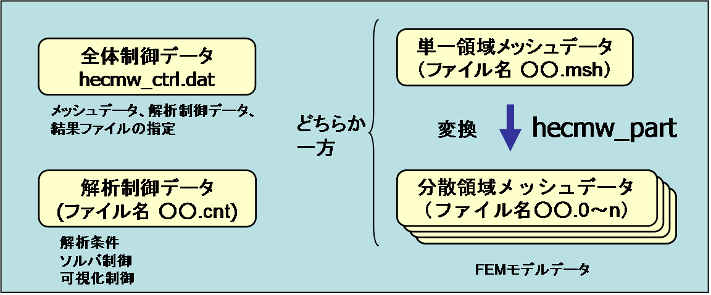
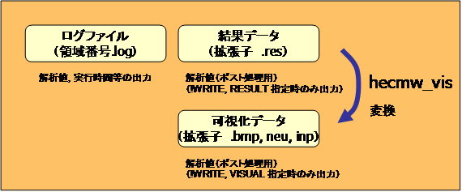

# 解析の流れと入出力ファイル

## 解析の流れ

構造解析コードFrontISTRの入力および出力ファイルを図 3.1.1に示す。

{width="5.9375in" height="2.46875in"}

\(a) 入力ファイル

{width="5.9375in" height="2.46875in"}

\(b) 出力ファイル

図 3.1.1　FrontISTR入出力ファイル

FrontISTR
は入力ファイルとして、全体制御データ、メッシュデータおよび解析制御データの3つのファイルが必要である。モデル全体を単体のCPUで解析する場合には、単一領域メッシュファイルを使用する。複数のCPUで並列実行する場合には、HEC-MW
の領域分割ツールである hecmw\_part
プログラムにより、予め単一領域メッシュデータを領域分割し、その結果としての分散領域メッシュデータを用いる。hecmw\_part
の詳細は
HEC-MW領域分割マニュアルを参照すること。全体制御データ、解析制御データおよび単一領域メッシュデータはテキストデータであり、ユーザーはこのマニュアルの説明にしたがって、適当なエディタを用いて作成、編集することが可能であるが、FrontISTR
の付属のツールとして、市販のプリポストプロセッサである Femap
のサポートするニュートラルファイル（\*.neu）をFrontISTR
入力データに変換する neu2fstr を用いて作成することもできる。neu2fstr
の詳細は neu2fstr マニュアルを参照すること。

FrontISTRの実行により、ログデータファイルと結果データファイルおよび可視化データを出力する。これらの出力の有無、内容は、解析制御ファイル中の記述および解析内容に依存する。

可視化データは FrontISTR
の実行後、作成された結果ファイルより、HEC-MW付属のツールである
hecmw\_vis プログラムにより生成することも出来る。hecmw\_vis の詳細は
HEC-MW 可視化マニュアルを参照すること。

以下、上記入出力ファイルの概要について説明する。

## 全体制御データ

このファイルは、メッシュデータと解析制御データの入力ファイルおよび結果出力ファイルを指定する。

全体制御データの詳細は第5章に記載する。

（例）

!MESH, NAME=fstrMSH,TYPE=HECMW-DIST　

・・・・・分散メッシュデータファイルのヘッダーの定義（領域分散モデルでは必須）

Foo\_P16

!MESH, NAME=fstrMSH,TYPE=HECMW-ENTIRE　

・・・・・メッシュデータファイル名の定義（単一領域モデルでは必須）

Foo.msh

!CONTROL,NAME=fstrCNT ・・・・・解析制御データファイル名の定義（必須）

Foo.cnt

!RESULT,NAME=fstrRES,IO=OUT
・・・・・解析結果データファイル名の定義（任意）

Foo.res

!RESULT,NAME=vis\_out,IO=OUT
・・・・・可視化データファイル名の定義（任意）

Foo.vis

## メッシュデータ

このファイルは有限要素メッシュを定義し、その材料データとセクションデータを定義する。また、解析制御データにて使用するグループデータを定義する。

メッシュデータの詳細は第6章に記載する。

**（例）**

!HEADER ---------　　メッシュタイトルの設定

TEST MODEL A361

!NODE ---------　　節点座標の定義

0.0,0.0,0.0

!ELEMENT, TYPE=361 ---------　　要素コネクティビティの定義

1001,1,2,3,4,5,6,7,8

!SECTION, TYPE=SOLID, EGRP=ALL,
MATERIAL=M1　　----　セクションデータの定義

!MATERIAL, NAME=M1, ITEM=1 ---------　　材料データの定義

!ITEM=1, SUBITEM=2

4000., 0.3

!NGROUP, NGRP=FIX, GENERATE ---------　　節点グループの定義

1001, 1201, 50

!EGROUP, EGRP=TOP, GENERATE ---------　　要素グループの定義

1001, 1201, 1

!END

## 解析制御データ

このファイルは解析の種別、変位境界条件、集中荷重など解析制御データを定義する。またソルバーの制御やビジュアライザーの制御データも、解析制御データに含まれる。

解析制御データの詳細は第7章に記載する。

（例）

!!Analysis Type

!SOLUTION, TYPE=STATIC ---------　解析の種別の指定

!! Analysis control data

!BOUNDARY ---------　変位境界条件の定義

FIX,1,3,0.0

!CLOAD ---------　集中荷重条件の定義

CL1,1,-1.0

!DLOAD ---------　分布荷重条件の定義

ALL,BX,1.0

!REFTEMP ---------　参照温度の定義

20.0

!TEMPERATURE ---------　熱荷重（温度）条件の定義

ALL,100.0

!! Solver Control Data

!SOLVER,METHOD=CG,PRECOND=1,TIMELOG=YES, ITERLOG=YES

> ---------　ソルバーの制御

10000,2

1.0e-8,1.0,0.0

!! Post Control Data

!WRITE,RESULT　　　　　-------　結果データ出力

!WRITE,VISUAL　　　　　-------　メモリ渡しビジュアライザ制御

!! Visualizer　　　　　　　　　　　　　　　　　　　　　

!visual 　 -------　以下、ビジュアライザーの制御データ

!surface\_num =1

!surface\_style =1

!END

## 出力ファイル

実行が終了すると、ログファイル(拡張子
.log)が出力される。また、出力の指示により可視化用解析結果ファイル（拡張子　.res）が出力される。

ログファイルは、以下に示す内容が出力される。

･　変位、ひずみ、応力成分の最大・最小値

･　固有値

･　固有ベクトル値

## 実行方法

##### FrontISTR の準備

FrontISTR の本体（Linux 版は fistr1、Windows 版は
fistr1.exe）をパスの通ったディレクトリまたは実行時のカレントディレクトリに格納する。

##### 入力ファイルの準備

3種類の入力ファイル
hecmw\_ctrl.dat、解析制御データおよび（単一または分散領域）メッシュデータ用意し、hecmw\_ctrl.dat
に解析制御データとメッシュデータのファイル名（パス名）を記述する。必要ならば、解析結果データファイルおよび可視化データファイルの指定も行っておくこと。

##### 単一領域の解析実行

Linux のターミナルもしくは Windows
のコマンドプロンプトを立ち上げ、入力ファイルのあるディレクトリへカレントディレクトリを移動し、下記のように実行する（ただし
'&gt;' はプロンプトを表す）

例） Linux の場合

&gt; ./fistr1

例） Window の場合

&gt; fistr１

##### Linux 上での並列実行

Linux 版では予め MPI
をインストールした環境で、並列実行用にコンパイルしなければならない。コンパイル方法の詳細はインストールマニュアルを参照のこと。実行は、MPIの実行環境の設定に依存する。以下に4領域での実行例を示す。

&gt; mpirun -np 4 ./fistr1

##### Windows 上での並列実行

Windows版では、MPICH2 のライブラリを下記 URL
よりダウンロードし、インストールする必要がある。並列実行の方法については
MPICH2 のマニュアルを参照すること。

http://www-unix.mcs.anl.gov/mpi/mpich/

##### 並列接触解析の実行

FrontISTR
の並列実行では、入力データとしてhecmw\_ctrl.dat、解析制御データおよび分散領域メッシュデータを準備するが、接触解析のみ分散領域メッシュデータではなく、単一領域メッシュデータを準備する。それに伴い並列実行であってもhecmw\_ctrl.dat中のメッシュデータファイル名の定義では単位領域モデルの指定を行う必要がある。

!MESH, NAME=fstrMSH,TYPE=HECMW-ENTIRE

その他のFrontISTRの準備、入力ファイルの準備、LinuxおよびWindows上での並列実行手順は通常のFrontISTRの実行と同様である。

## 実行時の制約

FrontISTR Ver.3.5において、正常実行が確認できている機能と要素タイプを表
3.7.1に示す。

表 3.7.1　解析機能別対応要素一覧

  要素番号   線形静解析   固有値解析   熱伝導解析   線形動解析   周波数応答解析   材料・幾何学的非線形静／動解析   境界非線形静／動解析
  ---------- ------------ ------------ ------------ ------------ ---------------- -------------------------------- ----------------------
  111        ×            ×            ○            ×            ×                ×                                ×
  112        ×            ×            ×            ×            ×                ×                                ×
  231        ○            ○            ○            ○            ×                ×                                ×
  232        ○            ○            ○            ○            ×                ×                                ×
  241        ○            ○            ○            ○            ×                ×                                ×
  242        ○            ○            ○            ○            ×                ×                                ×
  301        ○            ×            ×            ○            ×                ○                                ○
  341        ○            ○            ○            ○            ○                ○                                ○
  342        ○            ○            ○            ○            ○                ○                                ×
  351        ○            ○            ○            ○            ○                ○                                ○
  352        ○            ○            ○            ○            ○                ○                                ×
  361        ○            ○            ○            ○            ○                ○                                ○
  362        ○            ○            ○            ○            ○                ○                                ×
  541        ×            ×            ○            ×            ×                ×                                ×
  542        ×            ×            ×            ×            ×                ×                                ×
  611        ○            ×            ×            ○            ×                ×                                ×
  641        ○            ×            ×            ○            ×                ×                                ×
  731        ○            ○            ○            ○            ×                ×                                ×
  732        ×            ×            ×            ×            ×                ×                                ×
  741        ○            ○            ○            ○            ×                ×                                ×
  743        ○            ○            ×            ○            ×                ×                                ×
  761        ○            ×            ×            ×            ×                ×                                ×
  781        ○            ×            ×            ×            ×                ×                                ×

注）○：対応×：未対応

-   線形動解析では要素番号731、741、743で並列計算は未対応であるが、それ以外の要素番号での並列計算は可能である。

-   接触解析についての並列計算は直接法のみ対応している。

-   要素番号611は熱応力、重力、圧力、遠心力を考慮した解析には対応していない。

-   要素番号641は圧力、遠心力を考慮した解析には対応していない。

-   梁要素をソリッド要素と混在して解析を行う場合、利用可能な梁要素は要素番号641である。

-   シェル要素をソリッド要素と混在して解析を行う場合、利用可能なシェル要素は要素番号761および781である。
