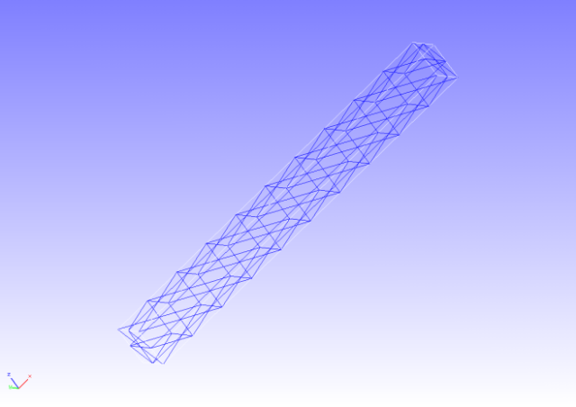

##  線形動解析

本解析の実施には、tutorial/ 12\_dynamic\_beam/ のデータを用います。

### 解析対象

　解析対象は片持ち梁で、形状を図4.12.1に、メッシュデータを図4.12.2に示します。メッシュには四面体2次要素を用い、メッシュ規模は要素数240、節点数525です。

{width="2.9897036307961504in"
height="2.1150820209973755in"}{width="2.9897036307961504in"
height="2.1150820209973755in"}

図4.12.1　片持ち梁の形状　　　　　　図4.12.2　片持ち梁のメッシュデータ

### 解析内容

　図4.12.1に示す拘束面の変位を拘束し、荷重節点に集中荷重を負荷した後の線形動解析を実施します。解析制御データを以下に示します。

### 解析結果

　解析制御データで指定したモニタリング節点（荷重節点、節点番号3121）の変位の時系列表示をMicrosoft
Excelで作成して図4.12.3に示します。また、解析結果の数値データとして、モニタリング節点の変位出力ファイル（dyna\_disp\_p1.out）の一部を以下に示します。

{width="5.906666666666666in" height="2.42in"}

図4.12.3　モニタリング節点の変位時系列
