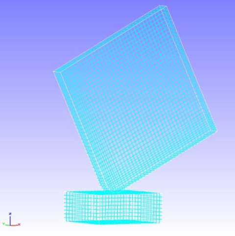
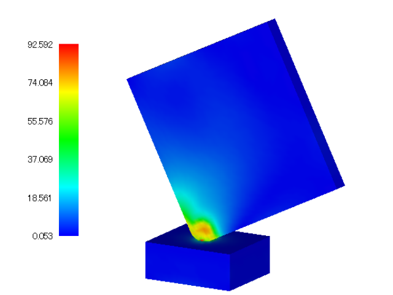

##  非線形接触動解析

本解析の実施には、tutorial/ 14\_dynamic\_plate\_contact/
のデータを用います。

### 解析対象

　解析対象は床面への角材の落下衝撃解析で、形状を図4.14.1に、メッシュデータを図4.14.2に示します。メッシュには六面体1次要素を用い、メッシュ規模は要素数8,232、節点数10,712です。

{width="1.943358486439195in"
height="2.0277777777777777in"}　　　　{width="2.0277777777777777in"
height="2.0385083114610674in"}

図4.14.1　床面と角材の形状　　　図4.14.2　床面と角材のメッシュデータ

### 解析内容

　解析対象の角材に初期速度4427mm/sを設定し、接触動解析を実施します。解析制御データを以下に示します。

### 解析結果

　落下衝撃時のミーゼス応力のコンター図を図4.14.3に示します。また、解析結果の数値データとして、モニタリング節点のエネルギー出力ファイル（dyna\_energy.txt）の一部を以下に示します。

{width="5.625in" height="4.21875in"}

図4.14.3　落下衝撃時のミーゼス応力
